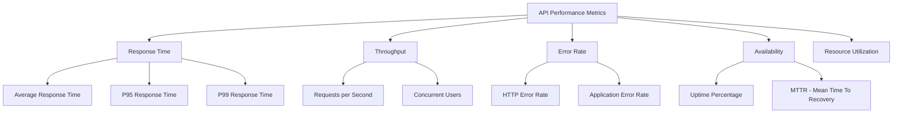
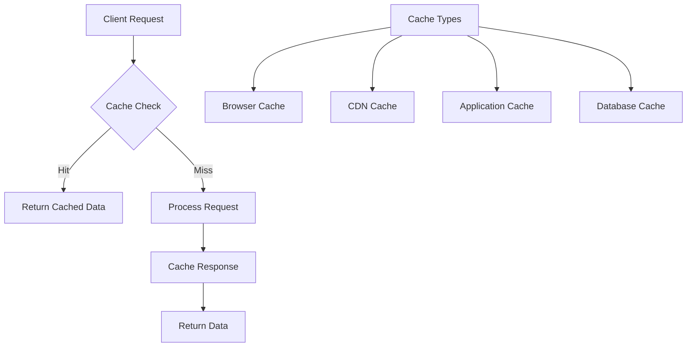
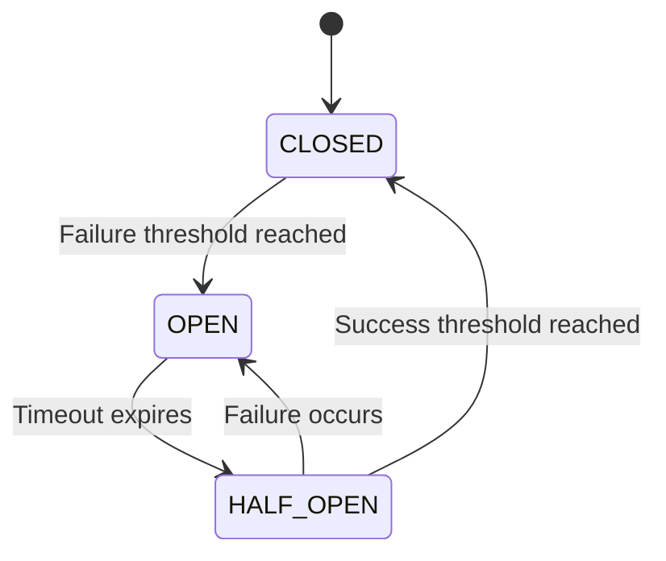
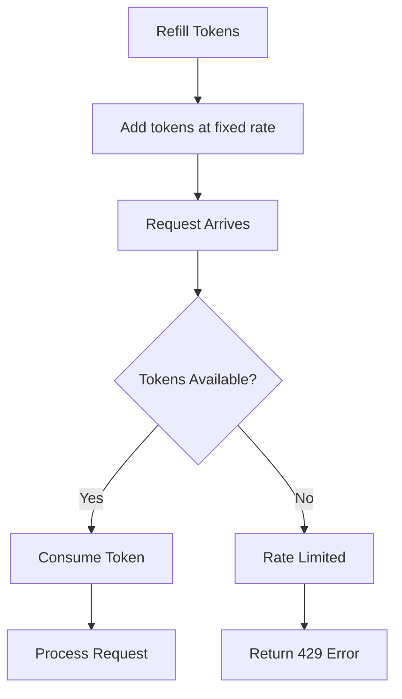
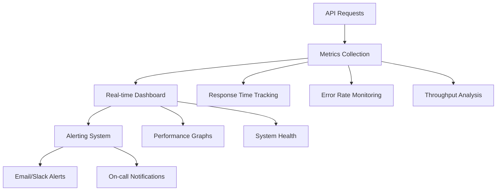

# Chapter 08: API Performance

## Introduction

**📌 API Performance**: How fast and efficiently your API responds to requests while handling high traffic loads.

Performance optimization ensures APIs meet user expectations, business requirements, and service level agreements (SLAs). This chapter covers essential strategies to build high-performance APIs.

---

## Performance Metrics

### Key Performance Indicators (KPIs)

**📌 KPI**: Measurable values that show how effectively an API is achieving key business objectives.



### Response Time Percentiles

**📌 Percentile**: A measure that indicates the value below which a given percentage of observations fall.

| Percentile | Meaning | Why It Matters |
|-----------|---------|----------------|
| **P50** | Median response time | Typical user experience |
| **P95** | 95% of requests are faster | Most users experience this or better |
| **P99** | 99% of requests are faster | Worst-case experience for most users |
| **P99.9** | 99.9% of requests are faster | Critical for enterprise systems |

### Performance Targets

| API Type | P95 Target | P99 Target | Business Impact |
|----------|-----------|-----------|-----------------|
| **Critical APIs** | < 100ms | < 500ms | User satisfaction, revenue |
| **Standard APIs** | < 200ms | < 1000ms | Good user experience |
| **Internal APIs** | < 500ms | < 2000ms | Operational efficiency |
| **Batch APIs** | < 5000ms | < 10000ms | Background processing |

---

## Caching Strategies

### Multi-Layer Caching Architecture

**📌 Multi-Layer Caching**: Using multiple cache levels (browser, CDN, application, database) for optimal performance.



### Caching Decision Framework

| Cache Layer | TTL Recommendation | Best For | Cache Key Strategy |
|------------|-------------------|----------|-------------------|
| **Browser** | 5-60 minutes | Static content, user-specific data | URL + User ID + Version |
| **CDN** | 1-24 hours | Static assets, public data | URL path pattern |
| **Application** | 1-30 minutes | Computed results, database queries | Function + parameters |
| **Database** | Milliseconds | Query results, indexes | Query fingerprint |

### HTTP Caching Headers

**📌 HTTP Cache Headers**: Instructions that tell browsers and CDNs how to cache responses.

#### Cache-Control Directives

| Directive | Purpose | Example Usage |
|-----------|---------|---------------|
| **public** | Response can be cached by any cache | Static assets, public data |
| **private** | Response only for single user | User profile, account data |
| **max-age** | How long to cache (seconds) | `Cache-Control: max-age=3600` |
| **no-cache** | Validate before using cached copy | Sensitive or dynamic data |
| **no-store** | Never cache responses | Auth tokens, personal data |

#### ETag Implementation

**ETag**: Identifier for a specific version of a resource.

```javascript
// Simple ETag generation
function generateETag(data) {
  // Create hash of data content
  const hash = require('crypto')
    .createHash('md5')
    .update(JSON.stringify(data))
    .digest('hex');

  return `"${hash}"`;
}

// Express middleware example
function etagMiddleware(req, res, next) {
  const data = req.responseData;
  const etag = generateETag(data);

  res.setHeader('ETag', etag);

  // Check if client has current version
  if (req.headers['if-none-match'] === etag) {
    return res.status(304).end(); // Not Modified
  }

  next();
}
```

### Cache Invalidation Strategies

**📌 Cache Invalidation**: Removing outdated data from cache to ensure consistency.

| Strategy | When to Use | Implementation |
|----------|-------------|----------------|
| **TTL Expiration** | Data updates predictably | Set time-to-live on cache entries |
| **Event-Driven** | Real-time updates needed | Publish events when data changes |
| **Manual Invalidation** | Precise control required | Delete specific keys after updates |
| **Version-Based** | Multiple data versions | Include version in cache key |

---

## Load Balancing

### Load Balancing Algorithms

**📌 Load Balancer**: Distributes incoming API requests across multiple servers to prevent overload.

| Algorithm | How It Works | Best For | Pros | Cons |
|-----------|-------------|----------|------|------|
| **Round Robin** | Sequential rotation | Equal server capacity | Simple, fair | Ignores server load |
| **Least Connections** | Server with fewest active requests | Variable request duration | Load-aware | More complex |
| **Weighted Round Robin** | Ratio-based distribution | Different server capacities | Handles capacity differences | Manual weight tuning |
| **IP Hash** | Based on client IP | Session persistence | Sessions stay on same server | Uneven distribution |
| **Response Time** | Fastest responding server | Performance-critical | Optimizes speed | Requires monitoring |

### Load Balancer Configuration

```javascript
// Simple round-robin implementation
class LoadBalancer {
  constructor(servers) {
    this.servers = servers;
    this.currentIndex = 0;
  }

  getNextServer() {
    const server = this.servers[this.currentIndex];
    this.currentIndex = (this.currentIndex + 1) % this.servers.length;
    return server;
  }

  // Health check to ensure server is available
  isHealthy(server) {
    return server.isHealthy === true;
  }

  getHealthyServer() {
    // Find next healthy server
    let attempts = 0;
    while (attempts < this.servers.length) {
      const server = this.getNextServer();
      if (this.isHealthy(server)) {
        return server;
      }
      attempts++;
    }
    throw new Error('No healthy servers available');
  }
}

// Usage
const loadBalancer = new LoadBalancer([
  { url: 'http://server1:3000', isHealthy: true },
  { url: 'http://server2:3000', isHealthy: true },
  { url: 'http://server3:3000', isHealthy: true }
]);
```

### Circuit Breaker Pattern

**📌 Circuit Breaker**: Prevents cascade failures by stopping requests to failing services.



#### Circuit Breaker States

| State | Behavior | Recovery |
|-------|----------|----------|
| **CLOSED** | Normal operation, track failures | Auto-reset on success |
| **OPEN** | Fail fast, no requests sent | Try after timeout |
| **HALF_OPEN** | Limited test requests | Open on failure, close on success |

#### Circuit Breaker Implementation

```javascript
class CircuitBreaker {
  constructor(options = {}) {
    this.failureThreshold = options.failureThreshold || 5;
    this.timeout = options.timeout || 60000; // 1 minute
    this.state = 'CLOSED';
    this.failureCount = 0;
    this.nextAttempt = Date.now();
  }

  async execute(operation) {
    if (this.state === 'OPEN') {
      if (Date.now() < this.nextAttempt) {
        throw new Error('Circuit breaker is OPEN');
      }
      this.state = 'HALF_OPEN';
    }

    try {
      const result = await operation();
      this.onSuccess();
      return result;
    } catch (error) {
      this.onFailure();
      throw error;
    }
  }

  onSuccess() {
    this.failureCount = 0;
    if (this.state === 'HALF_OPEN') {
      this.state = 'CLOSED';
    }
  }

  onFailure() {
    this.failureCount++;
    if (this.failureCount >= this.failureThreshold) {
      this.state = 'OPEN';
      this.nextAttempt = Date.now() + this.timeout;
    }
  }
}
```

---

## Rate Limiting

### Rate Limiting Strategies

**📌 Rate Limiting**: Controlling how many requests a client can make in a given time period.

| Algorithm | Description | Pros | Cons |
|-----------|-------------|------|------|
| **Token Bucket** | Fixed capacity tokens refilling over time | Smooth traffic, allows bursts | Complex implementation |
| **Sliding Window** | Track requests in rolling time window | Precise control | Memory intensive |
| **Fixed Window** | Reset count at fixed intervals | Simple implementation | Traffic spikes at reset |
| **Leaky Bucket** | Process requests at fixed rate | Consistent output | Can delay requests |

### Token Bucket Algorithm



#### Rate Limiter Implementation

```javascript
class TokenBucketRateLimiter {
  constructor(capacity, refillRate) {
    this.capacity = capacity; // Maximum tokens
    this.refillRate = refillRate; // Tokens per second
    this.tokens = capacity;
    this.lastRefill = Date.now();
  }

  // Simplified token bucket
  allowRequest() {
    const now = Date.now();
    const timePassed = (now - this.lastRefill) / 1000;

    // Refill tokens
    this.tokens = Math.min(
      this.capacity,
      this.tokens + timePassed * this.refillRate
    );

    this.lastRefill = now;

    if (this.tokens >= 1) {
      this.tokens--;
      return true; // Allow request
    }

    return false; // Rate limited
  }

  getRateLimitHeaders() {
    return {
      'X-RateLimit-Limit': this.capacity,
      'X-RateLimit-Remaining': Math.max(0, Math.floor(this.tokens)),
      'X-RateLimit-Reset': this.lastRefill + 1000
    };
  }
}
```

### Rate Limiting Best Practices

| Practice | Implementation | Reason |
|----------|----------------|--------|
| **Differentiate by User** | Rate limit per API key/user | Fair resource allocation |
| **Public API Limits** | Lower limits for anonymous users | Prevent abuse |
| **Premium Tiers** | Higher limits for paying customers | Business model |
| **Burst Allowance** | Allow short bursts within limits | Handle legitimate spikes |
| **Clear Communication** | Return rate limit headers | Help clients adjust behavior |

---

## Performance Monitoring

### Key Performance Metrics

**📌 APM (Application Performance Monitoring)**: Tools and practices for monitoring application performance.

| Metric Category | Examples | Tools |
|----------------|----------|-------|
| **Response Time** | Average, P95, P99 latencies | APM tools, custom logging |
| **Throughput** | Requests per second, concurrency | Load balancer metrics |
| **Error Rate** | HTTP 4xx, 5xx percentages | Error tracking services |
| **Resource Usage** | CPU, memory, database connections | System monitoring |
| **Business Metrics** | Conversion rate, user engagement | Analytics platforms |

### Monitoring Dashboard Essentials



### Alerting Strategies

| Alert Type | Threshold | Response Time |
|------------|-----------|---------------|
| **Critical** | P95 latency > 2x target | Immediate (5 min) |
| **Warning** | Error rate > 5% | Standard (30 min) |
| **Info** | Throughput changes | Daily report |
| **Capacity** | Resource usage > 80% | Planning (weekly) |

### Performance Testing

**📌 Load Testing**: Simulating real-world traffic to test API performance under stress.

#### Load Testing Phases

| Phase | Duration | Traffic | Purpose |
|-------|----------|---------|---------|
| **Warm-up** | 5-10 minutes | 10-20% of expected load | Initialize caches, connections |
| **Ramp-up** | 10-20 minutes | Gradually increase | Find breaking points |
| **Sustain** | 30-60 minutes | Target load | Verify stability |
| **Peak** | 5-10 minutes | 150-200% of target | Test headroom |
| **Cool-down** | 5-10 minutes | Decrease gradually | Clean shutdown |

#### Performance Test Tools Comparison

| Tool | Language | Learning Curve | Best For |
|------|----------|----------------|----------|
| **Artillery** | Node.js/YAML | Medium | Complex scenarios |
| **JMeter** | Java GUI | Steep | Comprehensive testing |
| **k6** | Go/JavaScript | Easy | Developer-friendly |
| **Locust** | Python | Medium | Scalable distributed tests |

---

## Error Handling & Retries

### Retry Strategies

**📌 Exponential Backoff**: Increasing delay between retries exponentially to avoid overwhelming systems.

| Retry Algorithm | Delay Formula | Use Case |
|-----------------|---------------|----------|
| **Fixed Delay** | `delay = baseDelay` | Simple retries, low load |
| **Linear Backoff** | `delay = baseDelay * attempt` | Moderate congestion |
| **Exponential Backoff** | `delay = baseDelay * 2^attempt` | High congestion prevention |
| **Exponential with Jitter** | `delay = baseDelay * 2^attempt * random(0.5, 1.5)` | Distributed systems |

### Retry Implementation

```javascript
class RetryManager {
  constructor(options = {}) {
    this.maxRetries = options.maxRetries || 3;
    this.baseDelay = options.baseDelay || 1000;
    this.maxDelay = options.maxDelay || 30000;
  }

  async execute(operation) {
    let lastError;

    for (let attempt = 0; attempt <= this.maxRetries; attempt++) {
      try {
        return await operation();
      } catch (error) {
        lastError = error;

        if (attempt === this.maxRetries || !this.shouldRetry(error)) {
          throw error;
        }

        const delay = this.calculateDelay(attempt);
        await this.sleep(delay);
      }
    }

    throw lastError;
  }

  shouldRetry(error) {
    // Retry on network errors and 5xx status codes
    if (error.code === 'ECONNRESET' || error.code === 'ETIMEDOUT') {
      return true;
    }

    if (error.response?.status) {
      const status = error.response.status;
      return status >= 500 || status === 429; // Server errors or rate limit
    }

    return false;
  }

  calculateDelay(attempt) {
    // Exponential backoff with jitter
    const delay = Math.min(
      this.baseDelay * Math.pow(2, attempt),
      this.maxDelay
    );

    // Add jitter to prevent thundering herd
    const jitter = delay * 0.1 * Math.random();
    return delay + jitter;
  }

  sleep(ms) {
    return new Promise(resolve => setTimeout(resolve, ms));
  }
}
```

### Error Response Standards

**Consistent Error Format**:
```json
{
  "error": {
    "code": "RATE_LIMIT_EXCEEDED",
    "message": "Too many requests. Try again later.",
    "retryAfter": 60,
    "requestId": "req_123456",
    "timestamp": "2023-12-01T10:30:00Z"
  }
}
```

---

## Performance Optimization Checklist

### Database Optimization

| Area | Check | Action |
|------|-------|--------|
| **Indexing** | Missing indexes on query fields | Add appropriate indexes |
| **Query Performance** | Slow queries > 100ms | Optimize or rewrite queries |
| **Connection Pooling** | Creating new connections | Implement connection pooling |
| **Read Replicas** | Read-heavy workload | Distribute read queries |

### API Design

| Pattern | Performance Impact | Recommendation |
|---------|-------------------|----------------|
| **Pagination** | Reduces response size | Always paginate large datasets |
| **Field Selection** | Reduces payload | Allow `fields` parameter |
| **Batch Operations** | Reduces round trips | Combine multiple operations |
| **Compression** | Reduces bandwidth | Enable gzip/deflate |

### Caching Strategy

✅ **Browser Caching**: Set appropriate Cache-Control headers for static content
✅ **Application Caching**: Cache frequently accessed computed results
✅ **Database Caching**: Cache expensive query results
✅ **CDN Usage**: Distribute content globally for better latency

### Resource Optimization

✅ **Connection Reuse**: Keep-alive connections and connection pooling
✅ **Async Operations**: Non-blocking I/O for better concurrency
✅ **Memory Management**: Monitor memory usage and prevent leaks
✅ **CPU Optimization**: Profile and optimize CPU-intensive operations

### Monitoring & Alerting

✅ **Real-time Metrics**: Track response times, throughput, error rates
✅ **SLA Monitoring**: Ensure service level agreements are met
✅ **Automated Alerting**: Notify teams of performance degradation
✅ **Regular Testing**: Conduct load tests and performance audits

---

## Interview Questions

### **Q1: How would you optimize a slow API endpoint?**

**Answer:**
**Systematic approach:**
1. **Measure**: Profile the endpoint to identify bottlenecks
2. **Database**: Check queries, add indexes, implement caching
3. **Network**: Compress responses, reduce payload size
4. **Application**: Optimize algorithms, use async operations
5. **Infrastructure**: Add caching layers, scale horizontally

**Example optimization steps:**
- Add database indexes for frequently queried fields
- Implement Redis caching for expensive computations
- Enable response compression
- Add pagination for large datasets
- Use connection pooling for database connections

### **Q2: What's the difference between horizontal and vertical scaling?**

**Answer:**
**Vertical Scaling (Scale Up):**
- Add more resources to existing server (CPU, RAM, storage)
- Simpler architecture, no code changes needed
- Limited by hardware maximums
- Single point of failure remains

**Horizontal Scaling (Scale Out):**
- Add more servers to share the load
- Requires load balancer and stateless design
- Unlimited scaling potential
- Better fault tolerance and reliability

**Choice depends on:**
- Budget constraints (vertical is often cheaper initially)
- Growth requirements (horizontal for unpredictable growth)
- Complexity tolerance (vertical is simpler)
- Reliability needs (horizontal provides better uptime)

### **Q3: How do you implement effective rate limiting?**

**Answer:**
**Algorithm selection:**
- **Token Bucket**: For APIs that need to allow bursts
- **Sliding Window**: For precise rate limiting
- **Fixed Window**: Simple implementation for basic needs

**Implementation considerations:**
- **Scope**: Rate limit per API key, IP, or user
- **Storage**: Use Redis for distributed systems
- **Headers**: Return X-RateLimit-* headers to clients
- **Graduated Limits**: Different tiers for different user types

**Example response headers:**
```http
X-RateLimit-Limit: 1000
X-RateLimit-Remaining: 999
X-RateLimit-Reset: 1638360000
Retry-After: 60
```

### **Q4: What is a Circuit Breaker and when should you use it?**

**Answer:**
**Circuit Breaker Pattern:**
- Prevents cascade failures in distributed systems
- Three states: CLOSED (normal), OPEN (failing), HALF_OPEN (testing)
- Automatically fails fast when dependent services are down

**When to use:**
- **Microservices**: Protect against failing service dependencies
- **External APIs**: Handle unreliable third-party services
- **Database Connections**: Prevent connection pool exhaustion
- **Resource Protection**: Stop overwhelming failing components

**Implementation benefits:**
- Improves system stability and user experience
- Prevents resource waste on doomed requests
- Enables automatic recovery monitoring
- Provides graceful degradation

### **Q5: How do you measure API performance effectively?**

**Answer:**
**Key metrics to track:**
1. **Response Time**: Average, P95, P99 percentiles
2. **Throughput**: Requests per second, concurrent users
3. **Error Rate**: HTTP error percentages by type
4. **Availability**: Uptime and mean time to recovery (MTTR)

**Measurement approach:**
- **Real-time Monitoring**: APM tools like New Relic, DataDog
- **Synthetic Testing**: Automated tests from multiple locations
- **User Metrics**: Real user monitoring (RUM)
- **Load Testing**: Simulated traffic patterns

**Alerting thresholds:**
- P95 response time > 500ms: Alert
- Error rate > 1%: Critical alert
- Availability < 99.9%: Immediate action

### **Q6: What are the best caching strategies for APIs?**

**Answer:**
**Multi-layer approach:**
1. **Browser Cache**: HTTP headers for static content
2. **CDN Cache**: Edge locations for global content
3. **Application Cache**: Redis/Memcached for computed results
4. **Database Cache**: Query result caching

**Strategy selection:**
- **Cache-Aside**: Application manages cache (most common)
- **Write-Through**: Synchronous cache and database updates
- **Write-Behind**: Async database writes for performance

**Invalidation strategies:**
- **TTL-based**: Time-based expiration
- **Event-driven**: Invalidate on data changes
- **Manual**: Explicit cache clearing for critical updates

### **Q7: How do you handle performance testing for APIs?**

**Answer:**
**Testing methodology:**
1. **Baseline Testing**: Establish current performance metrics
2. **Load Testing**: Simulate expected traffic patterns
3. **Stress Testing**: Find breaking points with extreme load
4. **Spike Testing**: Handle sudden traffic surges
5. **Endurance Testing**: Sustained load over time

**Tool selection:**
- **Artillery**: Good for complex scenarios, YAML-based
- **k6**: Developer-friendly, JavaScript-based
- **JMeter**: Comprehensive but steep learning curve

**Test scenarios:**
- User registration and authentication flows
- Data read and write operations
- Peak traffic patterns (e.g., flash sales)
- Background processing loads

---

## Quick Tips & Best Practices

### **Performance Optimization**
✅ Monitor key metrics: response time, throughput, error rate
✅ Implement multi-layer caching strategy
✅ Use connection pooling for databases and external services
✅ Compress responses and optimize payload sizes
✅ Profile and optimize database queries with proper indexing

### **Scalability Design**
✅ Design for horizontal scaling from the beginning
✅ Implement proper load balancing with health checks
✅ Use stateless architecture for easier scaling
✅ Plan capacity based on growth projections
✅ Implement auto-scaling policies when possible

### **Reliability Patterns**
✅ Use circuit breakers for external dependencies
✅ Implement proper error handling and retry logic
✅ Add comprehensive logging and monitoring
✅ Design for graceful degradation during failures
✅ Regularly test failure scenarios and recovery procedures

### **Monitoring Strategy**
✅ Set up real-time performance dashboards
✅ Implement automated alerting with appropriate thresholds
✅ Track business metrics alongside technical metrics
✅ Use distributed tracing for complex microservices
✅ Conduct regular performance audits and optimization cycles

---

## Summary

### Key Takeaways

1. **Performance Metrics**: Monitor response times, throughput, error rates, and availability
2. **Caching**: Multi-layer caching strategy dramatically improves performance
3. **Load Balancing**: Distribute traffic efficiently and ensure high availability
4. **Rate Limiting**: Protect APIs from abuse and ensure fair resource usage
5. **Monitoring**: Real-time visibility into API performance and health
6. **Error Handling**: Implement robust retry mechanisms and graceful failure handling
7. **Testing**: Regular performance testing ensures scalability and reliability

### Best Practices Checklist

- [ ] Monitor P95/P99 response times, not just averages
- [ ] Implement caching at multiple levels (browser, CDN, application, database)
- [ ] Use load balancers with proper health checks
- [ ] Apply rate limiting to prevent abuse and ensure fairness
- [ ] Set up real-time monitoring and alerting
- [ ] Implement circuit breakers for external dependencies
- [ ] Conduct regular load and performance testing
- [ ] Design for horizontal scaling and fault tolerance
- [ ] Use exponential backoff with jitter for retries
- [ ] Compress responses and optimize payload sizes

**Next Up**: Chapter 09 explores API Integration Patterns, covering how APIs connect and communicate with each other in complex systems.