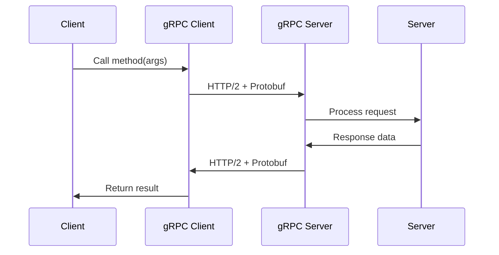

# Chapter 2: Different API Styles

## RESTful APIs

### What is REST?

**REST** = REpresentational State Transfer

Architectural style for designing networked applications using HTTP protocol.

### REST Principles

| Principle | Description | Example |
|-----------|-------------|---------|
| **Stateless** | Each request contains all information | `Authorization: Bearer token123` |
| **Client-Server** | Clear separation of concerns | Frontend ↔ Backend |
| **Cacheable** | Responses must indicate cacheability | `Cache-Control: max-age=3600` |
| **Uniform Interface** | Consistent conventions | `/users/{id}` pattern |
| **Layered System** | Hierarchical architecture | Client ↔ Load Balancer ↔ Server |

### REST API Structure

```
https://api.example.com/v1/users/123?include=profile
│          │          │    │     │         │
│          │          │    │     │         └─ Query Parameters
│          │          │    │     └─ Resource Identifier
│          │          │    └─ Resource Collection
│          │          └─ API Version
│          └─ Domain
└─ Protocol
```

### HTTP Methods in REST

| Operation | HTTP Method | Endpoint | Idempotent |
|-----------|-------------|----------|------------|
| **Create** | POST | `/users` | No |
| **Read** | GET | `/users/{id}` | Yes |
| **Update** | PUT | `/users/{id}` | Yes |
| **Update** | PATCH | `/users/{id}` | No |
| **Delete** | DELETE | `/users/{id}` | Yes |

### REST Response Format

```json
// GET /api/users/123
{
  "id": 123,
  "name": "John Doe",
  "email": "john@example.com",
  "created_at": "2024-01-15T10:30:00Z",
  "updated_at": "2024-01-20T14:22:00Z",
  "_links": {
    "self": {"href": "/users/123"},
    "posts": {"href": "/users/123/posts"},
    "profile": {"href": "/users/123/profile"}
  }
}
```

### REST Advantages

| Benefit | Explanation |
|---------|-------------|
| **Scalability** | Stateful clients, stateless servers |
| **Simplicity** | Uses standard HTTP methods |
| **Performance** | Caching support |
| **Flexibility** | Multiple data formats (JSON, XML) |
| **Tooling** | Extensive browser and testing support |

### REST Disadvantages

| Issue | Explanation |
|-------|-------------|
| **Over-fetching** | Getting more data than needed |
| **Under-fetching** | Multiple requests for related data |
| **Versioning** | URL or header version management |
| **Documentation** | Requires separate docs |

---

## Simple JSON APIs

### What are Simple JSON APIs?

Lightweight APIs that use JSON for request/response without strict REST constraints.

### Simple API vs REST API

| Feature | Simple JSON API | REST API |
|---------|----------------|----------|
| **Structure** | Flexible endpoints | Resource-oriented |
| **Methods** | GET/POST mainly | Full HTTP methods |
| **Statelessness** | Sometimes stateful | Always stateless |
| **Naming** | Action-based | Resource-based |
| **Standards** | Minimal | Strict |

### Simple API Examples

### Action-based Endpoints

```http
// Create user
POST /api/createUser
{
  "name": "John",
  "email": "john@example.com"
}

// Login user
POST /api/login
{
  "email": "john@example.com",
  "password": "password123"
}

// Get user data
POST /api/getUserData
{
  "user_id": 123
}
```

### RPC-style API

```http
POST /api/rpc
{
  "method": "getUserInfo",
  "params": {
    "userId": 123,
    "fields": ["name", "email", "avatar"]
  },
  "id": "req_123"
}
```

### Simple API Response

```json
{
  "success": true,
  "data": {
    "user_id": 123,
    "name": "John Doe",
    "email": "john@example.com"
  },
  "message": "User created successfully",
  "timestamp": "2024-01-15T10:30:00Z"
}
```

### Simple API Use Cases

| Scenario | Why Simple API Works |
|----------|---------------------|
| **Internal tools** | Quick development |
| **Mobile apps** | Reduced overhead |
| **Microservices** | Service-to-service communication |
| **Prototyping** | Fast iteration |

### Simple API Advantages

| Pro | Description |
|-----|-------------|
| **Speed** | Fast development and deployment |
| **Flexibility** | No strict constraints |
| **Simplicity** | Easy to understand and use |
| **Performance** | Minimal overhead |

---

## SOAP APIs

### What is SOAP?

**SOAP** = Simple Object Access Protocol

XML-based protocol for exchanging structured information in web services.

### SOAP Envelope Structure

```xml
<soap:Envelope xmlns:soap="http://www.w3.org/2003/05/soap-envelope">
  <soap:Header>
    <auth:Authentication xmlns:auth="http://example.com/auth">
      <auth:Username>john@example.com</auth:Username>
      <auth:Password>password123</auth:Password>
    </auth:Authentication>
  </soap:Header>
  <soap:Body>
    <m:GetUser xmlns:m="http://example.com/users">
      <m:UserId>123</m:UserId>
    </m:GetUser>
  </soap:Body>
</soap:Envelope>
```

### SOAP Response

```xml
<soap:Envelope xmlns:soap="http://www.w3.org/2003/05/soap-envelope">
  <soap:Body>
    <m:GetUserResponse xmlns:m="http://example.com/users">
      <m:User>
        <m:Id>123</m:Id>
        <m:Name>John Doe</m:Name>
        <m:Email>john@example.com</m:Email>
      </m:User>
    </m:GetUserResponse>
  </soap:Body>
</soap:Envelope>
```

### SOAP Components

| Component | Purpose | Example |
|-----------|---------|---------|
| **Envelope** | Root element | `<soap:Envelope>` |
| **Header** | Optional metadata | Authentication, transaction |
| **Body** | Message content | Request/Response data |
| **Fault** | Error information | `<soap:Fault>` |

### SOAP vs REST Comparison

| Feature | SOAP | REST |
|---------|------|------|
| **Format** | XML | JSON, XML, HTML |
| **Protocol** | WS-* standards | HTTP |
| **Contract** | WSDL required | Optional |
| **State** | Can be stateful | Stateless |
| **Complexity** | Complex | Simple |
| **Performance** | Slower | Faster |
| **Security** | WS-Security built-in | HTTP-based |

### SOAP Advantages

| Advantage | Description |
|-----------|-------------|
| **Standardized** | WS-* specifications |
| **Secure** | Built-in security (WS-Security) |
| **Reliable** | WS-ReliableMessaging |
| **Transaction support** | WS-AtomicTransaction |
| **Formal contract** | WSDL provides clear interface |

### SOAP Disadvantages

| Disadvantage | Description |
|--------------|-------------|
| **Complex** | Verbose XML structure |
| **Slow** | XML parsing overhead |
| **Heavy** | Large message size |
| **Learning curve** | Requires WS-* knowledge |

### SOAP Use Cases

| Scenario | Why SOAP |
|----------|----------|
| **Enterprise systems** | Formal contracts required |
| **Financial services** | Transaction support |
| **Payment processing** | High security needed |
| **Government systems** | Strict standards compliance |

---

## GraphQL APIs

### What is GraphQL?

Query language for APIs that allows clients to request exactly the data they need.

### GraphQL Query Example

```graphql
query GetUserWithPosts($userId: ID!) {
  user(id: $userId) {
    id
    name
    email
    avatar
    posts(first: 5) {
      edges {
        node {
          id
          title
          content
          createdAt
        }
      }
    }
  }
}
```

### GraphQL Response

```json
{
  "data": {
    "user": {
      "id": "123",
      "name": "John Doe",
      "email": "john@example.com",
      "avatar": "https://example.com/avatars/123.jpg",
      "posts": {
        "edges": [
          {
            "node": {
              "id": "1",
              "title": "Introduction to GraphQL",
              "content": "GraphQL is amazing...",
              "createdAt": "2024-01-15T10:00:00Z"
            }
          }
        ]
      }
    }
  }
}
```

### GraphQL Operations

| Operation | Purpose | Example |
|-----------|---------|---------|
| **Query** | Fetch data | `query GetUser` |
| **Mutation** | Modify data | `mutation CreateUser` |
| **Subscription** | Real-time updates | `subscription NewPost` |

### GraphQL Schema

```graphql
type User {
  id: ID!
  name: String!
  email: String!
  posts: [Post!]!
  createdAt: DateTime!
}

type Post {
  id: ID!
  title: String!
  content: String!
  author: User!
  createdAt: DateTime!
}

type Query {
  user(id: ID!): User
  users: [User!]!
  post(id: ID!): Post
}

type Mutation {
  createUser(input: CreateUserInput!): User!
  updateUser(id: ID!, input: UpdateUserInput!): User!
  deleteUser(id: ID!): Boolean!
}

type Subscription {
  postCreated: Post!
  userUpdated: User!
}
```

### GraphQL vs REST Comparison

| Feature | GraphQL | REST |
|---------|---------|------|
| **Data fetching** | Single request, exact data | Multiple endpoints, over/under-fetching |
| **Endpoints** | Single endpoint `/graphql` | Multiple endpoints `/users`, `/posts` |
| **Versioning** | Schema evolution | URL versioning |
| **Caching** | Complex (HTTP GET only) | Simple (HTTP cache headers) |
| **Error handling** | Partial responses | HTTP status codes |
| **Learning curve** | Higher | Lower |

### GraphQL Advantages

| Advantage | Description |
|-----------|-------------|
| **No over-fetching** | Get only what you need |
| **No under-fetching** | Single request for complex data |
| **Strong typing** | Schema validation |
| **Introspection** | Self-documenting API |
| **Real-time** | Built-in subscriptions |

### GraphQL Disadvantages

| Disadvantage | Description |
|--------------|-------------|
| **Complexity** | Learning curve, query complexity |
| **Caching** | HTTP caching not straightforward |
| **File uploads** | Requires custom implementation |
| **Rate limiting** | Per-query, per-endpoint complexity |
| **Performance** | Complex queries can be slow |

### GraphQL Use Cases

| Scenario | Why GraphQL |
|----------|------------|
| **Mobile apps** | Reduce bandwidth usage |
| **Complex data** | Related data in single request |
| **Multiple clients** | Different data needs |
| **Rapid development** | Frontend-driven API design |

---

## gRPC APIs

### What is gRPC?

**gRPC** = Google Remote Procedure Call

High-performance, open-source framework for RPC communication using HTTP/2.

### gRPC Architecture



### Protocol Buffers (Protobuf)

#### .proto Definition

```protobuf
syntax = "proto3";

package users;

service UserService {
  rpc GetUser(GetUserRequest) returns (GetUserResponse);
  rpc ListUsers(ListUsersRequest) returns (ListUsersResponse);
  rpc CreateUser(CreateUserRequest) returns (CreateUserResponse);
}

message User {
  int32 id = 1;
  string name = 2;
  string email = 3;
  string avatar_url = 4;
  int64 created_at = 5;
}

message GetUserRequest {
  int32 user_id = 1;
}

message GetUserResponse {
  User user = 1;
}
```

### gRPC Service Types

| Type | Description | Use Case |
|------|-------------|----------|
| **Unary** | Single request/response | Get user, create user |
| **Server Streaming** | One request, many responses | File download, data feeds |
| **Client Streaming** | Many requests, one response | File upload, batch processing |
| **Bidirectional Streaming** | Both sides can stream | Chat applications, live updates |

### gRPC Unary Call Example

#### Client Code (JavaScript)

```javascript
const client = new UserServiceClient('localhost:50051',
  grpc.credentials.createInsecure());

const request = {
  user_id: 123
};

client.getUser(request, (error, response) => {
  if (error) {
    console.error('Error:', error);
    return;
  }

  console.log('User:', response.user);
});
```

#### Server Implementation (Node.js)

```javascript
function getUser(call, callback) {
  const userId = call.request.user_id;

  // Database lookup
  const user = database.findUserById(userId);

  if (!user) {
    callback({
      code: grpc.status.NOT_FOUND,
      message: 'User not found'
    });
    return;
  }

  callback(null, { user: user });
}
```

### gRPC vs REST Comparison

| Feature | gRPC | REST |
|---------|------|------|
| **Protocol** | HTTP/2 | HTTP/1.1, HTTP/2 |
| **Format** | Protobuf (binary) | JSON, XML |
| **Performance** | Faster (binary, HTTP/2) | Slower (text parsing) |
| **Code generation** | Automatic | Manual |
| **Browser support** | Limited (requires gateway) | Native |
| **Streaming** | Built-in | Limited |
| **Contract** | .proto file | OpenAPI/Swagger |

### gRPC Advantages

| Advantage | Description |
|-----------|-------------|
| **Performance** | Binary format, HTTP/2 multiplexing |
| **Code generation** | Automatic client/server stubs |
| **Streaming** | Built-in bidirectional streaming |
| **Strong typing** | Schema enforcement via Protobuf |
| **Efficient** | Compact binary format |

### gRPC Disadvantages

| Disadvantage | Description |
|--------------|-------------|
| **Browser support** | Requires proxy/gateway |
| **Learning curve** | Protocol Buffers, gRPC concepts |
| **Debugging** | Binary format harder to read |
| **Ecosystem** | Smaller than REST/GraphQL |
| **Human readability** | Not human-readable |

### gRPC Use Cases

| Scenario | Why gRPC |
|----------|----------|
| **Microservices** | High-performance service communication |
| **Internal APIs** | Efficient data transfer |
| **Real-time systems** | Streaming capabilities |
| **Mobile apps** | Binary protocol reduces bandwidth |
| **IoT devices** | Efficient communication |

---

## API Style Comparison

### Decision Matrix

| Factor | REST | Simple JSON | SOAP | GraphQL | gRPC |
|--------|------|-------------|------|---------|------|
| **Simplicity** | ⭐⭐⭐⭐ | ⭐⭐⭐⭐⭐ | ⭐ | ⭐⭐ | ⭐⭐ |
| **Performance** | ⭐⭐⭐ | ⭐⭐⭐⭐ | ⭐ | ⭐⭐⭐ | ⭐⭐⭐⭐⭐ |
| **Flexibility** | ⭐⭐⭐ | ⭐⭐⭐⭐ | ⭐⭐ | ⭐⭐⭐⭐⭐ | ⭐⭐ |
| **Security** | ⭐⭐⭐ | ⭐⭐ | ⭐⭐⭐⭐⭐ | ⭐⭐⭐ | ⭐⭐⭐⭐ |
| **Tooling** | ⭐⭐⭐⭐⭐ | ⭐⭐⭐ | ⭐⭐⭐⭐ | ⭐⭐⭐⭐ | ⭐⭐⭐ |
| **Browser Support** | ⭐⭐⭐⭐⭐ | ⭐⭐⭐⭐⭐ | ⭐⭐⭐ | ⭐⭐⭐⭐ | ⭐ |
| **Learning Curve** | ⭐⭐⭐⭐ | ⭐⭐⭐⭐⭐ | ⭐⭐ | ⭐⭐ | ⭐⭐ |

### When to Use Each API Style

#### **REST APIs**
- ✅ Public APIs
- ✅ Web applications
- ✅ Mobile applications
- ✅ Need for caching
- ✅ Simple CRUD operations

#### **Simple JSON APIs**
- ✅ Internal tools
- ✅ Prototyping
- ✅ Simple applications
- ✅ Quick development
- ✅ Service-to-service communication

#### **SOAP APIs**
- ✅ Enterprise systems
- ✅ Financial services
- ✅ Government contracts
- ✅ Transaction requirements
- ✅ Formal contracts needed

#### **GraphQL APIs**
- ✅ Complex data requirements
- ✅ Multiple client types
- ✅ Mobile applications (bandwidth sensitive)
- ✅ Rapid frontend development
- ✅ Real-time requirements

#### **gRPC APIs**
- ✅ Microservices
- ✅ High-performance requirements
- ✅ Internal services
- ✅ Streaming applications
- ✅ Mobile/IoT applications

### Migration Strategies

#### **REST → GraphQL**
```graphql
// Phase 1: GraphQL wrapper around REST
type Query {
  user(id: ID!): User @rest(url: "/api/users/:id")
}

// Phase 2: Direct GraphQL resolvers
type Query {
  user(id: ID!): User @resolver
}
```

#### **REST → gRPC**
1. **Gradual migration**
   - Start with new services
   - Proxy existing REST APIs
2. **API Gateway pattern**
   - Single entry point
   - Route to appropriate backend

### Hybrid Approaches

#### **REST + GraphQL**
```
Client → API Gateway → {
  "/graphql": GraphQL Service,
  "/api/*": REST Services
}
```

#### **GraphQL + gRPC**
```
Client → GraphQL Gateway → gRPC Microservices
```

---

## Interview Questions

### **Q1: What is the difference between REST and GraphQL?**
**Answer:**
- **Data Fetching**: REST = multiple endpoints, GraphQL = single endpoint with queries
- **Over-fetching**: REST can return unused data, GraphQL returns exactly what's requested
- **Caching**: REST uses HTTP caching, GraphQL requires custom caching
- **Learning Curve**: REST is simpler, GraphQL has higher complexity

### **Q2: When would you choose SOAP over REST?**
**Answer:**
Choose SOAP when:
- Enterprise environments requiring formal contracts (WSDL)
- High security requirements (WS-Security)
- Transaction support needed (WS-AtomicTransaction)
- Asynchronous processing required
- Government or financial industry compliance

### **Q3: What is the main advantage of gRPC over REST?**
**Answer:**
gRPC's main advantages:
- **Performance**: Binary format (Protobuf) vs JSON text
- **HTTP/2**: Multiplexing, header compression, streaming
- **Code Generation**: Automatic client/server stubs
- **Streaming**: Built-in bidirectional streaming
- **Strong Typing**: Schema enforcement

### **Q4: How do you decide between REST and GraphQL?**
**Answer:**
Choose **REST** when:
- Simple CRUD operations
- Public API with multiple consumers
- Strong caching requirements
- Simple data relationships

Choose **GraphQL** when:
- Complex data requirements
- Multiple frontend clients
- Mobile apps (bandwidth sensitive)
- Need for flexible queries
- Rapid development cycles

### **Q5: What is idempotency in APIs and why is it important?**
**Answer:**
**Idempotency**: Multiple identical requests produce same result as single request.

**Important because:**
- Network retries work correctly
- Prevents duplicate operations
- Essential for payment processing
- Improves system reliability

**Examples**:
- **Idempotent**: GET, PUT, DELETE
- **Non-idempotent**: POST

### **Q6: What are the main components of a SOAP message?**
**Answer:**
1. **Envelope**: Root element defining XML namespace
2. **Header**: Optional metadata (authentication, routing)
3. **Body**: Contains actual message content
4. **Fault**: Error information (if any)

### **Q7: How does GraphQL handle real-time updates?**
**Answer:**
GraphQL handles real-time updates using **Subscriptions**:

```graphql
subscription NewPost($userId: ID!) {
  postAdded(userId: $userId) {
    id
    title
    content
    author {
      name
    }
  }
}
```

Subscriptions use WebSockets for persistent connections and push updates to clients in real-time.

---

## Quick Tips & Best Practices

### **API Design Principles**
✅ Choose API style based on requirements
✅ Consider performance vs complexity trade-offs
✅ Plan for future scalability
✅ Implement proper error handling
✅ Document APIs clearly

### **REST Best Practices**
✅ Use proper HTTP methods
✅ Implement meaningful status codes
✅ Use nouns for resources, not verbs
✅ Implement pagination for collections
✅ Use HTTPS for all APIs

### **GraphQL Best Practices**
✅ Design schema with clients in mind
✅ Implement query complexity analysis
✅ Use DataLoader to prevent N+1 problems
✅ Implement proper authentication
✅ Monitor query performance

### **gRPC Best Practices**
✅ Design protobuf schemas carefully
✅ Use appropriate service types (unary, streaming)
✅ Implement proper error handling
✅ Use interceptors for cross-cutting concerns
✅ Monitor performance metrics

### **General API Guidelines**
✅ Version your APIs
✅ Implement rate limiting
✅ Use proper authentication
✅ Log and monitor usage
✅ Handle failures gracefully

---

## Chapter Summary

Chapter 2 explores different API styles, each with unique characteristics:

### **REST APIs**
- Resource-oriented, uses HTTP methods
- Stateless, cacheable, scalable
- Most popular for web APIs

### **Simple JSON APIs**
- Lightweight, action-based endpoints
- Quick development, flexible
- Good for internal tools

### **SOAP APIs**
- XML-based, formal contracts
- Enterprise-grade security
- Complex but reliable

### **GraphQL APIs**
- Query language, single endpoint
- Flexible data fetching
- Good for complex data requirements

### **gRPC APIs**
- High-performance, binary protocol
- Code generation, streaming
- Best for microservices

Choose the right API style based on your specific requirements, performance needs, and development constraints. Each style has its strengths and ideal use cases.