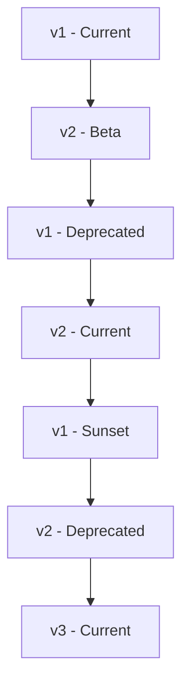
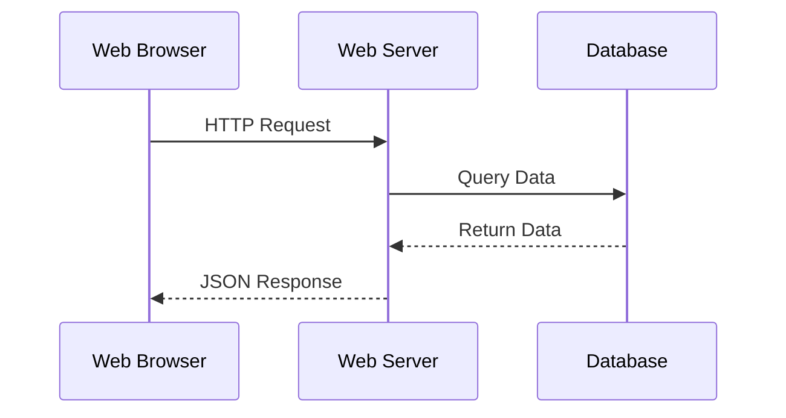
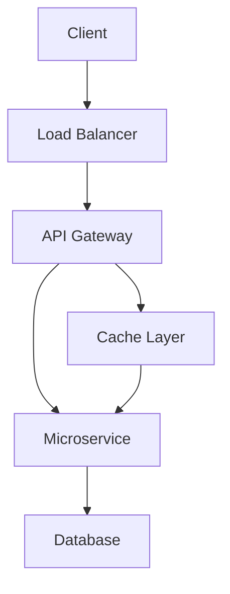
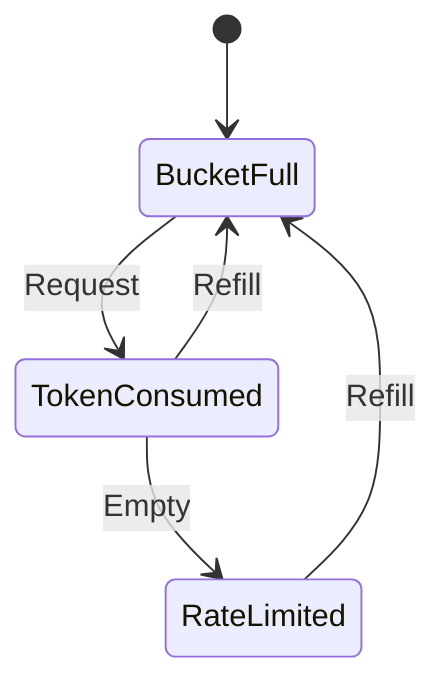
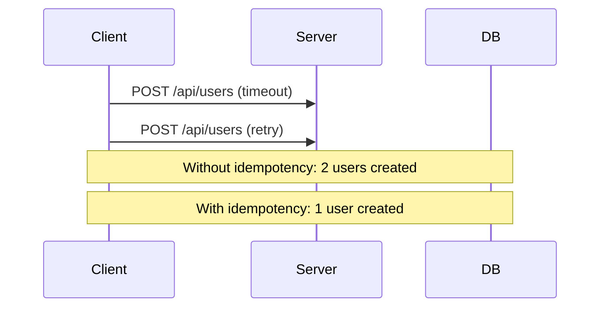

# Chapter 3: Building JSON/RESTful APIs

## Handling CRUD Operations

### What is CRUD?

**CRUD** = Create, Read, Update, Delete

Four basic operations for persistent storage.

### CRUD HTTP Methods

| Operation | HTTP Method | Endpoint | Success Status | Idempotent |
|-----------|-------------|----------|----------------|------------|
| **Create** | POST | `/users` | 201 Created | No |
| **Read** | GET | `/users/{id}` | 200 OK | Yes |
| **Update** | PUT | `/users/{id}` | 200 OK | Yes |
| **Update** | PATCH | `/users/{id}` | 200 OK | No |
| **Delete** | DELETE | `/users/{id}` | 204 No Content | Yes |

### CRUD Implementation Examples

#### **Create User - POST**

```http
POST /api/v1/users HTTP/1.1
Content-Type: application/json

{
  "name": "John Doe",
  "email": "john@example.com",
  "age": 30
}
```

**Response:**
```json
{
  "id": 123,
  "name": "John Doe",
  "email": "john@example.com",
  "age": 30,
  "created_at": "2024-01-15T10:30:00Z",
  "updated_at": "2024-01-15T10:30:00Z"
}
```

#### **Read User - GET**

```http
GET /api/v1/users/123 HTTP/1.1
Accept: application/json
```

**Response:**
```json
{
  "id": 123,
  "name": "John Doe",
  "email": "john@example.com",
  "age": 30,
  "created_at": "2024-01-15T10:30:00Z",
  "updated_at": "2024-01-15T10:30:00Z"
}
```

#### **Update User - PUT**

```http
PUT /api/v1/users/123 HTTP/1.1
Content-Type: application/json

{
  "id": 123,
  "name": "John Doe",
  "email": "john.doe@example.com",
  "age": 31,
  "created_at": "2024-01-15T10:30:00Z",
  "updated_at": "2024-01-20T14:22:00Z"
}
```

#### **Partial Update - PATCH**

```http
PATCH /api/v1/users/123 HTTP/1.1
Content-Type: application/json

{
  "age": 32
}
```

#### **Delete User - DELETE**

```http
DELETE /api/v1/users/123 HTTP/1.1
```

**Response:**
```
HTTP/1.1 204 No Content
```

### CRUD Best Practices

| Practice | Good | Bad |
|----------|------|-----|
| **Status Codes** | 201 for create, 200 for update | Always 200 |
| **Response Data** | Return created/updated resource | Empty responses |
| **Idempotency** | PUT for full replace | POST for updates |
| **Validation** | Validate before processing | Process invalid data |

---

## Versioning Strategies

### Why Version APIs?

- **Backward Compatibility**: Breaking changes don't affect existing clients
- **Evolution**: Gradual migration to new versions
- **Testing**: Multiple versions can coexist
- **Deprecation**: Planned migration path

### API Versioning Methods

#### **1. URI Versioning**

```http
GET /api/v1/users
GET /api/v2/users
```

**Pros:**
- Clear and explicit
- Easy to understand
- Works with all HTTP tools

**Cons:**
- URL pollution
- Cache invalidation
- Multiple endpoints to maintain

#### **2. Query Parameter Versioning**

```http
GET /api/users?version=1
GET /api/users?version=2
```

**Pros:**
- Clean URLs
- Flexible version switching

**Cons:**
- Harder to cache
- Can be forgotten
- Mixing with other parameters

#### **3. Header Versioning**

```http
GET /api/users HTTP/1.1
Accept: application/vnd.myapi.v1+json
Accept: application/vnd.myapi.v2+json
```

**Pros:**
- Clean URLs
- Standards-based
- Easy caching

**Cons:**
- Less discoverable
- Complex client implementation
- Not all clients support custom headers

#### **4. Subdomain Versioning**

```http
GET v1.api.example.com/users
GET v2.api.example.com/users
```

**Pros:**
- Clear separation
- DNS-based routing

**Cons:**
- SSL certificate management
- More complex infrastructure

### Version Comparison Table

| Method | Best For | Migration Effort | Caching |
|--------|----------|------------------|---------|
| **URI Versioning** | Public APIs | Low | Good |
| **Query Parameter** | Internal APIs | Medium | Poor |
| **Header Versioning** | Enterprise APIs | High | Excellent |
| **Subdomain** | Large-scale | High | Good |

### Version Lifecycle



### Deprecation Strategy

#### **Deprecation Headers**

```http
GET /api/v1/users HTTP/1.1
X-API-Deprecated: true
X-API-Sunset: 2024-12-31
X-API-Migration-Guide: https://docs.example.com/migration-v2
```

#### **Graceful Migration**

```http
GET /api/v1/users HTTP/1.1
Warning: 299 - "API v1 is deprecated. Please migrate to v2."
Link: </api/v2/users>; rel="successor-version"
```

---

## URI Design

### URL Structure Best Practices

#### **Use Nouns, Not Verbs**

| Good | Bad |
|------|-----|
| `/users` | `/getUsers` |
| `/users/123` | `/getUserById` |
| `/users/123/orders` | `/getOrdersByUser` |

#### **Plural Resources**

| Good | Bad |
|------|-----|
| `/users` | `/user` |
| `/products` | `/product` |
| `/orders` | `/order` |

#### **Resource Hierarchy**

```
Good: /users/123/orders/456/items
      ├── Users collection
      ├── Specific user
      ├── User's orders
      ├── Specific order
      └── Order's items

Bad: /orders/456
      ├── No user context
      └── Missing hierarchy
```

### Resource Naming Patterns

#### **Collections**

```http
GET /users           # Get all users
POST /users          # Create new user
GET /users/123       # Get specific user
PUT /users/123       # Update user
DELETE /users/123    # Delete user
```

#### **Sub-resources**

```http
GET /users/123/orders        # User's orders
POST /users/123/orders       # Create order for user
GET /users/123/orders/456    # Specific order
PUT /users/123/orders/456    # Update order
```

#### **Actions (when necessary)**

```http
POST /users/123/activate     # Activate user
POST /orders/456/cancel      # Cancel order
POST /posts/789/publish      # Publish post
```

### URL Guidelines

| Rule | Example | Reason |
|------|---------|--------|
| **Use hyphens** | `/user-profiles` | More readable than underscores |
| **Lowercase** | `/api/v1/users` | Case-sensitive URLs |
| **No trailing slash** | `/users` not `/users/` | Consistency |
| **Avoid file extensions** | `/users` not `/users.json` | Content negotiation |
| **Limit depth** | `/users/123/posts` not `/app/v1/data/users/123/posts` | Simplicity |

### Query Parameter Design

#### **Filtering**

```http
GET /users?status=active&role=admin
```

#### **Sorting**

```http
GET /users?sort=name:asc,created_at:desc
```

#### **Pagination**

```http
GET /users?page=2&limit=10
```

#### **Field Selection**

```http
GET /users?fields=id,name,email
```

### Bad URL Examples

```http
// Bad: Verbs in URL
GET /getAllUsers
POST /createUser
PUT /updateUser/123
DELETE /deleteUser/123

// Bad: Mixed conventions
GET /api/v1/get_user_list
GET /UserProfiles
GET /user-profiles_v2

// Bad: Too complex
GET /app/v1/data/users/123/related/orders/456/items.json
```

---

## REST Principles

### Six Core Constraints

#### **1. Client-Server Architecture**
- **Separation**: Client handles UI, server handles data
- **Benefit**: Independent evolution of client and server
- **Example**: Web browser ↔ Web server



#### **2. Stateless**
- **No Context**: Each request contains all needed information
- **Benefit**: Scalability, reliability
- **Implementation**: Tokens, session IDs in requests

```http
// Stateful (Bad)
POST /cart/add
Cookie: sessionId=abc123

// Stateless (Good)
POST /api/cart/add
Authorization: Bearer token123
{
  "user_id": 123,
  "product_id": 456
}
```

#### **3. Cacheable**
- **Response Headers**: Cache-Control, ETag, Last-Modified
- **Benefit**: Performance, reduced server load
- **Types**: Private, public, no-cache

```http
GET /api/users/123
Cache-Control: max-age=3600, public
ETag: "abc123"
Last-Modified: Wed, 15 Jan 2024 10:30:00 GMT
```

#### **4. Uniform Interface**
- **Resource Identification**: URLs identify resources
- **Manipulation through Representations**: JSON/XML represent resources
- **Self-descriptive Messages**: Include content type, metadata
- **Hypermedia as Engine of Application State (HATEOAS)**: Links guide navigation

#### **5. Layered System**
- **Architecture**: Client → Load Balancer → API Gateway → Service → Database
- **Benefit**: Scalability, security, maintainability
- **Transparency**: Each layer only sees adjacent layer



#### **6. Code on Demand (Optional)**
- **Server-executable code**: JavaScript in responses
- **Benefit**: Client extensibility
- **Example**: Server sending validation rules

### REST Maturity Model (Richardson)

| Level | Description | Example |
|-------|-------------|---------|
| **0** | The Swamp of POX - Single URI, single method | POST `/api` with XML body |
| **1** **Resources** - Multiple URIs, single method | GET `/users`, GET `/orders` |
| **2** **HTTP Verbs** - Proper HTTP method usage | GET `/users`, POST `/users`, DELETE `/users/123` |
| **3** **Hypermedia** - HATEOAS | Responses include links for navigation |

---

## Pagination

### Why Pagination?

- **Performance**: Limit data transfer
- **Scalability**: Prevent memory overload
- **User Experience**: Manageable data chunks
- **Network Efficiency**: Reduce response size

### Pagination Methods

#### **1. Offset-based Pagination**

```http
GET /api/users?page=2&limit=10
```

**Response:**
```json
{
  "data": [
    {"id": 11, "name": "User 11"},
    {"id": 12, "name": "User 12"}
  ],
  "pagination": {
    "page": 2,
    "limit": 10,
    "total": 100,
    "total_pages": 10
  },
  "links": {
    "first": "/api/users?page=1&limit=10",
    "prev": "/api/users?page=1&limit=10",
    "self": "/api/users?page=2&limit=10",
    "next": "/api/users?page=3&limit=10",
    "last": "/api/users?page=10&limit=10"
  }
}
```

**Database Query:**
```sql
SELECT * FROM users
ORDER BY id
LIMIT 10 OFFSET 10;
```

#### **2. Cursor-based Pagination**

```http
GET /api/users?limit=10&after=eyJpZCI6MTB9
```

**Response:**
```json
{
  "data": [
    {"id": 11, "name": "User 11"},
    {"id": 12, "name": "User 12"}
  ],
  "pageInfo": {
    "hasNextPage": true,
    "hasPreviousPage": true,
    "startCursor": "eyJpZCI6MTF9",
    "endCursor": "eyJpZCI6MjB9"
  }
}
```

**Database Query:**
```sql
SELECT * FROM users
WHERE id > 10
ORDER BY id
LIMIT 10;
```

### Pagination Comparison

| Method | Pros | Cons | Use Case |
|--------|------|------|----------|
| **Offset** | Simple, random access | Inefficient for large datasets | Small tables, UI pagination |
| **Cursor** | Fast, consistent | No random access | Infinite scroll, real-time data |
| **Keyset** | Fast, efficient | Limited to sortable fields | Large datasets, high performance |

### Pagination Best Practices

| Practice | Good | Bad |
|----------|------|-----|
| **Page size** | 10-100 items per page | 1000+ items per page |
| **Metadata** | Include total counts | Only data array |
| **Links** | Navigation links | Manual URL building |
| **Validation** | Validate page/limit parameters | Accept any values |

### Advanced Pagination Features

#### **Total Count Optimization**

```sql
-- Slow for large tables
SELECT COUNT(*) FROM users;

-- Fast but approximate
SELECT COUNT(*) FROM users WHERE id < 100000;

-- No count, just has_more flag
SELECT * FROM users ORDER BY id LIMIT 101;
```

#### **Cursor Encryption**

```javascript
// Encode cursor
const cursor = Buffer.from(JSON.stringify({id: 123, ts: 1642245600})).toString('base64');

// Decode cursor
const decoded = JSON.parse(Buffer.from(cursor, 'base64').toString());
```

---

## Rate Limiting

### Why Rate Limit?

- **Prevent Abuse**: Protect against DoS attacks
- **Fair Usage**: Ensure resource availability
- **Cost Management**: Control API costs
- **Performance**: Maintain service quality

### Rate Limiting Strategies

#### **1. Fixed Window Counter**

```javascript
// Reset every hour
const rateLimit = {
  windowMs: 60 * 60 * 1000, // 1 hour
  max: 1000, // requests per window
  message: "Too many requests from this IP"
};

redis.set(ip, count, 'EX', 3600);
```

**Pros:** Simple to implement
**Cons:** Traffic spikes at window boundaries

#### **2. Sliding Window Log**

```javascript
// Track each request timestamp
const requests = [timestamp1, timestamp2, timestamp3];

// Remove old requests
const oneMinuteAgo = Date.now() - 60000;
const validRequests = requests.filter(ts => ts > oneMinuteAgo);

// Check limit
if (validRequests.length >= limit) {
  // Rate limit exceeded
}
```

**Pros:** More precise control
**Cons:** Higher memory usage

#### **3. Token Bucket Algorithm**



```javascript
class TokenBucket {
  constructor(capacity, refillRate) {
    this.capacity = capacity;
    this.tokens = capacity;
    this.refillRate = refillRate;
    this.lastRefill = Date.now();
  }

  consume() {
    this.refill();

    if (this.tokens >= 1) {
      this.tokens--;
      return true;
    }
    return false;
  }

  refill() {
    const now = Date.now();
    const timePassed = (now - this.lastRefill) / 1000;
    this.tokens = Math.min(this.capacity,
                          this.tokens + timePassed * this.refillRate);
    this.lastRefill = now;
  }
}
```

### Rate Limit Headers

```http
GET /api/users HTTP/1.1
X-RateLimit-Limit: 1000
X-RateLimit-Remaining: 999
X-RateLimit-Reset: 1642245600
X-RateLimit-Retry-After: 60
```

### Rate Limiting Levels

| Level | Scope | Use Case |
|-------|-------|----------|
| **Global** | All requests | DDoS protection |
| **User** | Per user | Fair usage |
| **API Key** | Per key | Tier-based pricing |
| **Endpoint** | Per endpoint | Resource protection |

### Implementation Examples

#### **Redis-based Rate Limiting**

```javascript
async function rateLimit(key, limit, windowMs) {
  const redisKey = `rate_limit:${key}`;
  const current = await redis.incr(redisKey);

  if (current === 1) {
    await redis.expire(redisKey, windowMs / 1000);
  }

  return {
    allowed: current <= limit,
    remaining: Math.max(0, limit - current),
    resetAt: Date.now() + windowMs
  };
}
```

#### **Express.js Middleware**

```javascript
const rateLimit = require('express-rate-limit');

const apiLimiter = rateLimit({
  windowMs: 15 * 60 * 1000, // 15 minutes
  max: 100, // limit each IP to 100 requests
  message: {
    error: "Too many requests",
    retryAfter: 15 * 60
  },
  standardHeaders: true,
  legacyHeaders: false,
});

app.use('/api/', apiLimiter);
```

---

## Idempotency

### What is Idempotency?

Operation produces the same result regardless of how many times it's executed.

### Idempotency in HTTP Methods

| Method | Idempotent | Example |
|--------|------------|---------|
| **GET** | Yes | `GET /users/123` always returns same user |
| **PUT** | Yes | `PUT /users/123` with same data → same result |
| **DELETE** | Yes | `DELETE /users/123` after first call → resource gone |
| **HEAD** | Yes | `HEAD /users/123` same headers each time |
| **OPTIONS** | Yes | `OPTIONS /users` same allowed methods |
| **POST** | No | `POST /users` creates new user each time |
| **PATCH** | No | `PATCH /users/123` may change state each time |

### Why Idempotency Matters

#### **Network Reliability**



#### **Payment Processing**

```http
// Bad: Non-idempotent
POST /api/payments
{
  "amount": 10.99,
  "card": "4242-4242-4242-4242"
}

// Good: Idempotent with key
POST /api/payments
Idempotency-Key: uuid-12345
{
  "amount": 10.99,
  "card": "4242-4242-4242-4242"
}
```

### Idempotency Implementation

#### **Idempotency Keys**

```javascript
// Server-side implementation
const idempotencyStore = new Map();

app.post('/api/payments', async (req, res) => {
  const idempotencyKey = req.headers['idempotency-key'];

  if (idempotencyKey) {
    // Check if already processed
    const existingResult = idempotencyStore.get(idempotencyKey);
    if (existingResult) {
      return res.status(200).json(existingResult);
    }
  }

  // Process payment
  const result = await processPayment(req.body);

  // Store result for idempotency
  if (idempotencyKey) {
    idempotencyStore.set(idempotencyKey, result);
  }

  res.status(201).json(result);
});
```

#### **Database Constraints**

```sql
-- Unique constraint ensures idempotency
CREATE TABLE payments (
  id UUID PRIMARY KEY,
  idempotency_key VARCHAR(255) UNIQUE,
  amount DECIMAL(10,2),
  status VARCHAR(50),
  created_at TIMESTAMP
);

-- This will fail on duplicate
INSERT INTO payments (idempotency_key, amount)
VALUES ('uuid-12345', 10.99);
```

### Idempotency Best Practices

| Practice | Implementation |
|----------|----------------|
| **Client-generated keys** | UUIDs for uniqueness |
| **Server validation** | Check before processing |
| **Expiration** | Clean old idempotency records |
| **Scope** | User-specific or global |

### Idempotency Examples

#### **PUT vs POST**

```http
// PUT: Idempotent - always sets user to John
PUT /api/users/123
{
  "name": "John",
  "email": "john@example.com"
}

// POST: Not idempotent - creates new user each time
POST /api/users
{
  "name": "John",
  "email": "john@example.com"
}
```

#### **PATCH Operations**

```http
// Non-idempotent: Increments counter each time
PATCH /api/users/123
{
  "login_count": {
    "$inc": 1
  }
}

// Idempotent: Sets specific value
PATCH /api/users/123
{
  "login_count": 5
}
```

---

## HATEOAS

### What is HATEOAS?

**HATEOAS** = Hypermedia as the Engine of Application State

Responses include links to guide client navigation and possible actions.

### HATEOAS Principles

1. **Self-Descriptive Messages**: Resources describe their own capabilities
2. **Hypermedia Controls**: Links guide client interactions
3. **State Transitions**: Clients navigate via provided links

### HATEOAS Response Examples

#### **User Resource with Links**

```json
{
  "id": 123,
  "name": "John Doe",
  "email": "john@example.com",
  "status": "active",
  "_links": {
    "self": {
      "href": "/api/v1/users/123",
      "method": "GET"
    },
    "update": {
      "href": "/api/v1/users/123",
      "method": "PUT"
    },
    "delete": {
      "href": "/api/v1/users/123",
      "method": "DELETE"
    },
    "orders": {
      "href": "/api/v1/users/123/orders",
      "method": "GET"
    },
    "profile": {
      "href": "/api/v1/users/123/profile",
      "method": "GET"
    },
    "deactivate": {
      "href": "/api/v1/users/123/deactivate",
      "method": "POST",
      "condition": "status == 'active'"
    }
  }
}
```

#### **Collection with Navigation**

```json
{
  "users": [
    {
      "id": 123,
      "name": "John Doe",
      "_links": {
        "self": {"href": "/api/v1/users/123"}
      }
    },
    {
      "id": 124,
      "name": "Jane Smith",
      "_links": {
        "self": {"href": "/api/v1/users/124"}
      }
    }
  ],
  "_links": {
    "self": {
      "href": "/api/v1/users?page=1&limit=2"
    },
    "first": {
      "href": "/api/v1/users?page=1&limit=2"
    },
    "next": {
      "href": "/api/v1/users?page=2&limit=2"
    },
    "last": {
      "href": "/api/v1/users?page=50&limit=2"
    },
    "create": {
      "href": "/api/v1/users",
      "method": "POST"
    }
  },
  "_meta": {
    "page": 1,
    "limit": 2,
    "total": 100
  }
}
```

### Link Relations

| Relation | Purpose | Example |
|----------|---------|---------|
| **self** | Current resource | `href: "/users/123"` |
| **next** | Next page | `href: "/users?page=2"` |
| **prev** | Previous page | `href: "/users?page=1"` |
| **first** | First page | `href: "/users?page=1"` |
| **last** | Last page | `href: "/users?page=10"` |
| **collection** | Parent collection | `href: "/users"` |
| **describedby** | Schema/documentation | `href: "/docs/user-schema"` |

### HATEOAS Benefits

| Benefit | Description |
|---------|-------------|
| **Discoverability** | Clients discover capabilities dynamically |
| **Decoupling** | No hard-coded URLs |
| **Evolution** | APIs can evolve without breaking clients |
| **State Management** | Links guide application flow |

### HATEOAS Challenges

| Challenge | Solution |
|-----------|----------|
| **Complexity** | Additional metadata in responses |
| **Payload Size** | Larger responses due to links |
| **Caching** | More complex cache invalidation |
| **Client Logic** | More complex client code |

### HATEOAS Implementation

#### **HAL (Hypertext Application Language)**

```json
{
  "_links": {
    "self": { "href": "/api/users/123" },
    "profile": { "href": "/api/users/123/profile" }
  },
  "_embedded": {
    "orders": [
      {
        "_links": { "self": { "href": "/api/orders/456" } },
        "id": 456,
        "total": 99.99
      }
    ]
  },
  "id": 123,
  "name": "John Doe"
}
```

#### **JSON:API Specification**

```json
{
  "data": {
    "type": "users",
    "id": "123",
    "attributes": {
      "name": "John Doe",
      "email": "john@example.com"
    },
    "relationships": {
      "orders": {
        "links": {
          "self": "/api/v1/users/123/relationships/orders",
          "related": "/api/v1/users/123/orders"
        }
      }
    }
  },
  "links": {
    "self": "/api/v1/users/123"
  }
}
```

---

## Error Handling

### HTTP Status Codes for Errors

| Category | Range | Purpose | Examples |
|----------|-------|---------|----------|
| **Client Errors** | 4xx | Client mistake | 400, 401, 403, 404, 409 |
| **Server Errors** | 5xx | Server failure | 500, 502, 503, 504 |

### Common Error Status Codes

| Code | Meaning | Use Case |
|------|---------|----------|
| **400 Bad Request** | Invalid request | Malformed JSON, validation errors |
| **401 Unauthorized** | Authentication required | Missing/invalid auth token |
| **403 Forbidden** | Permission denied | User lacks access rights |
| **404 Not Found** | Resource doesn't exist | Invalid resource ID |
| **409 Conflict** | Resource conflict | Duplicate creation, version conflicts |
| **422 Unprocessable Entity** | Semantic errors | Valid JSON but business logic errors |
| **429 Too Many Requests** | Rate limited | API rate limit exceeded |
| **500 Internal Server Error** | Unexpected error | Database errors, unhandled exceptions |

### Error Response Structure

#### **Basic Error Response**

```json
{
  "error": {
    "code": "VALIDATION_ERROR",
    "message": "Invalid input data",
    "details": {
      "field": "email",
      "reason": "Invalid email format"
    },
    "timestamp": "2024-01-15T10:30:00Z",
    "request_id": "req_123456"
  }
}
```

#### **Validation Errors**

```json
{
  "error": {
    "code": "VALIDATION_ERROR",
    "message": "Request validation failed",
    "errors": [
      {
        "field": "name",
        "message": "Name is required",
        "code": "REQUIRED"
      },
      {
        "field": "email",
        "message": "Invalid email format",
        "code": "INVALID_FORMAT"
      }
    ],
    "timestamp": "2024-01-15T10:30:00Z"
  }
}
```

### Error Handling Best Practices

| Practice | Good | Bad |
|----------|------|-----|
| **Status codes** | Appropriate HTTP status | Always 200 with error flag |
| **Consistent format** | Standard error object | Different formats per endpoint |
| **Client context** | Include actionable information | Generic error messages |
| **Logging** | Log errors with request IDs | No error tracking |
| **Security** | Don't expose internal details | Stack traces in responses |

### Error Handling Implementation

#### **Express.js Error Middleware**

```javascript
const errorHandler = (err, req, res, next) => {
  const error = {
    error: {
      code: err.code || 'INTERNAL_ERROR',
      message: err.message || 'Internal server error',
      timestamp: new Date().toISOString(),
      request_id: req.id
    }
  };

  // Add validation errors if any
  if (err.errors) {
    error.error.errors = err.errors;
  }

  // Log error for debugging
  console.error('Error:', {
    error: err,
    request: {
      method: req.method,
      url: req.url,
      headers: req.headers,
      body: req.body
    }
  });

  const statusCode = err.statusCode || 500;
  res.status(statusCode).json(error);
};

// Usage in route handlers
app.post('/api/users', (req, res, next) => {
  try {
    const user = createUser(req.body);
    res.status(201).json(user);
  } catch (err) {
    err.statusCode = 400;
    err.code = 'USER_CREATION_ERROR';
    next(err);
  }
});
```

#### **Validation with Joi**

```javascript
const Joi = require('joi');

const userSchema = Joi.object({
  name: Joi.string().required().min(2).max(50),
  email: Joi.string().required().email(),
  age: Joi.number().integer().min(0).max(150)
});

app.post('/api/users', (req, res, next) => {
  const { error, value } = userSchema.validate(req.body);

  if (error) {
    const validationError = new Error('Validation failed');
    validationError.statusCode = 400;
    validationError.code = 'VALIDATION_ERROR';
    validationError.errors = error.details.map(detail => ({
      field: detail.path.join('.'),
      message: detail.message,
      code: detail.type
    }));
    return next(validationError);
  }

  // Process valid data
  const user = createUser(value);
  res.status(201).json(user);
});
```

---

## RFC 7807 - Problem Details for APIs

### What is RFC 7807?

Standard format for HTTP API problem details providing machine-readable error information.

### Problem Details Format

```http
HTTP/1.1 400 Bad Request
Content-Type: application/problem+json
Content-Language: en

{
  "type": "https://example.com/probs/validation-error",
  "title": "Validation Error",
  "status": 400,
  "detail": "The request failed validation",
  "instance": "/api/v1/users/123",
  "timestamp": "2024-01-15T10:30:00Z",
  "violations": [
    {
      "field": "email",
      "message": "Invalid email format"
    }
  ]
}
```

### Problem Details Fields

| Field | Required | Description |
|-------|----------|-------------|
| **type** | Yes | URL identifying problem type |
| **title** | No | Human-readable summary |
| **status** | Yes | HTTP status code |
| **detail** | No | Human-readable explanation |
| **instance** | No | URL identifying specific occurrence |

### Implementation Examples

#### **Custom Problem Details Class**

```javascript
class ProblemDetails extends Error {
  constructor(type, title, status, detail, instance) {
    super(detail);
    this.type = type;
    this.title = title;
    this.status = status;
    this.detail = detail;
    this.instance = instance;
  }

  toJSON() {
    return {
      type: this.type,
      title: this.title,
      status: this.status,
      detail: this.detail,
      instance: this.instance
    };
  }
}

// Usage examples
const validationError = new ProblemDetails(
  'https://example.com/probs/validation-error',
  'Validation Error',
  400,
  'The request failed validation',
  '/api/v1/users'
);

const notFoundError = new ProblemDetails(
  'https://example.com/probs/not-found',
  'Resource Not Found',
  404,
  'User with ID 123 not found',
  '/api/v1/users/123'
);
```

#### **Express.js Middleware for RFC 7807**

```javascript
const problemDetailsMiddleware = (err, req, res, next) => {
  const problem = {
    type: err.type || 'https://example.com/probs/internal-error',
    title: err.title || 'Internal Server Error',
    status: err.status || 500,
    detail: err.detail || err.message,
    instance: req.url,
    timestamp: new Date().toISOString()
  };

  // Add custom fields if present
  if (err.violations) problem.violations = err.violations;
  if (err.request_id) problem.request_id = err.request_id;

  res.status(problem.status).json(problem);
};
```

### Common Problem Types

#### **Validation Error**

```json
{
  "type": "https://example.com/probs/validation-error",
  "title": "Validation Error",
  "status": 400,
  "detail": "Request validation failed",
  "violations": [
    {
      "field": "name",
      "message": "Name is required",
      "code": "REQUIRED"
    }
  ]
}
```

#### **Not Found**

```json
{
  "type": "https://example.com/probs/not-found",
  "title": "Resource Not Found",
  "status": 404,
  "detail": "User with ID 123 not found",
  "resource_type": "User",
  "resource_id": "123"
}
```

#### **Rate Limited**

```json
{
  "type": "https://example.com/probs/rate-limited",
  "title": "Rate Limit Exceeded",
  "status": 429,
  "detail": "Too many requests from this IP",
  "retry_after": 60,
  "limit": 100,
  "reset_time": "2024-01-15T11:00:00Z"
}
```

### Benefits of RFC 7807

| Benefit | Description |
|---------|-------------|
| **Standardized** | Consistent error format across APIs |
| **Machine-readable** | Easy for clients to parse |
| **Extensible** | Custom fields supported |
| **Type-safe** | Problem types identify specific issues |
| **Debuggable** | Rich context for troubleshooting |

---

## Interview Questions

### **Q1: What is the difference between PUT and PATCH?**
**Answer:**
- **PUT**: Replace entire resource, idempotent, requires full resource
- **PATCH**: Partial update, not idempotent, updates specific fields only
- **PUT**: Safe to retry multiple times with same data
- **PATCH**: May produce different results on repeated calls

### **Q2: When should you use API versioning and which method is best?**
**Answer:**
**When to version:**
- Breaking changes in data structure
- Changes in behavior
- Security updates
- Multiple client versions

**Best method:**
- **URI versioning** for public APIs (`/api/v1/users`)
- **Header versioning** for enterprise APIs (`Accept: application/vnd.api.v1+json`)
- **Never version in production without deprecation plan**

### **Q3: What is idempotency and why is it important for APIs?**
**Answer:**
**Idempotency**: Operation produces same result regardless of execution count.

**Important because:**
- **Network reliability**: Retries don't cause side effects
- **Payment processing**: Prevents duplicate charges
- **System reliability**: Safe retry mechanisms
- **User experience**: Consistent behavior

### **Q4: How do you implement proper error handling in REST APIs?**
**Answer:**
1. **Use appropriate HTTP status codes** (400, 401, 403, 404, 500)
2. **Consistent error response format** with code, message, details
3. **Include request IDs** for debugging
4. **Log errors server-side**, don't expose internals
5. **Use RFC 7807** for standardized problem details
6. **Provide actionable information** for clients

### **Q5: What is HATEOAS and why is it important in REST?**
**Answer:**
**HATEOAS**: Hypermedia as the Engine of Application State - responses include links for navigation.

**Important because:**
- **Discoverability**: Clients discover API capabilities
- **Decoupling**: No hard-coded URLs in clients
- **Evolution**: APIs can change without breaking clients
- **State management**: Links guide application flow

### **Q6: What are the best practices for API pagination?**
**Answer:**
1. **Choose appropriate method**: Offset for small datasets, cursor for large/real-time data
2. **Include metadata**: Total count, current page, navigation links
3. **Validate parameters**: Check page/limit bounds
4. **Use meaningful defaults**: Reasonable page sizes
5. **Provide navigation links**: first, last, next, previous
6. **Consider performance**: Avoid large offsets on big tables

### **Q7: How do you implement rate limiting effectively?**
**Answer:**
1. **Choose strategy**: Token bucket for smooth limiting, sliding window for precision
2. **Use Redis**: Distributed rate limiting across servers
3. **Set appropriate headers**: X-RateLimit-Limit, X-RateLimit-Remaining
4. **Implement at multiple levels**: Global, per-user, per-endpoint
5. **Provide clear error responses**: Include retry-after header
6. **Monitor and adjust**: Based on usage patterns

---

## Quick Tips & Best Practices

### **CRUD Operations**
✅ Use correct HTTP methods (GET, POST, PUT, DELETE)
✅ Return appropriate status codes (201, 200, 204)
✅ Include created/updated resource in response
✅ Validate input data before processing
✅ Implement proper error handling

### **API Versioning**
✅ Plan for backward compatibility
✅ Use clear deprecation strategy
✅ Choose appropriate versioning method
✅ Document version differences
✅ Provide migration guides

### **URI Design**
✅ Use nouns, not verbs
✅ Use plural resources
✅ Keep URLs simple and readable
✅ Use hyphens instead of underscores
✅ Limit nesting depth

### **REST Principles**
✅ Maintain statelessness
✅ Implement proper caching
✅ Use consistent interfaces
✅ Design layered systems
✅ Consider HATEOAS for full REST

### **Error Handling**
✅ Use appropriate status codes
✅ Provide consistent error format
✅ Include actionable information
✅ Log errors with request IDs
✅ Use RFC 7807 for standardized errors

### **Performance**
✅ Implement pagination for large datasets
✅ Use rate limiting to prevent abuse
✅ Add caching headers
✅ Optimize database queries
✅ Monitor response times

---

## Chapter Summary

Chapter 3 covers essential REST API building blocks:

### **CRUD Operations**
- Proper HTTP method usage (GET, POST, PUT, PATCH, DELETE)
- Idempotency considerations
- Appropriate status codes

### **Versioning Strategies**
- URI, query parameter, header, and subdomain versioning
- Migration and deprecation strategies
- Choosing the right approach

### **URI Design**
- Resource naming conventions
- URL structure best practices
- Hierarchy and relationships

### **REST Principles**
- Six core constraints
- Statelessness and caching
- Uniform interface design

### **Advanced Features**
- Pagination strategies (offset vs cursor)
- Rate limiting algorithms
- HATEOAS implementation
- Error handling patterns
- RFC 7807 problem details

These patterns form the foundation for building robust, scalable, and maintainable REST APIs that follow industry best practices.