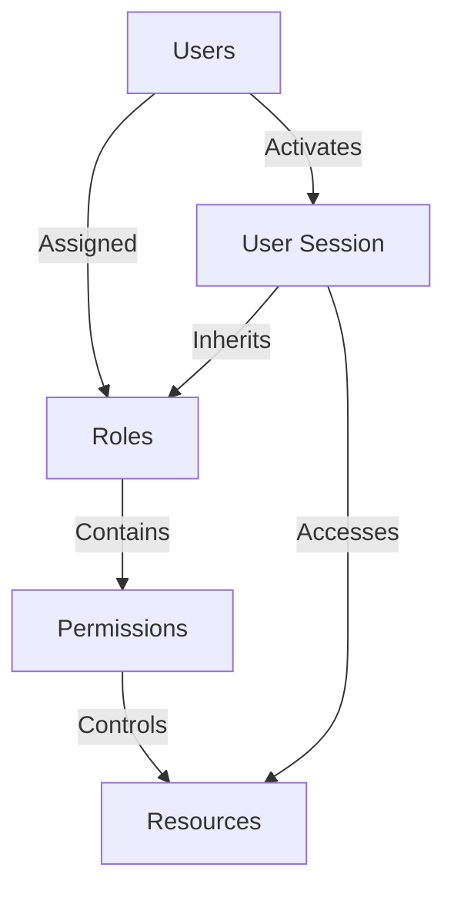
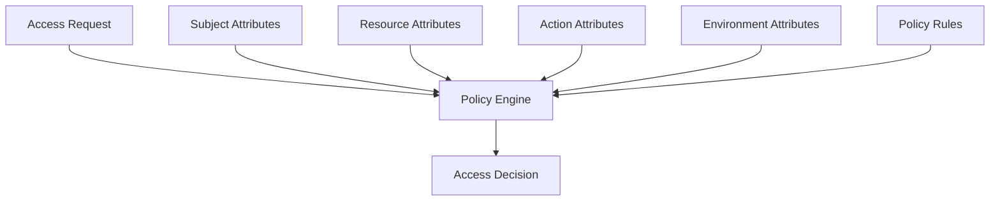
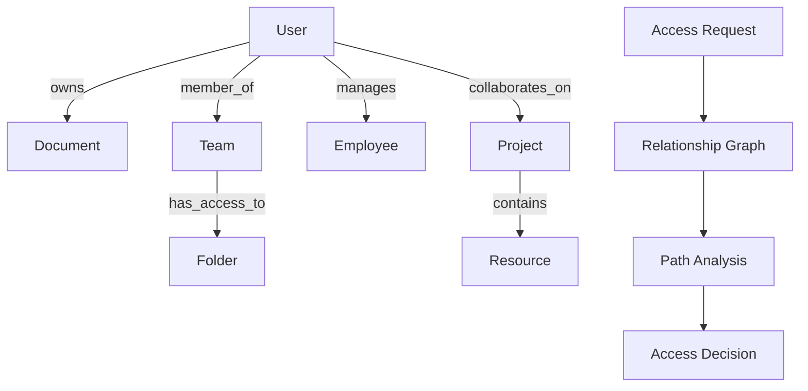

# Chapter 5: Authorization Methods

## RBAC (Role-Based Access Control)

### What is RBAC?

**RBAC** = Role-Based Access Control

Authorization model where access permissions are assigned to roles, and users are assigned to appropriate roles.

### RBAC Components

#### **Core Elements**

| Component | Description | Example |
|-----------|-------------|---------|
| **Users** | System users needing access | John Doe, Jane Smith |
| **Roles** | Job functions with permissions | Admin, Manager, User |
| **Permissions** | Granular access rights | read:users, write:posts |
| **Sessions** | User-role activation | Active login session |

### RBAC Architecture



### RBAC Implementation

#### **Database Schema**

```sql
-- Users table
CREATE TABLE users (
    id INT PRIMARY KEY AUTO_INCREMENT,
    username VARCHAR(50) UNIQUE NOT NULL,
    email VARCHAR(100) UNIQUE NOT NULL,
    password_hash VARCHAR(255) NOT NULL,
    created_at TIMESTAMP DEFAULT CURRENT_TIMESTAMP
);

-- Roles table
CREATE TABLE roles (
    id INT PRIMARY KEY AUTO_INCREMENT,
    name VARCHAR(50) UNIQUE NOT NULL,
    description TEXT,
    created_at TIMESTAMP DEFAULT CURRENT_TIMESTAMP
);

-- Permissions table
CREATE TABLE permissions (
    id INT PRIMARY KEY AUTO_INCREMENT,
    name VARCHAR(100) UNIQUE NOT NULL,
    resource VARCHAR(50) NOT NULL,
    action VARCHAR(50) NOT NULL,
    description TEXT
);

-- User-Role mapping
CREATE TABLE user_roles (
    user_id INT,
    role_id INT,
    assigned_at TIMESTAMP DEFAULT CURRENT_TIMESTAMP,
    PRIMARY KEY (user_id, role_id),
    FOREIGN KEY (user_id) REFERENCES users(id),
    FOREIGN KEY (role_id) REFERENCES roles(id)
);

-- Role-Permission mapping
CREATE TABLE role_permissions (
    role_id INT,
    permission_id INT,
    PRIMARY KEY (role_id, permission_id),
    FOREIGN KEY (role_id) REFERENCES roles(id),
    FOREIGN KEY (permission_id) REFERENCES permissions(id)
);
```

#### **Node.js Implementation**

```javascript
const express = require('express');
const router = express.Router();

// Role definition
const roles = {
  admin: {
    permissions: [
      'users:create',
      'users:read',
      'users:update',
      'users:delete',
      'posts:create',
      'posts:read',
      'posts:update',
      'posts:delete'
    ]
  },
  moderator: {
    permissions: [
      'users:read',
      'posts:create',
      'posts:read',
      'posts:update'
    ]
  },
  user: {
    permissions: [
      'posts:create',
      'posts:read',
      'profile:update'
    ]
  }
};

// User to role mapping
const userRoles = {
  1: ['admin'],      // John is admin
  2: ['moderator'],  // Jane is moderator
  3: ['user']        // Bob is user
};

// Get user permissions
function getUserPermissions(userId) {
  const userRoleNames = userRoles[userId] || [];
  const permissions = new Set();

  userRoleNames.forEach(roleName => {
    const role = roles[roleName];
    if (role) {
      role.permissions.forEach(permission => {
        permissions.add(permission);
      });
    }
  });

  return Array.from(permissions);
}

// Authorization middleware
function requirePermission(resource, action) {
  return (req, res, next) => {
    const userId = req.user.id;
    const requiredPermission = `${resource}:${action}`;

    const userPermissions = getUserPermissions(userId);

    if (userPermissions.includes(requiredPermission)) {
      next();
    } else {
      res.status(403).json({
        error: 'Insufficient permissions',
        required: requiredPermission
      });
    }
  };
}

// Route usage examples
router.get('/users', requirePermission('users', 'read'), getUsers);
router.post('/users', requirePermission('users', 'create'), createUser);
router.put('/users/:id', requirePermission('users', 'update'), updateUser);
router.delete('/users/:id', requirePermission('users', 'delete'), deleteUser);
```

### RBAC Hierarchy

#### **Role Inheritance**

```javascript
const roleHierarchy = {
  admin: {
    inherits: ['moderator'],
    permissions: ['users:delete', 'system:config']
  },
  moderator: {
    inherits: ['user'],
    permissions: ['posts:moderate', 'comments:delete']
  },
  user: {
    inherits: [],
    permissions: ['posts:create', 'profile:update']
  }
};

function getAllRolePermissions(roleName) {
  const role = roleHierarchy[roleName];
  if (!role) return [];

  let permissions = [...(role.permissions || [])];

  // Get permissions from inherited roles
  role.inherits.forEach(inheritedRole => {
    permissions = [
      ...permissions,
      ...getAllRolePermissions(inheritedRole)
    ];
  });

  return [...new Set(permissions)]; // Remove duplicates
}
```

### RBAC Benefits

| Benefit | Description |
|---------|-------------|
| **Simplicity** | Easy to understand and manage |
| **Scalability** | Works well with large user bases |
| **Efficiency** | Fast permission checks |
| **Auditing** | Clear access trail |
| **Compliance** | Meets many regulatory requirements |

### RBAC Limitations

| Limitation | Impact |
|------------|--------|
| **Coarse-grained** | Limited flexibility for fine permissions |
| **Role Explosion** | Too many roles become unmanageable |
| **Static** | Doesn't adapt to context |
| **Maintenance** | Requires ongoing role management |

---

## ABAC (Attribute-Based Access Control)

### What is ABAC?

**ABAC** = Attribute-Based Access Control

Authorization model that uses attributes (user, resource, action, environment) to make access decisions.

### ABAC Components

#### **Attribute Types**

| Attribute Type | Description | Examples |
|----------------|-------------|----------|
| **Subject** | User attributes | role, department, clearance_level |
| **Resource** | Object attributes | classification, owner, department |
| **Action** | Operation attributes | type, risk_level, sensitivity |
| **Environment** | Context attributes | time, location, device_type |

### ABAC Architecture



### ABAC Policy Examples

#### **Policy Language Example**

```javascript
// Policy: Users can access documents if:
// 1. They work in the same department
// 2. The document is not classified
// 3. Access is during business hours

const policies = [
  {
    name: "document_access_policy",
    rules: [
      {
        conditions: [
          "user.department == document.owner_department",
          "document.classification != 'confidential'",
          "environment.time.hour >= 9",
          "environment.time.hour <= 17"
        ],
        effect: "allow",
        actions: ["read", "write"]
      }
    ]
  }
];
```

#### **Complex ABAC Rules**

```javascript
// Medical records access policy
const healthcarePolicies = {
  policies: [
    {
      id: "medical_record_access",
      description: "Access to patient medical records",
      rules: [
        {
          name: "doctor_access_own_patients",
          when: {
            subject: {
              role: "doctor",
              department: "medical"
            },
            resource: {
              type: "medical_record"
            },
            relationship: {
              "doctor.id": "patient.primary_care_physician"
            },
            action: ["read", "update"],
            environment: {
              time: {
                hour: { min: 8, max: 20 }
              }
            }
          },
          effect: "allow"
        },
        {
          name: "emergency_access",
          when: {
            subject: {
              role: ["doctor", "nurse"]
            },
            resource: {
              type: "medical_record",
              emergency: true
            },
            action: ["read"]
          },
          effect: "allow"
        },
        {
          name: "research_access_anonymized",
          when: {
            subject: {
              role: "researcher",
              clearance: "research"
            },
            resource: {
              type: "medical_record",
              anonymized: true
            },
            action: ["read"],
            environment: {
              location: "hospital_network"
            }
          },
          effect: "allow"
        }
      ]
    }
  ]
};
```

### ABAC Implementation

#### **Policy Engine**

```javascript
class ABACPolicyEngine {
  constructor(policies) {
    this.policies = policies;
  }

  evaluate(accessRequest) {
    const {
      subject,
      resource,
      action,
      environment
    } = accessRequest;

    for (const policy of this.policies.policies) {
      for (const rule of policy.rules) {
        if (this.evaluateRule(rule, { subject, resource, action, environment })) {
          return {
            allowed: rule.effect === "allow",
            policy: policy.id,
            rule: rule.name
          };
        }
      }
    }

    return { allowed: false, reason: "No matching policy" };
  }

  evaluateRule(rule, context) {
    return rule.when && this.evaluateConditions(rule.when, context);
  }

  evaluateConditions(conditions, context) {
    for (const [key, value] of Object.entries(conditions)) {
      if (key === "relationship") {
        if (!this.evaluateRelationships(value, context)) {
          return false;
        }
      } else if (typeof value === "object" && value !== null) {
        if (!this.evaluateNestedConditions(key, value, context)) {
          return false;
        }
      } else {
        if (!this.evaluateCondition(key, value, context)) {
          return false;
        }
      }
    }
    return true;
  }

  evaluateCondition(path, expectedValue, context) {
    const actualValue = this.getValueFromPath(path, context);

    if (Array.isArray(expectedValue)) {
      return expectedValue.includes(actualValue);
    }

    if (typeof expectedValue === "object" && expectedValue !== null) {
      return this.evaluateRangeCondition(actualValue, expectedValue);
    }

    return actualValue === expectedValue;
  }

  getValueFromPath(path, context) {
    const [section, ...keys] = path.split(".");
    let value = context[section];

    for (const key of keys) {
      if (value && typeof value === "object") {
        value = value[key];
      } else {
        return undefined;
      }
    }

    return value;
  }

  evaluateRangeCondition(actualValue, rangeCondition) {
    if (rangeCondition.min !== undefined && actualValue < rangeCondition.min) {
      return false;
    }
    if (rangeCondition.max !== undefined && actualValue > rangeCondition.max) {
      return false;
    }
    return true;
  }
}

// Usage example
const policyEngine = new ABACPolicyEngine(healthcarePolicies);

const accessRequest = {
  subject: {
    id: "dr_smith",
    role: "doctor",
    department: "medical"
  },
  resource: {
    id: "record_123",
    type: "medical_record",
    patient_id: "patient_456",
    primary_care_physician: "dr_smith",
    classification: "confidential",
    anonymized: false
  },
  action: "read",
  environment: {
    time: { hour: 14, minute: 30 },
    location: "hospital_network",
    device: "workstation"
  }
};

const decision = policyEngine.evaluate(accessRequest);
console.log(decision); // { allowed: true, policy: "medical_record_access", rule: "doctor_access_own_patients" }
```

### ABAC vs RBAC Comparison

| Aspect | RBAC | ABAC |
|--------|------|------|
| **Granularity** | Coarse-grained | Fine-grained |
| **Flexibility** | Limited | High |
| **Complexity** | Simple | Complex |
| **Performance** | Fast | Slower |
| **Administration** | Role management | Policy management |
| **Context-aware** | No | Yes |
| **Scalability** | Good | Excellent |

---

## DAC (Discretionary Access Control)

### What is DAC?

**DAC** = Discretionary Access Control

Authorization model where the owner of a resource determines who has access rights.

### DAC Characteristics

| Feature | Description |
|---------|-------------|
| **Owner Control** | Resource owners control access |
| **Flexibility** | Fine-grained permissions |
| **Inheritance** | Permissions can be inherited |
| **Delegation** | Access rights can be delegated |

### DAC Implementation

#### **File System Analogy**

```javascript
// File system permissions model
class FileSystemPermission {
  constructor(path) {
    this.path = path;
    this.owner = null;
    this.group = null;
    this.permissions = {
      owner: { read: false, write: false, execute: false },
      group: { read: false, write: false, execute: false },
      others: { read: false, write: false, execute: false }
    };
  }

  setPermissions(userPermissions) {
    this.permissions.owner = userPermissions.owner || this.permissions.owner;
    this.permissions.group = userPermissions.group || this.permissions.group;
    this.permissions.others = userPermissions.others || this.permissions.others;
  }

  checkAccess(user, action) {
    // Owner access
    if (this.owner === user.id) {
      return this.permissions.owner[action] || false;
    }

    // Group access
    if (this.group && user.groups.includes(this.group)) {
      return this.permissions.group[action] || false;
    }

    // Others access
    return this.permissions.others[action] || false;
  }
}

// Usage
const filePermission = new FileSystemPermission('/documents/report.pdf');
filePermission.owner = 'user_123';
filePermission.group = 'finance_team';

filePermission.setPermissions({
  owner: { read: true, write: true, execute: false },
  group: { read: true, write: false, execute: false },
  others: { read: false, write: false, execute: false }
});

// Check access
const user = { id: 'user_456', groups: ['finance_team'] };
const canRead = filePermission.checkAccess(user, 'read'); // true
const canWrite = filePermission.checkAccess(user, 'write'); // false
```

#### **API Resource Ownership**

```javascript
class DACAuthorization {
  constructor() {
    this.resources = new Map();
    this.owners = new Map();
    this.permissions = new Map();
  }

  createResource(resourceId, ownerId) {
    this.resources.set(resourceId, {
      id: resourceId,
      owner: ownerId,
      created_at: new Date()
    });

    // Owner gets full permissions
    this.setPermission(resourceId, ownerId, {
      read: true,
      write: true,
      delete: true,
      share: true
    });
  }

  setPermission(resourceId, userId, permissions) {
    const key = `${resourceId}:${userId}`;
    this.permissions.set(key, permissions);
  }

  grantAccess(resourceId, ownerId, userId, permissions) {
    // Check if requester is owner
    if (!this.isOwner(resourceId, ownerId)) {
      throw new Error('Only resource owners can grant access');
    }

    this.setPermission(resourceId, userId, permissions);
  }

  checkAccess(resourceId, userId, action) {
    // Owner always has access
    if (this.isOwner(resourceId, userId)) {
      return true;
    }

    // Check explicit permissions
    const permissions = this.getUserPermissions(resourceId, userId);
    return permissions && permissions[action] === true;
  }

  isOwner(resourceId, userId) {
    const resource = this.resources.get(resourceId);
    return resource && resource.owner === userId;
  }

  getUserPermissions(resourceId, userId) {
    const key = `${resourceId}:${userId}`;
    return this.permissions.get(key);
  }
}

// Middleware for API routes
function requireDACAccess(action) {
  return (req, res, next) => {
    const resourceId = req.params.id;
    const userId = req.user.id;

    if (dacAuth.checkAccess(resourceId, userId, action)) {
      next();
    } else {
      res.status(403).json({
        error: 'Access denied',
        action: action,
        resource: resourceId
      });
    }
  };
}

// Route usage
app.get('/api/documents/:id', requireDACAccess('read'), getDocument);
app.put('/api/documents/:id', requireDACAccess('write'), updateDocument);
app.delete('/api/documents/:id', requireDACAccess('delete'), deleteDocument);

// Grant access endpoint
app.post('/api/documents/:id/share', (req, res) => {
  const { userId, permissions } = req.body;
  const resourceId = req.params.id;
  const ownerUserId = req.user.id;

  try {
    dacAuth.grantAccess(resourceId, ownerUserId, userId, permissions);
    res.json({ message: 'Access granted successfully' });
  } catch (error) {
    res.status(403).json({ error: error.message });
  }
});
```

### DAC Use Cases

| Use Case | Why DAC Works |
|----------|---------------|
| **File Sharing** | Users control their files |
| **Document Collaboration** | Owners invite collaborators |
| **Personal Data** | User controls own information |
| **Social Media** | Users control post visibility |
| **Cloud Storage** | User controls file access |

---

## MAC (Mandatory Access Control)

### What is MAC?

**MAC** = Mandatory Access Control

Authorization model where access decisions are based on security labels and clearances, not owner discretion.

### MAC Components

#### **Security Labels**

| Component | Description | Examples |
|-----------|-------------|----------|
| **Classification Level** | Data sensitivity | Unclassified, Confidential, Secret, Top Secret |
| **Category** | Subject area | Finance, HR, Engineering |
| **Compartment** | Specific project or need-to-know | Project_X, Research_Division |

#### **Clearance Levels**

| Clearance | Can Access |
|-----------|------------|
| **Unclassified** | Unclassified data only |
| **Confidential** | Confidential + Unclassified |
| **Secret** | Secret + Confidential + Unclassified |
| **Top Secret** | All levels |

### MAC Implementation

#### **Security Model**

```javascript
class MACSecurityModel {
  constructor() {
    this.classificationLevels = {
      'UNC': 0,    // Unclassified
      'C': 1,      // Confidential
      'S': 2,      // Secret
      'TS': 3      // Top Secret
    };

    this.categories = new Set(['FINANCE', 'HR', 'ENGINEERING', 'RESEARCH']);
    this.compartments = new Set(['PROJECT_ALPHA', 'PROJECT_BETA', 'LEGACY']);
  }

  createSecurityLabel(classification, categories = [], compartments = []) {
    return {
      classification,
      categories: new Set(categories),
      compartments: new Set(compartments)
    };
  }

  createClearance(classification, categories = [], compartments = []) {
    return this.createSecurityLabel(classification, categories, compartments);
  }

  canAccess(subjectClearance, objectLabel) {
    // Check classification level (dominance)
    if (!this.dominatesClassification(
      subjectClearance.classification,
      objectLabel.classification
    )) {
      return false;
    }

    // Check categories (superset)
    if (!this.supersetOf(
      subjectClearance.categories,
      objectLabel.categories
    )) {
      return false;
    }

    // Check compartments (superset)
    if (!this.supersetOf(
      subjectClearance.compartments,
      objectLabel.compartments
    )) {
      return false;
    }

    return true;
  }

  dominatesClassification(subjectLevel, objectLevel) {
    return this.classificationLevels[subjectLevel] >=
           this.classificationLevels[objectLevel];
  }

  supersetOf(setA, setB) {
    for (const item of setB) {
      if (!setA.has(item)) {
        return false;
      }
    }
    return true;
  }
}

// Usage
const macModel = new MACSecurityModel();

// User clearances
const userClearance = {
  alice: macModel.createClearance('S', ['FINANCE', 'HR'], []),
  bob: macModel.createClearance('C', ['FINANCE'], []),
  charlie: macModel.createClearance('TS', ['FINANCE', 'HR', 'ENGINEERING'], ['PROJECT_ALPHA'])
};

// Document labels
const documentLabels = {
  report1: macModel.createSecurityLabel('C', ['FINANCE'], []),
  project1: macModel.createSecurityLabel('S', ['ENGINEERING'], ['PROJECT_ALPHA']),
  hrData: macModel.createSecurityLabel('TS', ['HR'], [])
};

// Check access
console.log('Alice can access report1:',
  macModel.canAccess(userClearance.alice, documentLabels.report1)); // true
console.log('Bob can access project1:',
  macModel.canAccess(userClearance.bob, documentLabels.project1)); // false
console.log('Charlie can access hrData:',
  macModel.canAccess(userClearance.charlie, documentLabels.hrData)); // true
```

#### **API Implementation**

```javascript
class MACAuthorization {
  constructor() {
    this.securityModel = new MACSecurityModel();
    this.userClearances = new Map();
    this.resourceLabels = new Map();
  }

  setUserClearance(userId, clearance) {
    this.userClearances.set(userId, clearance);
  }

  setResourceLabel(resourceId, label) {
    this.resourceLabels.set(resourceId, label);
  }

  checkAccess(userId, resourceId) {
    const userClearance = this.userClearances.get(userId);
    const resourceLabel = this.resourceLabels.get(resourceId);

    if (!userClearance || !resourceLabel) {
      return { allowed: false, reason: 'Missing clearance or label' };
    }

    const allowed = this.securityModel.canAccess(userClearance, resourceLabel);

    return {
      allowed,
      userClearance,
      resourceLabel,
      reason: allowed ? 'Access granted' : 'Insufficient clearance'
    };
  }
}

// Middleware
function requireMACAccess(resourceIdParam = 'id') {
  return (req, res, next) => {
    const resourceId = req.params[resourceIdParam];
    const userId = req.user.id;

    const accessResult = macAuth.checkAccess(userId, resourceId);

    if (accessResult.allowed) {
      req.macContext = accessResult;
      next();
    } else {
      res.status(403).json({
        error: 'Access denied',
        reason: accessResult.reason,
        resource: resourceId
      });
    }
  };
}

// Route usage
app.get('/api/documents/:id',
  requireMACAccess('id'),
  (req, res) => {
    // User has MAC clearance for this resource
    res.json({
      document: getDocument(req.params.id),
      securityContext: req.macContext
    });
  }
);
```

### MAC Use Cases

| Environment | Why MAC |
|-------------|----------|
| **Military/Government** | National security requirements |
| **Intelligence Agencies** | Compartmentalized information |
| **Financial Institutions** | Regulatory compliance |
| **Healthcare** | HIPAA compliance |
| **Critical Infrastructure** | High security requirements |

---

## PBAC (Policy-Based Access Control)

### What is PBAC?

**PBAC** = Policy-Based Access Control

Authorization model that uses predefined policies to determine access rights based on various attributes and conditions.

### PBAC Policy Structure

#### **Policy Definition**

```javascript
const pbacPolicies = {
  policies: [
    {
      id: "financial_data_access",
      name: "Financial Data Access Policy",
      description: "Controls access to financial reports and data",
      rules: [
        {
          name: "finance_department_access",
          priority: 1,
          conditions: [
            {
              type: "attribute",
              attribute: "user.department",
              operator: "equals",
              value: "finance"
            },
            {
              type: "attribute",
              attribute: "resource.type",
              operator: "in",
              value: ["financial_report", "transaction", "budget"]
            },
            {
              type: "attribute",
              attribute: "action",
              operator: "in",
              value: ["read", "write", "export"]
            }
          ],
          effect: "allow",
          obligations: [
            "log_access_attempt",
            "notify_financial_manager"
          ]
        },
        {
          name: "executive_summary_access",
          priority: 2,
          conditions: [
            {
              type: "attribute",
              attribute: "user.role",
              operator: "in",
              value: ["ceo", "cfo", "coo"]
            },
            {
              type: "attribute",
              attribute: "resource.classification",
              operator: "equals",
              value: "executive_summary"
            },
            {
              type: "time",
              attribute: "environment.time.hour",
              operator: "between",
              value: [9, 17]
            }
          ],
          effect: "allow",
          obligations: ["audit_log"]
        },
        {
          name: "auditor_access",
          priority: 3,
          conditions: [
            {
              type: "attribute",
              attribute: "user.role",
              operator: "equals",
              value: "auditor"
            },
            {
              type: "attribute",
              attribute: "audit.status",
              operator: "equals",
              value: "active"
            },
            {
              type: "relationship",
              relationship: "user.can_audit",
              target: "resource.owner_department"
            }
          ],
          effect: "allow",
          obligations: ["detailed_audit_trail"]
        }
      ]
    },
    {
      id: "healthcare_data_access",
      name: "HIPAA Healthcare Data Access",
      rules: [
        {
          name: "provider_patient_relationship",
          conditions: [
            {
              type: "attribute",
              attribute: "user.role",
              operator: "in",
              value: ["doctor", "nurse", "therapist"]
            },
            {
              type: "relationship",
              relationship: "user.treating",
              target: "resource.patient_id"
            },
            {
              type: "consent",
              consent_type: "medical_treatment",
              patient: "resource.patient_id",
              status: "active"
            }
          ],
          effect: "allow"
        }
      ]
    }
  ]
};
```

### PBAC Engine Implementation

```javascript
class PBACPolicyEngine {
  constructor(policies) {
    this.policies = policies;
  }

  evaluate(accessRequest) {
    const { subject, resource, action, environment } = accessRequest;

    const applicablePolicies = this.findApplicablePolicies(resource.type);
    const results = [];

    for (const policy of applicablePolicies) {
      for (const rule of policy.rules) {
        const result = this.evaluateRule(rule, accessRequest);
        if (result.decision !== "not_applicable") {
          results.push({
            policyId: policy.id,
            ruleName: rule.name,
            decision: result.decision,
            obligations: rule.obligations || [],
            priority: rule.priority || 0
          });
        }
      }
    }

    return this.resolveConflicts(results);
  }

  evaluateRule(rule, context) {
    const allConditionsMet = rule.conditions.every(condition =>
      this.evaluateCondition(condition, context)
    );

    if (allConditionsMet) {
      return { decision: rule.effect };
    }

    return { decision: "not_applicable" };
  }

  evaluateCondition(condition, context) {
    switch (condition.type) {
      case "attribute":
        return this.evaluateAttributeCondition(condition, context);
      case "time":
        return this.evaluateTimeCondition(condition, context);
      case "relationship":
        return this.evaluateRelationshipCondition(condition, context);
      case "consent":
        return this.evaluateConsentCondition(condition, context);
      default:
        return false;
    }
  }

  evaluateAttributeCondition(condition, context) {
    const value = this.getAttributeValue(condition.attribute, context);

    switch (condition.operator) {
      case "equals":
        return value === condition.value;
      case "not_equals":
        return value !== condition.value;
      case "in":
        return Array.isArray(condition.value) && condition.value.includes(value);
      case "not_in":
        return Array.isArray(condition.value) && !condition.value.includes(value);
      case "contains":
        return Array.isArray(value) && value.includes(condition.value);
      case "greater_than":
        return value > condition.value;
      case "less_than":
        return value < condition.value;
      case "between":
        return value >= condition.value[0] && value <= condition.value[1];
      default:
        return false;
    }
  }

  getAttributeValue(attributePath, context) {
    const [entityType, ...path] = attributePath.split('.');
    let value = context[entityType];

    for (const key of path) {
      if (value && typeof value === 'object') {
        value = value[key];
      } else {
        return undefined;
      }
    }

    return value;
  }

  evaluateTimeCondition(condition, context) {
    const currentValue = this.getAttributeValue(condition.attribute, context);

    switch (condition.operator) {
      case "between":
        return currentValue >= condition.value[0] && currentValue <= condition.value[1];
      case "equals":
        return currentValue === condition.value;
      default:
        return false;
    }
  }

  evaluateRelationshipCondition(condition, context) {
    // This would implement relationship checking logic
    // For example, checking if a user is treating a specific patient
    return checkRelationship(condition.relationship, condition.target, context);
  }

  evaluateConsentCondition(condition, context) {
    // This would check consent records and status
    return checkConsent(condition, context);
  }

  resolveConflicts(results) {
    if (results.length === 0) {
      return {
        decision: "deny",
        reason: "No applicable policies",
        obligations: []
      };
    }

    // Sort by priority (higher priority wins)
    results.sort((a, b) => b.priority - a.priority);

    const highestPriority = results[0];

    // Check for conflicts with same priority
    const conflicting = results.filter(r =>
      r.priority === highestPriority.priority && r.decision !== highestPriority.decision
    );

    if (conflicting.length > 0) {
      return {
        decision: "deny", // Deny on conflict
        reason: "Conflicting policy decisions",
        conflictingRules: conflicting.map(r => r.ruleName)
      };
    }

    return {
      decision: highestPriority.decision,
      policy: highestPriority.policyId,
      rule: highestPriority.ruleName,
      obligations: highestPriority.obligations,
      allResults: results
    };
  }

  findApplicablePolicies(resourceType) {
    return this.policies.policies.filter(policy =>
      policy.rules.some(rule =>
        rule.conditions.some(condition =>
          condition.attribute && condition.attribute.includes(resourceType)
        )
      )
    );
  }
}
```

### PBAC vs Other Models

| Feature | RBAC | ABAC | PBAC |
|---------|------|------|------|
| **Policy Definition** | Role-based | Attribute-based | Explicit policies |
| **Complexity** | Simple | High | Medium-High |
| **Flexibility** | Limited | High | Very High |
| **Admin Overhead** | Low | High | Medium |
| **Auditing** | Basic | Detailed | Very Detailed |
| **Obligations** | No | Yes | Yes |

---

## ReBAC (Relationship-Based Access Control)

### What is ReBAC?

**ReBAC** = Relationship-Based Access Control

Authorization model that determines access based on the relationships between entities (users, resources, and actions).

### ReBAC Concepts

#### **Relationship Types**

| Relationship Type | Description | Example |
|-------------------|-------------|---------|
| **Ownership** | User owns resource | User → Document |
| **Membership** | User belongs to group | User → Team |
| **Hierarchy** | Parent-child relationships | Manager → Employee |
| **Collaboration** | Working together | Editor → Document |
| **Delegation** | Temporary authority | Manager → Assistant |

### ReBAC Architecture



### ReBAC Implementation

#### **Relationship Graph**

```javascript
class ReBACGraph {
  constructor() {
    this.nodes = new Map(); // id -> node data
    this.edges = new Map(); // relationship -> Set of edges
    this.relationships = new Map(); // edge_id -> relationship data
  }

  addNode(id, type, attributes = {}) {
    this.nodes.set(id, {
      id,
      type,
      attributes,
      relationships: new Set()
    });
  }

  addRelationship(fromId, toId, type, attributes = {}) {
    const edgeId = `${fromId}-${type}-${toId}`;

    const relationship = {
      id: edgeId,
      from: fromId,
      to: toId,
      type,
      attributes,
      created_at: new Date()
    };

    this.relationships.set(edgeId, relationship);

    // Update node relationships
    const fromNode = this.nodes.get(fromId);
    const toNode = this.nodes.get(toId);

    if (fromNode) fromNode.relationships.add(edgeId);
    if (toNode) toNode.relationships.add(edgeId);

    return relationship;
  }

  findRelationships(fromId, type = null, toId = null) {
    const results = [];

    for (const [edgeId, relationship] of this.relationships) {
      if (fromId && relationship.from !== fromId) continue;
      if (type && relationship.type !== type) continue;
      if (toId && relationship.to !== toId) continue;

      results.push(relationship);
    }

    return results;
  }

  findPaths(fromId, toId, maxDepth = 5) {
    const visited = new Set([fromId]);
    const paths = [];

    function dfs(currentId, targetId, currentPath, depth) {
      if (currentId === targetId) {
        paths.push([...currentPath]);
        return;
      }

      if (depth >= maxDepth) return;

      const currentNode = this.nodes.get(currentId);
      if (!currentNode) return;

      for (const edgeId of currentNode.relationships) {
        const relationship = this.relationships.get(edgeId);
        if (!relationship) continue;

        const nextId = relationship.to;
        if (visited.has(nextId)) continue;

        visited.add(nextId);
        currentPath.push(relationship);

        dfs.call(this, nextId, targetId, currentPath, depth + 1);

        currentPath.pop();
        visited.delete(nextId);
      }
    }

    dfs.call(this, fromId, toId, [], 0);
    return paths;
  }
}
```

#### **ReBAC Policy Engine**

```javascript
class ReBACPolicyEngine {
  constructor(graph) {
    this.graph = graph;
    this.policies = [];
  }

  addPolicy(policy) {
    this.policies.push(policy);
  }

  checkAccess(userId, resourceId, action) {
    const userNode = this.graph.nodes.get(userId);
    const resourceNode = this.graph.nodes.get(resourceId);

    if (!userNode || !resourceNode) {
      return { allowed: false, reason: 'User or resource not found' };
    }

    for (const policy of this.policies) {
      const result = this.evaluatePolicy(policy, userId, resourceId, action);
      if (result.decision === 'allow') {
        return { allowed: true, policy: policy.name, reason: result.reason };
      } else if (result.decision === 'deny') {
        return { allowed: false, policy: policy.name, reason: result.reason };
      }
    }

    return { allowed: false, reason: 'No matching policies' };
  }

  evaluatePolicy(policy, userId, resourceId, action) {
    for (const rule of policy.rules) {
      if (rule.action && !rule.action.includes(action)) {
        continue;
      }

      const result = this.evaluateRule(rule, userId, resourceId);
      if (result.matched) {
        return {
          decision: rule.effect,
          reason: result.reason
        };
      }
    }

    return { decision: 'not_applicable' };
  }

  evaluateRule(rule, userId, resourceId) {
    const paths = this.graph.findPaths(userId, resourceId, rule.maxDepth || 3);

    for (const path of paths) {
      if (this.matchesPattern(path, rule.relationships)) {
        return {
          matched: true,
          reason: `Path matches pattern: ${path.map(r => r.type).join(' → ')}`
        };
      }
    }

    return { matched: false };
  }

  matchesPattern(path, pattern) {
    if (path.length !== pattern.length) {
      return false;
    }

    return path.every((relationship, index) => {
      const patternItem = pattern[index];
      if (Array.isArray(patternItem)) {
        return patternItem.includes(relationship.type);
      }
      return relationship.type === patternItem;
    });
  }
}
```

#### **ReBAC Policies**

```javascript
// Example ReBAC policies
const rebacPolicies = [
  {
    name: "Document Access Policy",
    rules: [
      {
        name: "owner_access",
        relationships: ["owns"],
        action: ["read", "write", "delete", "share"],
        effect: "allow"
      },
      {
        name: "collaborator_access",
        relationships: ["collaborates_on"],
        action: ["read", "write"],
        effect: "allow"
      },
      {
        name: "team_member_access",
        relationships: ["member_of", "has_access_to"],
        action: ["read"],
        effect: "allow"
      },
      {
        name: "manager_access",
        relationships: ["manages", "owns"],
        action: ["read", "write"],
        effect: "allow"
      }
    ]
  },
  {
    name: "Project Resource Policy",
    rules: [
      {
        name: "project_member_access",
        relationships: ["member_of", "contains"],
        action: ["read"],
        effect: "allow"
      },
      {
        name: "project_lead_access",
        relationships: ["leads", "contains"],
        action: ["read", "write", "manage"],
        effect: "allow"
      }
    ]
  }
];
```

#### **Usage Example**

```javascript
// Initialize ReBAC system
const rebacGraph = new ReBACGraph();
const rebacEngine = new ReBACPolicyEngine(rebacGraph);

// Add nodes
rebacGraph.addNode('user_1', 'user', { name: 'Alice', role: 'manager' });
rebacGraph.addNode('user_2', 'user', { name: 'Bob', role: 'employee' });
rebacGraph.addNode('doc_1', 'document', { title: 'Project Report' });
rebacGraph.addNode('team_1', 'team', { name: 'Project Team' });
rebacGraph.addNode('project_1', 'project', { name: 'Q1 Project' });

// Add relationships
rebacGraph.addRelationship('user_1', 'doc_1', 'owns');
rebacGraph.addRelationship('user_1', 'user_2', 'manages');
rebacGraph.addRelationship('user_2', 'team_1', 'member_of');
rebacGraph.addRelationship('team_1', 'project_1', 'works_on');
rebacGraph.addRelationship('project_1', 'doc_1', 'contains');
rebacGraph.addRelationship('user_1', 'team_1', 'leads');

// Add policies
rebacPolicies.forEach(policy => rebacEngine.addPolicy(policy));

// Check access
console.log('Alice can read doc_1:',
  rebacEngine.checkAccess('user_1', 'doc_1', 'read')); // true
console.log('Bob can read doc_1:',
  rebacEngine.checkAccess('user_2', 'doc_1', 'read')); // true (team member)
console.log('Bob can delete doc_1:',
  rebacEngine.checkAccess('user_2', 'doc_1', 'delete')); // false
```

### ReBAC Use Cases

| Use Case | Why ReBAC |
|----------|-----------|
| **Social Media** | Follow relationships, content sharing |
| **Collaboration Tools** | Project teams, document access |
| **Healthcare** | Doctor-patient relationships |
| **Enterprise Systems** | Organizational hierarchies |
| **IoT Networks** | Device relationships and permissions |

---

## Authorization Method Comparison

### Comprehensive Comparison Matrix

| Aspect | RBAC | ABAC | DAC | MAC | PBAC | ReBAC |
|--------|------|------|-----|-----|------|-------|
| **Flexibility** | ⭐⭐ | ⭐⭐⭐⭐⭐ | ⭐⭐⭐⭐ | ⭐ | ⭐⭐⭐⭐⭐ | ⭐⭐⭐⭐ |
| **Simplicity** | ⭐⭐⭐⭐⭐ | ⭐⭐ | ⭐⭐⭐ | ⭐⭐ | ⭐⭐ | ⭐⭐⭐ |
| **Scalability** | ⭐⭐⭐⭐ | ⭐⭐⭐⭐⭐ | ⭐⭐ | ⭐⭐⭐ | ⭐⭐⭐⭐ | ⭐⭐⭐⭐ |
| **Granularity** | ⭐⭐ | ⭐⭐⭐⭐⭐ | ⭐⭐⭐⭐ | ⭐⭐ | ⭐⭐⭐⭐⭐ | ⭐⭐⭐⭐⭐ |
| **Context-Aware** | ❌ | ✅ | ❌ | ❌ | ✅ | ✅ |
| **Performance** | ⭐⭐⭐⭐⭐ | ⭐⭐ | ⭐⭐⭐⭐ | ⭐⭐⭐⭐ | ⭐⭐ | ⭐⭐⭐ |
| **Admin Overhead** | ⭐⭐⭐⭐ | ⭐⭐ | ⭐⭐⭐ | ⭐⭐⭐⭐ | ⭐⭐ | ⭐⭐⭐ |
| **Regulatory Compliance** | ⭐⭐⭐ | ⭐⭐⭐⭐ | ⭐⭐ | ⭐⭐⭐⭐⭐ | ⭐⭐⭐⭐⭐ | ⭐⭐⭐ |

### Decision Guide

#### **When to Use Each Method**

| Scenario | Recommended Method | Reason |
|----------|-------------------|--------|
| **Small Business App** | RBAC | Simple, easy to manage |
| **Enterprise SaaS** | ABAC | Flexible, fine-grained control |
| **File Sharing System** | DAC | User-controlled access |
| **Military/Government** | MAC | Security classification required |
| **Healthcare** | PBAC + ReBAC | Complex policies + relationships |
| **Social Network** | ReBAC | Relationship-based permissions |
| **Financial Services** | ABAC + RBAC | Compliance + operational needs |

### Hybrid Approaches

#### **RBAC + ABAC Combination**

```javascript
// Hybrid authorization combining roles and attributes
class HybridAuthorization {
  constructor() {
    this.rbac = new RBACSystem();
    this.abac = new ABACPolicyEngine();
  }

  checkAccess(userId, resourceId, action, context = {}) {
    // First check RBAC
    const rbacResult = this.rbac.checkAccess(userId, action);

    if (rbacResult.denied) {
      return { allowed: false, reason: "RBAC deny" };
    }

    // Then check ABAC for additional constraints
    const abacRequest = {
      subject: { id: userId, ...context.subject },
      resource: { id: resourceId, ...context.resource },
      action,
      environment: context.environment || {}
    };

    const abacResult = this.abac.evaluate(abacRequest);

    return {
      allowed: abacResult.allowed && rbacResult.allowed,
      rbac: rbacResult,
      abac: abacResult
    };
  }
}
```

#### **Policy Evaluation Order**

1. **MAC** (Mandatory rules, cannot be overridden)
2. **RBAC** (Basic role permissions)
3. **ABAC** (Fine-grained attribute-based rules)
4. **DAC** (Owner discretion)
5. **ReBAC** (Relationship-based permissions)

---

## Interview Questions

### **Q1: What is the difference between Authentication and Authorization?**
**Answer:**
- **Authentication**: Verifying who you are (identity verification)
- **Authorization**: Determining what you can do (permission checking)
- **Example**: Authentication = showing your ID card, Authorization = checking if your ID allows access to a specific room

### **Q2: When would you choose RBAC over ABAC?**
**Answer:**
**Choose RBAC when:**
- Simple, predictable access patterns
- Clear job roles and responsibilities
- Limited number of user roles
- Easy administration is priority
- Regulatory compliance with role-based access

**Choose ABAC when:**
- Complex, dynamic access requirements
- Fine-grained permissions needed
- Context-aware decisions required
- Large number of user combinations
- Dynamic policy changes needed

### **Q3: What are the main challenges of implementing MAC?**
**Answer:**
**Challenges:**
- **Complexity**: Requires security classification system
- **Administration**: Overhead of managing clearances and labels
- **Performance**: Complex rule evaluation
- **Flexibility**: Rigid rules, hard to adapt to changing needs
- **User Experience**: Complex permission denials
- **Implementation**: Need specialized security expertise

### **Q4: How does ReBAC differ from traditional access control models?**
**Answer:**
**ReBAC Key Differences:**
- **Relationship-based**: Uses entity relationships instead of roles/attributes
- **Path-based**: Evaluates access through relationship paths
- **Dynamic**: Automatically inherits permissions through relationships
- **Natural fit**: Maps well to real-world organizational structures
- **Graph-based**: Uses graph algorithms for permission evaluation

### **Q5: What are the advantages of PBAC over other models?**
**Answer:**
**PBAC Advantages:**
- **Expressiveness**: Can express complex business rules
- **Explicit policies**: Clear, auditable policy definitions
- **Obligations**: Can trigger actions alongside decisions
- **Flexibility**: Supports complex rule combinations
- **Compliance**: Excellent for regulatory requirements
- **Traceability**: Detailed audit trails and decision reasoning

### **Q6: How would you implement a hybrid authorization system?**
**Answer:**
```javascript
// Implementation approach:
1. Layer multiple models with evaluation order
2. Start with mandatory controls (MAC)
3. Apply role-based permissions (RBAC)
4. Add attribute-based constraints (ABAC)
5. Consider relationship-based access (ReBAC)
6. Allow user discretion where appropriate (DAC)

// Benefits:
- Defense in depth
- Flexible policy combination
- Compliance with multiple requirements
- Granular control where needed
```

### **Q7: What are the performance considerations for different authorization models?**
**Answer:**
**Performance by Model:**
- **RBAC**: Fast - simple role lookup
- **ABAC**: Slower - complex rule evaluation
- **DAC**: Medium - permission lookup + ownership check
- **MAC**: Fast-Medium - classification comparison
- **PBAC**: Slowest - complex policy evaluation
- **ReBAC**: Variable - depends on path finding complexity

**Optimization Strategies:**
- Cache frequent access decisions
- Pre-compute permission sets
- Use efficient data structures
- Implement decision caching
- Optimize rule evaluation order

---

## Quick Tips & Best Practices

### **Authorization Design**
✅ Start simple, add complexity as needed
✅ Use principle of least privilege
✅ Implement regular permission audits
✅ Document access control policies
✅ Plan for scalability from the start

### **RBAC Implementation**
✅ Keep number of roles manageable
✅ Use role hierarchies for inheritance
✅ Regular review of role assignments
✅ Separate duties for security
✅ Implement role expiration policies

### **ABAC/PBAC Implementation**
✅ Design clear policy language
✅ Implement efficient rule evaluation
✅ Cache frequent decisions
✅ Monitor policy performance
✅ Test edge cases thoroughly

### **Security Considerations**
✅ Log all authorization decisions
✅ Implement access request auditing
✅ Regular security reviews
✅ Separate authentication and authorization
✅ Fail securely (deny on uncertainty)

---

## Chapter Summary

Chapter 5 explores comprehensive authorization methods for controlling API access:

### **Authorization Models Overview**

| Model | Best For | Key Characteristics |
|-------|----------|-------------------|
| **RBAC** | Traditional enterprise apps | Role-based, simple, scalable |
| **ABAC** | Complex, dynamic environments | Attribute-based, flexible, context-aware |
| **DAC** | User-controlled resources | Owner discretion, fine-grained |
| **MAC** | High-security environments | Classification-based, mandatory |
| **PBAC** | Complex business rules | Policy-based, explicit, auditable |
| **ReBAC** | Relationship-centric systems | Graph-based, dynamic, natural |

### **Key Concepts**

- **Access Control Matrix**: Subject-Object-Action relationships
- **Security Labels**: Classification and clearance systems
- **Policy Evaluation**: Rule-based decision making
- **Relationship Graphs**: Entity connections and paths
- **Hybrid Approaches**: Combining multiple models

### **Implementation Considerations**

- **Performance**: Evaluation speed and caching strategies
- **Scalability**: Managing users, roles, and policies at scale
- **Auditing**: Tracking access decisions and compliance
- **Maintenance**: Ongoing administration and updates
- **Flexibility**: Adapting to changing business requirements

Choose the authorization model that best fits your application's security requirements, complexity needs, and operational constraints. Hybrid approaches often provide the best balance of security and usability.