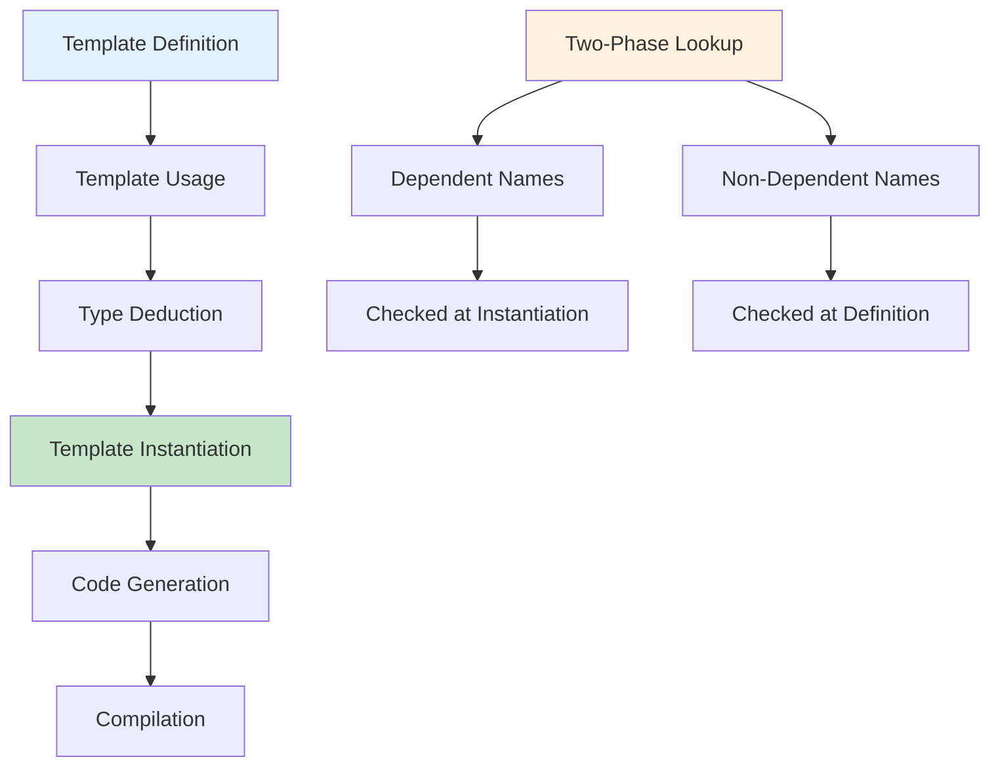

# Chapter 13: Templates (Interview Revision)

## Core Concepts

### Template Fundamentals

#### Function Templates
```cpp
// Basic function template
template<typename T>
T add(T a, T b) {
    return a + b;
}

// Multiple template parameters
template<typename T, typename U>
auto multiply(T a, U b) -> decltype(a * b) {
    return a * b;
}

// Template with non-type parameters
template<typename T, int SIZE>
class FixedArray {
private:
    T data[SIZE];
public:
    T& operator[](int index) { return data[index]; }
    const T& operator[](int index) const { return data[index]; }
    int size() const { return SIZE; }
};

// Usage
int main() {
    int result1 = add(5, 3);           // T = int
    double result2 = add(3.14, 2.71);   // T = double
    auto result3 = multiply(5, 3.14);   // T = int, U = double

    FixedArray<int, 10> intArray;      // SIZE = 10
    FixedArray<double, 5> doubleArray; // SIZE = 5

    return 0;
}
```

#### Class Templates
```cpp
// Basic class template
template<typename T>
class Stack {
private:
    std::vector<T> elements;

public:
    void push(const T& element) {
        elements.push_back(element);
    }

    T pop() {
        if (elements.empty()) {
            throw std::runtime_error("Stack empty");
        }
        T top = elements.back();
        elements.pop_back();
        return top;
    }

    bool empty() const {
        return elements.empty();
    }
};

// Template specialization example
template<typename T>
class Calculator {
public:
    T add(T a, T b) {
        return a + b;
    }
};

// Full specialization for bool
template<>
class Calculator<bool> {
public:
    bool add(bool a, bool b) {
        return a || b;  // Logical OR for booleans
    }
};
```

### Template Instantiation Process



### Template Argument Deduction

| Context | Deduction Rules | Example |
|---------|----------------|---------|
| **Function parameters** | Deduce from arguments | `add(5, 3)` → `add<int>` |
| **Auto** | Same as function templates | `auto x = 42` → `int` |
| **Class templates** | No deduction (C++17+ except) | `std::vector<int> v;` |
| **CTAD (C++17)** | Deduce from constructors | `std::vector v = {1,2,3};` |
| **Partial deduction** | Specify some parameters | `func<double>(42)` |

## Part 1: Template Specialization

### Full Specialization
```cpp
// Primary template
template<typename T>
class TypeInfo {
public:
    static const char* getName() {
        return "Unknown type";
    }

    static size_t getSize() {
        return sizeof(T);
    }
};

// Full specialization for int
template<>
class TypeInfo<int> {
public:
    static const char* getName() {
        return "int";
    }

    static size_t getSize() {
        return sizeof(int);
    }

    static int getMaxValue() {
        return INT_MAX;
    }
};

// Full specialization for std::string
template<>
class TypeInfo<std::string> {
public:
    static const char* getName() {
        return "std::string";
    }

    static size_t getSize() {
        return sizeof(std::string);
    }

    static std::string getEmpty() {
        return "";
    }
};

// Usage
void demonstrateSpecialization() {
    std::cout << TypeInfo<int>::getName() << ": " << TypeInfo<int>::getSize() << " bytes" << std::endl;
    std::cout << TypeInfo<double>::getName() << ": " << TypeInfo<double>::getSize() << " bytes" << std::endl;
    std::cout << TypeInfo<std::string>::getName() << ": " << TypeInfo<std::string>::getSize() << " bytes" << std::endl;
}
```

### Partial Specialization
```cpp
// Primary template
template<typename T, typename U>
class Pair {
private:
    T first;
    U second;

public:
    Pair(T f, U s) : first(f), second(s) {}

    void print() const {
        std::cout << "Pair<" << typeid(T).name() << ", " << typeid(U).name() << ">"
                  << "(" << first << ", " << second << ")" << std::endl;
    }
};

// Partial specialization for same types
template<typename T>
class Pair<T, T> {
private:
    T first;
    T second;

public:
    Pair(T f, T s) : first(f), second(s) {}

    void print() const {
        std::cout << "Pair<" << typeid(T).name() << ", " << typeid(T).name() << ">"
                  << "(" << first << ", " << second << ") - Same types!" << std::endl;
    }

    T sum() const {
        return first + second;
    }
};

// Partial specialization for pointer types
template<typename T, typename U>
class Pair<T*, U*> {
private:
    T* first;
    U* second;

public:
    Pair(T* f, U* s) : first(f), second(s) {}

    void print() const {
        std::cout << "Pair<" << typeid(T).name() << "*, " << typeid(U).name() << "*>"
                  << "(" << *first << ", " << *second << ") - Pointer types!" << std::endl;
    }
};
```

### Specialization for Function Templates
```cpp
// Primary function template
template<typename T>
T maxValue(T a, T b) {
    return (a > b) ? a : b;
}

// Full specialization for const char*
template<>
const char* maxValue<const char*>(const char* a, const char* b) {
    return (strcmp(a, b) > 0) ? a : b;
}

// Overloading vs Specialization
template<typename T>
T process(T value) {
    std::cout << "Generic template: " << value << std::endl;
    return value * 2;
}

// Overload (not specialization) - preferred in most cases
template<>
int process<int>(int value) {
    std::cout << "Int overload: " << value << std::endl;
    return value + 100;
}

// Regular function overload (even better)
double process(double value) {
    std::cout << "Double overload: " << value << std::endl;
    return value * 3.14;
}
```

## Part 2: Advanced Template Techniques

### Variadic Templates (C++11)
```cpp
// Basic variadic template
template<typename... Args>
void print(Args... args) {
    // Fold expression (C++17)
    (std::cout << ... << args) << std::endl;
}

// Recursive variadic template (C++11/14)
template<typename T>
void printVariadic(T&& value) {
    std::cout << value << std::endl;
}

template<typename T, typename... Args>
void printVariadic(T&& value, Args&&... args) {
    std::cout << value << " ";
    printVariadic(std::forward<Args>(args)......);
}

// Perfect forwarding with variadic templates
template<typename... Args>
auto make_unique_wrapper(Args&&... args) {
    return std::make_unique<typename std::common_type<Args...>::type>(
        std::forward<Args>(args)...
    );
}

// Parameter pack expansion
template<typename... Types>
class Tuple;

template<>
class Tuple<> {
    // Empty tuple
};

template<typename Head, typename... Tail>
class Tuple<Head, Tail...> {
private:
    Head head;
    Tuple<Tail...> tail;

public:
    Tuple(Head h, Tail... t) : head(h), tail(t...) {}

    Head& getHead() { return head; }
    Tuple<Tail...>& getTail() { return tail; }
};
```

### Template Metaprogramming (TMP)
```cpp
// Compile-time factorial
template<int N>
struct Factorial {
    static const int value = N * Factorial<N - 1>::value;
};

template<>
struct Factorial<0> {
    static const int value = 1;
};

// Compile-time power
template<int Base, int Exp>
struct Power {
    static const int value = Base * Power<Base, Exp - 1>::value;
};

template<int Base>
struct Power<Base, 0> {
    static const int value = 1;
};

// SFINAE examples
template<typename T>
typename std::enable_if<std::is_integral<T>::value, T>::type
processIntegral(T value) {
    std::cout << "Integral: " << value << std::endl;
    return value * 2;
}

template<typename T>
typename std::enable_if<std::is_floating_point<T>::value, T>::type
processIntegral(T value) {
    std::cout << "Floating point: " << value << std::endl;
    return value * 3.14;
}

// Check if type has specific method (SFINAE)
template<typename T>
class HasSerializeMethod {
private:
    template<typename U>
    static auto test(int) -> decltype(std::declval<U>().serialize(), std::true_type{});

    template<typename>
    static std::false_type test(...);

public:
    static constexpr bool value = decltype(test<T>(0))::value;
};
```

## Part 3: Type Traits

### Standard Type Traits
```cpp
#include <type_traits>

// Type traits examples
void demonstrateTypeTraits() {
    // Primary type categories
    std::cout << "int is integral: " << std::is_integral<int>::value << std::endl;
    std::cout << "double is floating point: " << std::is_floating_point<double>::value << std::endl;
    std::cout << "std::string is class: " << std::is_class<std::string>::value << std::endl;

    // Type properties
    std::cout << "int is const: " << std::is_const<const int>::value << std::endl;
    std::cout << "int* is pointer: " << std::is_pointer<int*>::value << std::endl;
    std::cout << "int& is reference: " << std::is_reference<int&>::value << std::endl;

    // Type relationships
    std::cout << "int is convertible to double: " << std::is_convertible<int, double>::value << std::endl;
    std::cout << "int is same as int: " << std::is_same<int, int>::value << std::endl;
    std::cout << "int is same as double: " << std::is_same<int, double>::value << std::endl;
}

// Custom type traits
template<typename T>
struct is_pointer_like {
    static const bool value = std::is_pointer<T>::value ||
                             std::is_same<T, std::nullptr_t>::value;
};

template<typename T>
constexpr bool is_pointer_like_v = is_pointer_like<T>::value;
```

### Type Transformations
```cpp
// Remove const, reference, pointer
template<typename T>
void demonstrateTypeTransformations() {
    using Original = const int*;

    // Remove const
    using NoConst = std::remove_const_t<Original>;  // int*

    // Remove pointer
    using NoPointer = std::remove_pointer_t<Original>;  // const int

    // Remove reference
    using NoReference = std::remove_reference_t<int&>;  // int

    // Add const
    using AddConst = std::add_const_t<int>;  // const int

    // Add reference
    using AddLValueRef = std::add_lvalue_reference_t<int>;  // int&
    using AddRValueRef = std::add_rvalue_reference_t<int>;  // int&&

    // Conditional type selection
    using Conditional = std::conditional_t<true, int, double>;  // int
}

// Enable_if for template specialization
template<typename T, typename = void>
class Container {
public:
    void operation() {
        std::cout << "Generic container operation" << std::endl;
    }
};

template<typename T>
class Container<T, std::enable_if_t<std::is_integral<T>::value>> {
public:
    void operation() {
        std::cout << "Integral container operation" << std::endl;
    }
};

template<typename T>
class Container<T, std::enable_if_t<std::is_floating_point<T>::value>> {
public:
    void operation() {
        std::cout << "Floating point container operation" << std::endl;
    }
};
```

## Part 4: SFINAE (Substitution Failure Is Not An Error)

### SFINAE Basics
```cpp
// SFINAE with return type
template<typename T>
typename std::enable_if<std::is_arithmetic<T>::value, T>::type
multiply(T a, T b) {
    return a * b;
}

// SFINAE with template parameter
template<typename T, typename = std::enable_if_t<std::is_integral<T>::value>>
T increment(T value) {
    return value + 1;
}

// SFINAE with default parameter
template<typename T>
T process(T value,
          typename std::enable_if<std::is_class<T>::value, int>::type = 0) {
    std::cout << "Processing class type" << std::endl;
    return value;
}

template<typename T>
T process(T value,
          typename std::enable_if<std::is_fundamental<T>::value, int>::type = 0) {
    std::cout << "Processing fundamental type" << std::endl;
    return value;
}

// Check if type has begin/end (range-based for support)
template<typename T>
class is_range {
private:
    template<typename U>
    static auto test(int) -> decltype(
        std::begin(std::declval<U>()),
        std::end(std::declval<U>()),
        std::true_type{}
    );

    template<typename>
    static std::false_type test(...);

public:
    static constexpr bool value = decltype(test<T>(0))::value;
};

template<typename T>
constexpr bool is_range_v = is_range<T>::value;
```

### Modern SFINAE with Concepts (C++20)
```cpp
// Concept definition
template<typename T>
concept Numeric = std::is_arithmetic_v<T>;

template<typename T>
concept Container = requires(T t) {
    std::begin(t);
    std::end(t);
    t.size();
};

// Function with concepts
template<Numeric T>
T addNumbers(T a, T b) {
    return a + b;
}

template<Container T>
void processContainer(const T& container) {
    for (const auto& item : container) {
        std::cout << item << " ";
    }
    std::cout << std::endl;
}

// Complex concept
template<typename T>
concept Sortable = Container<T> && requires(const T& a, const T& b) {
    { a < b } -> std::convertible_to<bool>;
    requires std::totally_ordered<typename T::value_type>;
};

template<Sortable T>
void sortContainer(T& container) {
    std::sort(container.begin(), container.end());
}
```

## Key Interview Points

### Template instantiation is lazy
- Templates are only instantiated when used
- Helps reduce compilation time
- Allows errors in unused templates

### Two-phase name lookup
1. **Template definition**: Check non-dependent names
2. **Template instantiation**: Check dependent names

### Template argument deduction rules
- Exact match
- Const conversion
- Derived-to-base conversion
- User-defined conversions

### SFINAE enables compile-time programming
- Select functions based on type properties
- Create compile-time constraints
- Enable/disable template specializations

## Interview Questions

### Q1: What is template specialization and when would you use it?
**Answer:**
**Template specialization** provides alternative implementations for specific template arguments.

**Types of specialization:**

1. **Full Specialization**: All template parameters specified
```cpp
// Primary template
template<typename T>
class TypeInfo {
public:
    static const char* getName() { return "Generic"; }
};

// Full specialization for int
template<>
class TypeInfo<int> {
public:
    static const char* getName() { return "int"; }
    static int getMax() { return INT_MAX; }
};
```

2. **Partial Specialization**: Some template parameters specified
```cpp
// Primary template
template<typename T, typename U>
class Pair {
    // Generic implementation
};

// Partial specialization for same types
template<typename T>
class Pair<T, T> {
    // Specialized implementation for T, T
};

// Partial specialization for pointer types
template<typename T>
class Pair<T*, T*> {
    // Specialized for pointers
};
```

**When to use specialization:**

1. **Performance optimization**: Specialized algorithms for specific types
```cpp
template<>
std::string max<std::string>(const std::string& a, const std::string& b) {
    // More efficient than generic version
    return (a.length() > b.length()) ? a : b;
}
```

2. **Type-specific behavior**: Different logic for different types
```cpp
template<typename T>
class Calculator {
public:
    T add(T a, T b) { return a + b; }
};

template<>
class Calculator<bool> {
public:
    bool add(bool a, bool b) { return a || b; }  // Logical OR for booleans
};
```

3. **Compile-time optimization**: Eliminate runtime checks
```cpp
template<typename T>
void process(T value) {
    if constexpr (std::is_integral_v<T>) {
        // No runtime type check for integers
        // Integer-specific processing
    } else {
        // Other types
    }
}
```

### Q2: Explain SFINAE and provide practical examples
**Answer:**
**SFINAE (Substitution Failure Is Not An Error)** is a C++ language rule where invalid template argument substitution results in removing the template from consideration rather than causing a compilation error.

**Basic SFINAE Examples:**

1. **Enable functions for specific types**
```cpp
// Only enabled for arithmetic types
template<typename T>
typename std::enable_if<std::is_arithmetic<T>::value, T>::type
multiply(T a, T b) {
    return a * b;
}

// Only enabled for integral types
template<typename T>
typename std::enable_if<std::is_integral<T>::value, T>::type
bitwiseAnd(T a, T b) {
    return a & b;
}

// Usage
multiply(3.14, 2.71);  // OK - floating point
bitwiseAnd(5, 3);      // OK - integral
// bitwiseAnd(3.14, 2.71);  // SFINAE removes this from overload set
```

2. **Check for type capabilities**
```cpp
// Check if type has serialize method
template<typename T>
auto serialize(const T& obj) -> decltype(obj.serialize(), void()) {
    obj.serialize();  // Call if serialize() exists
}

template<typename T>
void serialize(...) {
    std::cout << "Type doesn't have serialize method" << std::endl;
}
```

3. **Compile-time constraints**
```cpp
template<typename T>
class Container {
    static_assert(std::is_default_constructible_v<T>,
                  "T must be default constructible");
};

// Modern SFINAE with requires (C++20)
template<typename T>
requires std::is_copy_constructible_v<T>
void copyAndProcess(const T& obj) {
    T copy = obj;  // Safe - T is copy constructible
    // Process copy...
}
```

**Advanced SFINAE Techniques:**

1. **Detect member existence**
```cpp
template<typename T>
class has_size_method {
private:
    template<typename U>
    static auto test(int) -> decltype(std::declval<U>().size(), std::true_type{});

    template<typename>
    static std::false_type test(...);

public:
    static constexpr bool value = decltype(test<T>(0))::value;
};

// Usage
template<typename T>
void printSize(const T& container) {
    if constexpr (has_size_method<T>::value) {
        std::cout << "Size: " << container.size() << std::endl;
    } else {
        std::cout << "No size method available" << std::endl;
    }
}
```

2. **Type trait combinations**
```cpp
template<typename T>
using is_numeric = std::integral_constant<bool,
    std::is_arithmetic_v<T> && !std::is_same_v<T, bool>
>;

template<typename T>
constexpr bool is_numeric_v = is_numeric<T>::value;

template<typename T>
std::enable_if_t<is_numeric_v<T>, T>
processNumeric(T value) {
    return value * 2;
}
```

### Q3: What are type traits and how are they used in template programming?
**Answer:**
**Type traits** are compile-time templates that provide information about types, enabling type-aware template programming.

**Standard Type Traits Categories:**

1. **Primary Type Categories**
```cpp
std::is_integral_v<T>      // int, char, bool, etc.
std::is_floating_point_v<T> // float, double, etc.
std::is_array_v<T>          // T[]
std::is_pointer_v<T>        // T*
std::is_class_v<T>          // User-defined types
```

2. **Type Properties**
```cpp
std::is_const_v<T>          // const T
std::is_reference_v<T>      // T& or T&&
std::is_trivial_v<T>        // Trivially copyable
std::is_standard_layout_v<T> // Standard layout
```

3. **Type Relationships**
```cpp
std::is_same_v<T, U>        // T and U are same type
std::is_base_of_v<Base, Derived>  // Base is base of Derived
std::is_convertible_v<T, U>  // T can be converted to U
```

**Practical Type Traits Usage:**

1. **Type selection and transformation**
```cpp
template<typename T>
using remove_reference_t = typename std::remove_reference<T>::type;

template<typename T>
void process(T&& value) {
    using DecayedT = std::decay_t<T>;  // Remove reference, const-volatile
    DecayedT copy = value;  // Work with decayed type
}

// Conditional types
template<typename T>
using StorageType = std::conditional_t<
    sizeof(T) <= sizeof(void*),
    T,
    std::unique_ptr<T>
>;
```

2. **Function overloading based on type properties**
```cpp
template<typename T>
std::enable_if_t<std::is_trivially_copyable_v<T>>
fastCopy(const T* src, T* dst, size_t count) {
    std::memcpy(dst, src, count * sizeof(T));  // Fast for trivial types
}

template<typename T>
std::enable_if_t<!std::is_trivially_copyable_v<T>>
fastCopy(const T* src, T* dst, size_t count) {
    for (size_t i = 0; i < count; ++i) {
        dst[i] = src[i];  // Safe for non-trivial types
    }
}
```

3. **Compile-time validation**
```cpp
template<typename T>
class SafeContainer {
    static_assert(std::is_default_constructible_v<T>,
                  "Container element must be default constructible");
    static_assert(std::is_copyable_v<T>,
                  "Container element must be copyable");

    // Container implementation...
};
```

4. **Type introspection**
```cpp
template<typename T>
void analyzeType() {
    std::cout << "Type: " << typeid(T).name() << std::endl;
    std::cout << "Size: " << sizeof(T) << " bytes" << std::endl;
    std::cout << "Is integral: " << std::is_integral_v<T> << std::endl;
    std::cout << "Is const: " << std::is_const_v<T> << std::endl;
    std::cout << "Is reference: " << std::is_reference_v<T> << std::endl;
    std::cout << "Is class: " << std::is_class_v<T> << std::endl;
}
```

### Q4: What is two-phase name lookup and why is it important?
**Answer:**
**Two-phase name lookup** is the process by which C++ resolves names in template definitions in two distinct phases:

**Phase 1: Template Definition**
- **Non-dependent names**: Names that don't depend on template parameters
- **Checked immediately**: Must be visible when template is defined
- **Example**: Standard library functions, global variables

**Phase 2: Template Instantiation**
- **Dependent names**: Names that depend on template parameters
- **Checked when instantiated**: Resolved based on actual template arguments
- **Example**: Member functions of template parameter types

**Examples:**

```cpp
// Phase 1: Non-dependent names must be visible
template<typename T>
void testFunction(T value) {
    std::cout << value << std::endl;  // OK: std::cout visible
    // unknownFunction(value);       // ❌ Error: not visible at definition

    value.someMethod();               // ✅ OK: dependent name
}

// Phase 2: Dependent names resolved at instantiation
struct MyClass {
    void method() { std::cout << "MyClass::method" << std::endl; }
};

struct OtherClass {
    void differentMethod() { std::cout << "OtherClass::differentMethod" << std::endl; }
};

template<typename T>
void callMethod(T obj) {
    obj.method();  // Dependent name - checked at instantiation
}

MyClass myObj;
OtherClass otherObj;

callMethod(myObj);      // ✅ OK: MyClass has method()
callMethod(otherObj);   // ❌ Error: OtherClass doesn't have method()
```

**Common Issues and Solutions:**

1. **ADL and two-phase lookup**
```cpp
namespace MyNamespace {
    struct MyType {};
    void myFunction(const MyType&) { std::cout << "MyNamespace::myFunction" << std::endl; }
}

template<typename T>
void process(T obj) {
    // myFunction(obj);  // ❌ Might not be found in phase 1
    using std::myFunction;  // Bring into scope (if it exists)
    myFunction(obj);       // ✅ Now works with ADL
}

void testTwoPhase() {
    MyNamespace::MyType obj;
    process(obj);  // Works: ADL finds MyNamespace::myFunction
}
```

2. **Template-dependent base class members**
```cpp
template<typename T>
class Base {
public:
    void baseMethod() { std::cout << "Base method" << std::endl; }
};

template<typename T>
class Derived : public Base<T> {
public:
    void callBase() {
        // baseMethod();  // ❌ Error: dependent base class member not found
        this->baseMethod();  // ✅ OK: this-> makes it dependent
        Base<T>::baseMethod();  // ✅ OK: qualified name
    }
};
```

3. **Using declarations for dependent names**
```cpp
template<typename T>
class TemplateClass {
    T value;

public:
    template<typename U>
    void process(U& other) {
        // typename U::iterator it;  // ❌ Need typename for dependent type
        using Iterator = typename U::iterator;  // ✅ Clear and valid
        Iterator it = other.begin();
    }
};
```

**Why two-phase lookup is important:**

1. **Early error detection**: Problems with non-dependent code caught immediately
2. **Modular compilation**: Templates can be compiled without knowing all specializations
3. **Separate compilation**: Template definitions can be in headers without full type information
4. **Performance**: Enables better optimization through early analysis

## Practical Code Examples

### Complete Template Metaprogramming Example
```cpp
#include <iostream>
#include <type_traits>
#include <string>

// Compile-time factorial
template<int N>
struct Factorial {
    static constexpr int value = N * Factorial<N - 1>::value;
};

template<>
struct Factorial<0> {
    static constexpr int value = 1;
};

// Compile-time Fibonacci
template<int N>
struct Fibonacci {
    static constexpr int value = Fibonacci<N - 1>::value + Fibonacci<N - 2>::value;
};

template<>
struct Fibonacci<0> {
    static constexpr int value = 0;
};

template<>
struct Fibonacci<1> {
    static constexpr int value = 1;
};

// Type list for metaprogramming
template<typename... Types>
struct TypeList {};

// Type list operations
template<typename List>
struct Size;

template<typename... Types>
struct Size<TypeList<Types...>> {
    static constexpr size_t value = sizeof...(Types);
};

// Get type at index
template<typename List, size_t Index>
struct TypeAt;

template<typename Head, typename... Tail, size_t Index>
struct TypeAt<TypeList<Head, Tail...>, Index> {
    using type = typename TypeAt<TypeList<Tail...>, Index - 1>::type;
};

template<typename Head, typename... Tail>
struct TypeAt<TypeList<Head, Tail...>, 0> {
    using type = Head;
};

// Filter types by condition
template<typename List, template<typename> typename Condition>
struct Filter;

template<template<typename> typename Condition>
struct Filter<TypeList<>, Condition> {
    using type = TypeList<>;
};

template<template<typename> typename Condition, typename Head, typename... Tail>
struct Filter<TypeList<Head, Tail...>, Condition> {
    using rest = typename Filter<TypeList<Tail...>, Condition>::type;
    using type = std::conditional_t<
        Condition<Head>::value,
        typename Prepend<Head, rest>::type,
        rest
    >;
};

// Prepend type to type list
template<typename T, typename List>
struct Prepend;

template<typename T, typename... Types>
struct Prepend<T, TypeList<Types...>> {
    using type = TypeList<T, Types...>;
};

// Usage examples
void demonstrateTMP() {
    // Compile-time calculations
    constexpr int fact5 = Factorial<5>::value;  // 120
    constexpr int fib10 = Fibonacci<10>::value; // 55

    std::cout << "Factorial<5> = " << fact5 << std::endl;
    std::cout << "Fibonacci<10> = " << fib10 << std::endl;

    // Type list operations
    using MyTypes = TypeList<int, double, std::string>;
    constexpr size_t typeCount = Size<MyTypes>::value;  // 3

    using FirstType = typename TypeAt<MyTypes, 0>::type;  // int
    using SecondType = typename TypeAt<MyTypes, 1>::type; // double

    std::cout << "Type count: " << typeCount << std::endl;

    // Type traits at compile time
    static_assert(std::is_same_v<FirstType, int>);
    static_assert(std::is_same_v<SecondType, double>);
}
```

### Generic Programming with Templates
```cpp
#include <vector>
#include <list>
#include <algorithm>

// Generic sorting algorithm with custom comparator
template<typename Container, typename Compare>
void sortContainer(Container& container, Compare comp) {
    static_assert(HasRandomAccessIterator<Container>::value,
                  "Container must have random access iterator");
    std::sort(container.begin(), container.end(), comp);
}

// Generic algorithm for any container
template<typename Container, typename Function>
void forEach(Container& container, Function func) {
    for (auto& element : container) {
        func(element);
    }
}

// Type-safe print function
template<typename T>
void printElement(const T& element) {
    if constexpr (std::is_fundamental_v<T>) {
        std::cout << element;
    } else if constexpr (HasToString<T>::value) {
        std::cout << element.toString();
    } else {
        std::cout << "[Object]";
    }
}

// Container-agnostic printer
template<typename Container>
void printContainer(const Container& container) {
    std::cout << "[";
    bool first = true;
    for (const auto& element : container) {
        if (!first) std::cout << ", ";
        printElement(element);
        first = false;
    }
    std::cout << "]" << std::endl;
}

// Generic factory with template constructor
class ObjectFactory {
public:
    template<typename T, typename... Args>
    static std::unique_ptr<T> create(Args&&... args) {
        return std::make_unique<T>(std::forward<Args>(args)...);
    }
};

// Usage
void demonstrateGenericProgramming() {
    std::vector<int> vec = {3, 1, 4, 1, 5};
    std::list<std::string> lst = {"hello", "world", "templates"};

    // Sort with custom comparator
    sortContainer(vec, [](int a, int b) { return a > b; });

    // Apply operation to all elements
    forEach(vec, [](int& x) { x *= 2; });

    // Print containers
    printContainer(vec);
    printContainer(lst);

    // Factory usage
    auto int_ptr = ObjectFactory::create<int>(42);
    auto str_ptr = ObjectFactory::create<std::string>("Hello");
}
```

## Common Mistakes & Solutions

### Mistake 1: Template argument deduction failures
```cpp
// ❌ Problem: Ambiguous deduction
template<typename T>
void func(T, T);

func(42, 3.14);  // ❌ Error: cannot deduce T (int vs double)

// ✅ Solution: Multiple template parameters
template<typename T, typename U>
void func(T, U);

func(42, 3.14);  // ✅ OK: T = int, U = double

// Or explicit template arguments
func<int>(42, 3.14);  // ✅ Explicit T = int, U = double
```

### Mistake 2: Dependent name lookup issues
```cpp
// ❌ Problem: Dependent base class member not found
template<typename T>
class Base {
public:
    void method() {}
};

template<typename T>
class Derived : public Base<T> {
public:
    void callBase() {
        method();  // ❌ Error: dependent name not found
    }
};

// ✅ Solution: Use this-> or qualified name
template<typename T>
class Derived : public Base<T> {
public:
    void callBase() {
        this->method();        // ✅ OK: makes it dependent
        Base<T>::method();    // ✅ OK: qualified name
    }
};
```

### Mistake 3: Template instantiation errors in unrelated code
```cpp
// ❌ Problem: Template errors in unused code
template<typename T>
class UnusedTemplate {
    void someMethod() {
        invalid_operation();  // ❌ Error even if never used
    }
};

// ✅ Solution: Use requires or SFINAE
template<typename T>
requires std::requires<T>  // Or enable_if
class UsedTemplate {
    void someMethod() requires std::requires<T> {
        // Only compiled if T supports required operations
    }
};
```

### Mistake 4: Incorrect SFINAE usage
```cpp
// ❌ Problem: SFINAE doesn't work on return type in some contexts
template<typename T>
auto function() -> decltype(T::invalid_method(), void()) {
    // This might not work as expected
}

// ✅ Solution: Use modern requires or template parameters
template<typename T>
requires requires { T::valid_method(); }
void function() {
    // Clear constraint expression
}
```

## Performance Considerations

### Template Instantiation Overhead
```cpp
// Templates have zero runtime overhead
// All work is done at compile time

template<typename T>
T add(T a, T b) {
    return a + b;  // Same as handwritten function
}

// Code bloat consideration
template<typename T>
class Vector {
    // Each instantiation creates separate code
    // Vector<int>, Vector<double>, etc.
};

// Solution: Use common code when possible
template<typename T>
class Vector {
private:
    T* data;
    size_t size;

    // Common operations can be in base class
    void commonOperation();  // Shared between all instantiations
};
```

### Compile-Time vs Runtime
```cpp
// Compile-time computation (zero runtime cost)
constexpr int factorial(int n) {
    return (n <= 1) ? 1 : n * factorial(n - 1);
}

constexpr int fact5 = factorial(5);  // Computed at compile time

// Runtime computation
int computeFactorial(int n) {
    int result = 1;
    for (int i = 2; i <= n; ++i) {
        result *= i;
    }
    return result;
}
```

## Quick Reference

### Template Syntax
```cpp
// Function template
template<typename T, typename U>
auto functionName(T param1, U param2) -> ReturnType;

// Class template
template<typename T, int N = 10>
class ClassName {
    T member;
public:
    ReturnType method();
};

// Template specialization
template<>
class ClassName<SpecificType> {
    // Specialized implementation
};

// Partial specialization
template<typename U>
class ClassName<int, U> {
    // Partially specialized implementation
};
```

### Type Traits
```cpp
// Common type traits
std::is_integral_v<T>
std::is_floating_point_v<T>
std::is_pointer_v<T>
std::is_reference_v<T>
std::is_const_v<T>
std::is_same_v<T, U>
std::is_base_of_v<Base, Derived>
std::is_convertible_v<T, U>

// Type transformations
std::remove_const_t<T>
std::remove_reference_t<T>
std::add_pointer_t<T>
std::decay_t<T>
std::conditional_t<Condition, T, U>

// Logical operations on type traits
std::conjunction_v<Traits...>
std::disjunction_v<Traits...>
std::negation_v<Trait>
```

### SFINAE Patterns
```cpp
// Enable_if return type
template<typename T>
std::enable_if_t<std::is_arithmetic_v<T>, T>
function(T value);

// Enable_if template parameter
template<typename T, typename = std::enable_if_t<std::is_integral_v<T>>>
void integralFunction(T value);

// Modern requires clause (C++20)
template<typename T>
requires std::is_arithmetic_v<T>
void arithmeticFunction(T value);

// Concept-based constraints (C++20)
template<Numeric T>
void numericFunction(T value);
```

## Final Interview Tips

1. **Template instantiation**: Understand two-phase lookup and lazy instantiation
2. **SFINAE**: Know how to enable/disable functions based on type properties
3. **Type traits**: Master standard type traits for compile-time introspection
4. **Specialization**: When and how to use full vs partial specialization
5. **Template metaprogramming**: Compile-time computation techniques
6. **Modern C++**: Concepts, requires, and improved template syntax
7. **Performance**: Zero-cost abstractions and code bloat considerations

---

**Remember: Templates are C++'s most powerful feature for generic programming - mastering them is essential for advanced C++ development!**