# Chapter 15: Standards (Interview Revision)

## Core Concepts

### C++ Standards Evolution

C++ has evolved significantly since its creation, with each standard version introducing new features, improvements, and deprecations. Understanding this evolution is crucial for modern C++ development.

| Standard | Year | Codename | Major Features | Current Support |
|----------|------|----------|----------------|----------------|
| **C++98** | 1998 | First ISO standard, STL, exceptions | ✅ Widely Supported |
| **C++03** | 2003 | Technical corrigendum, TR1 | ✅ Widely Supported |
| **C++11** | 2011 | "Modern C++" major update | ✅ Widely Supported |
| **C++14** | 2014 | Minor improvements, bug fixes | ✅ Widely Supported |
| **C++17** | 2017 | Major features, library updates | ✅ Widely Supported |
| **C++20** | 2020 | Concepts, modules, coroutines | ✅ Growing Support |
| **C++23** | 2023 | Further improvements | 🔄 Emerging Support |

### C++ Standards Timeline



```mermaid
timeline
    title C++ Standards Evolution
    section C++98
        1998 : First ISO Standard
        1998 : STL Integration
        1998 : Exception Handling
        1998 : Templates
    section C++03
        2003 : Technical Corrigendum
        2003 : TR1 Preview
    section C++11
        2011 : "Modern C++"
        2011 : Auto Keyword
        2011 : Lambda Expressions
        2011 : Smart Pointers
        2011 : Move Semantics
    section C++14
        2014 : Generic Lambdas
        2014 : Return Type Deduction
        2014 : Variable Templates
    section C++17
        2017 : Structured Bindings
        2017 : std::optional
        2017 : std::variant
        2017 : std::any
        2017 : std::string_view
    section C++20
        2020 : Concepts
        2020 : Modules
        2020 : Coroutines
        2020 : Ranges
        2020 : Three-way Comparison
    section C++23
        2023 : Deducing this
        2023 : Explicit Object Parameters
        2023 : std::mdspan
        2023 : std::expected
```

## Detailed Standards Overview

### C++98 (1998) - The Foundation

**Major Features:**
- First official ISO standard
- Standard Template Library (STL)
- Exception handling
- Templates and generic programming
- Namespaces
- Run-time type information (RTTI)
- New cast operators (static_cast, dynamic_cast, const_cast, reinterpret_cast)

**Key Interview Points:**
- **STL Introduction**: `std::vector`, `std::map`, `std::string` containers
- **Exception Safety**: `try`, `catch`, `throw` keywords
- **Template Basics**: Function and class templates
- **Type Safety**: Strong typing, type casting

```cpp
// C++98 Example
#include <vector>
#include <stdexcept>
#include <iostream>

class Calculator {
public:
    int divide(int a, int b) {
        if (b == 0) {
            throw std::runtime_error("Division by zero");
        }
        return a / b;
    }
};

int main() {
    try {
        Calculator calc;
        std::cout << calc.divide(10, 2) << std::endl;
    }
    catch (const std::exception& e) {
        std::cout << "Error: " << e.what() << std::endl;
    }
    return 0;
}
```

### C++03 (2003) - Technical Improvements

**Major Features:**
- Technical corrigendum (bug fixes)
- TR1 (Technical Report 1) - preview of C++11 features
- Value initialization
- Deprecation of `throw()` specifications
- Improved template argument deduction

**TR1 Features (Preview of C++11):**
- `std::tr1::shared_ptr`, `std::tr1::weak_ptr`
- `std::tr1::function`
- `std::tr1::bind`
- `std::tr1::array`
- `std::tr1::tuple`
- `std::tr1::unordered_map`, `std::tr1::unordered_set`
- `std::tr1::hash`

```cpp
// C++03 with TR1 Example
#include <tr1/memory>
#include <tr1/functional>
#include <iostream>

void demonstrateTR1() {
    // Shared pointer from TR1
    std::tr1::shared_ptr<int> ptr1(new int(42));
    std::tr1::shared_ptr<int> ptr2 = ptr1;

    std::cout << "Shared count: " << ptr1.use_count() << std::endl;

    // Function wrapper from TR1
    std::tr1::function<int(int, int)> add = [](int a, int b) {
        return a + b;
    };

    std::cout << "5 + 3 = " << add(5, 3) << std::endl;
}
```

### C++11 (2011) - The Modern C++ Revolution

**Major Features:**

#### Language Features
- **auto**: Automatic type deduction
- **nullptr**: Null pointer constant
- **Range-based for loops**
- **Lambda expressions**
- **constexpr**: Compile-time constants
- **Noexcept specification**
- **Override and final keywords**
- **Uniform initialization**
- **Delegating constructors**
- **Inheriting constructors**
- **Explicit conversion operators**
- **Raw string literals**
- **Unicode string literals**

#### Library Features
- **Smart pointers**: `std::unique_ptr`, `std::shared_ptr`, `std::weak_ptr`
- **std::move** and **std::forward**
- **std::thread**, `std::mutex`, `std::condition_variable`
- **std::chrono**: Date and time utilities
- **std::tuple**: Fixed-size containers
- **std::array**: Fixed-size array
- **std::unordered_map/set**: Hash-based containers
- **std::regex**: Regular expressions
- **Random number generation**
- **Type traits**: `std::is_integral`, `std::is_same`, etc.

```cpp
// C++11 Example
#include <iostream>
#include <vector>
#include <memory>
#include <thread>
#include <mutex>
#include <chrono>

class ModernCPP {
private:
    std::vector<std::unique_ptr<int>> data;
    std::mutex mtx;

public:
    void addData(int value) {
        auto ptr = std::make_unique<int>(value);

        std::lock_guard<std::mutex> lock(mtx);
        data.push_back(std::move(ptr));
    }

    void processData() {
        // Range-based for loop
        for (const auto& ptr : data) {
            std::cout << "Processing: " << *ptr << std::endl;
        }
    }

    // Lambda expression
    void filterData(std::function<bool(int)> predicate) {
        auto it = std::remove_if(data.begin(), data.end(),
            [&predicate](const std::unique_ptr<int>& ptr) {
                return !predicate(*ptr);
            });
        data.erase(it, data.end());
    }
};

void demonstrateC11() {
    ModernCPP processor;

    // Add data
    for (int i = 1; i <= 10; i++) {
        processor.addData(i);
    }

    // Filter even numbers with lambda
    processor.filterData([]( int x ) { return x % 2 == 0; });

    // Process data
    processor.processData();
}
```

### C++14 (2014) - Polishing Modern C++

**Major Features:**

#### Language Features
- **Generic lambda expressions**
- **Return type deduction**: `auto` return type
- **Variable templates**
- **Binary literals**
- **Digit separators**
- **Generic lambdas**: `[](auto param)`
- **Relaxed constexpr restrictions**
- **Deprecated attribute**

#### Library Features
- **std::make_unique**
- **std::shared_timed_mutex**
- **std::shared_lock**
- **std::chrono::duration literals**
- **std::exchange**
- **std::get<T>(tuple)** improvements

```cpp
// C++14 Example
#include <iostream>
#include <tuple>
#include <memory>
#include <string>

class CPP14 {
public:
    // Generic lambda
    auto createMultiplier() {
        return [](auto factor) {
            return [factor](auto value) {
                return value * factor;
            };
        };
    }

    // Return type deduction
    auto addNumbers(const auto& container) {
        auto sum = 0;
        for (const auto& item : container) {
            sum += item;
        }
        return sum;  // Return type deduced as int
    }

    // Variable templates
    template<typename T>
    T pi = T(3.14159265358979323846);

    // Structured bindings preview (C++14 via experimental)
    std::tuple<int, std::string> createTuple() {
        return {42, "Hello"};
    }

    // Binary literals with digit separators
    void demonstrateLiterals() {
        int binary = 0b1010'1010;  // Binary literal with separators
        int value = 1'000'000;     // Digit separators for readability
        std::cout << "Binary: " << binary << ", Value: " << value << std::endl;
    }
};

void demonstrateC14() {
    CPP14 demo;

    // Generic lambda usage
    auto multiplier = demo.createMultiplier();
    auto result = multiplier(10);

    // Return type deduction
    std::vector<int> numbers = {1, 2, 3, 4, 5};
    auto sum = demo.addNumbers(numbers);

    // Variable template
    double piDouble = demo.pi<double>;
    float piFloat = demo.pi<float>;

    std::cout << "Result: " << result << ", Sum: " << sum << std::endl;
    std::cout << "Pi (double): " << piDouble << ", Pi (float): " << piFloat << std::endl;

    demo.demonstrateLiterals();
}
```

### C++17 (2017) - Productivity Boost

**Major Features:**

#### Language Features
- **Structured bindings**: `auto [a, b] = pair;`
- **if constexpr**: Compile-time if statements
- **Class template argument deduction (CTAD)**
- **Inline variables**
- **std::byte**: Byte type for raw memory
- **[[nodiscard]] attribute**
- **[[maybe_unused]] attribute**
- **Aggregate initialization**
- **Fold expressions**: Parameter pack operations
- **Exception specifications**: `noexcept` improvements

#### Library Features
- **std::optional**: Container for optional values
- **std::variant**: Type-safe union
- **std::any**: Type-safe container for any type
- **std::string_view**: Non-owning string reference
- **std::filesystem**: File system operations
- **std::invoke**: Universal function invocation
- **std::apply**: Apply function to tuple arguments
- **Mathematical special functions**

```cpp
// C++17 Example
#include <iostream>
#include <optional>
#include <variant>
#include <string_view>
#include <filesystem>
#include <algorithm>

class CPP17 {
public:
    // Optional return type
    std::optional<int> divide(int a, int b) {
        if (b == 0) {
            return std::nullopt;  // No value
        }
        return a / b;
    }

    // Variant for type-safe union
    using ConfigValue = std::variant<int, double, std::string>;

    // String view for non-owning strings
    void processString(std::string_view text) {
        std::cout << "Processing: " << text << std::endl;
    }

    // File system operations
    void processFiles(const std::filesystem::path& dir) {
        for (const auto& entry : std::filesystem::directory_iterator(dir)) {
            if (entry.is_regular_file()) {
                std::cout << "File: " << entry.path().filename() << std::endl;
            }
        }
    }

    // Structured bindings
    void demonstrateStructuredBindings() {
        ConfigValue config = 42;

        std::visit([]( const auto& value ) {
            using T = std::decay_t<decltype(value)>;
            if constexpr (std::is_same_v<T, int>) {
                std::cout << "Int: " << value << std::endl;
            } else if constexpr (std::is_same_v<T, double>) {
                std::cout << "Double: " << value << std::endl;
            } else if constexpr (std::is_same_v<T, std::string>) {
                std::cout << "String: " << value << std::endl;
            }
        }, config);
    }

    // if constexpr
    template<typename T>
    void checkType(const T& value) {
        if constexpr (std::is_integral_v<T>) {
            std::cout << "Integral type" << std::endl;
        } else if constexpr (std::is_floating_point_v<T>) {
            std::cout << "Floating point type" << std::endl;
        } else {
            std::cout << "Other type" << std::endl;
        }
    }
};

void demonstrateC17() {
    CPP17 demo;

    // Optional
    if (auto result = demo.divide(10, 2)) {
        std::cout << "Division result: " << *result << std::endl;
    } else {
        std::cout << "Division by zero" << std::endl;
    }

    // String view
    std::string text = "Hello, Modern C++!";
    demo.processString(text);

    // File system
    if (std::filesystem::exists("test_dir")) {
        demo.processFiles("test_dir");
    }

    // Structured bindings with pairs
    std::pair<int, std::string> pair = {42, "Answer"};
    auto [number, text] = pair;
    std::cout << "Number: " << number << ", Text: " << text << std::endl;

    demo.demonstrateStructuredBindings();
    demo.checkType(42);
    demo.checkType(3.14);
    demo.checkType("Hello");
}
```

### C++20 (2020) - The Future is Here

**Major Features:**

#### Language Features
- **Concepts**: Compile-time constraints on template parameters
- **Three-way comparison operator** (`<=>`)
- **Spaceship operator** (`<=>`)
- **Designated initializers**: `{.member = value}`
- **Coroutines**: `co_await`, `co_return`
- **Modules**: `import`/`export` syntax
- **Range-based for loops with initializer**
- **Template parameter lists for lambdas**
- **Explicit object parameter types**

#### Library Features
- **Ranges**: Library for range operations
- **Concepts**: Standard concepts library
- **Formatting library**: `std::format`
- **Calendar and time zones**: Extended chrono library
- **Span**: View over contiguous sequences
- **jthread**: Joining threads
- **std::is_constant_evaluated**: Compile-time evaluation detection

```cpp
// C++20 Example
#include <iostream>
#include <concepts>
#include <ranges>
#include <algorithm>
#include <format>

// Concepts
template<typename T>
concept Numeric = std::integral<T> || std::floating_point<T>;

template<Numeric T>
auto square(T value) {
    return value * value;
}

// Three-way comparison
struct Spaceship {
    std::string name;
    int crew;
    int speed;

    auto operator<=>(const Spaceship& other) const {
        if (speed != other.speed) return speed <=> other.speed;
        if (crew != other.crew) return crew <=> other.crew;
        return name <=> other.name;
    }
};

// Coroutines
struct Generator {
    struct promise_type {
        Generator get_return_object() { return {}; }
        std::suspend_always initial_suspend() { return {}; }
        std::suspend_always final_suspend() noexcept { return {}; }
        void return_void() {}
        void unhandled_exception() {}
    };

    std::suspend_always yield_value(int value) {
        current_value = value;
        return {};
    }

    int current_value;
};

// Ranges example
class CPP20 {
public:
    // Concept usage
    template<Numeric T>
    T process(T value) {
        return square(value);
    }

    // Ranges
    void demonstrateRanges() {
        std::vector<int> numbers = {1, 2, 3, 4, 5, 6, 7, 8, 9, 10};

        // Filter even numbers
        auto evens = numbers | std::views::filter([]( int n ) { return n % 2 == 0; });

        // Take first 3 even numbers
        auto first_three = evens | std::views::take(3);

        // Convert to vector
        std::vector<int> result(first_three.begin(), first_three.end());

        for (int n : result) {
            std::cout << n << " ";
        }
        std::cout << std::endl;
    }

    // Three-way comparison
    void demonstrateSpaceship() {
        Spaceship ship1{"Enterprise", 1000, 50};
        Spaceship ship2{"Voyager", 400, 75};

        if (ship1 < ship2) {
            std::cout << ship1.name << " is smaller than " << ship2.name << std::endl;
        }
    }

    // std::format
    void demonstrateFormatting() {
        int value = 42;
        std::string text = "Hello";

        std::string formatted = std::format("Value: {}, Text: '{}'", value, text);
        std::cout << formatted << std::endl;
    }
};

// Coroutine generator
Generator fibonacci_sequence() {
    int a = 0, b = 1;
    while (true) {
        co_yield a;
        auto next = a + b;
        a = b;
        b = next;
    }
}

void demonstrateC20() {
    CPP20 demo;

    // Concept usage
    std::cout << "Square of 5: " << demo.process(5) << std::endl;
    std::cout << "Square of 3.14: " << demo.process(3.14) << std::endl;

    demo.demonstrateRanges();
    demo.demonstrateSpaceship();
    demo.demonstrateFormatting();

    // Coroutine usage
    auto fib = fibonacci_sequence();
    for (int i = 0; i < 10; i++) {
        fib.current_value;
        fib();
    }
}
```

### C++23 (2023) - Continuing Evolution

**Major Features:**

#### Language Features
- **Deducing this**: `this` parameter in lambda expressions
- **Explicit object parameter**: Explicit object parameter in member functions
- **if consteval**: Compile-time evaluation detection
- **#warning**: Directive to emit warnings
- **static operator()**: Static operators
- **Extending static_assert**: More informative assertions

#### Library Features
- **std::mdspan**: Multi-dimensional span view
- **std::expected**: Type-safe error handling
- **std::flat_set/map**: Flat associative containers
- **std::out_ptr**: Smart pointer with observer pattern
- **std::function_ref**: Function reference wrapper
- **Unicode ranges**: Unicode support in ranges library
- **std::print**: Standard print function
- **std::string::contains**: String contains method

```cpp
// C++23 Example
#include <iostream>
#include <span>
#include <expected>
#include <print>
#include <vector>

class CPP23 {
public:
    // Deducing this in lambda
    void demonstrateDeducingThis() {
        std::vector<int> data = {1, 2, 3, 4, 5};

        auto sum = [this]() {
            int total = 0;
            for (int value : data) {
                total += value;
            }
            return total;
        };

        std::cout << "Sum: " << sum() << std::endl;
    }

    // Explicit object parameter
    void process() {
        // Method with explicit object parameter
        auto func = [this](auto& obj) -> int {
            return obj.getDataCount();
        };

        int count = func(*this);
        std::cout << "Data count: " << count << std::endl;
    }

    // std::expected for error handling
    std::expected<int, std::string> safeDivide(int a, int b) {
        if (b == 0) {
            return std::unexpected("Division by zero");
        }
        return a / b;
    }

    // std::mdspan for multi-dimensional arrays
    void demonstrateMDspan() {
        int matrix[3][4] = {
            {1, 2, 3, 4},
            {5, 6, 7, 8},
            {9, 10, 11, 12}
        };

        std::mdspan<int, std::dynamic_extent, 4> span(matrix, 3);

        for (auto row : span) {
            for (int val : row) {
                std::cout << val << " ";
            }
            std::cout << std::endl;
        }
    }

    // std::print
    void demonstratePrint() {
        int value = 42;
        std::string text = "Hello";

        std::println("Value: {}, Text: '{}'", value, text);
        std::println("Value squared: {}", value * value);
    }

    // Explicit object parameter example
    int getDataCount() const {
        return 42;  // Example implementation
    }
};

void demonstrateC23() {
    CPP23 demo;

    demo.demonstrateDeducingThis();
    demo.process();

    // Expected error handling
    auto result1 = demo.safeDivide(10, 2);
    auto result2 = demo.safeDivide(10, 0);

    if (result1) {
        std::cout << "Division result: " << *result1 << std::endl;
    } else {
        std::cout << "Error: " << result2.error() << std::endl;
    }

    demo.demonstrateMDspan();
    demo.demonstratePrint();
}
```

## Key Interview Points

### Standard Evolution Impact
- **C++11**: Revolutionized C++ programming with modern features
- **C++14**: Polished C++11 features
- **C++17**: Added productivity-boosting features
- **C++20**: Introduced major language changes (concepts, modules, coroutines)
- **C++23**: Continued refinement and library improvements

### Feature Adoption Timeline
1. **Immediate adoption**: Small features, bug fixes
2. **Medium adoption**: New language constructs (auto, lambda)
3. **Slow adoption**: Major features (concepts, modules)
4. **Library migration**: New standard library features

### Backward Compatibility
- **High compatibility**: C++ standards generally maintain backward compatibility
- **Breaking changes**: Very rare and well-justified
- **Deprecation**: Features marked before removal

## Interview Questions

### Q1: What are the major differences between C++11 and C++14?
**Answer:**
**C++11** introduced revolutionary changes to modernize C++, while **C++14** focused on polishing and extending C++11 features.

**C++11 Major Features:**
- **auto**: Automatic type deduction
- **Lambda expressions**: Anonymous functions
- **Smart pointers**: `std::unique_ptr`, `std::shared_ptr`
- **Move semantics**: `std::move`, rvalue references
- **Range-based for loops**
- **nullptr**: Null pointer constant
- **constexpr**: Compile-time constants
- **Threading**: `std::thread`, `std::mutex`
- **STL additions**: `std::unordered_map`, `std::array`, `std::tuple`

**C++14 Improvements:**
- **Generic lambda expressions**: `[](auto param) { return param * 2; }`
- **Return type deduction**: `auto` return type for functions
- **Variable templates**: `template<typename T> T pi = T(3.14);`
- **Binary literals**: `int value = 0b1010;`
- **Digit separators**: `int value = 1'000'000;`
- **std::make_unique**: Factory for unique_ptr
- **Relaxed constexpr**: More flexible compile-time evaluation

```cpp
// C++11: Basic lambda
auto lambda1 = [](int x) { return x * 2; };  // Must specify parameter type

// C++14: Generic lambda
auto lambda2 = [](auto x) { return x * 2; };   // Type deduced automatically
auto lambda3 = []<int>(int x) { return x * 2; };  // Explicit type

// C++11: Function return type
int add(int a, int b) { return a + b; }

// C++14: Auto return type
auto add2(int a, int b) { return a + b; }  // Return type deduced as int

// C++14: Variable templates
template<typename T>
T pi = T(3.14159265359);

double pi_double = pi<double>;
float pi_float = pi<float>;
```

### Q2: How do concepts in C++20 improve template programming?
**Answer:**
**Concepts** in C++20 provide compile-time constraints for template parameters, making template programming more readable and producing better error messages.

**Before Concepts (SFINAE-based):**
```cpp
// Complex SFINAE-based constraints
template<typename T>
typename std::enable_if<std::is_integral<T>::value, T>::type
process(T value) {
    return value * 2;
}

template<typename T>
typename std::enable_if<std::is_floating_point<T>::value, T>::type
process(T value) {
    return value * 3.14;
}

// Error messages were cryptic
process(42);      // OK
process(3.14);    // OK
process("hello");  // Error: No matching function
// Error: no type named 'type' in 'std::enable_if<std::is_integral<std::__cxx11::basic_string<char>, std::__cxx11::allocator<char> >, void>'
```

**With Concepts (C++20):**
```cpp
// Define concepts
template<typename T>
concept Numeric = std::is_integral_v<T> || std::is_floating_point_v<T>;

template<typename T>
concept Integral = std::is_integral_v<T>;

template<typename T>
concept FloatingPoint = std::is_floating_point_v<T>;

// Use concepts for function constraints
template<Numeric T>
T process(T value) {
    if constexpr (std::is_integral_v<T>) {
        return value * 2;
    } else {
        return value * 3.14;
    }
}

// Or separate constrained functions
template<Integral T>
T processIntegral(T value) {
    return value * 2;
}

template<FloatingPoint T>
T processFloatingPoint(T value) {
    return value * 3.14;
}

// Clear error messages
process(42);      // OK
process(3.14);    // OK
process("hello");  // Error: constraint not satisfied
// Error: no matching function for call to 'process'
// candidate function template [with T = const char* [with T = char [6]]
// candidate ignored: constraints not satisfied
```

**Key Benefits of Concepts:**
1. **Better error messages**: Clear, concise constraint descriptions
2. **Improved readability**: Intent is explicit in function signature
3. **Overload resolution**: Concepts participate in overload resolution
4. **Concept maps**: Named concept requirements
5. **Requires expression**: Inline constraints in function bodies

**Advanced Concept Examples:**
```cpp
// Concept composition
template<typename T>
concept Container = requires {
    typename T::value_type;
    typename T::iterator;
    typename T::const_iterator;
    { std::declval<T>().begin() } -> std::input_iterator<typename T::iterator>;
    { std::declval<T>().end() } -> std::input_iterator<typename T::iterator>;
    { std::declval<T>().size() } -> std::convertible_to<std::size_t>;
};

// Concept with multiple requirements
template<typename T>
concept Sortable = Container<T> && requires {
    typename T::value_type;
    { std::declval<T>().begin() < std::declval<T>().end() } -> std::convertible_to<bool>;
};

// Function with concept constraints
template<Sortable Container>
void sortContainer(Container& container) {
    std::sort(container.begin(), container.end());
}

// Concept maps
template<typename T>
concept Addable = requires(T a, T b) {
    { a + b } -> std::same_as<T>;
};
```

### Q3: Explain the benefits of structured bindings (C++17) over traditional approaches
**Answer:**
**Structured bindings** provide a clean syntax for decomposing structures into individual variables, making code more readable and less error-prone.

**Traditional Approaches:**
```cpp
// Before structured bindings (C++14 and earlier)

// 1. Pair/tuple decomposition
std::pair<int, std::string> pair = {42, "Answer"};
int number = pair.first;        // Manual extraction
std::string text = pair.second;

std::tuple<int, double, char> tuple = {42, 3.14, 'A'};
int num = std::get<0>(tuple);     // Position-based access
double val = std::get<1>(tuple);
char ch = std::get<2>(tuple);

// 2. Array decomposition
int arr[3] = {1, 2, 3};
int a = arr[0];
int b = arr[1];
int c = arr[2];

// 3. Structure decomposition
struct Point {
    int x, y;
};
Point p = {1, 2};
int x = p.x;
int y = p.y;
```

**With Structured Bindings (C++17):**
```cpp
// Structured bindings make code much cleaner

// 1. Pair/tuple decomposition
auto [number, text] = std::make_pair(42, "Answer");
// Both variables declared and initialized in single statement

auto [num, val, ch] = std::make_tuple(42, 3.14, 'A');
// Order-based initialization, no position tracking

// 2. Array decomposition
int arr[3] = {1, 2, 3};
auto [a, b, c] = arr;

// 3. Structure decomposition
Point p = {1, 2};
auto [x, y] = p;

// 4. Map iteration
std::map<std::string, int> scores = {{"Alice", 95}, {"Bob", 87}};
for (const auto& [name, score] : scores) {
    std::cout << name << ": " << score << std::endl;
}

// 5. Range-based for with decomposition
std::vector<std::pair<int, std::string>> pairs = {{1, "One"}, {2, "Two"}};
for (const auto& [key, value] : pairs) {
    std::cout << key << " -> " << value << std::endl;
}
```

**Benefits of Structured Bindings:**
1. **Readability**: Clear intent, variable names are visible
2. **Conciseness**: Single declaration and initialization
3. **Type Safety**: Types automatically deduced correctly
4. **Immutability**: Can use `const` bindings
5. **Performance**: No additional copying overhead

```cpp
// Readability comparison
// Before
auto it = map.find("key");
if (it != map.end()) {
    std::string key = it->first;
    int value = it->second;
    std::cout << key << ": " << value << std::endl;
}

// After
if (auto [key, value] = map.find("key"); key != map.end()) {
    std::cout << key << ": " << value << std::endl;
}

// Const bindings
const auto [name, score] = getStudentInfo();
std::cout << "Name: " << name << ", Score: " << score << std::endl;

// Avoiding unnecessary copies
// Before: might copy pair
for (auto& pair : pairs) {
    int key = pair.first;     // Copy of first
    int value = pair.second; // Copy of second
}

// After: references to original
for (auto& [key, value] : pairs) {
    // key and value are references to original
}
```

**Advanced Structured Binding Features:**
```cpp
// Nested structured bindings
std::map<int, std::pair<std::string, double>> data = {
    {1, {"Alice", 95.5}},
    {2, {"Bob", 87.0}}
};

for (const auto& [id, [name, score]] : data) {
    std::cout << "ID: " << id << ", Name: " << name << ", Score: " << score << std::endl;
}

// Structured bindings with references
auto& [first, second] = getPair();  // References to tuple elements
const auto& [key, value] = map.find("key");  // Const reference

// Structured bindings in return statements
auto getMinMax(const std::vector<int>& vec) {
    auto [min, max] = std::minmax_element(vec.begin(), vec.end());
    return std::make_pair(*min, *max);
}

auto [minVal, maxVal] = getMinMax(numbers);
```

### Q4: What is the significance of the three-way comparison operator (<=>) introduced in C++20?
**Answer:**
The **three-way comparison operator** (`<=>`) provides a unified way to implement all comparison operators (`==`, `!=`, `<`, `<=`, `>`, `>=`) from a single function, reducing boilerplate code and ensuring consistency.

**Traditional Comparison Operators:**
```cpp
class Person {
private:
    std::string name;
    int age;

public:
    Person(const std::string& n, int a) : name(n), age(a) {}

    // Need to implement all 6 comparison operators
    bool operator==(const Person& other) const {
        return age == other.age && name == other.name;
    }

    bool operator!=(const Person& other) const {
        return !(*this == other);
    }

    bool operator<(const Person& other) const {
        return age < other.age || (age == other.age && name < other.name);
    }

    bool operator<=(const Person& other) const {
        return !(other < *this);
    }

    bool operator>(const Person& other) const {
        return other < *this;
    }

    bool operator>=(const Person& other) const {
        return !(*this <= other);
    }
};
```

**With Three-Way Comparison Operator (C++20):**
```cpp
class Person {
private:
    std::string name;
    int age;

public:
    Person(const std::string& n, int a) : name(n), age(a) {}

    // Single three-way comparison operator
    std::strong_ordering operator<=>(const Person& other) const {
        if (age != other.age) {
            return age <=> other.age;
        }
        return name <=> other.name;
    }

    // All other comparison operators are automatically generated
    // ==, !=, <, <=, >, >= all work correctly
};

// Usage
Person alice("Alice", 30);
Person bob("Bob", 25);

if (alice == bob) { ... }      // Uses <=>
if (alice != bob) { ... }      // Uses <=> and negation
if (alice < bob) { ... }       // Uses < directly
if (alice <= bob) { ... }     // Uses <=
if (alice > bob) { ... }       // Uses > directly (or reverse <=)
if (alice >= bob) { ... }     // Uses >=
```

**Key Benefits of `<=>`:**

1. **Reduced Boilerplate**: Single implementation instead of six
2. **Consistency**: All operators derived from same comparison logic
3. **Performance**: Single comparison for multiple operators
4. **Correctness**: Impossible to implement inconsistent operators
5. **Maintainability**: Only one function to modify when comparison logic changes

**Comparison Category Return Types:**
```cpp
#include <compare>

class Product {
private:
    std::string name;
    double price;

public:
    Product(const std::string& n, double p) : name(n), price(p) {}

    // Strong ordering (default ordering for associative containers)
    std::strong_ordering operator<=>(const Product& other) const {
        if (auto cmp = name <=> other.name; cmp != 0) return cmp;
        return price <=> other.price;
    }

    // Weak ordering (for performance-critical comparisons)
    std::weak_ordering operator<=>(const Product& other) const {
        if (auto cmp = price <=> other.price; cmp != 0) return cmp;
        return name <=> other.name;
    }

    // Partial ordering (for member-specific comparisons)
    std::partial_ordering operator<=>(const Product& other) const {
        return std::compare_string(name, other.name);
    }
};

// Usage with different comparison categories
std::map<Product, std::strong_ordering> strongMap;
std::map<Product, std::weak_ordering, std::less<>> weakMap;
std::set<Product, std::partial_ordering> partialSet;
```

**Advanced Uses:**
```cpp
// Custom comparison with spaceship operator
class Version {
private:
    int major, minor, patch;

public:
    Version(int m, int min, int p) : major(m), minor(min), patch(p) {}

    std::strong_ordering operator<=>(const Version& other) const {
        if (auto cmp = major <=> other.major; cmp != 0) return cmp;
        if (auto cmp = minor <=> other.minor; cmp != 0) return cmp;
        return patch <=> other.patch;
    }

    // Version comparison examples
    bool isNewerThan(const Version& other) const {
        return *this > other;
    }

    bool isCompatibleWith(const Version& other) const {
        return major == other.major && minor <= other.minor;
    }
};

// Using spaceship operator in generic code
template<typename T>
void processVersions(const std::vector<T>& versions) {
    // Sort using default comparison
    std::vector<T> sorted = versions;
    std::ranges::copy(versions, std::back_inserter(sorted));
    std::ranges::sort(sorted);

    // Find latest version
    auto latest = std::max_element(sorted.begin(), sorted.end());
}
```

## Practical Code Examples

### Cross-Version Compatibility Example
```cpp
#include <iostream>
#include <memory>
#include <string>

class CrossVersionExample {
public:
    // C++11 features
    void demonstrateC11() {
        auto message = std::make_unique<std::string>("Hello C++11!");
        std::cout << *message << std::endl;

        // Lambda expression
        auto lambda = [](int x) { return x * 2; };
        std::cout << "Lambda result: " << lambda(5) << std::endl;
    }

    // C++14 features
    void demonstrateC14() {
        // Generic lambda
        auto multiplier = [](auto factor) {
            return [factor](auto value) {
                return value * factor;
            };
        };

        std::cout << "Multiplier result: " << multiplier(3)(5) << std::endl;

        // Return type deduction
        auto add = [](auto a, auto b) { return a + b; };
        std::cout << "Addition result: " << add(3, 4) << std::endl;
    }

    // C++17 features
    void demonstrateC17() {
        // Structured bindings
        std::pair<int, std::string> pair = {42, "Answer"};
        auto [number, text] = pair;
        std::cout << "Number: " << number << ", Text: " << text << std::endl;

        // Optional
        std::optional<int> maybe_value = 42;
        if (maybe_value) {
            std::cout << "Value exists: " << *maybe_value << std::endl;
        }

        // Variant
        std::variant<int, double, std::string> var = std::string("Hello");
        std::visit([]( const auto& value ) {
            std::cout << "Variant contains: " << value << std::endl;
        }, var);
    }

    // C++20 features
    void demonstrateC20() {
        // Concepts and constrained templates
        auto process_number = [](auto value) {
            std::cout << "Processing number: " << value << std::endl;
        };

        process_number(42);
        process_number(3.14);
        // process_number("hello");  // Error: not satisfied by concept

        // Ranges
        std::vector<int> numbers = {1, 2, 3, 4, 5, 6, 7, 8, 9, 10};
        auto evens = numbers | std::views::filter([]( int n ) { return n % 2 == 0; });

        for (int n : evens) {
            std::cout << n << " ";
        }
        std::cout << std::endl;
    }

    // C++23 features
    void demonstrateC23() {
        // std::print
        std::println("Hello from C++23!");

        // std::expected
        std::expected<int, std::string> result = safeDivide(10, 2);
        if (result) {
            std::println("Division successful: {}", *result);
        } else {
            std::println("Error: {}", result.error());
        }

        // String contains
        std::string text = "Hello Modern C++";
        if (text.contains("Modern")) {
            std::println("Found 'Modern' in text");
        }
    }

    std::expected<int, std::string> safeDivide(int a, int b) {
        if (b == 0) {
            return std::unexpected("Division by zero");
        }
        return a / b;
    }

    void runAllDemos() {
        std::cout << "=== Cross-Version C++ Demonstration ===" << std::endl;
        demonstrateC11();
        demonstrateC14();
        demonstrateC17();
        demonstrateC20();
        demonstrateC23();
        std::cout << "============================================" << std::endl;
    }
};
```

### Feature Detection and Compatibility
```cpp
#include <iostream>
#include <version>

class FeatureDetection {
public:
    // Feature detection using preprocessor macros
    void detectCXXVersion() {
        std::cout << "C++ Version Detection:" << std::endl;

        #if __cplusplus >= 202302L
            std::cout << "C++23 or later" << std::endl;
        #elif __cplusplus >= 202002L
            std::cout << "C++20" << std::endl;
        #elif __cplusplus >= 201703L
            std::cout << "C++17" << std::endl;
        #elif __cplusplus >= 201402L
            std::cout << "C++14" << std::endl;
        #elif __cplusplus >= 201103L
            std::cout << "C++11" << std::endl;
        #elif __cplusplus >= 199711L
            std::cout << "C++98" << std::endl;
        #else
            std::cout << "Pre-C++98" << std::endl;
        #endif
    }

    // Feature availability at runtime
    void checkFeatures() {
        std::cout << "Feature Availability:" << std::endl;

        // Check if concepts are available (C++20)
        #if __cpp_concepts
            std::cout << "✓ Concepts available" << std::endl;
        #else
            std::cout << "✗ Concepts not available" << std::endl;
        #endif

        // Check if structured bindings are available (C++17)
        #if __cpp_structured_bindings
            std::cout << "✓ Structured bindings available" << std::endl;
        #else
            std::cout << "✗ Structured bindings not available" << std::endl;
        #endif

        // Check if constexpr lambda is available (C++17)
        #if __cpp_constexpr_lambda
            std::cout << "✓ Constexpr lambda available" << std::endl;
        #else
            std::cout << "✗ Constexpr lambda not available" << std::endl;
        #endif

        // Check if generic lambdas are available (C++14)
        #if __cpp_generic_lambdas
            std::cout << "✓ Generic lambdas available" << std::endl;
        #else
            std::cout << "✗ Generic lambdas not available" << std::endl;
        #endif

        // Check if auto return type is available (C++14)
        #if __cpp_return_type_deduction
            std::cout << "✓ Auto return type deduction available" << std::endl;
        #else
            std::cout << "✗ Auto return type deduction not available" << std::endl;
        #endif
    }

    // Compiler-specific feature detection
    void checkCompilerSupport() {
        std::cout << "Compiler Support:" << std::endl;

        #ifdef __clang__
            std::cout << "Clang version: " << __clang_version__ << std::endl;
        #elif defined(__GNUC__)
            std::cout << "GCC version: " << __GNUC__ << "." << __GNUC_MINOR__ << "." << __GNUC_PATCHLEVEL__ << std::endl;
        #elif defined(_MSC_VER)
            std::cout << "MSVC version: " << _MSC_VER << std::endl;
        #else
            std::cout << "Unknown compiler" << std::endl;
        #endif

        // Check for specific library support
        #ifdef __has_include
            #if __has_include(<filesystem>)
                std::cout << "✓ Filesystem library available" << std::endl;
            #else
                std::cout << "✗ Filesystem library not available" << std::endl;
            #endif
        #endif
    }

    // Runtime feature testing
    template<typename T>
    bool hasConceptSupport(const T& test) {
        try {
            test();
            return true;
        } catch (...) {
            return false;
        }
    }

    void runFeatureDetection() {
        detectCXXVersion();
        checkFeatures();
        checkCompilerSupport();

        // Test concepts at runtime (if available)
        #if __cpp_concepts
        if (hasConceptSupport([]() {
            // Simple concept test
            requires true;  // Always true
            return true;
        })) {
            std::cout << "Concepts work at runtime" << std::endl;
        }
        #endif
    }
};
```

## Common Mistakes & Solutions

### Mistake 1: Using deprecated features
```cpp
// ❌ Problem: Using deprecated exception specifications
void oldStyleFunction() throw (int);  // Deprecated in C++11

// ✅ Solution: Use noexcept or no exception specification
void modernFunction() noexcept;  // Modern C++

// ❌ Problem: Using auto_ptr (deprecated in C++11)
std::auto_ptr<int> oldStylePtr = std::auto_ptr<int>(new int(42));

// ✅ Solution: Use unique_ptr
std::unique_ptr<int> modernPtr = std::make_unique<int>(42);
```

### Mistake 2: Missing feature detection
```cpp
// ❌ Problem: Using features without checking availability
void modernCode() {
    std::ranges::sort(container);  // C++20 feature
}

// ✅ Solution: Check before using
void safeCode() {
    #if __cpp_lib_ranges
        std::ranges::sort(container);
    #else
        std::sort(container.begin(), container.end());
    #endif
}
```

### Mistake 3: Incorrect C++ version assumptions
```cpp
// ❌ Problem: Assuming all features are available
void assumeCXX17() {
    std::optional<int> opt;  // C++17
    auto [x, y] = std::make_pair(1, 2);  // C++17
    std::cout << std::format("Hello {}", "World");  // C++23
}

// ✅ Solution: Version-specific implementation
void versionSafeCode() {
    #if __cplusplus >= 202302L
        std::cout << std::format("Hello {}", "World") << std::endl;
    #elif __cplusplus >= 201703L
        std::cout << "Hello World" << std::endl;
    #else
        printf("Hello World\n");
    #endif
}
```

## Performance Considerations

### Standard Library Evolution Impact
```cpp
#include <chrono>
#include <vector>
#include <algorithm>

void benchmarkStandards() {
    const int iterations = 1000000;
    std::vector<int> data(iterations);

    // Test different iteration methods
    auto start = std::chrono::high_resolution_clock::now();

    // C++11 range-based for
    for (int value : data) {
        value *= 2;
    }

    auto end = std::chrono::high_resolution_clock::now();
    auto duration = std::chrono::duration_cast<std::chrono::microseconds>(end - start);
    std::cout << "Range-based for: " << duration.count() << " μs" << std::endl;

    // Reset data
    std::iota(data.begin(), data.end(), 1);

    // Traditional for loop
    start = std::chrono::high_resolution_clock::now();
    for (size_t i = 0; i < data.size(); ++i) {
        data[i] *= 2;
    }
    end = std::chrono::high_resolution_clock::now();
    duration = std::chrono::duration_cast<std::chrono::microseconds>(end - start);
    std::cout << "Traditional for loop: " << duration.count() << " μs" << std::endl;
}
```

### Feature-Specific Optimizations
```cpp
// C++17: Structured bindings vs manual extraction
void benchmarkStructuredBindings() {
    std::vector<std::pair<int, std::string>> data;
    for (int i = 0; i < 100000; ++i) {
        data.emplace_back(i, "Value " + std::to_string(i));
    }

    // Traditional method
    auto start = std::chrono::high_resolution_clock::now();
    long sum = 0;
    for (const auto& pair : data) {
        sum += pair.first;
    }
    auto end = std::chrono::high_resolution_clock::now();
    auto duration = std::chrono::duration_cast<std::chrono::microseconds>(end - start);
    std::cout << "Traditional extraction: " << duration.count() << " μs" << std::endl;

    // Structured bindings
    start = std::chrono::high_resolution_clock::now();
    sum = 0;
    for (const auto& [key, value] : data) {
        sum += key;
    }
    end = std::conclusion_clock::now();
    duration = std::chrono::duration_cast<std::chrono::microseconds>(end - start);
    std::cout << "Structured bindings: " << duration.count() << " μs" << std::endl;
}
```

## Quick Reference

### C++ Standards Timeline
```cpp
// C++98 (1998)
- First ISO standard
- STL integration
- Exception handling
- Templates

// C++03 (2003)
- Technical corrigendum
- TR1 features (preview)

// C++11 (2011)
- Modern C++ revolution
- auto, nullptr, lambda
- Smart pointers, move semantics
- Threading support

// C++ (2014)
- Generic lambdas
- Return type deduction
- Variable templates

// C++17 (2017)
- Structured bindings
- std::optional, variant, any
- std::string_view
- std::filesystem

// C++20 (2020)
- Concepts, modules, coroutines
- Three-way comparison
- Ranges library

// C++23 (2023)
- Deducing this, explicit object
- std::mdspan, std::expected
- std::print, std::format
```

### Feature Availability Table
| Feature | Minimum Standard | Status |
|---------|------------------|--------|
| **auto** | C++11 | ✅ |
| **nullptr** | C++11 | ✅ |
| **Lambda** | C++11 | ✅ |
| **Move semantics** | C++11 | ✅ |
| **Generic lambda** | C++14 | ✅ |
| **Return type deduction** | C++14 | ✅ |
| **Structured bindings** | C++17 | ✅ |
| **std::optional** | C++17 | ✅ |
| **std::variant** | C++17 | ✅ |
| **std::string_view** | C++17 | ✅ |
| **Concepts** | C++20 | 🔄 |
| **Coroutines** | C++20 | 🔄 |
| **Three-way comparison** | C++20 | ✅ |
| **Deducing this** | C++23 | 🔄 |
| **std::expected** | C++23 | 🔄 |
| **std::print** | C++23 | 🔄 |

Legend: ✅ Widely Supported, 🔄 Growing Support

## Final Interview Tips

1. **Know the timeline**: Understand when features were introduced
2. **Feature adoption**: Be aware of compiler support levels
3. **Modern practices**: Prefer modern C++ features over legacy approaches
4. **Backward compatibility**: Understand when breaking changes occur
5. **Performance**: Know performance implications of different features
6. **Toolchain**: Be aware of compiler differences and limitations
7. **Standards compliance**: Know when to use which standard version

---

**Remember: Understanding C++ standards evolution is crucial for writing modern, portable, and maintainable C++ code!**