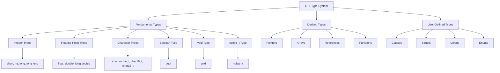
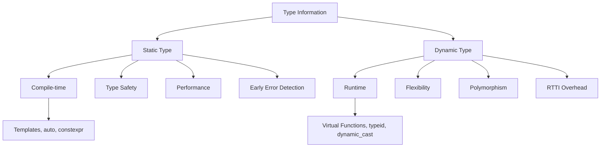
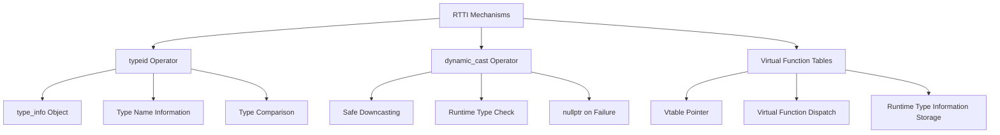

# Chapter 6: Data Types (Interview Revision)

## Core Concepts

### Static Typing in C++
C++ is a statically typed language - types are checked at compile time

```cpp
int x = 5;          // Type known at compile time
double y = 3.14;    // Cannot assign string to y
auto z = 10;        // Type deduced as int (still static)

// Type errors caught at compile time
// x = "hello";     // Compilation error!
```

### Dynamic Typing (Limited in C++)
While C++ is primarily static, it offers some dynamic capabilities

```cpp
// Polymorphic behavior (dynamic dispatch)
class Animal {
public:
    virtual void makeSound() = 0;
};

class Dog : public Animal {
public:
    void makeSound() override { cout << "Woof!" << endl; }
};

Animal* animal = new Dog();  // Static type: Animal*, Dynamic type: Dog
animal->makeSound();         // Dynamic dispatch to Dog::makeSound()
```

### RTTI (Run-Time Type Information)
Mechanism to determine type information at runtime

```cpp
#include <typeinfo>

class Base {
public:
    virtual ~Base() = default;  // Required for RTTI
};

class Derived : public Base {};

void check_type(Base* obj) {
    if (typeid(*obj) == typeid(Derived)) {
        cout << "Object is of type Derived" << endl;
    }
    cout << "Type name: " << typeid(*obj).name() << endl;
}
```

## Type System Visualization

### C++ Type System Hierarchy



### Static vs Dynamic Type Information



### RTTI Mechanisms



## Key Interview Points

### Static Typing Advantages
1. **Type Safety**: Errors caught at compile time
2. **Performance**: No runtime type checking overhead
3. **Documentation**: Types serve as documentation
4. **IDE Support**: Better autocompletion and refactoring
5. **Optimization**: Compiler can optimize based on types

### Dynamic Typing Use Cases
1. **Polymorphism**: Different behaviors for same interface
2. **Plugin Systems**: Loading unknown types at runtime
3. **Serialization**: Converting objects to/from different formats

### RTTI Features and Limitations
- **typeid**: Get type information at runtime
- **dynamic_cast**: Safe downcasting with type checking
- **Overhead**: RTTI adds memory and performance overhead
- **Limited**: Only works with polymorphic types (virtual functions)

## Interview Questions

### Q1: What is the difference between static and dynamic typing?
**Answer:**
**Static Typing (C++ primary):**
- **Compile-time type checking**
- **Type safety guaranteed at compile time**
- **No runtime overhead**
- **Better performance and optimization**

```cpp
int x = 5;           // Type known at compile time
// x = "hello";     // Compile-time error
```

**Dynamic Typing (Limited in C++):**
- **Runtime type checking**
- **Flexibility but less safety**
- **Runtime overhead**
- **Used in polymorphism**

```cpp
Animal* ptr = new Dog();    // Static: Animal*, Dynamic: Dog*
ptr->makeSound();           // Dynamic dispatch at runtime
```

### Q2: What is RTTI and when should you use it?
**Answer:**
**RTTI (Run-Time Type Information)** allows determining type information at runtime.

**RTTI Mechanisms:**
```cpp
#include <typeinfo>

// typeid operator
if (typeid(*ptr) == typeid(Derived)) {
    // Object is actually of type Derived
}

// dynamic_cast for safe downcasting
Derived* derived = dynamic_cast<Derived*>(base_ptr);
if (derived) {
    // Safe to use Derived-specific methods
}
```

**When to use RTTI:**
- **Type-safe downcasting** in inheritance hierarchies
- **Debugging and logging** type information
- **Plugin systems** with unknown object types
- **Serialization/deserialization** systems

**When to avoid RTTI:**
- **Performance-critical code** (RTTI has overhead)
- **Better design alternatives** exist (virtual functions, visitor pattern)
- **Code maintenance** issues (harder to understand control flow)

### Q3: Explain typeid operator and its limitations
**Answer:**
**typeid** returns a `type_info` object containing type information.

```cpp
#include <typeinfo>

class Base { virtual ~Base() = default; };
class Derived : public Base {};

Base* obj = new Derived();

// Get type information
const type_info& info = typeid(*obj);
cout << "Type name: " << info.name() << endl;

// Type comparison
if (typeid(*obj) == typeid(Derived)) {
    cout << "Object is Derived type" << endl;
}

if (typeid(*obj) != typeid(Base)) {
    cout << "Object is not Base type" << endl;
}
```

**Limitations:**
1. **Requires polymorphic type**: Must have at least one virtual function
2. **Implementation-defined**: `name()` format varies by compiler
3. **Performance overhead**: Runtime type checking cost
4. **No cross-platform consistency**: Type names differ between compilers

### Q4: What is the difference between static_cast and dynamic_cast?
**Answer:**
**static_cast:**
- **Compile-time cast** - no runtime checking
- **Faster** but **unsafe** if cast is invalid
- **Can cast up/down inheritance hierarchy** (unsafe downcast)
- **Can cast between unrelated types** (dangerous)

```cpp
Base* base = new Derived();
Derived* derived = static_cast<Derived*>(base);  // No runtime check

// Dangerous - will compile but crash at runtime
Base* base2 = new Base();
Derived* derived2 = static_cast<Derived*>(base2);  // Undefined behavior!
```

**dynamic_cast:**
- **Runtime cast** with type checking
- **Safer** but **slower**
- **Only works with polymorphic types** (virtual functions)
- **Returns nullptr** on failed cast (for pointers)

```cpp
Base* base = new Derived();
Derived* derived = dynamic_cast<Derived*>(base);  // Runtime type check
if (derived) {
    // Safe to use derived
} else {
    // Cast failed, object is not Derived type
}

// Safe - returns nullptr if cast fails
Base* base2 = new Base();
Derived* derived2 = dynamic_cast<Derived*>(base2);
if (!derived2) {
    cout << "Cast failed - object is not Derived" << endl;
}
```

## Practical Code Examples

### Complete RTTI Example
```cpp
#include <iostream>
#include <typeinfo>
#include <memory>

class Shape {
public:
    virtual ~Shape() = default;
    virtual double area() const = 0;
    virtual void draw() const = 0;
};

class Circle : public Shape {
private:
    double radius;
public:
    Circle(double r) : radius(r) {}
    double area() const override { return 3.14159 * radius * radius; }
    void draw() const override { cout << "Drawing Circle" << endl; }
};

class Rectangle : public Shape {
private:
    double width, height;
public:
    Rectangle(double w, double h) : width(w), height(h) {}
    double area() const override { return width * height; }
    void draw() const override { cout << "Drawing Rectangle" << endl; }
};

void processShape(Shape* shape) {
    // Use typeid to check type
    cout << "Shape type: " << typeid(*shape).name() << endl;

    // Use dynamic_cast for type-specific operations
    if (auto circle = dynamic_cast<Circle*>(shape)) {
        cout << "Circle with area: " << circle->area() << endl;
    } else if (auto rectangle = dynamic_cast<Rectangle*>(shape)) {
        cout << "Rectangle with area: " << rectangle->area() << endl;
    }

    shape->draw();
}

int main() {
    std::unique_ptr<Shape> shapes[] = {
        std::make_unique<Circle>(5.0),
        std::make_unique<Rectangle>(3.0, 4.0)
    };

    for (auto& shape : shapes) {
        processShape(shape.get());
    }
}
```

### Static vs Dynamic Typing Comparison
```cpp
// Static typing - compile-time type checking
template<typename T>
T add(T a, T b) {
    static_assert(std::is_arithmetic<T>::value, "T must be numeric");
    return a + b;
}

int result1 = add(5, 3);           // T = int, compiled separately
double result2 = add(3.14, 2.71);   // T = double, compiled separately
// string result3 = add("hello", "world");  // Compile-time error!

// Dynamic typing - runtime type behavior
class Number {
public:
    virtual ~Number() = default;
    virtual Number* add(const Number& other) const = 0;
    virtual void print() const = 0;
};

class IntNumber : public Number {
private:
    int value;
public:
    IntNumber(int v) : value(v) {}
    Number* add(const Number& other) const override {
        // Runtime type checking
        if (const IntNumber* intOther = dynamic_cast<const IntNumber*>(&other)) {
            return new IntNumber(value + intOther->value);
        }
        throw std::runtime_error("Type mismatch");
    }
    void print() const override { cout << value; }
};
```

### Advanced Type Traits (C++11+)
```cpp
#include <type_traits>

template<typename T>
void analyzeType(T value) {
    cout << "Type analysis:" << endl;
    cout << "Is integral: " << is_integral<T>::value << endl;
    cout << "Is floating point: " << is_floating_point<T>::value << endl;
    cout << "Is pointer: " << is_pointer<T>::value << endl;
    cout << "Is const: " << is_const<T>::value << endl;
    cout << "Is reference: " << is_reference<T>::value << endl;

    // Conditional compilation based on type
    if constexpr (is_integral<T>::value) {
        cout << "Optimized path for integral types" << endl;
    } else if constexpr (is_floating_point<T>::value) {
        cout << "Optimized path for floating point types" << endl;
    }
}

int main() {
    analyzeType(42);          // Integral
    analyzeType(3.14);        // Floating point
    analyzeType(&"hello");    // Pointer
}
```

## Common Mistakes & Solutions

### Mistake 1: Using RTTI without virtual functions
```cpp
// ❌ Problem: typeid on non-polymorphic type
class Base { };  // No virtual functions

class Derived : public Base { };

Base* obj = new Derived();
if (typeid(*obj) == typeid(Derived)) {  // Always Base, not Derived!
    // Never executes
}

// ✅ Solution: Add virtual function
class Base {
public:
    virtual ~Base() = default;  // Makes class polymorphic
};

// Now typeid(*obj) will be Derived
```

### Mistake 2: Unsafe static_cast instead of dynamic_cast
```cpp
// ❌ Problem: Unsafe downcasting
Base* base = getObject();  // Could be any derived type
Derived* derived = static_cast<Derived*>(base);
derived->specificMethod();  // Crash if base is not actually Derived!

// ✅ Solution: Safe dynamic_cast
Derived* derived = dynamic_cast<Derived*>(base);
if (derived) {
    derived->specificMethod();  // Safe to call
} else {
    cout << "Object is not of type Derived" << endl;
}
```

### Mistake 3: Overusing RTTI when polymorphism is better
```cpp
// ❌ Problem: RTTI overuse
void processAnimal(Animal* animal) {
    if (typeid(*animal) == typeid(Dog)) {
        static_cast<Dog*>(animal)->bark();
    } else if (typeid(*animal) == typeid(Cat)) {
        static_cast<Cat*>(animal)->meow();
    } else if (typeid(*animal) == typeid(Bird)) {
        static_cast<Bird*>(animal)->chirp();
    }
}

// ✅ Solution: Use polymorphism
class Animal {
public:
    virtual void makeSound() = 0;
};

class Dog : public Animal {
public:
    void makeSound() override { bark(); }
private:
    void bark() { cout << "Woof!" << endl; }
};

void processAnimal(Animal* animal) {
    animal->makeSound();  // Polymorphic dispatch - no RTTI needed
}
```

### Mistake 4: Not understanding auto is still static typing
```cpp
// ❌ Misconception: Thinking auto makes C++ dynamically typed
auto x = 5;      // x is statically typed as int
// x = "hello";  // Still compile-time error!

// ✅ Understanding: auto is type deduction, not dynamic typing
auto x = 5;      // Type deduced as int at compile time
auto y = 3.14;   // Type deduced as double at compile time
auto z = "hello"; // Type deduced as const char* at compile time

// Type is still fixed after initialization
```

## Performance Considerations

### RTTI Performance Impact
```cpp
// Without RTTI - no overhead
class NoRTTI {
public:
    void method() { /* No vtable, no RTTI */ }
};

// With RTTI - adds overhead
class WithRTTI {
public:
    virtual ~WithRTTI() = default;  // Adds vtable pointer
    virtual void method() { /* Virtual dispatch overhead */ }
};

// RTTI operations add runtime cost
if (typeid(*obj) == typeid(Derived)) {  // Type comparison overhead
    // ...
}

Derived* ptr = dynamic_cast<Derived*>(base);  // Runtime type check overhead
```

### Template Instantiation vs Dynamic Dispatch
```cpp
// Template: Compile-time specialization (no runtime overhead)
template<typename T>
T max_template(T a, T b) {
    return (a > b) ? a : b;  // Specialized for each type
}

// Virtual function: Runtime dispatch (overhead)
class Comparator {
public:
    virtual int compare(int a, int b) = 0;
};

class IntComparator : public Comparator {
public:
    int compare(int a, int b) override {
        return (a > b) - (a < b);  // Virtual call overhead
    }
};
```

## Advanced Patterns

### Type Erasure Pattern
```cpp
// Hiding type behind interface (dynamic behavior with static typing)
class Any {
private:
    struct HolderBase {
        virtual ~HolderBase() = default;
        virtual const type_info& type() const = 0;
    };

    template<typename T>
    struct Holder : HolderBase {
        T value;
        Holder(const T& val) : value(val) {}
        const type_info& type() const override { return typeid(T); }
    };

    std::unique_ptr<HolderBase> holder;

public:
    template<typename T>
    Any(const T& val) : holder(std::make_unique<Holder<T>>(val)) {}

    template<typename T>
    T cast() const {
        if (typeid(T) != holder->type()) {
            throw std::bad_cast();
        }
        return static_cast<Holder<T>*>(holder.get())->value;
    }
};
```

### Variant Type (C++17)
```cpp
#include <variant>

// Type-safe union (compile-time checked)
std::variant<int, double, std::string> value;

value = 42;                    // Holds int
value = 3.14;                  // Holds double
value = "hello";               // Holds string

// Type-safe access
if (auto intVal = std::get_if<int>(&value)) {
    cout << "Int value: " << *intVal << endl;
} else if (auto doubleVal = std::get_if<double>(&value)) {
    cout << "Double value: " << *doubleVal << endl;
}

// Visitor pattern
std::visit([](auto&& arg) {
    cout << "Value: " << arg << endl;
}, value);
```

## Quick Reference

### C++ Fundamental Types
```cpp
// Integer types
short s;           // Usually 16 bits
int i;             // Usually 32 bits
long l;            // Usually 32/64 bits
long long ll;      // Usually 64 bits
unsigned int ui;   // Unsigned variants

// Floating point
float f;           // Usually 32 bits
double d;          // Usually 64 bits
long double ld;    // Usually 80/128 bits

// Character types
char c;            // 8 bits
wchar_t wc;        // Wide character
char16_t c16;      // UTF-16
char32_t c32;      // UTF-32

// Other types
bool b;            // true/false
void v;            // No type
nullptr_t np;      // Type of nullptr
```

### RTTI Operations
```cpp
#include <typeinfo>

// typeid operator
const type_info& info = typeid(expression);
bool same = typeid(expr1) == typeid(expr2);
const char* name = typeid(expression).name();

// dynamic_cast
Derived* ptr = dynamic_cast<Derived*>(base_ptr);
Base& ref = dynamic_cast<Base&>(derived_ref);

// Cross-cast (multiple inheritance)
Related* ptr = dynamic_cast<Related*>(base_ptr);
```

### Type Categories
```cpp
#include <type_traits>

// Type checks
is_integral<T>::value
is_floating_point<T>::value
is_pointer<T>::value
is_reference<T>::value
is_const<T>::value
is_array<T>::value
is_class<T>::value
is_union<T>::value

// Type transformations
remove_const<T>::type
add_pointer<T>::type
make_signed<T>::type
common_type<T, U>::type
```

## Final Interview Tips

1. **Static vs Dynamic**: C++ is primarily static with limited dynamic features
2. **RTTI overhead**: Performance cost for runtime type information
3. **typeid requirements**: Needs polymorphic types (virtual functions)
4. **static_cast vs dynamic_cast**: Safety vs performance trade-off
5. **auto is static typing**: Type deduction, not dynamic typing
6. **Type safety**: Compile-time checking is C++ advantage
7. **Polymorphism alternative**: Often better than RTTI for type-specific behavior

---

**Remember**: C++ gives you type safety with static typing, but provides dynamic capabilities when needed through polymorphism and RTTI!