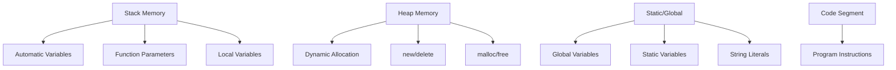

# Chapter 7: Pointers and References (Interview Revision)

## Core Concepts

### References vs Pointers

| Feature | References | Pointers |
|---------|------------|----------|
| **Syntax** | `int& ref = var;` | `int* ptr = &var;` |
| **Null/Empty** | Cannot be null | Can be nullptr |
| **Reassignment** | Cannot be reassigned | Can point to different objects |
| **Dereferencing** | Automatic | Manual (`*ptr`) |
| **Address** | `&ref` gives original address | `&ptr` gives pointer address |
| **Memory** | No extra memory | Uses memory to store address |
| **Arithmetic** | Not allowed | Pointer arithmetic possible |
| **Usage** | Function parameters, return values | Dynamic memory, data structures |

### Memory Model Visualization



### Object Lifetime

| Storage Duration | When Created | When Destroyed | Example |
|------------------|--------------|----------------|---------|
| **Automatic** | Enter scope | Exit scope | `int x = 5;` |
| **Dynamic** | `new` operator | `delete` operator | `int* p = new int;` |
| **Static** | Program start | Program end | `static int count = 0;` |
| **Thread** | Thread start | Thread end | `thread_local int x;` |

## Part 1: Basic Memory Management

### References
```cpp
int x = 10;
int& ref = x;        // Reference to x
ref = 20;            // Modifies x to 20

// Reference as function parameter
void swap(int& a, int& b) {
    int temp = a;
    a = b;
    b = temp;
}

// Reference as return value (dangerous!)
int& get_bad_reference() {
    int local = 5;
    return local;    // Dangling reference!
}

// Safe reference return
int& get_good_reference(int& param) {
    param++;
    return param;    // Reference to parameter
}
```

### Memory Layout and Stack/Heap
```cpp
void demonstrate_memory() {
    int stack_var = 10;           // Stack
    int* heap_var = new int(20);  // Heap

    cout << "Stack address: " << &stack_var << endl;
    cout << "Heap address: " << heap_var << endl;
    cout << "Pointer address: " << &heap_var << endl;

    delete heap_var;              // Must free heap memory
}
```

### Lifetime Management
```cpp
class Resource {
private:
    int* data;
public:
    Resource() : data(new int(42)) {
        cout << "Resource acquired" << endl;
    }

    ~Resource() {
        delete data;
        cout << "Resource released" << endl;
    }
};

{
    Resource res;  // Constructor called
    // ... use res
}  // Destructor called automatically
```

## Part 2: Smart Pointers

### Smart Pointer Comparison

| Smart Pointer | Ownership | Copy | Array Support | Use Case |
|---------------|-----------|------|---------------|----------|
| **unique_ptr** | Exclusive | ❌ No | ✅ `unique_ptr<T[]>` | Single ownership |
| **shared_ptr** | Shared | ✅ Yes | ❌ No (use custom deleter) | Multiple ownership |
| **weak_ptr** | Observer | ✅ Yes | ❌ No | Break circular references |

### unique_ptr (Exclusive Ownership)
```cpp
#include <memory>

// Basic usage
std::unique_ptr<int> ptr = std::make_unique<int>(42);
cout << *ptr << endl;  // 42

// Custom deleter
auto deleter = [](int* p) {
    cout << "Custom delete" << endl;
    delete p;
};
std::unique_ptr<int, decltype(deleter)> custom_ptr(new int(10), deleter);

// Transfer ownership
std::unique_ptr<int> ptr2 = std::move(ptr);  // ptr becomes nullptr

// With arrays
std::unique_ptr<int[]> arr = std::make_unique<int[]>(5);
arr[0] = 10;
```

### shared_ptr (Shared Ownership)
```cpp
// Basic usage
std::shared_ptr<int> ptr1 = std::make_shared<int>(42);
{
    std::shared_ptr<int> ptr2 = ptr1;  // Reference count = 2
    cout << "Use count: " << ptr1.use_count() << endl;  // 2
}  // ptr2 destroyed, reference count = 1

// Custom deleter
auto custom_deleter = [](int* p) {
    cout << "Shared custom delete" << endl;
    delete p;
};
std::shared_ptr<int> custom_ptr(new int(10), custom_deleter);
```

### weak_ptr (Non-owning Observer)
```cpp
std::shared_ptr<int> shared = std::make_shared<int>(42);
std::weak_ptr<int> weak = shared;  // Doesn't increase reference count

// Check if object still exists
if (auto locked = weak.lock()) {  // Returns shared_ptr if valid
    cout << *locked << endl;      // Safe access
} else {
    cout << "Object destroyed" << endl;
}

// Avoiding circular references
class Node {
public:
    std::shared_ptr<Node> next;
    std::weak_ptr<Node> parent;  // weak_ptr prevents circular reference
};
```

## Part 3: Raw Pointers

### New/Delete Operators
```cpp
// Single object
int* ptr = new int(42);
cout << *ptr << endl;
delete ptr;

// Arrays
int* arr = new int[5];
for (int i = 0; i < 5; i++) {
    arr[i] = i * 10;
}
delete[] arr;  // Note: delete[] for arrays

// New with initialization
int* initialized = new int[5] {1, 2, 3, 4, 5};
delete[] initialized;

// Placement new
char buffer[sizeof(int)];
int* placed = new(buffer) int(42);
placed->~int();  // Explicit destructor call
```

### Common Memory Issues

| Issue | Cause | Symptoms | Prevention |
|-------|-------|----------|-------------|
| **Memory Leak** | `new` without `delete` | Increasing memory usage | RAII, smart pointers |
| **Dangling Pointer** | Pointer to freed memory | Crashes, undefined behavior | Set to nullptr after delete |
| **Double Free** | Deleting same memory twice | Crash, heap corruption | Set to nullptr after delete |
| **Buffer Overflow** | Writing past array bounds | Memory corruption, crashes | Bounds checking |
| **Use After Free** | Using deleted object | Undefined behavior | Set to nullptr, smart pointers |

### Pointer Arithmetic
```cpp
int arr[] = {10, 20, 30, 40, 50};
int* ptr = arr;  // Points to arr[0]

cout << *ptr << endl;     // 10
ptr++;                    // Points to arr[1]
cout << *ptr << endl;     // 20

// Pointer arithmetic
int* ptr2 = arr + 3;      // Points to arr[3]
cout << *(ptr2 - 1) << endl;  // 30 (arr[2])

// Pointer difference
int* first = arr;
int* last = arr + 4;
cout << last - first << endl;  // 4 (distance)
```

## Key Interview Points

### Must-Know Concepts
1. **RAII (Resource Acquisition Is Initialization)**: Automatic resource management
2. **Smart pointers**: Prefer over raw pointers for memory management
3. **nullptr vs NULL**: Modern C++ uses nullptr
4. **Pointer vs Reference**: Choose based on requirements
5. **Memory ownership**: Clear ownership prevents leaks

### Performance Considerations
- **Smart pointers**: Slight overhead compared to raw pointers
- **shared_ptr**: Reference counting overhead
- **unique_ptr**: Zero overhead optimization
- **Pointer arithmetic**: Fast but dangerous

## Interview Questions

### Q1: What's the difference between pointers and references?
**Answer:**
**References:**
- **Cannot be null** - must refer to valid object
- **Cannot be reassigned** - always refers to same object
- **Automatic dereferencing** - no `*` needed
- **Cannot do arithmetic** - not address manipulation

**Pointers:**
- **Can be null** - `nullptr` indicates no object
- **Can be reassigned** - can point to different objects
- **Manual dereferencing** - need `*` operator
- **Can do arithmetic** - pointer manipulation

```cpp
int x = 5, y = 10;
int& ref = x;    // Reference to x
int* ptr = &x;   // Pointer to x

ref = y;         // Changes x to 15
ptr = &y;        // Now points to y
```

### Q2: What is RAII and why is it important?
**Answer:**
**RAII (Resource Acquisition Is Initialization)**: Resource lifetime is bound to object lifetime.

```cpp
// Without RAII - manual resource management
void bad_example() {
    FILE* file = fopen("data.txt", "r");
    if (error_condition) {
        return;  // File not closed! Memory leak!
    }
    fclose(file);
}

// With RAII - automatic resource management
class FileWrapper {
    FILE* file;
public:
    FileWrapper(const char* filename) : file(fopen(filename, "r")) {
        if (!file) throw std::runtime_error("Cannot open file");
    }
    ~FileWrapper() { if (file) fclose(file); }
};

void good_example() {
    FileWrapper file("data.txt");  // File opened
    if (error_condition) {
        return;  // File automatically closed by destructor
    }
    // File automatically closed when leaving scope
}
```

**Benefits:**
- **Exception safety**: Resources cleaned up even when exceptions occur
- **No memory leaks**: Automatic cleanup
- **Clear ownership**: Resource lifetime is obvious
- **Simpler code**: No manual cleanup needed

### Q3: When should you use each type of smart pointer?
**Answer:**

**unique_ptr - Exclusive Ownership:**
```cpp
// Use when only one owner should exist
std::unique_ptr<Resource> resource = std::make_unique<Resource>();
// Cannot copy, but can move ownership
std::unique_ptr<Resource> owner2 = std::move(resource);
```

**shared_ptr - Shared Ownership:**
```cpp
// Use when multiple owners need access
std::shared_ptr<Resource> shared1 = std::make_shared<Resource>();
std::shared_ptr<Resource> shared2 = shared1;  // Both own the resource
// Resource destroyed when last shared_ptr is destroyed
```

**weak_ptr - Non-owning Observer:**
```cpp
// Use to break circular references or observe without ownership
class Node {
    std::shared_ptr<Node> next;
    std::weak_ptr<Node> parent;  // Prevents circular reference
};
```

### Q4: What are common causes of memory leaks and how to prevent them?
**Answer:**

**Common Causes:**
1. **Mismatched new/delete**: `new` without corresponding `delete`
2. **Exception paths**: Resources not cleaned up when exceptions occur
3. **Circular references**: shared_ptr cycles preventing deletion
4. **Forgotten cleanup**: Manual resource management errors

**Prevention Strategies:**

```cpp
// 1. Use RAII and smart pointers
class ResourceManager {
    std::unique_ptr<int[]> data;
public:
    ResourceManager(size_t size) : data(std::make_unique<int[]>(size)) {}
    // Destructor automatically frees memory
};

// 2. Use smart pointers instead of raw pointers
std::shared_ptr<Object> obj = std::make_shared<Object>();
// Automatically deleted when last reference is gone

// 3. Avoid circular references with weak_ptr
class Parent {
    std::shared_ptr<Child> child;
};
class Child {
    std::weak_ptr<Parent> parent;  // Prevents cycle
};

// 4. Exception safety with RAII
void safe_function() {
    std::lock_guard<std::mutex> lock(mutex);  // Auto-unlock
    auto file = std::make_unique<File>("data.txt");  // Auto-close
    // Even if exception occurs, resources are cleaned up
}
```

## Practical Code Examples

### Complete Smart Pointer Example
```cpp
#include <iostream>
#include <memory>
#include <vector>

class Widget {
public:
    Widget(int id) : id_(id) {
        std::cout << "Widget " << id_ << " created" << std::endl;
    }
    ~Widget() {
        std::cout << "Widget " << id_ << " destroyed" << std::endl;
    }
    void process() {
        std::cout << "Processing widget " << id_ << std::endl;
    }
private:
    int id_;
};

void demonstrate_smart_pointers() {
    // unique_ptr - exclusive ownership
    std::cout << "=== unique_ptr demo ===" << std::endl;
    {
        auto widget1 = std::make_unique<Widget>(1);
        widget1->process();

        // Transfer ownership
        auto widget2 = std::move(widget1);
        if (widget1) {
            std::cout << "widget1 is valid" << std::endl;
        } else {
            std::cout << "widget1 is null after move" << std::endl;
        }
        widget2->process();
    }  // widget2 destroyed here

    // shared_ptr - shared ownership
    std::cout << "\n=== shared_ptr demo ===" << std::endl;
    {
        auto shared1 = std::make_shared<Widget>(2);
        std::cout << "Use count: " << shared1.use_count() << std::endl;

        {
            auto shared2 = shared1;
            std::cout << "Use count: " << shared1.use_count() << std::endl;
            shared2->process();
        }  // shared2 destroyed, reference count decreases

        std::cout << "Use count: " << shared1.use_count() << std::endl;
    }  // shared1 destroyed, widget destroyed

    // weak_ptr - non-owning observer
    std::cout << "\n=== weak_ptr demo ===" << std::endl;
    {
        std::weak_ptr<Widget> weak;
        {
            auto shared = std::make_shared<Widget>(3);
            weak = shared;
            std::cout << "Use count: " << shared.use_count() << std::endl;

            if (auto locked = weak.lock()) {
                locked->process();
            }
        }  // shared destroyed

        if (auto locked = weak.lock()) {
            std::cout << "Widget still exists" << std::endl;
        } else {
            std::cout << "Widget has been destroyed" << std::endl;
        }
    }
}
```

### Memory Layout Analysis
```cpp
#include <iostream>

void analyze_memory_layout() {
    // Stack variables
    int stack_var = 10;
    char stack_array[100];

    // Heap variables
    int* heap_var = new int(20);
    char* heap_array = new char[1000];

    // Static variables
    static int static_var = 30;

    std::cout << "Memory Layout Analysis:" << std::endl;
    std::cout << "Stack variable address: " << &stack_var << std::endl;
    std::cout << "Stack array address: " << static_cast<void*>(stack_array) << std::endl;
    std::cout << "Heap variable address: " << heap_var << std::endl;
    std::cout << "Heap array address: " << static_cast<void*>(heap_array) << std::endl;
    std::cout << "Static variable address: " << &static_var << std::endl;
    std::cout << "Pointer variable address: " << &heap_var << std::endl;

    // Clean up
    delete heap_var;
    delete[] heap_array;
}

// Stack usage visualization
void recursive_stack_demo(int depth) {
    if (depth <= 0) return;

    int local_var = depth;  // Each call adds to stack
    std::cout << "Depth " << depth << " address: " << &local_var << std::endl;

    recursive_stack_demo(depth - 1);
}
```

## Common Mistakes & Solutions

### Mistake 1: Dangling Pointers
```cpp
// ❌ Problem: Dangling pointer
int* create_dangling() {
    int local = 42;
    return &local;  // local destroyed when function returns
}

int* ptr = create_dangling();
*ptr = 10;  // Undefined behavior!

// ✅ Solution: Use heap allocation or smart pointers
std::unique_ptr<int> create_safe() {
    return std::make_unique<int>(42);  // Safe ownership
}

auto ptr = create_safe();
*ptr = 10;  // Safe
```

### Mistake 2: Memory Leaks
```cpp
// ❌ Problem: Memory leak
void process_data() {
    int* data = new int[1000];
    if (error_condition) {
        return;  // Memory leaked!
    }
    delete[] data;
}

// ✅ Solution: RAII with smart pointers
void process_data_safe() {
    auto data = std::make_unique<int[]>(1000);
    if (error_condition) {
        return;  // Automatically cleaned up
    }
    // Automatically cleaned up
}
```

### Mistake 3: Double Delete
```cpp
// ❌ Problem: Double delete
int* ptr = new int(42);
delete ptr;
delete ptr;  // Crash! Undefined behavior

// ✅ Solution: Set to nullptr after delete
int* ptr = new int(42);
delete ptr;
ptr = nullptr;  // Prevent accidental use
delete ptr;     // Safe: deleting nullptr is no-op

// Better: Use smart pointers
auto smart_ptr = std::make_unique<int>(42);
// Automatically handled, no double delete possible
```

### Mistake 4: Wrong delete for arrays
```cpp
// ❌ Problem: Wrong delete operator
int* array = new int[10];
delete array;  // Wrong! Should be delete[]

// ✅ Solution: Use correct delete
int* array = new int[10];
delete[] array;  // Correct

// Better: Use smart pointers for arrays
auto array = std::make_unique<int[]>(10);
// Automatically handled
```

## Performance Considerations

### Smart Pointer Overhead
```cpp
// unique_ptr: Zero overhead (optimizable)
std::unique_ptr<int> uptr = std::make_unique<int>(42);
// Same performance as raw pointer after optimization

// shared_ptr: Reference counting overhead
std::shared_ptr<int> sptr = std::make_shared<int>(42);
// Atomic operations for reference counting

// Performance comparison
class Benchmark {
public:
    void raw_pointer_test() {
        int* ptr = new int(42);
        (*ptr)++;
        delete ptr;
    }

    void unique_ptr_test() {
        auto ptr = std::make_unique<int>(42);
        (*ptr)++;
        // Automatically deleted
    }

    void shared_ptr_test() {
        auto ptr = std::make_shared<int>(42);
        (*ptr)++;
        // Reference count overhead
    }
};
```

### Cache-Friendly Memory Access
```cpp
// Good: Sequential memory access
void process_array_sequential(int* arr, size_t size) {
    for (size_t i = 0; i < size; i++) {
        arr[i] *= 2;  // Cache-friendly
    }
}

// Bad: Random memory access
void process_array_random(int* arr, size_t size, int* indices) {
    for (size_t i = 0; i < size; i++) {
        arr[indices[i]] *= 2;  // Cache-unfriendly
    }
}

// Better: Structure of Arrays for cache locality
struct Particle {
    float x, y, z;  // Bad for cache when accessing only x
};

struct Particles {
    float* x;
    float* y;
    float* z;  // Better for cache when accessing only x coordinates
};
```

## Quick Reference

### Pointer Declaration and Usage
```cpp
// Declaration
int* ptr;                    // Pointer to int
const int* ptr;              // Pointer to const int
int* const ptr;              // Const pointer to int
const int* const ptr;        // Const pointer to const int

// Operations
int x = 10;
int* ptr = &x;               // Address of
int value = *ptr;            // Dereference
ptr++;                       // Pointer arithmetic
```

### Smart Pointer Creation
```cpp
// unique_ptr
auto uptr = std::make_unique<int>(42);
std::unique_ptr<int[]> arr = std::make_unique<int[]>(10);

// shared_ptr
auto sptr = std::make_shared<int>(42);
std::shared_ptr<int> sptr2 = std::make_shared<int[]>(10);  // C++20

// weak_ptr
std::weak_ptr<int> wptr = sptr;
if (auto locked = wptr.lock()) { /* safe access */ }
```

### Memory Management Best Practices
```cpp
// 1. Prefer smart pointers over raw pointers
std::unique_ptr<Resource> resource = std::make_unique<Resource>();

// 2. Use RAII for all resources
std::lock_guard<std::mutex> lock(mutex);  // Auto-unlock
std::ifstream file("data.txt");           // Auto-close

// 3. Follow Rule of Zero/Five/Three
class Example {
    std::unique_ptr<int[]> data;
public:
    Example(size_t size) : data(std::make_unique<int[]>(size)) {}
    // Compiler-generated destructor, copy/move operations work correctly
};

// 4. Use nullptr instead of NULL
int* ptr = nullptr;  // Modern C++

// 5. Check pointers before dereferencing
if (ptr != nullptr) {
    *ptr = 42;
}
```

## Final Interview Tips

1. **RAII is fundamental**: Understand automatic resource management
2. **Smart pointers preferred**: Use unique_ptr, shared_ptr, weak_ptr appropriately
3. **Memory ownership**: Be clear about who owns and deletes memory
4. **nullptr vs NULL**: Use nullptr in modern C++
5. **Exception safety**: RAII ensures cleanup even with exceptions
6. **Performance awareness**: Smart pointers have minimal overhead when used correctly
7. **Debugging memory issues**: Tools like Valgrind, AddressSanitizer

---

**Remember**: Memory management is critical in C++ - smart pointers and RAII make it much safer and easier!