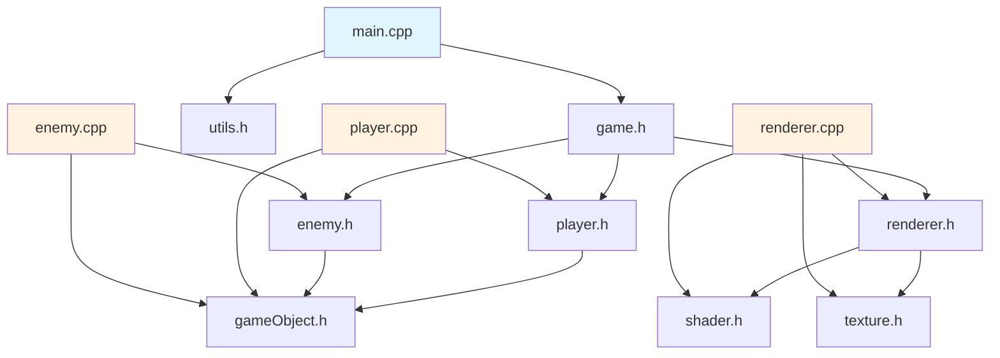
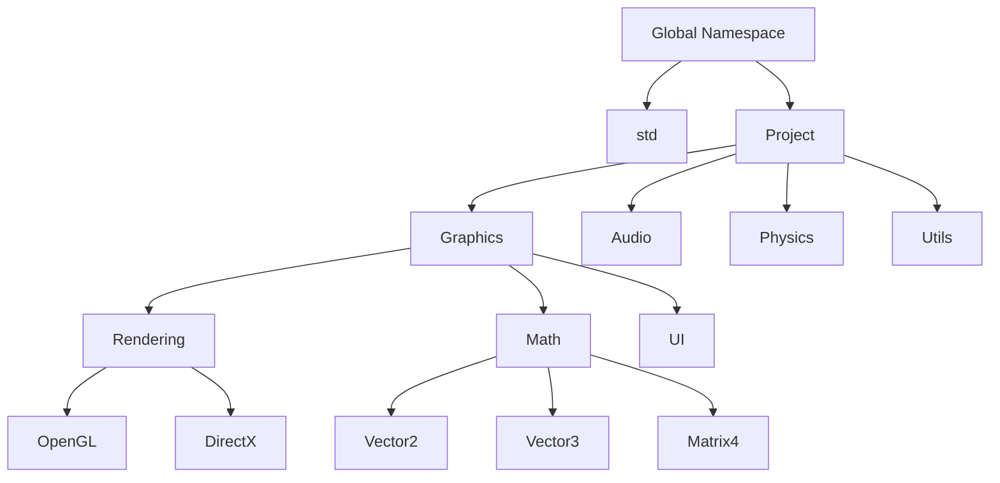
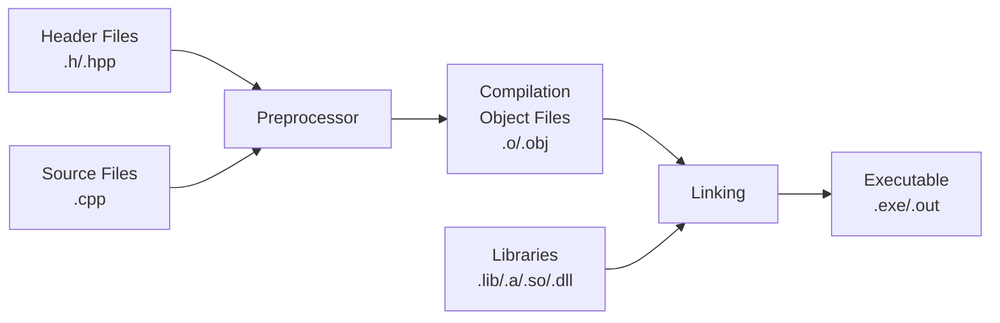

# Chapter 8: Structuring Codebase (Interview Revision)

## Core Concepts

### Part 1: File Organization

#### Header vs Source Files

| Aspect | Header Files (.h/.hpp) | Source Files (.cpp) |
|--------|------------------------|---------------------|
| **Purpose** | Declarations, interfaces | Implementations, definitions |
| **Content** | Class declarations, function prototypes, templates, inline functions | Function definitions, static variables |
| **Inclusion** | Included in multiple files | Compiled individually |
| **Compilation** | Included, not compiled separately | Compiled to object files |
| **Include Guards** | Required (#pragma once or include guards) | Not needed |
| **Size Impact** | Increases compile time | Linked separately |

#### Header File Structure
```cpp
// calculator.h
#pragma once  // Modern include guard

#include <vector>  // System headers
#include "utils.h" // Project headers

namespace Math {
    // Forward declarations
    class ComplexNumber;

    // Constants
    const double PI = 3.14159265359;

    // Class declaration
    class Calculator {
    private:
        double result;

    public:
        Calculator();
        double add(double a, double b);
        double multiply(double a, double b);

        // Inline function (defined in header)
        inline double getPI() const { return PI; }
    };

    // Free function declarations
    int factorial(int n);
    bool isPrime(int n);
}
```

#### Source File Structure
```cpp
// calculator.cpp
#include "calculator.h"  // Include corresponding header
#include <cmath>        // Additional headers

namespace Math {
    // Constructor implementation
    Calculator::Calculator() : result(0.0) {}

    // Method implementations
    double Calculator::add(double a, double b) {
        result = a + b;
        return result;
    }

    double Calculator::multiply(double a, double b) {
        result = a * b;
        return result;
    }

    // Free function implementations
    int factorial(int n) {
        if (n <= 1) return 1;
        return n * factorial(n - 1);
    }

    bool isPrime(int n) {
        if (n <= 1) return false;
        for (int i = 2; i * i <= n; i++) {
            if (n % i == 0) return false;
        }
        return true;
    }
}
```

### Forward Declarations

#### When to Use Forward Declarations

| Situation | Use Forward Declaration | Reason |
|-----------|------------------------|--------|
| **Class pointers/references** | ✅ Yes | No need full definition |
| **Function parameters** | ✅ Yes | Only need to know it's a type |
| **Return types** | ✅ Yes | Compiler manages memory layout |
| **Class inheritance** | ❌ No | Need full definition |
| **Class member access** | ❌ No | Need full definition |
| **Template instantiation** | ❌ No | Need complete definition |

```cpp
// Good forward declarations
class GameObject;           // Forward declare
class Player;               // Forward declare

class GameManager {
private:
    GameObject* currentLevel;  // Pointer - forward declaration sufficient
    Player* activePlayer;      // Pointer - forward declaration sufficient

public:
    void switchPlayer(Player* newPlayer);
    GameObject* getCurrentLevel() const;
};

// Bad forward declarations
class Derived : public Base;  // ❌ Need full Base definition

template<typename T>
class Container {
    T data;  // ❌ Need full T definition
};
```

#### Forward Declaration Examples
```cpp
// engine.h
#pragma once

class Renderer;      // Forward declaration
class InputManager;  // Forward declaration

class Engine {
private:
    Renderer* renderer;      // Pointer - forward declaration OK
    InputManager* input;     // Pointer - forward declaration OK

public:
    Engine();
    void initialize(Renderer* rend, InputManager* inp);
    void update();
};

// engine.cpp
#include "engine.h"
#include "renderer.h"      // Full definition needed here
#include "input_manager.h" // Full definition needed here

Engine::Engine() : renderer(nullptr), input(nullptr) {}

void Engine::initialize(Renderer* rend, InputManager* inp) {
    renderer = rend;
    input = inp;
}
```

### Part 2: Scope and Namespaces

#### Scope Levels

| Scope Type | Declaration Lifetime | Visibility | Example |
|------------|---------------------|------------|---------|
| **Global Scope** | Program duration | Entire program | `int global_var;` |
| **Namespace Scope** | Program duration | Namespace | `namespace NS { int var; }` |
| **Class Scope** | Object lifetime | Class members | `class C { int member; };` |
| **Function Scope** | Function execution | Function only | `void func() { int local; }` |
| **Block Scope** | Block execution | Block only | `{ int block_var; }` |

#### Namespace Best Practices
```cpp
// Good namespace organization
namespace Graphics {
    namespace Rendering {
        class Shader {
            // Shader implementation
        };

        class Renderer {
            // Renderer implementation
        };
    }

    namespace Math {
        class Vector3 {
            // Vector implementation
        };

        class Matrix4 {
            // Matrix implementation
        };
    }
}

// Using specific declarations (good practice)
using Graphics::Rendering::Renderer;
using Graphics::Math::Vector3;

// Avoid using entire namespaces in headers
// ❌ Bad in headers
// using namespace std;  // Pollutes global namespace

// ✅ OK in source files
#include <vector>
#include <iostream>

void function() {
    using namespace std;  // Limited to this function
    vector<int> vec;
    cout << "Hello" << endl;
}
```

#### Anonymous Namespaces
```cpp
// utils.cpp
#include "utils.h"

namespace {
    // Anonymous namespace - internal linkage
    // Visible only in this translation unit

    const int MAX_RETRIES = 3;
    std::string logFile = "app.log";

    void logError(const std::string& message) {
        // Internal logging function
        // Not visible outside this file
    }

    bool validateInput(int value) {
        return value > 0 && value < 1000;
    }
}

// Public functions
namespace Utils {
    bool processInput(int value) {
        if (!validateInput(value)) {  // Uses internal function
            logError("Invalid input");
            return false;
        }
        return true;
    }
}
```

## Code Organization Visualization

### File Dependencies



### Namespace Hierarchy



### Compilation Process



## Key Interview Points

### Must-Know Concepts
1. **Header-Source Separation**: Declarations vs implementations
2. **Include Guards**: Prevent multiple inclusion
3. **Forward Declarations**: Reduce compilation dependencies
4. **Namespace Organization**: Avoid naming conflicts
5. **One Definition Rule (ODR)**: Single definition per translation unit

### Compilation Units
- **Translation Unit**: Source file + included headers
- **Object Files**: Compiled translation units
- **Linking**: Combining object files and libraries

### Best Practices
1. **Minimize header inclusions**: Use forward declarations
2. **Include guards**: Always protect headers
3. **Namespace organization**: Logical grouping
4. **Anonymous namespaces**: Internal linkage

## Interview Questions

### Q1: What's the difference between header files and source files?
**Answer:**
**Header Files (.h/.hpp):**
- **Declarations only**: Class definitions, function prototypes, constants
- **Multiple inclusions**: Can be included in many source files
- **Include guards**: Required to prevent multiple definition errors
- **Inline functions**: Can be defined in headers
- **Templates**: Must be defined in headers

**Source Files (.cpp):**
- **Implementations**: Function bodies, static variables
- **Single compilation**: Compiled into object files
- **Include own header**: Always include corresponding header
- **Linking**: Object files linked to create executable

```cpp
// math.h - Header file
#pragma once
namespace Math {
    int add(int a, int b);  // Declaration only
}

// math.cpp - Source file
#include "math.h"
namespace Math {
    int add(int a, int b) {  // Implementation
        return a + b;
    }
}
```

### Q2: What are forward declarations and when should you use them?
**Answer:**
**Forward declarations** declare types without defining them, reducing compilation dependencies.

**When to use forward declarations:**
- **Pointers/references**: When you only need to know a type exists
- **Function parameters**: When passing by pointer/reference
- **Return types**: When returning pointers/references

```cpp
// Good: Forward declarations
class Player;        // Forward declare
class Enemy;         // Forward declare

class Game {
    Player* currentPlayer;     // Pointer - forward declaration OK
    Enemy* currentEnemy;       // Pointer - forward declaration OK

public:
    void setPlayer(Player* p);
    Player* getPlayer() const;
};
```

**When NOT to use forward declarations:**
- **Inheritance**: Need full class definition
- **Member variables**: Need to know size
- **Method calls**: Need full definition
- **Templates**: Need complete type

```cpp
// Bad: Forward declarations insufficient
class Derived : public Base;  // ❌ Need Base definition

class Container {
    Data member;  // ❌ Need Data definition for size
};
```

### Q3: What are namespaces and why are they important?
**Answer:**
**Namespaces** provide named scopes to organize code and prevent naming conflicts.

**Benefits of namespaces:**
1. **Avoid naming conflicts**: Multiple libraries can have same function names
2. **Logical organization**: Group related functionality
3. **Explicit scope**: Clear where functions/classes come from
4. **Version control**: Different versions can coexist

```cpp
// Namespace organization
namespace Graphics {
    namespace Rendering {
        class Shader {
            void compile();
        };
    }

    namespace Math {
        class Vector3 {
            float x, y, z;
        };
    }
}

// Usage
Graphics::Rendering::Shader shader;
Graphics::Math::Vector3 position;

// Using declarations (selective)
using Graphics::Rendering::Shader;
using Graphics::Math::Vector3;

Shader shader;  // No need for full qualification
Vector3 pos;
```

**Best practices:**
- **Organize logically**: Group related functionality
- **Avoid using namespace in headers**: Prevents pollution
- **Use specific using declarations**: Instead of entire namespaces
- **Anonymous namespaces**: For internal linkage

### Q4: What is the One Definition Rule (ODR)?
**Answer:**
**One Definition Rule (ODR)**: Any entity (function, class, variable) can have only one definition in a program.

**Two types of ODR violations:**

1. **ODR Violation (Multiple Definitions)**: Linker error
```cpp
// ❌ Multiple definitions - Linker error
// utils.cpp
int global_var = 10;

// another.cpp
int global_var = 20;  // ODR violation!

// ✅ Solution: Use extern declaration
// utils.h
extern int global_var;

// utils.cpp
int global_var = 10;  // Single definition
```

2. **ODR Use (Inconsistent Definitions)**: Undefined behavior
```cpp
// ❌ Inconsistent definitions - Undefined behavior
// file1.cpp
struct Point {
    int x, y;
};

void process(Point p) {
    // Uses Point with x, y
}

// file2.cpp
struct Point {
    double x, y, z;  // Different definition!
};

void process(Point p) {
    // Uses Point with x, y, z - ODR use violation
}
```

**Solutions:**
- **Header guards**: Prevent multiple inclusion
- **Inline functions**: Allow multiple definitions in headers
- **Templates**: Automatically inline, can be defined in headers
- **External linkage**: Single definition, multiple declarations

## Practical Code Examples

### Complete Project Structure
```cpp
// project_structure/
// ├── include/
// │   ├── game/
// │   │   ├── game_object.h
// │   │   ├── player.h
// │   │   └── enemy.h
// │   └── utils/
// │       └── math_utils.h
// ├── src/
// │   ├── game/
// │   │   ├── game_object.cpp
// │   │   ├── player.cpp
// │   │   └── enemy.cpp
// │   └── utils/
// │       └── math_utils.cpp
// └── main.cpp

// include/game/game_object.h
#pragma once

#include "utils/math_utils.h"

namespace Game {
    // Forward declarations
    class Renderer;
    class PhysicsWorld;

    class GameObject {
    protected:
        MathUtils::Vector3 position;
        MathUtils::Vector3 velocity;
        bool active;

    public:
        GameObject(const MathUtils::Vector3& pos);
        virtual ~GameObject() = default;

        virtual void update(float deltaTime) = 0;
        virtual void render(Renderer* renderer) = 0;

        // Inline functions (can be in header)
        inline bool isActive() const { return active; }
        inline void setActive(bool state) { active = state; }
        inline const MathUtils::Vector3& getPosition() const { return position; }
    };
}

// include/game/player.h
#pragma once

#include "game_object.h"

namespace Game {
    class Player : public GameObject {
    private:
        int health;
        int score;

    public:
        Player(const MathUtils::Vector3& startPos);

        void update(float deltaTime) override;
        void render(Renderer* renderer) override;

        void takeDamage(int amount);
        void addScore(int points);

        int getHealth() const { return health; }
        int getScore() const { return score; }
    };
}

// src/game/player.cpp
#include "game/player.h"
#include "graphics/renderer.h"

namespace Game {
    Player::Player(const MathUtils::Vector3& startPos)
        : GameObject(startPos), health(100), score(0) {
    }

    void Player::update(float deltaTime) {
        // Update player logic
        position = position + velocity * deltaTime;
    }

    void Player::render(Renderer* renderer) {
        // Render player
        renderer->drawSprite(position, "player_texture.png");
    }

    void Player::takeDamage(int amount) {
        health -= amount;
        if (health <= 0) {
            setActive(false);
        }
    }

    void Player::addScore(int points) {
        score += points;
    }
}
```

### Advanced Namespace Usage
```cpp
// Advanced namespace organization
namespace Audio {
    // Internal namespace - not part of public API
    namespace detail {
        class AudioBuffer {
            // Internal implementation
        };

        void loadAudioFile(const std::string& path);
    }

    // Public API
    class Sound {
    private:
        std::shared_ptr<detail::AudioBuffer> buffer;

    public:
        Sound(const std::string& filename);
        void play();
        void pause();
        void stop();

        float getVolume() const;
        void setVolume(float volume);
    };

    class Music {
    private:
        std::string currentTrack;

    public:
        void load(const std::string& filename);
        void play();
        void stop();
        void setLooping(bool loop);
    };
}

// Usage in other files
#include "audio/sound.h"

void playGameSounds() {
    using Audio::Sound;  // Bring Sound into scope

    Sound jumpSound("jump.wav");
    Sound shootSound("shoot.wav");

    jumpSound.play();
    shootSound.play();

    // Don't need Audio:: prefix repeatedly
}
```

## Common Mistakes & Solutions

### Mistake 1: Missing Include Guards
```cpp
// ❌ Problem: No include guard
// player.h
class Player {
    int health;
};

// game.h
#include "player.h"
#include "player.h"  // Multiple definition error!

// ✅ Solution: Add include guard
#pragma once  // Modern approach

class Player {
    int health;
};

// Or traditional approach
#ifndef PLAYER_H
#define PLAYER_H

class Player {
    int health;
};

#endif  // PLAYER_H
```

### Mistake 2: Including Headers Unnecessarily
```cpp
// ❌ Problem: Unnecessary includes increase compile time
// game_object.h
#include <vector>
#include <string>
#include <iostream>
#include "player.h"
#include "enemy.h"
#include "renderer.h"

class GameObject {
    Player* player;    // Only need forward declaration!
    Enemy* enemy;      // Only need forward declaration!
    Renderer* renderer; // Only need forward declaration!
};

// ✅ Solution: Use forward declarations
// game_object.h
class Player;    // Forward declaration
class Enemy;     // Forward declaration
class Renderer;  // Forward declaration

class GameObject {
    Player* player;
    Enemy* enemy;
    Renderer* renderer;
};

// ✅ Include full headers only in implementation file
// game_object.cpp
#include "game_object.h"
#include "player.h"
#include "enemy.h"
#include "renderer.h"
```

### Mistake 3: Using Entire Namespaces in Headers
```cpp
// ❌ Problem: Using namespace in header pollutes global scope
// utils.h
#pragma once
#include <vector>
#include <string>

using namespace std;  // ❌ Bad! Affects all files that include this

class Utils {
public:
    vector<string> split(const string& s);  // No std:: prefix needed
};

// ✅ Solution: Use explicit qualification or specific using
// utils.h
#pragma once
#include <vector>
#include <string>

class Utils {
public:
    std::vector<std::string> split(const std::string& s);  // Explicit
};

// Or specific using declarations
using std::vector;
using std::string;

class Utils {
public:
    vector<string> split(const string& s);  // Limited using
};
```

### Mistake 4: Circular Dependencies
```cpp
// ❌ Problem: Circular dependency
// player.h
#pragma once
#include "enemy.h"  // Player needs Enemy

class Player {
    Enemy* target;
};

// enemy.h
#pragma once
#include "player.h"  // Enemy needs Player

class Enemy {
    Player* target;
};

// ✅ Solution: Use forward declarations
// player.h
#pragma once

class Enemy;  // Forward declaration

class Player {
    Enemy* target;
};

// enemy.h
#pragma once

class Player;  // Forward declaration

class Enemy {
    Player* target;
};

// ✅ Include full headers in implementation files
// player.cpp
#include "player.h"
#include "enemy.h"  // Full definition needed here
```

## Performance Considerations

### Compilation Time Optimization
```cpp
// ❌ Slow compilation: Heavy headers in other headers
// common.h
#pragma once
#include <vector>
#include <map>
#include <string>
#include <algorithm>
#include <memory>

class Common {
    std::vector<std::string> data;
    std::map<int, std::string> lookup;
};

// ✅ Fast compilation: Minimize header dependencies
// common.h
#pragma once
#include <memory>

class Common;  // Forward declaration for other uses

class Common {
private:
    struct Impl;  // Pimpl idiom
    std::unique_ptr<Impl> pImpl;

public:
    Common();
    ~Common();

    // Public interface
};

// common.cpp
#include "common.h"
#include <vector>
#include <map>
#include <string>
#include <algorithm>

struct Common::Impl {
    std::vector<std::string> data;
    std::map<int, std::string> lookup;
};

Common::Common() : pImpl(std::make_unique<Impl>()) {}
Common::~Common() = default;
```

### Pimpl Idiom (Pointer to Implementation)
```cpp
// widget.h - Fast compilation, minimal dependencies
#pragma once

class Widget {
private:
    class Impl;           // Forward declaration
    std::unique_ptr<Impl> pImpl;  // Pointer to implementation

public:
    Widget();
    ~Widget();

    void draw();
    void resize(int width, int height);

    // No need to include <string>, <vector>, etc. in header
};

// widget.cpp - Full implementation with all dependencies
#include "widget.h"
#include <string>
#include <vector>
#include <graphics/renderer.h>

class Widget::Impl {
private:
    std::string title;
    std::vector<int> data;
    Graphics::Renderer* renderer;

public:
    void draw() {
        renderer->drawText(title);
    }

    void resize(int w, int h) {
        data.resize(w * h);
    }
};

Widget::Widget() : pImpl(std::make_unique<Impl>()) {}
Widget::~Widget() = default;

void Widget::draw() { pImpl->draw(); }
void Widget::resize(int w, int h) { pImpl->resize(w, h); }
```

## Quick Reference

### File Organization Template
```cpp
// header.h
#pragma once

// System headers (grouped)
#include <vector>
#include <string>

// Project headers (grouped)
#include "other_header.h"

// Forward declarations
class ForwardDeclared;

namespace Project {
    // Constants
    const int MAX_SIZE = 100;

    // Class declarations
    class ClassName {
    public:
        // Public interface
        void publicMethod();

    private:
        // Private members
        int memberVariable;
    };

    // Function declarations
    void functionDeclaration(Type param);
}

// source.cpp
#include "header.h"        // Always include own header first
#include "other_header.h"  // Additional headers

namespace Project {
    // Function implementations
    void functionDeclaration(Type param) {
        // Implementation
    }

    // Method implementations
    void ClassName::publicMethod() {
        // Implementation
    }
}
```

### Namespace Usage Guidelines
```cpp
// Good namespace practices
namespace Company {
    namespace Product {
        namespace Module {
            class ClassName {
                // Implementation
            };

            void function();
        }
    }
}

// Usage - choose appropriate method

// Method 1: Full qualification (explicit)
Company::Product::Module::ClassName obj;
Company::Product::Module::function();

// Method 2: Using declarations (selective)
using Company::Product::Module::ClassName;
using Company::Product::Module::function;

ClassName obj;
function();

// Method 3: Using namespace (in source files only)
using namespace Company::Product::Module;
ClassName obj;
function();
```

### Forward Declaration Cheat Sheet
```cpp
// ✅ Can forward declare
class ClassName;           // Classes
struct StructName;         // Structs
enum EnumName;             // Enums (C++11)
void function(Type param); // Functions

// ❌ Cannot forward declare
typedef int TypeAlias;     // Typedefs
using Type = int;          // Type aliases
template<typename T>       // Template definitions
class TemplateClass {
    T member;              // Need full definition
};
```

## Final Interview Tips

1. **Header-Source separation**: Understand declarations vs implementations
2. **Include guards**: Always protect headers from multiple inclusion
3. **Forward declarations**: Use to reduce compilation dependencies
4. **Namespace organization**: Prevent naming conflicts, organize code
5. **One Definition Rule**: Single definition per program entity
6. **Compilation dependencies**: Minimize for faster builds
7. **Pimpl idiom**: Reduce header dependencies and compilation time

---

**Remember**: Good code organization is crucial for maintainable, scalable C++ projects!