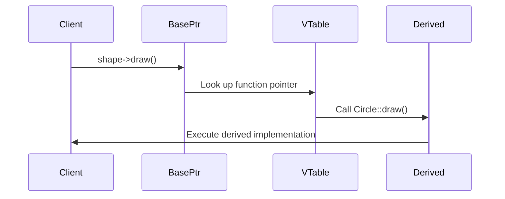
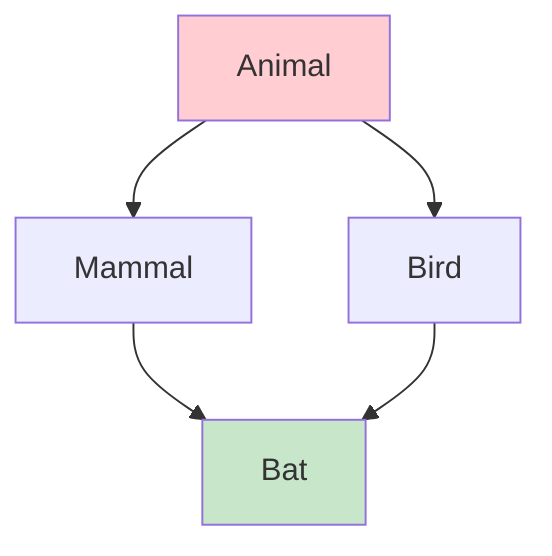

# Chapter 9: Structures and Classes (Interview Revision)

## Core Concepts

### Part 1: Object Oriented Programming Basics

#### Class vs Struct

| Feature | Class | Struct |
|---------|-------|--------|
| **Default Access** | Private | Public |
| **Default Inheritance** | Private | Public |
| **Usage** | Complex behavior, data hiding | Simple data aggregation |
| **Methods** | Can have complex behavior | Usually simple or none |
| **Constructors** | Often needed | Sometimes defaulted |
| **Encapsulation** | Strong | Weak |

```cpp
// Class - encapsulation and behavior
class BankAccount {
private:
    double balance;
    std::string accountNumber;

public:
    BankAccount(const std::string& number, double initialBalance)
        : accountNumber(number), balance(initialBalance) {}

    bool withdraw(double amount) {
        if (amount <= balance) {
            balance -= amount;
            return true;
        }
        return false;
    }

    void deposit(double amount) {
        balance += amount;
    }

    double getBalance() const { return balance; }
};

// Struct - simple data aggregation
struct Point {
    double x;
    double y;
    double z;

    // Simple constructor
    Point(double x = 0, double y = 0, double z = 0)
        : x(x), y(y), z(z) {}
};
```

### Encapsulation, Inheritance, Polymorphism

| OOP Principle | Description | C++ Implementation |
|---------------|-------------|-------------------|
| **Encapsulation** | Data hiding, bundling data and methods | private/protected/public members |
| **Inheritance** | Code reuse, "is-a" relationship | Class inheritance, virtual functions |
| **Polymorphism** | Same interface, different implementations | Virtual functions, function overriding |
| **Abstraction** | Hiding implementation details | Abstract classes, interfaces |

### Part 2: Runtime Polymorphism

#### Virtual Functions and Vtables

**Virtual Function Mechanism:**
1. **Virtual Keyword**: Enables dynamic dispatch
2. **Vtable**: Table of function pointers per class
3. **Vpointer**: Pointer to vtable in each object
4. **Dynamic Dispatch**: Runtime function lookup

```cpp
class Shape {
public:
    virtual double area() const = 0;      // Pure virtual
    virtual void draw() const {             // Virtual with default
        std::cout << "Drawing shape" << std::endl;
    }
    virtual ~Shape() = default;            // Virtual destructor
};

class Circle : public Shape {
private:
    double radius;
public:
    Circle(double r) : radius(r) {}

    double area() const override {
        return 3.14159 * radius * radius;
    }

    void draw() const override {
        std::cout << "Drawing circle with radius " << radius << std::endl;
    }
};

class Rectangle : public Shape {
private:
    double width, height;
public:
    Rectangle(double w, double h) : width(w), height(h) {}

    double area() const override {
        return width * height;
    }

    void draw() const override {
        std::cout << "Drawing rectangle " << width << "x" << height << std::endl;
    }
};
```

#### Virtual Function Call Flow



### Part 3: Advanced Inheritance

#### Multiple Inheritance

```cpp
class Drawable {
public:
    virtual void draw() const = 0;
    virtual ~Drawable() = default;
};

class Serializable {
public:
    virtual void serialize(std::ostream& os) const = 0;
    virtual void deserialize(std::istream& is) = 0;
    virtual ~Serializable() = default;
};

class Sprite : public Drawable, public Serializable {
private:
    int x, y;
    std::string texturePath;

public:
    Sprite(int x, int y, const std::string& path)
        : x(x), y(y), texturePath(path) {}

    void draw() const override {
        std::cout << "Drawing sprite at (" << x << "," << y << ")" << std::endl;
    }

    void serialize(std::ostream& os) const override {
        os << x << " " << y << " " << texturePath;
    }

    void deserialize(std::istream& is) override {
        is >> x >> y >> texturePath;
    }
};
```

#### Diamond Inheritance Problem



**Diamond Problem Solution - Virtual Inheritance:**
```cpp
// ❌ Diamond inheritance without virtual
class Animal {
public:
    void eat() { std::cout << "Eating" << std::endl; }
};

class Mammal : public Animal {
public:
    void breathe() { std::cout << "Breathing air" << std::endl; }
};

class Bird : public Animal {
public:
    void fly() { std::cout << "Flying" << std::endl; }
};

class Bat : public Mammal, public Bird {
    // Two Animal base classes - ambiguity!
    // bat.eat() // Error: which eat()?
};

// ✅ Solution: Virtual inheritance
class Animal {
public:
    void eat() { std::cout << "Eating" << std::endl; }
};

class Mammal : virtual public Animal {
public:
    void breathe() { std::cout << "Breathing air" << std::endl; }
};

class Bird : virtual public Animal {
public:
    void fly() { std::cout << "Flying" << std::endl; }
};

class Bat : public Mammal, public Bird {
    // Single Animal base class - no ambiguity!
    void echolocate() { std::cout << "Echolocating" << std::endl; }
};
```

### Part 4: Resource Management

#### Rule of Zero/Five/Three

| Rule | When to Apply | What to Implement |
|------|---------------|-------------------|
| **Rule of Zero** | Class doesn't manage resources | Nothing (use smart pointers) |
| **Rule of Three** | Class manages raw resources | Destructor, Copy Constructor, Copy Assignment |
| **Rule of Five** | Class manages resources with move semantics | All of Rule 3 + Move Constructor, Move Assignment |

#### Rule of Zero (Modern C++)
```cpp
// ✅ Rule of Zero - No manual resource management
class ModernPlayer {
private:
    std::string name;
    std::unique_ptr<int[]> inventory;
    std::vector<std::string> achievements;

public:
    ModernPlayer(const std::string& playerName, size_t invSize = 100)
        : name(playerName), inventory(std::make_unique<int[]>(invSize)) {}

    // No need to write:
    // - Destructor (smart pointers handle cleanup)
    // - Copy constructor/move (compiler generates)
    // - Assignment operators (compiler generates)

    void addItem(int itemId, size_t slot) {
        inventory[slot] = itemId;
    }

    const std::string& getName() const { return name; }
};
```

#### Rule of Three (Legacy Code)
```cpp
// Rule of Three - Manual resource management
class LegacyPlayer {
private:
    char* name;
    int* inventory;
    size_t inventorySize;

public:
    Constructor
    LegacyPlayer(const char* playerName, size_t invSize)
        : inventorySize(invSize) {
        name = new char[strlen(playerName) + 1];
        strcpy(name, playerName);

        inventory = new int[invSize];
        memset(inventory, 0, invSize * sizeof(int));
    }

    // 1. Destructor
    ~LegacyPlayer() {
        delete[] name;
        delete[] inventory;
    }

    // 2. Copy Constructor
    LegacyPlayer(const LegacyPlayer& other)
        : inventorySize(other.inventorySize) {
        name = new char[strlen(other.name) + 1];
        strcpy(name, other.name);

        inventory = new int[inventorySize];
        memcpy(inventory, other.inventory, inventorySize * sizeof(int));
    }

    // 3. Copy Assignment Operator
    LegacyPlayer& operator=(const LegacyPlayer& other) {
        if (this != &other) {
            // Free existing resources
            delete[] name;
            delete[] inventory;

            // Copy new resources
            inventorySize = other.inventorySize;
            name = new char[strlen(other.name) + 1];
            strcpy(name, other.name);

            inventory = new int[inventorySize];
            memcpy(inventory, other.inventory, inventorySize * sizeof(int));
        }
        return *this;
    }
};
```

#### Rule of Five (Move Semantics)
```cpp
// Rule of Five - Efficient resource management with moves
class EfficientPlayer {
private:
    std::unique_ptr<char[]> name;
    std::unique_ptr<int[]> inventory;
    size_t inventorySize;

public:
    EfficientPlayer(const char* playerName, size_t invSize)
        : inventorySize(invSize) {
        size_t nameLen = strlen(playerName);
        name = std::make_unique<char[]>(nameLen + 1);
        strcpy(name.get(), playerName);

        inventory = std::make_unique<int[]>(invSize);
        memset(inventory.get(), 0, invSize * sizeof(int));
    }

    // Destructor
    ~EfficientPlayer() = default;  // Smart pointers handle cleanup

    // Copy Constructor
    EfficientPlayer(const EfficientPlayer& other)
        : inventorySize(other.inventorySize) {
        // Deep copy
        size_t nameLen = strlen(other.name.get());
        name = std::make_unique<char[]>(nameLen + 1);
        strcpy(name.get(), other.name.get());

        inventory = std::make_unique<int[]>(inventorySize);
        memcpy(inventory.get(), other.inventory.get(), inventorySize * sizeof(int));
    }

    // Copy Assignment
    EfficientPlayer& operator=(const EfficientPlayer& other) {
        if (this != &other) {
            // Copy and swap idiom
            EfficientPlayer temp(other);
            swap(temp);
        }
        return *this;
    }

    // Move Constructor
    EfficientPlayer(EfficientPlayer&& other) noexcept
        : name(std::move(other.name)),
          inventory(std::move(other.inventory)),
          inventorySize(other.inventorySize) {
        other.inventorySize = 0;
    }

    // Move Assignment
    EfficientPlayer& operator=(EfficientPlayer&& other) noexcept {
        if (this != &other) {
            name = std::move(other.name);
            inventory = std::move(other.inventory);
            inventorySize = other.inventorySize;
            other.inventorySize = 0;
        }
        return *this;
    }

private:
    void swap(EfficientPlayer& other) noexcept {
        using std::swap;
        swap(name, other.name);
        swap(inventory, other.inventory);
        swap(inventorySize, other.inventorySize);
    }
};
```

## Key Interview Points

### Virtual Function Table (Vtable) Understanding
- **One vtable per class** with virtual functions
- **Each object has vpointer** to its class's vtable
- **Virtual function calls** resolved at runtime through vtable
- **Memory overhead**: One pointer per object + table per class

### Abstract Classes vs Interfaces
- **Abstract Class**: Can have implementation and member variables
- **Interface** (C++ style): Pure virtual functions only
- **Multiple Inheritance**: Can inherit from multiple interfaces
- **Pure Virtual**: `virtual void func() = 0;`

### Inheritance Types
- **Public Inheritance**: "is-a" relationship, maintain access levels
- **Protected Inheritance**: "inherited" relationship, protected in derived
- **Private Inheritance**: "has-a" relationship, private in derived

## Interview Questions

### Q1: What is the difference between compile-time and runtime polymorphism?
**Answer:**
**Compile-time Polymorphism (Static):**
- **Function overloading**: Same name, different parameters
- **Operator overloading**: Define behavior for operators
- **Templates**: Generic programming
- **Resolved at compile time**: No runtime overhead
- **Type safety**: Errors caught during compilation

```cpp
// Compile-time polymorphism
int add(int a, int b) { return a + b; }
double add(double a, double b) { return a + b; }

template<typename T>
T multiply(T a, T b) { return a * b; }

// Resolved at compile time
int result1 = add(5, 3);        // Calls add(int, int)
double result2 = add(5.5, 3.2);  // Calls add(double, double)
```

**Runtime Polymorphism (Dynamic):**
- **Virtual functions**: Base class pointers call derived methods
- **Function overriding**: Derived class replaces base implementation
- **Resolved at runtime**: Through vtable lookup
- **Flexibility**: Can add new types without recompilation
- **Runtime overhead**: Vtable lookup cost

```cpp
// Runtime polymorphism
class Animal {
public:
    virtual void makeSound() = 0;
};

class Dog : public Animal {
public:
    void makeSound() override { std::cout << "Woof!" << std::endl; }
};

class Cat : public Animal {
public:
    void makeSound() override { std::cout << "Meow!" << std::endl; }
};

// Resolved at runtime
Animal* animal = new Dog();
animal->makeSound();  // Calls Dog::makeSound() at runtime
```

### Q2: Explain the virtual function mechanism and vtable layout
**Answer:**
**Virtual Function Mechanism:**
1. **Vtable Creation**: Compiler creates table of virtual function pointers for each class
2. **Vpointer Addition**: Each object gets hidden pointer to its class's vtable
3. **Function Dispatch**: Virtual calls resolved through vtable lookup

```cpp
class Base {
public:
    virtual void func1() { std::cout << "Base::func1" << std::endl; }
    virtual void func2() { std::cout << "Base::func2" << std::endl; }
    virtual ~Base() = default;
};

class Derived : public Base {
public:
    void func1() override { std::cout << "Derived::func1" << std::endl; }
    void func2() override { std::cout << "Derived::func2" << std::endl; }
};

// Vtable layout:
// Base Vtable: [&Base::func1, &Base::func2, &Base::~Base]
// Derived Vtable: [&Derived::func1, &Derived::func2, &Derived::~Derived]

// Object layout:
// Base object: [vpointer*][Base members]
// Derived object: [vpointer*][Base members][Derived members]
```

**Vtable Lookup Process:**
```cpp
Base* obj = new Derived();
obj->func1();  // Process:
// 1. Get vpointer from object
// 2. Look up func1 in vtable
// 3. Call Derived::func1()
```

**Memory Layout:**
- **Vtable**: One per class (shared by all instances)
- **Vpointer**: One per object (usually first 8 bytes)
- **Overhead**: Minimal (one pointer per object)

### Q3: What is the diamond inheritance problem and how do you solve it?
**Answer:**
**Diamond Problem**: Multiple inheritance creates ambiguity when multiple base classes share a common base.

```cpp
// Problem: Diamond inheritance
class Animal {
public:
    void eat() { std::cout << "Animal eating" << std::endl; }
};

class Mammal : public Animal {
public:
    void breathe() { std::cout << "Breathing air" << std::endl; }
};

class Bird : public Animal {
public:
    void fly() { std::cout << "Flying" << std::endl; }
};

class Bat : public Mammal, public Bird {
    // Problem: Two Animal base classes!
    // bat.eat(); // Error: ambiguous - Mammal::Animal::eat or Bird::Animal::eat?
};
```

**Solutions:**

1. **Virtual Inheritance** (Preferred):
```cpp
class Animal {
public:
    void eat() { std::cout << "Animal eating" << std::endl; }
};

class Mammal : virtual public Animal {
public:
    void breathe() { std::cout << "Breathing air" << std::endl; }
};

class Bird : virtual public Animal {
public:
    void fly() { std::cout << "Flying" << std::endl; }
};

class Bat : public Mammal, public Bird {
public:
    void echolocate() { std::cout << "Echolocating" << std::endl; }
};

// Now works: Single Animal base
Bat bat;
bat.eat();        // No ambiguity
bat.breathe();    // From Mammal
bat.fly();        // From Bird
```

2. **Explicit Qualification**:
```cpp
Bat bat;
bat.Mammal::eat();  // Explicitly choose Mammal's Animal
bat.Bird::eat();    // Explicitly choose Bird's Animal
```

### Q4: When should you use the Rule of Zero, Three, or Five?
**Answer:**

**Rule of Zero (Modern C++)**: When class doesn't directly manage resources
```cpp
class ModernPlayer {
private:
    std::string name;                    // Manages its own memory
    std::unique_ptr<int[]> inventory;    // Smart pointer handles memory
    std::vector<Item> items;             // Container handles memory

public:
    ModernPlayer(const std::string& playerName) : name(playerName) {}

    // No need to write destructor, copy/move operations
    // Compiler generates correct versions automatically
};
```

**Rule of Three**: When class manages raw resources but doesn't need move semantics
```cpp
class LegacyContainer {
private:
    int* data;
    size_t size;

public:
    LegacyContainer(size_t s) : size(s), data(new int[s]) {}

    ~LegacyContainer() { delete[] data; }                    // Destructor

    LegacyContainer(const LegacyContainer& other)           // Copy constructor
        : size(other.size), data(new int[other.size]) {
        std::copy(other.data, other.data + size, data);
    }

    LegacyContainer& operator=(const LegacyContainer& other) { // Copy assignment
        if (this != &other) {
            delete[] data;
            size = other.size;
            data = new int[size];
            std::copy(other.data, other.data + size, data);
        }
        return *this;
    }
};
```

**Rule of Five**: When class manages resources and can benefit from move semantics
```cpp
class EfficientContainer {
private:
    int* data;
    size_t size;

public:
    EfficientContainer(size_t s) : size(s), data(new int[s]) {}

    ~EfficientContainer() { delete[] data; }

    // Copy operations
    EfficientContainer(const EfficientContainer& other);
    EfficientContainer& operator=(const EfficientContainer& other);

    // Move operations (for efficiency)
    EfficientContainer(EfficientContainer&& other) noexcept
        : data(other.data), size(other.size) {
        other.data = nullptr;
        other.size = 0;
    }

    EfficientContainer& operator=(EfficientContainer&& other) noexcept {
        if (this != &other) {
            delete[] data;
            data = other.data;
            size = other.size;
            other.data = nullptr;
            other.size = 0;
        }
        return *this;
    }
};
```

**Decision Guide:**
- **Rule of Zero**: Default choice - use smart pointers and RAII
- **Rule of Three**: Legacy code or when move semantics not beneficial
- **Rule of Five**: Performance-critical code with expensive resources

## Practical Code Examples

### Complete Game Object System
```cpp
// gameObject.h
#pragma once
#include <string>
#include <memory>
#include <vector>

class Transform {
public:
    float x, y, z;
    float rotation;
    float scale;

    Transform() : x(0), y(0), z(0), rotation(0), scale(1) {}
};

class GameObject {
protected:
    std::string name;
    Transform transform;
    bool active;

public:
    GameObject(const std::string& objName) : name(objName), active(true) {}
    virtual ~GameObject() = default;

    // Core game loop methods
    virtual void update(float deltaTime) = 0;
    virtual void render() = 0;

    // Common methods
    virtual void setPosition(float x, float y, float z) {
        transform.x = x;
        transform.y = y;
        transform.z = z;
    }

    const std::string& getName() const { return name; }
    bool isActive() const { return active; }
    void setActive(bool state) { active = state; }
};

// Player class with complex behavior
class Player : public GameObject {
private:
    float health;
    float speed;
    std::vector<std::string> inventory;

public:
    Player(const std::string& playerName)
        : GameObject(playerName), health(100.0f), speed(5.0f) {}

    void update(float deltaTime) override {
        // Player-specific update logic
        if (active) {
            // Move player, check collisions, etc.
        }
    }

    void render() override {
        // Render player sprite/model
        std::cout << "Rendering player: " << name << std::endl;
    }

    void takeDamage(float amount) {
        health -= amount;
        if (health <= 0) {
            active = false;
        }
    }

    void heal(float amount) {
        health = std::min(health + amount, 100.0f);
    }

    void addItem(const std::string& item) {
        inventory.push_back(item);
    }

    float getHealth() const { return health; }
};

// Enemy class with AI behavior
class Enemy : public GameObject {
private:
    float health;
    float damage;
    std::string type;

public:
    Enemy(const std::string& enemyType, float dmg)
        : GameObject(enemyType), health(50.0f), damage(dmg), type(enemyType) {}

    void update(float deltaTime) override {
        // AI behavior
        if (active) {
            // Patrol, chase player, attack, etc.
        }
    }

    void render() override {
        std::cout << "Rendering enemy: " << name << " (type: " << type << ")" << std::endl;
    }

    void attack(Player& target) {
        target.takeDamage(damage);
    }

    void takeDamage(float amount) {
        health -= amount;
        if (health <= 0) {
            active = false;
        }
    }
};

// Factory for creating game objects
class GameObjectFactory {
public:
    static std::unique_ptr<Player> createPlayer(const std::string& name) {
        return std::make_unique<Player>(name);
    }

    static std::unique_ptr<Enemy> createEnemy(const std::string& type, float damage) {
        return std::make_unique<Enemy>(type, damage);
    }
};
```

### Resource Management Comparison
```cpp
#include <iostream>
#include <memory>
#include <vector>

class Resource {
private:
    int* data;
    size_t size;
    std::string name;

public:
    Resource(const std::string& resName, size_t dataSize)
        : name(resName), size(dataSize), data(new int[dataSize]) {
        std::cout << "Resource '" << name << "' created" << std::endl;
    }

    ~Resource() {
        delete[] data;
        std::cout << "Resource '" << name << "' destroyed" << std::endl;
    }

    // Rule of Five implementation
    Resource(const Resource& other)
        : name(other.name + "_copy"), size(other.size), data(new int[size]) {
        std::copy(other.data, other.data + size, data);
        std::cout << "Resource '" << name << "' copy constructed" << std::endl;
    }

    Resource(Resource&& other) noexcept
        : name(std::move(other.name)), size(other.size), data(other.data) {
        other.data = nullptr;
        other.size = 0;
        std::cout << "Resource '" << name << "' move constructed" << std::endl;
    }

    Resource& operator=(const Resource& other) {
        if (this != &other) {
            delete[] data;
            name = other.name + "_assigned";
            size = other.size;
            data = new int[size];
            std::copy(other.data, other.data + size, data);
            std::cout << "Resource '" << name << "' copy assigned" << std::endl;
        }
        return *this;
    }

    Resource& operator=(Resource&& other) noexcept {
        if (this != &other) {
            delete[] data;
            name = std::move(other.name);
            size = other.size;
            data = other.data;
            other.data = nullptr;
            other.size = 0;
            std::cout << "Resource '" << name << "' move assigned" << std::endl;
        }
        return *this;
    }
};

void demonstrateResourceManagement() {
    std::cout << "=== Resource Management Demo ===" << std::endl;

    // Using unique_ptr (Rule of Zero approach)
    std::vector<std::unique_ptr<Resource>> resources;

    resources.push_back(std::make_unique<Resource>("Texture1", 1024));
    resources.push_back(std::make_unique<Resource>("Sound1", 512));

    // Move semantics demonstration
    Resource original("Original", 2048);
    Resource moved = std::move(original);  // Move construction
    Resource assigned("Temp", 100);
    assigned = std::move(moved);           // Move assignment

    std::cout << "=== End of scope ===" << std::endl;
    // All resources automatically cleaned up
}
```

## Common Mistakes & Solutions

### Mistake 1: Forgetting Virtual Destructor
```cpp
// ❌ Problem: No virtual destructor
class Base {
public:
    virtual void func() { std::cout << "Base::func" << std::endl; }
    // Missing virtual destructor!
};

class Derived : public Base {
private:
    int* data;
public:
    Derived() : data(new int[1000]) {}
    ~Derived() { delete[] data; }  // Never called through Base pointer!
};

void function() {
    Base* ptr = new Derived();
    delete ptr;  // Only Base destructor called! Memory leak!
}

// ✅ Solution: Virtual destructor
class Base {
public:
    virtual void func() { std::cout << "Base::func" << std::endl; }
    virtual ~Base() = default;  // Virtual destructor
};

// Now delete through Base pointer correctly calls Derived destructor
```

### Mistake 2: Object Slicing
```cpp
// ❌ Problem: Object slicing
class Animal {
public:
    virtual void makeSound() { std::cout << "Animal sound" << std::endl; }
    int age = 0;
};

class Dog : public Animal {
public:
    void makeSound() override { std::cout << "Woof!" << std::endl; }
    std::string breed = "Unknown";
};

Dog dog;
dog.breed = "Golden Retriever";
dog.age = 5;

Animal animal = dog;  // Object slicing! breed lost
animal.makeSound();   // Calls Animal::makeSound, not Dog::makeSound
// std::cout << animal.breed; // Error: breed doesn't exist

// ✅ Solution: Use pointers/references
Animal* animalPtr = &dog;  // No slicing
animalPtr->makeSound();    // Calls Dog::makeSound

Animal& animalRef = dog;   // No slicing
animalRef.makeSound();     // Calls Dog::makeSound
```

### Mistake 3: Rule of Three Violations
```cpp
// ❌ Problem: Rule of Three violation
class BadString {
private:
    char* data;
public:
    BadString(const char* str) {
        data = new char[strlen(str) + 1];
        strcpy(data, str);
    }

    ~BadString() {
        delete[] data;  // Destructor defined
    }

    // Missing copy constructor and copy assignment!
};

void function() {
    BadString s1("Hello");
    BadString s2 = s1;  // Shallow copy! Both point to same memory
}  // Double delete! Crash!

// ✅ Solution: Follow Rule of Three
class GoodString {
private:
    char* data;
public:
    GoodString(const char* str) {
        data = new char[strlen(str) + 1];
        strcpy(data, str);
    }

    ~GoodString() {
        delete[] data;
    }

    // Copy constructor
    GoodString(const GoodString& other) {
        data = new char[strlen(other.data) + 1];
        strcpy(data, other.data);
    }

    // Copy assignment
    GoodString& operator=(const GoodString& other) {
        if (this != &other) {
            delete[] data;
            data = new char[strlen(other.data) + 1];
            strcpy(data, other.data);
        }
        return *this;
    }
};
```

### Mistake 4: Incorrect Virtual Function Override
```cpp
// ❌ Problem: Incorrect override signature
class Base {
public:
    virtual void process(int value) { std::cout << "Base: " << value << std::endl; }
};

class Derived : public Base {
public:
    void process(int value) const {  // ❌ const mismatch - doesn't override!
        std::cout << "Derived: " << value << std::endl;
    }
};

Base* ptr = new Derived();
ptr->process(42);  // Calls Base::process, not Derived::process!

// ✅ Solution: Use override keyword and match signature
class CorrectDerived : public Base {
public:
    void process(int value) override {  // ✅ Correct signature, override keyword
        std::cout << "Derived: " << value << std::endl;
    }
};

// C++11+ solution: Use override keyword to catch mistakes at compile time
class ModernDerived : public Base {
public:
    void process(int value) const override {  // ❌ Compile error! No function to override
        std::cout << "Derived: " << value << std::endl;
    }
};
```

## Performance Considerations

### Virtual Function Overhead
```cpp
// Virtual call overhead vs direct call
class Base {
public:
    virtual void virtualFunction() {
        // Virtual call: vtable lookup overhead
    }

    void directFunction() {
        // Direct call: no overhead
    }
};

class Derived : public Base {
public:
    void virtualFunction() override {
        // Still virtual call overhead
    }
};

// Performance comparison
void benchmark() {
    Derived obj;
    Base* ptr = &obj;

    // Virtual call (slower)
    for (int i = 0; i < 1000000; i++) {
        ptr->virtualFunction();  // Vtable lookup each time
    }

    // Direct call (faster)
    for (int i = 0; i < 1000000; i++) {
        obj.directFunction();   // Direct call, no lookup
    }
}
```

### Memory Layout Optimization
```cpp
// Optimize class layout for cache efficiency
class OptimizedGameObject {
private:
    // Group frequently accessed data together
    float position[3];      // x, y, z - accessed every frame
    float velocity[3];      // vx, vy, vz - accessed every frame
    float rotation;         // accessed every frame

    // Less frequently accessed data
    int health;             // accessed when damaged
    std::string name;       // accessed rarely

    // Rarely accessed data
    std::vector<std::string> tags;  // accessed very rarely

public:
    void update(float deltaTime) {
        // Frequently accessed data is cache-friendly
        position[0] += velocity[0] * deltaTime;
        position[1] += velocity[1] * deltaTime;
        position[2] += velocity[2] * deltaTime;
    }
};
```

## Quick Reference

### Virtual Function Keywords
```cpp
class Base {
public:
    virtual void pureVirtual() = 0;        // Pure virtual (abstract)
    virtual void virtualFunc();            // Virtual with default
    void normalFunc();                     // Non-virtual
    virtual ~Base() = default;             // Virtual destructor
};

class Derived : public Base {
public:
    void pureVirtual() override;           // Must implement
    void virtualFunc() override;           // Override base
    // void normalFunc() override;         // Error: not virtual
    // void newFunc() override;            // Error: no base function
};
```

### Inheritance Access Specifiers
```cpp
class Base {
public:    int pub;
protected: int prot;
private:   int priv;
};

class PublicDerived : public Base {
    // pub: public
    // prot: protected
    // priv: inaccessible
};

class ProtectedDerived : protected Base {
    // pub: protected
    // prot: protected
    // priv: inaccessible
};

class PrivateDerived : private Base {
    // pub: private
    // prot: private
    // priv: inaccessible
};
```

### Rule of Five Template
```cpp
class RuleOfFive {
private:
    Resource* resource;

public:
    // Constructor
    RuleOfFive();

    // Destructor
    ~RuleOfFive();

    // Copy Constructor
    RuleOfFive(const RuleOfFive& other);

    // Copy Assignment
    RuleOfFive& operator=(const RuleOfFive& other);

    // Move Constructor
    RuleOfFive(RuleOfFive&& other) noexcept;

    // Move Assignment
    RuleOfFive& operator=(RuleOfFive&& other) noexcept;
};
```

## Final Interview Tips

1. **Virtual functions**: Understand vtable mechanism and overhead
2. **RAII**: Resource management through object lifetime
3. **Rule of Zero/Five/Three**: Know when to apply each rule
4. **Object slicing**: Use pointers/references for polymorphism
5. **Virtual destructor**: Essential for base classes with virtual functions
6. **Multiple inheritance**: Understand diamond problem and virtual inheritance
7. **Override keyword**: Use to catch signature mistakes at compile time

---

**Remember**: OOP in C++ is powerful but complex - understand the mechanisms to use it effectively!