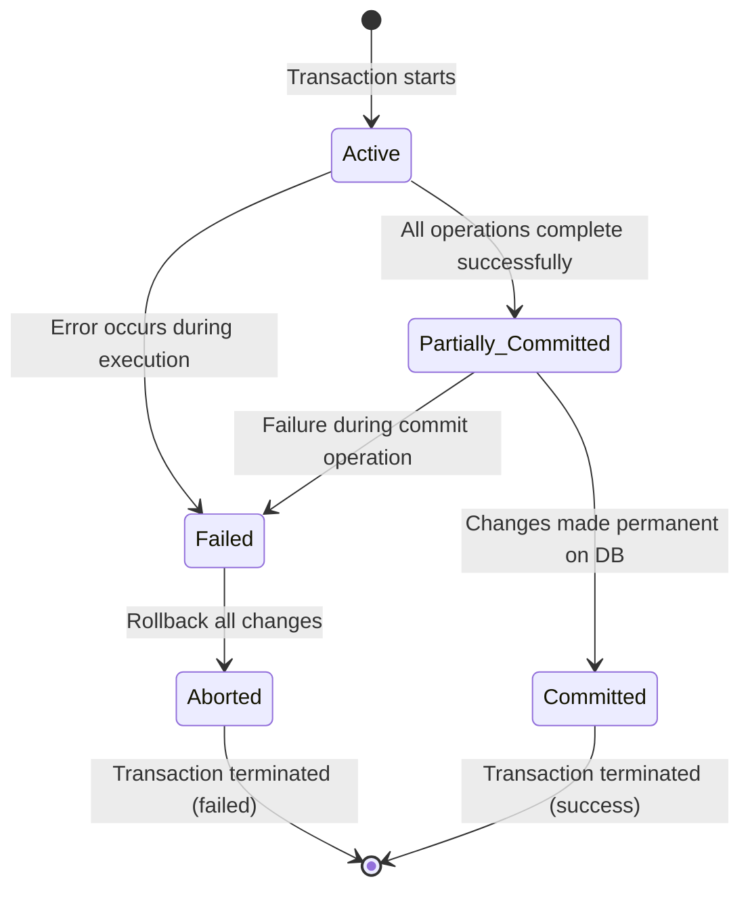
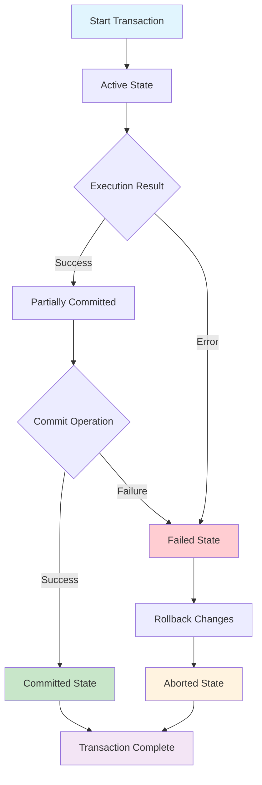

# Chapter 11: ACID Properties & Transactions 🔐

## What is a Transaction? 🤔

**A transaction is a unit of work done against the DB in a logical sequence.**

**The sequence is very important in transactions.**

**It is a logical unit of work that contains one or more SQL statements.** The result of all these statements in a transaction either gets completed successfully (all the changes made to the database are permanent) or if at any point any failure happens it gets rollbacked (all the changes being done are undone.)

### Real-Life Example 🏦
**Bank Transfer Transaction**:
1. Check if Account A has sufficient balance
2. Debit amount from Account A
3. Credit amount to Account B
4. Update transaction log

**All steps must succeed OR all steps must fail** - no partial operations allowed!

---

## ACID Properties ⚛️

**To ensure integrity of the data, we require that the DB system maintain the following properties of the transaction.**

### 1. Atomicity ⚛️
**Either all operations of transaction are reflected properly in the DB, or none are.**

**What this means**: Transaction is **all or nothing**.

**Example**: Bank transfer
- ✅ **Success**: Money moves from Account A to Account B
- ❌ **Failure**: No money moves at all (balances unchanged)

**Atomicity ensures**: No partial transfers where money disappears!

---

### 2. Consistency 🎯
**Integrity constraints must be maintained before and after transaction.**
**DB must be consistent after transaction happens.**

**What this means**: Database moves from one **valid state** to another **valid state**.

**Example**: Account balance cannot be negative
- Before transfer: Account A = ₹1000, Account B = ₹500
- After transfer: Account A = ₹500, Account B = ₹1000
- Both states are valid (no negative balances)

**Consistency ensures**: All business rules and constraints are always satisfied.

---

### 3. Isolation 🔒
**Even though multiple transactions may execute concurrently, the system guarantees that, for every pair of transactions Ti and Tj, it appears to Ti that either Tj finished execution before Ti started, or Tj started execution after Ti finished. Thus, each transaction is unaware of other transactions executing concurrently in the system.**

**What this means**: Transactions appear to run **one at a time**, even if they run simultaneously.

**Simple definition**: Multiple transactions can happen in the system in isolation, without interfering with each other.

**Example**: Two bank transfers happening simultaneously
- Transaction 1: Account A → Account B (₹100)
- Transaction 2: Account B → Account C (₹50)

**Without Isolation**: Might read intermediate values and cause wrong balances
**With Isolation**: Each transaction sees a consistent view of the database

**Isolation ensures**: Concurrent transactions don't corrupt each other's data.

---

### 4. Durability 💪
**After transaction completes successfully, the changes it has made to the database persist, even if there are system failures.**

**What this means**: Once committed, changes are **permanent**.

**Example**: After bank transfer completes
- Database crashes immediately after
- When system restarts, the transfer is still recorded
- Money moved successfully despite crash

**Durability ensures**: Committed data survives power failures, crashes, etc.

---

## Transaction States 📊

### Transaction Lifecycle Diagram

**Complete Transaction State Flow**:



**Detailed State Transitions**:



### State Descriptions:

#### 1. Active State 🟢
**The very first state of the life cycle of the transaction, all the read and write operations are being performed.**

- Transaction is executing its operations
- Reading and writing database records
- If they execute without any error → goes to Partially Committed state
- If any error occurs → goes to Failed state

#### 2. Partially Committed State 🟡
**After transaction is executed the changes are saved in the buffer in the main memory.**

- All operations completed successfully
- Changes are in memory buffer (not yet on disk)
- If changes made permanent on DB → goes to Committed state
- If there's any failure → goes to Failed state

#### 3. Committed State ✅
**When updates are made permanent on the DB. Then the transaction is said to be in the committed state.**

- Changes are written to disk
- New consistent state is achieved
- **Rollback can't be done from committed state**
- Transaction successfully completed

#### 4. Failed State ❌
**When transaction is being executed and some failure occurs. Due to this it is impossible to continue the execution of the transaction.**

- Error detected during execution
- Cannot continue processing
- Must roll back all changes

#### 5. Aborted State 🔄
**When transaction reaches the failed state, all the changes made in the buffer are reversed.**

- All changes are undone (rollback)
- Database returns to state prior to transaction
- Transaction reaches abort state after rollback

#### 6. Terminated State ⏹️
**A transaction is said to have terminated if it has either committed or aborted.**

- Final state of transaction
- Either successful (committed) or failed (aborted)
- Resources are released

---

## Practical Examples 💼

### Example 1: ATM Withdrawal
```
Transaction Steps:
1. Check PIN verification
2. Check account balance
3. Deduct amount from account
4. Update ATM cash balance
5. Record transaction

ACID Properties:
- Atomicity: All steps succeed OR none
- Consistency: Balance never negative
- Isolation: Other withdrawals don't interfere
- Durability: Transaction persists if system crashes
```

### Example 2: E-commerce Order
```
Transaction Steps:
1. Check product availability
2. Reduce product stock
3. Charge customer credit card
4. Create order record
5. Send confirmation email

ACID Properties:
- Atomicity: Customer pays only if stock available
- Consistency: Stock count always accurate
- Isolation: Multiple orders don't oversell products
- Durability: Order remains even if website crashes
```

---

## Interview Questions 🎯

### Q1: Explain ACID properties with real-life examples
**Answer**:
- **Atomicity**: Bank transfer - money moves completely or not at all
- **Consistency**: Account balance never negative - maintains integrity
- **Isolation**: Two transfers don't interfere with each other
- **Durability**: Once transfer completes, it survives system crashes

### Q2: What happens if a transaction fails in Partially Committed state?
**Answer**:
- Transaction moves to Failed state
- All changes in buffer are rolled back
- Database returns to state before transaction
- Transaction goes to Aborted state, then Terminated

### Q3: Why is Isolation important in banking systems?
**Answer**:
- Prevents concurrent transactions from reading partial data
- Ensures accurate balance calculations
- Avoids issues like double-spending or incorrect transfers
- Maintains data consistency during peak usage

### Q4: Can a transaction be rolled back after reaching Committed state?
**Answer**:
**No!** Once a transaction reaches Committed state:
- Changes are permanent and persistent
- Rollback is not possible
- Database is in a new consistent state
- Only way to undo is through a compensating transaction

### Q5: What's the difference between Failed and Aborted states?
**Answer**:
- **Failed State**: Error detected, rollback needed
- **Aborted State**: Rollback completed, transaction undone
- **Sequence**: Active → Failed → Aborted → Terminated

---

## Quick Reference Table 📋

| ACID Property | Key Concept | Real-Life Example |
|---------------|-------------|-------------------|
| **Atomicity** | All or Nothing | Bank transfer completes fully or fails completely |
| **Consistency** | Valid States | Account balances never go negative |
| **Isolation** | Concurrent Safety | Multiple users don't interfere with each other |
| **Durability** | Permanent Changes | Transaction survives system crashes |

| Transaction State | Description | Next State |
|-------------------|-------------|------------|
| **Active** | Executing operations | Partially Committed or Failed |
| **Partially Committed** | Changes in buffer | Committed or Failed |
| **Committed** | Changes permanent | Terminated |
| **Failed** | Error occurred | Aborted |
| **Aborted** | Rollback complete | Terminated |
| **Terminated** | Transaction ended | End |

---

## Key Takeaways 💡

1. **Transactions are logical units of work** - multiple SQL statements as one unit
2. **ACID properties ensure data integrity** - Atomicity, Consistency, Isolation, Durability
3. **Transaction states follow a lifecycle** - Active → Partially Committed → Committed/Failed
4. **Rollback is only possible before commit** - cannot undo committed transactions
5. **Concurrent transactions need isolation** - prevents data corruption
6. **Durability means persistence** - committed changes survive failures

**Remember**: Transactions are the foundation of reliable database systems - they ensure your data stays consistent and accurate even when things go wrong! 🎯