# Chapter 1: OOPS (C++) and Low Level Design

## Core OOPS Concepts

### Classes and Objects

#### Fundamental Concepts
- **Class**: Blueprint or template for creating objects. Defines properties (attributes) and behaviors (methods) that objects will have.
- **Object**: Instance of a class with actual data and state. Objects occupy memory and have independent existence.
- **Key Points**:
  - Multiple objects can be created from the same class
  - Each object has its own state (data values) but shares behavior (methods)
  - Objects communicate through method calls

#### Example Scenario
Think of a `Car` class - it defines what a car should have (engine, wheels, color) and what it can do (start, stop, accelerate). Individual car objects (Toyota Camry, Honda Civic) are instances with specific colors and features.

### Four Pillars of OOPS

#### 1. Encapsulation
**Definition**: Bundling data (variables) and methods (functions) together into a single unit while hiding internal details from outside.

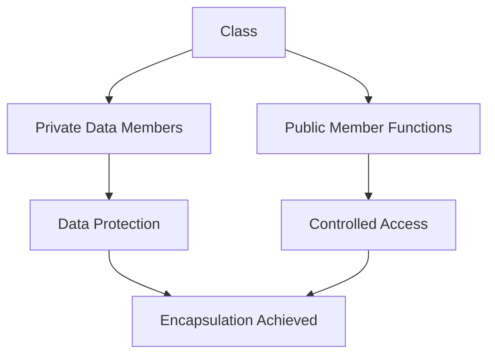

| Access Specifier | Accessibility | Use Case | Example |
|------------------|---------------|----------|---------|
| `public` | Everywhere | Interface for external users | Public methods like `startEngine()` |
| `private` | Within class only | Internal data and helper methods | Engine details, internal state |
| `protected` | Class and derived classes | Shared with inheritance | Protected methods used by child classes |

#### 2. Inheritance
**Definition**: One class acquiring properties and behaviors of another class. Enables code reuse and establishes parent-child relationships.

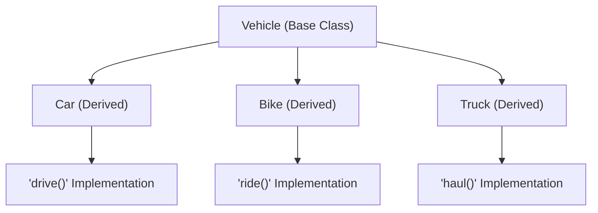

**Types of Inheritance**:
- **Single**: One parent, one child
- **Multiple**: Multiple parents, one child (complex, can cause diamond problem)
- **Multilevel**: Grandparent → Parent → Child
- **Hierarchical**: One parent, multiple children
- **Hybrid**: Combination of multiple types

**Real-world Example**: Vehicle → Car → ElectricCar. ElectricCar inherits from Car, which inherits from Vehicle.

#### 3. Polymorphism
**Definition**: One interface, multiple implementations. Same method name can behave differently based on the object calling it.

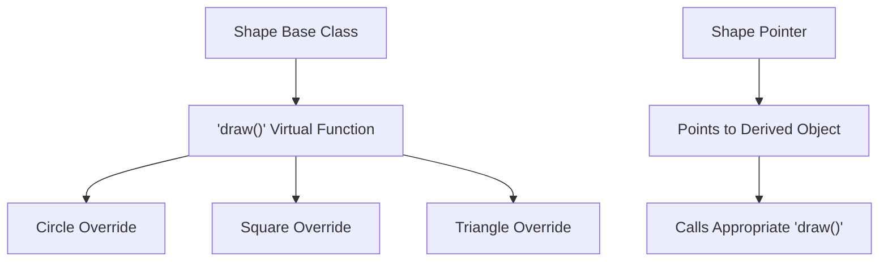

**Types of Polymorphism**:
- **Compile Time**: Function overloading, operator overloading
- **Runtime**: Function overriding, virtual functions

**Real-world Example**: `draw()` method - Circle draws a circle, Square draws a square, but through a common interface.

#### 4. Abstraction
**Definition**: Hiding complex implementation details and showing only essential features to the user.

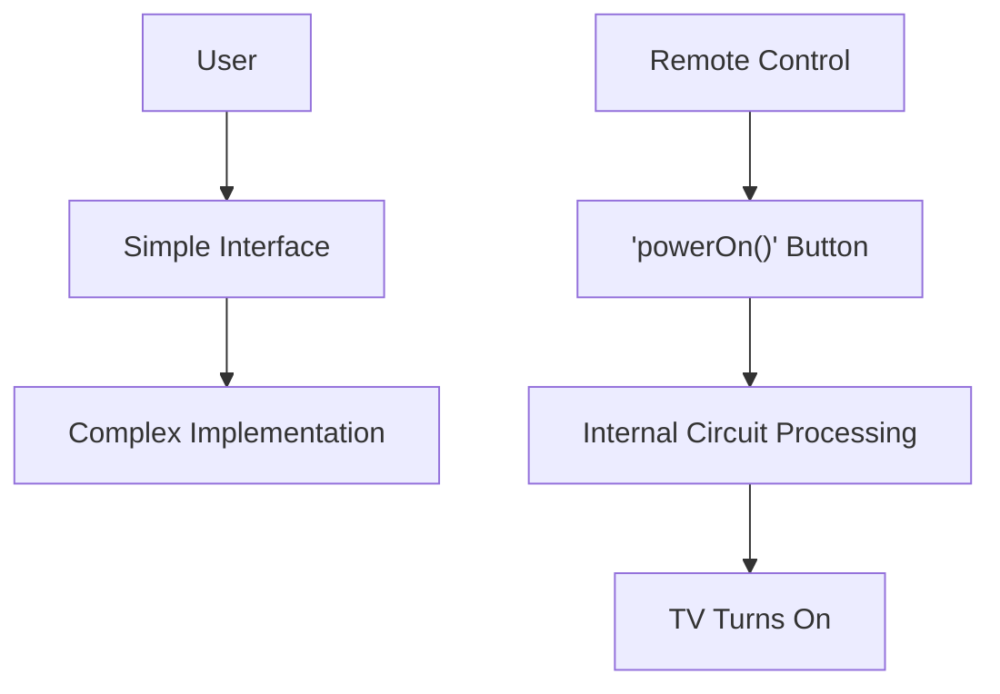

**Real-world Example**: When you press the power button on a TV remote, you don't need to know about the internal circuits - you just see the result.

## C++ Fundamentals for Interviews

### Constructors and Destructors

#### Constructor Types
- **Default Constructor**: Initializes object with default values
- **Parameterized Constructor**: Initializes object with given values
- **Copy Constructor**: Creates object by copying another object
- **Move Constructor** (C++11): Efficiently transfers ownership

| Constructor Type | Purpose | Key Feature |
|----------------|---------|-------------|
| **Default** | Initialize with default values | No parameters |
| **Parameterized** | Initialize with specific values | Takes parameters |
| **Copy** | Create copy of existing object | Takes const reference |
| **Move** (C++11) | Transfer ownership efficiently | Takes rvalue reference |

**Interview Focus**: Understand when each constructor is called and their importance in resource management.

### Virtual Functions and Runtime Polymorphism

#### Virtual Functions Concept
- **Virtual Function**: Function declared in base class and overridden in derived class
- **Runtime Polymorphism**: Actual function called is determined at runtime based on object type
- **VTable (Virtual Table)**: Mechanism that enables runtime polymorphism

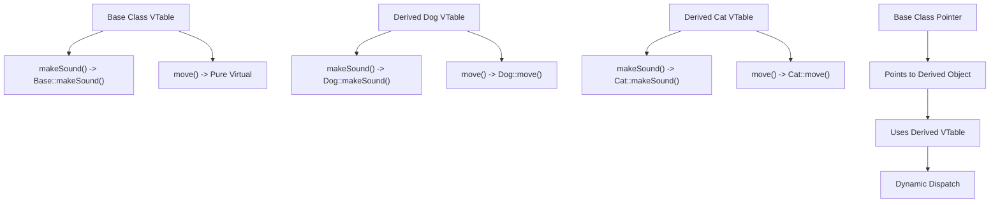

**Key Points for Interviews**:
- Virtual functions enable runtime polymorphism
- Pure virtual functions make a class abstract
- Virtual destructor is important for proper cleanup

### Pointers and Memory Management

#### Pointers Fundamentals
- **Pointer**: Variable that stores memory address of another variable
- **Dereferencing**: Accessing value at pointer's address
- **Memory Address**: Location where variable is stored

#### Stack vs Heap Memory
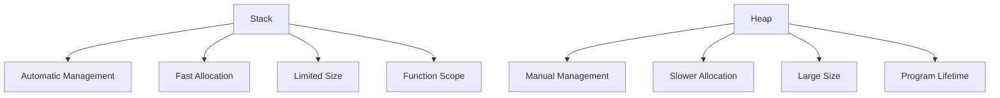

**Memory Allocation Comparison**:
- **Stack**: Automatic allocation, fast, limited size, function scope
- **Heap**: Dynamic allocation, slower, larger size, manual management

#### Smart Pointsers (Modern C++)
| Type | Ownership | Use Case | Memory Management |
|------|-----------|----------|------------------|
| **unique_ptr** | Exclusive | Single owner, non-copyable | Automatic cleanup |
| **shared_ptr** | Shared | Multiple owners, reference counting | Automatic cleanup |
| **weak_ptr** | Non-owning | Observer, avoid circular references | No automatic cleanup |

## Design Patterns for Freshers

### Singleton Pattern
**Purpose**: Ensure only one instance of class exists globally
**Use Cases**: Database connection pool, logging system, configuration manager
**Interview Focus**: Thread safety, lazy initialization, global access point

**Real-world Example**: Only one database connection manager for entire application to avoid connection overhead.

### Factory Pattern
**Purpose**: Create objects without specifying exact class
**Use Cases**: Creating different types of objects based on input parameters
**Interview Focus**: Decoupling object creation from usage, extensibility

**Real-world Example**: Payment system that creates different payment objects (CreditCard, PayPal, UPI) based on user selection.

### Observer Pattern
**Purpose**: One-to-many dependency between objects
**Use Cases**: Event handling systems, notification systems, UI updates
**Interview Focus**: Loose coupling, event-driven architecture

**Real-world Example**: Stock price monitoring system where multiple displays update when stock prices change.

### Adapter Pattern
**Purpose**: Allow incompatible interfaces to work together
**Use Cases**: Legacy code integration, third-party library integration
**Interview Focus**: Interface adaptation, code reuse without modification

**Real-world Example**: Using new payment gateway with existing shopping cart system without changing cart code.

## Low Level Design Problems

### System Design Process
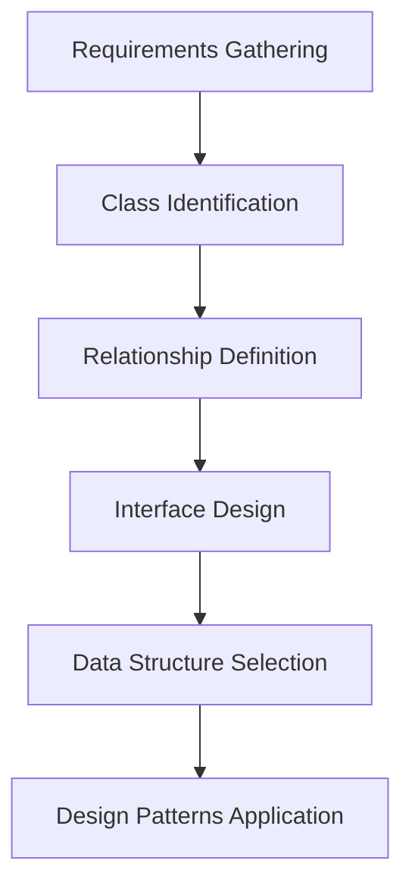

### 1. Parking Lot System

#### Requirements Analysis
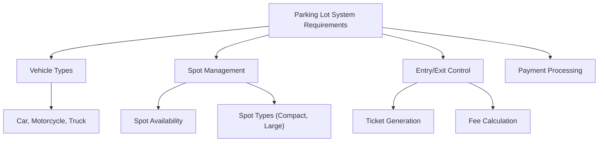

#### Core Classes and Relationships
**Key Classes**:
- **ParkingLot**: Main orchestrator, manages all operations
- **Vehicle**: Abstract base class for different vehicle types
- **ParkingSpot**: Represents individual parking spots
- **Ticket**: Contains parking information and fee calculation
- **PaymentProcessor**: Handles different payment methods

**Relationships**:
- ParkingLot has multiple ParkingSpots
- ParkingLot processes multiple Vehicles
- Vehicle can be parked in one ParkingSpot
- Ticket is generated for each Vehicle

#### Design Considerations
- **Vehicle-Spot Compatibility**: Motorcycle can park in compact or motorcycle spot
- **Concurrency Handling**: Multiple vehicles entering/exiting simultaneously
- **Scalability**: Handle multiple parking lots or floors
- **Time-based Pricing**: Different rates for different time periods

### 2. Library Management System

#### Requirements Analysis
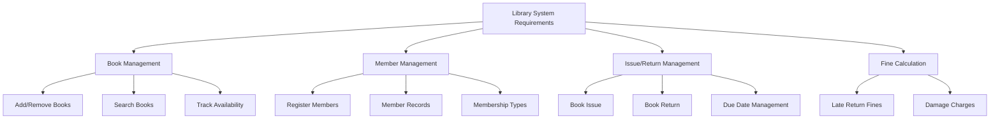

#### Core Classes and Relationships
**Key Classes**:
- **Library**: Main system orchestrator
- **Book**: Represents individual books with metadata
- **Member**: Library members with borrowing privileges
- **Librarian**: System administrator with extended privileges
- **IssueRecord**: Tracks book borrowing history

**Relationships**:
- Library has multiple Books and Members
- Member can borrow multiple Books
- Book can be borrowed by one Member at a time
- IssueRecord connects Member and Book

#### Design Considerations
- **Search Functionality**: Multiple search criteria (title, author, ISBN)
- **Reservation System**: Book reservation when not available
- **Membership Tiers**: Different borrowing limits based on membership type
- **Fine Calculation**: Different rates for different book types/member types

### 3. URL Shortener System

#### Requirements Analysis
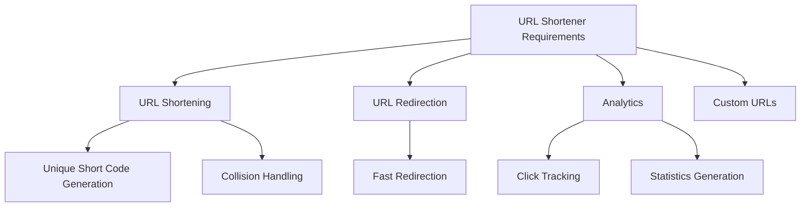

#### Core Classes and Relationships
**Key Classes**:
- **URLShortener**: Main service class
- **URLMapping**: Stores mapping between short and long URLs
- **AnalyticsService**: Tracks clicks and generates statistics
- **CustomURLManager**: Handles custom short URLs

**Relationships**:
- URLShortener manages multiple URLMappings
- URLMapping is associated with AnalyticsService
- CustomURLManager extends base functionality

#### Design Considerations
- **Hash Function**: Generate unique, short codes efficiently
- **Collision Resolution**: Handle cases where same code is generated
- **Redirection Speed**: Fast lookup for shortened URLs
- **Scalability**: Handle millions of URLs and clicks
- **Analytics**: Real-time and historical data processing

## Common Interview Questions

### Basic OOPS Questions

**Q1: What is the difference between struct and class in C++?**
**Answer**: Main difference is default access specifier:
- **struct**: Members are `public` by default
- **class**: Members are `private` by default

**Follow-up**: When would you prefer struct over class?
**Answer**: Use struct for simple data structures with public data, use class for complex objects with behavior and data hiding.

**Q2: What is the difference between composition and inheritance?**
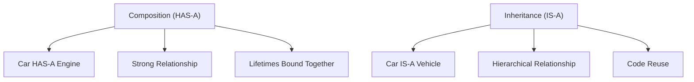

**Answer**:
- **Composition**: "HAS-A" relationship, objects contain other objects (Car has Engine)
- **Inheritance**: "IS-A" relationship, classes extend other classes (Car is Vehicle)

**Q3: What is a virtual destructor and why is it important?**
**Answer**: Virtual destructor ensures proper cleanup when deleting derived objects through base class pointers. Without virtual destructor, only the base destructor is called, leading to resource leaks.

**Follow-up**: When should you make destructors virtual?
**Answer**: When a class is designed to be a base class that will be inherited from.

### Intermediate Questions

**Q4: What is the Diamond Problem and how is it solved?**
**Answer**: Diamond Problem occurs when a class inherits from two classes that both inherit from the same base class, causing ambiguity in which base class implementation to use.

**Solution**: Virtual inheritance - use `virtual` keyword when inheriting from the base class.

**Q5: What is RAII and why is it important?**
**Answer**: RAII (Resource Acquisition Is Initialization) is a programming paradigm where resource management is tied to object lifetime.

**Importance**:
- Automatic resource cleanup
- Exception safety
- No resource leaks
- Cleaner code

**Real-world Example**: File handling - file is opened in constructor, automatically closed in destructor.

### Advanced Questions

**Q6: What is the Rule of Three/Five/Zero?**
**Answer**:
- **Rule of Three**: If you need to define destructor, copy constructor, or copy assignment, you probably need all three
- **Rule of Five**: Add move constructor and move assignment (C++11+)
- **Rule of Zero**: Prefer default implementations when possible, let compiler handle resource management

**Q7: What is perfect forwarding?**
**Answer**: Perfect forwarding preserves value category (lvalue/rvalue) of template arguments when forwarding them to other functions.

**Use Case**: Factory functions that need to forward arguments to constructors perfectly.

## Design Principles

### SOLID Principles for Interviews

1. **Single Responsibility Principle**: Each class should have one reason to change
2. **Open/Closed Principle**: Open for extension, closed for modification
3. **Liskov Substitution Principle**: Subtypes must be substitutable for their base types
4. **Interface Segregation Principle**: Clients should not depend on interfaces they don't use
5. **Dependency Inversion Principle**: Depend on abstractions, not concretions

### Key Design Patterns for Freshers

| Pattern | Problem Solves | Interview Focus |
|---------|----------------|----------------|
| **Singleton** | Single instance requirement | Thread safety, initialization |
| **Factory** | Object creation complexity | Decoupling, extensibility |
| **Observer** | One-to-many communication | Loose coupling, events |
| **Adapter** | Interface incompatibility | Legacy integration |
| **Strategy** | Algorithm selection | Flexibility, extensibility |

## Quick Reference

### OOPS Concepts Summary
| Concept | Key Points | Interview Focus |
|---------|------------|-----------------|
| **Class/Object** | Blueprint/Instance | Creation, usage scenarios |
| **Encapsulation** | Data hiding | Access specifiers, benefits |
| **Inheritance** | Code reuse | Types, virtual functions |
| **Polymorphism** | Many forms | Overriding vs overloading |
| **Abstraction** | Hide complexity | Interface design |

### Common Interview Topics
| Topic | Key Points | Preparation Focus |
|-------|------------|------------------|
| **Constructors** | Types, order of execution | When each type is called |
| **Virtual Functions** | Runtime polymorphism | VTable, virtual destructors |
| **Smart Pointers** | Memory management | RAII, ownership types |
| **Memory Management** | Stack vs heap | Allocation, deallocation |
| **Design Patterns** | Reusable solutions | When to use which pattern |

### LLD Preparation Tips

1. **Requirements First**: Always clarify requirements before starting design
2. **Class Identification**: Identify entities and their responsibilities
3. **Relationships**: Determine associations between classes
4. **Design Patterns**: Apply appropriate patterns to solve common problems
5. **Scalability**: Consider how design will handle growth
6. **Edge Cases**: Think about error handling and boundary conditions

---

**Important Note**: Focus on understanding concepts and their practical applications rather than memorizing syntax. In interviews, interviewers are more interested in your thought process, design decisions, and understanding of trade-offs than perfect code implementation.