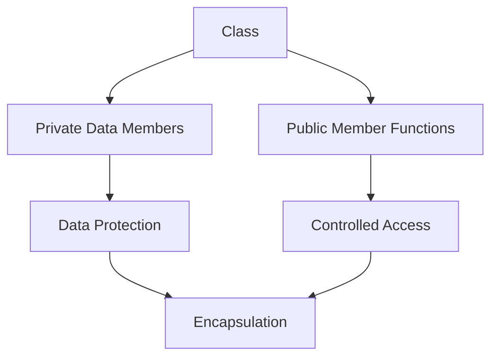
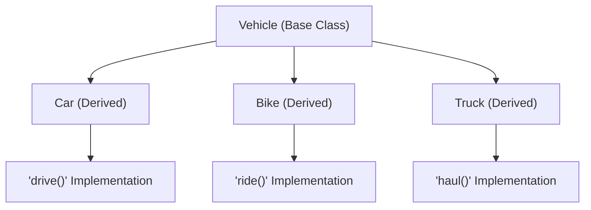
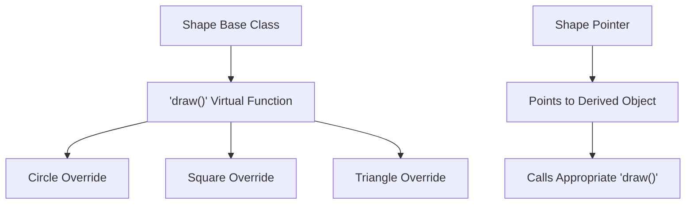
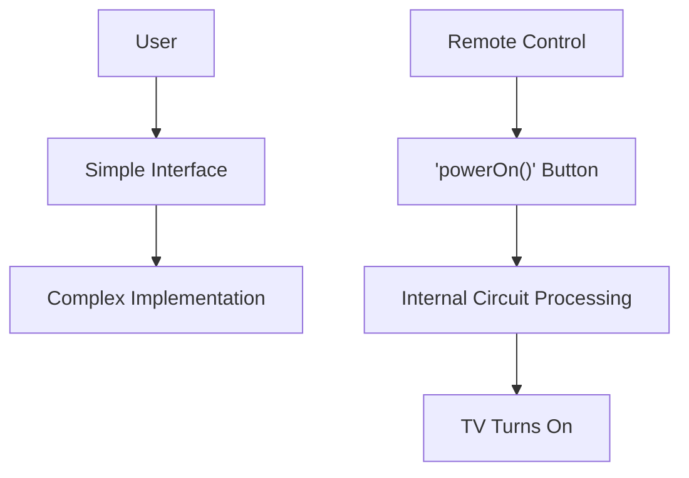
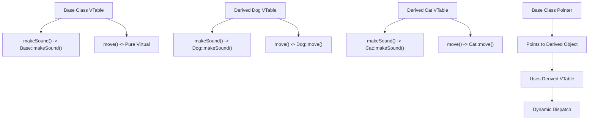
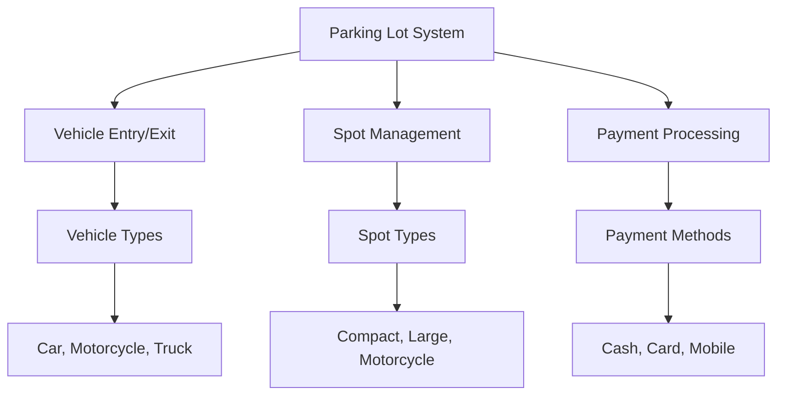
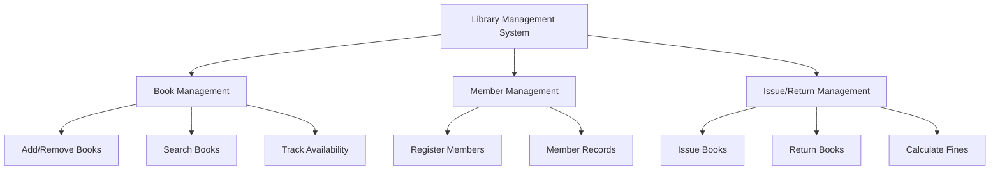
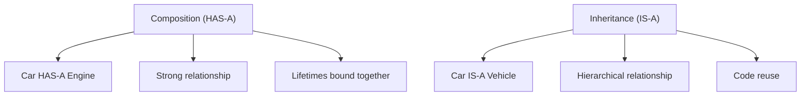

# Chapter 1: OOPS (C++) and Low Level Design

## Core OOPS Concepts

### Classes and Objects

#### Fundamental Concepts
- **Class**: Blueprint/template for creating objects
- **Object**: Instance of a class with actual data
- **Key Points**:
  - Multiple objects can be created from same class
  - Each object has its own state (data members)
  - Objects share same behavior (member functions)

#### Example
```cpp
class Student {
private:
    string name;
    int age;
    double marks;

public:
    // Constructor
    Student(string n, int a, double m) : name(n), age(a), marks(m) {}

    // Member functions
    void displayDetails() {
        cout << "Name: " << name << ", Age: " << age << ", Marks: " << marks << endl;
    }

    bool isPassed() {
        return marks >= 40.0;
    }
};
```

### Four Pillars of OOPS

#### 1. Encapsulation
**Definition**: Binding data and methods together



| Access Specifier | Accessibility | Use Case |
|------------------|---------------|----------|
| `public` | Everywhere | Interface for external users |
| `private` | Within class only | Internal data and helper methods |
| `protected` | Class and derived classes | Shared with inheritance |

#### 2. Inheritance
**Definition**: One class acquiring properties of another



**Types of Inheritance**:
- **Single**: One parent, one child
- **Multiple**: Multiple parents, one child
- **Multilevel**: Grandparent → Parent → Child
- **Hierarchical**: One parent, multiple children

#### 3. Polymorphism
**Definition**: One interface, multiple implementations
- **Compile Time**: Function overloading, operator overloading
- **Runtime**: Function overriding, virtual functions



#### 4. Abstraction
**Definition**: Hiding implementation details, showing essential features



## C++ Fundamentals for Interviews

### Constructors and Destructors

#### Constructor Types
```cpp
class Account {
private:
    string accountNumber;
    double balance;

public:
    // Default constructor
    Account() : accountNumber(""), balance(0.0) {
        cout << "Default constructor called" << endl;
    }

    // Parameterized constructor
    Account(string accNum, double bal) : accountNumber(accNum), balance(bal) {
        cout << "Parameterized constructor called" << endl;
    }

    // Copy constructor
    Account(const Account& other) : accountNumber(other.accountNumber), balance(other.balance) {
        cout << "Copy constructor called" << endl;
    }

    // Destructor
    ~Account() {
        cout << "Destructor called for account: " << accountNumber << endl;
    }
};
```

#### Constructor Comparison
| Type | Purpose | Key Feature |
|------|---------|-------------|
| **Default** | Initialize with default values | No parameters |
| **Parameterized** | Initialize with specific values | Takes parameters |
| **Copy** | Create copy of existing object | Takes const reference |
| **Move** (C++11) | Transfer ownership efficiently | Takes rvalue reference |

### Virtual Functions and Runtime Polymorphism

#### Virtual Functions
```cpp
class Animal {
public:
    // Virtual function
    virtual void makeSound() {
        cout << "Some animal sound" << endl;
    }

    // Pure virtual function (abstract class)
    virtual void move() = 0;

    // Virtual destructor (important!)
    virtual ~Animal() {
        cout << "Animal destructor" << endl;
    }
};

class Dog : public Animal {
public:
    void makeSound() override {
        cout << "Woof! Woof!" << endl;
    }

    void move() override {
        cout << "Dog is running" << endl;
    }

    ~Dog() {
        cout << "Dog destructor" << endl;
    }
};

class Cat : public Animal {
public:
    void makeSound() override {
        cout << "Meow! Meow!" << endl;
    }

    void move() override {
        cout << "Cat is walking" << endl;
    }

    ~Cat() {
        cout << "Cat destructor" << endl;
    }
};

int main() {
    Animal* animals[2];
    animals[0] = new Dog();
    animals[1] = new Cat();

    for (int i = 0; i < 2; i++) {
        animals[i]->makeSound(); // Calls appropriate function
        animals[i]->move();
    }

    // Clean up
    for (int i = 0; i < 2; i++) {
        delete animals[i];
    }

    return 0;
}
```

#### VTable Concept


### Pointers and Memory Management

#### Pointers Basics
```cpp
class PointerDemo {
public:
    int value;

    PointerDemo(int v) : value(v) {}

    void display() {
        cout << "Value: " << value << endl;
    }
};

void pointerBasics() {
    // Basic pointer
    int num = 42;
    int* ptr = &num; // ptr stores address of num

    cout << "Value: " << *ptr << endl; // Dereferencing
    cout << "Address: " << ptr << endl; // Address

    // Pointer to object
    PointerDemo obj(100);
    PointerDemo* objPtr = &obj;

    objPtr->display(); // Arrow operator for pointer to object

    // Dynamic allocation
    PointerDemo* dynamicObj = new PointerDemo(200);
    dynamicObj->display();
    delete dynamicObj; // Important: free memory
}
```

#### References vs Pointers
| Feature | References | Pointers |
|---------|------------|----------|
| **Declaration** | `int& ref = var;` | `int* ptr = &var;` |
| **Null Value** | Cannot be null | Can be null (nullptr) |
| **Reassignment** | Cannot be reassigned | Can point to different objects |
| **Dereferencing** | Automatic | Manual (using `*`) |
| **Arithmetic** | Not allowed | Pointer arithmetic possible |

### STL Basics

#### Vector
```cpp
#include <vector>

void vectorDemo() {
    // Create vector
    vector<int> numbers;

    // Add elements
    numbers.push_back(10);
    numbers.push_back(20);
    numbers.push_back(30);

    // Access elements
    cout << "First element: " << numbers[0] << endl;
    cout << "Size: " << numbers.size() << endl;

    // Iterate
    for (int num : numbers) {
        cout << num << " ";
    }
    cout << endl;

    // Remove last element
    numbers.pop_back();

    // Check if empty
    if (numbers.empty()) {
        cout << "Vector is empty" << endl;
    }
}
```

#### Map
```cpp
#include <map>

void mapDemo() {
    // Create map
    map<string, int> studentMarks;

    // Insert elements
    studentMarks["Alice"] = 85;
    studentMarks["Bob"] = 92;
    studentMarks.insert({"Charlie", 78});

    // Access elements
    cout << "Alice's marks: " << studentMarks["Alice"] << endl;

    // Check if key exists
    if (studentMarks.find("David") != studentMarks.end()) {
        cout << "David's marks: " << studentMarks["David"] << endl;
    } else {
        cout << "David not found" << endl;
    }

    // Iterate
    for (const auto& pair : studentMarks) {
        cout << pair.first << ": " << pair.second << endl;
    }
}
```

## Design Patterns for Freshers

### Singleton Pattern
**Purpose**: Ensure only one instance of class exists
**Use Cases**: Database connection, logging, configuration

```cpp
class DatabaseConnection {
private:
    static DatabaseConnection* instance;
    string connectionString;

    // Private constructor
    DatabaseConnection() {
        connectionString = "localhost:5432/mydb";
        cout << "Database connection established" << endl;
    }

public:
    // Static method to get instance
    static DatabaseConnection* getInstance() {
        if (instance == nullptr) {
            instance = new DatabaseConnection();
        }
        return instance;
    }

    void connect() {
        cout << "Connecting to: " << connectionString << endl;
    }

    // Delete copy constructor and assignment
    DatabaseConnection(const DatabaseConnection&) = delete;
    DatabaseConnection& operator=(const DatabaseConnection&) = delete;

    // Destructor
    ~DatabaseConnection() {
        cout << "Database connection closed" << endl;
    }
};

// Initialize static member
DatabaseConnection* DatabaseConnection::instance = nullptr;
```

### Factory Pattern
**Purpose**: Create objects without specifying exact class
**Use Cases**: Creating different types based on input

```cpp
// Abstract base class
class Shape {
public:
    virtual void draw() = 0;
    virtual double area() = 0;
    virtual ~Shape() {}
};

// Concrete classes
class Circle : public Shape {
private:
    double radius;
public:
    Circle(double r) : radius(r) {}
    void draw() override { cout << "Drawing Circle" << endl; }
    double area() override { return 3.14 * radius * radius; }
};

class Rectangle : public Shape {
private:
    double width, height;
public:
    Rectangle(double w, double h) : width(w), height(h) {}
    void draw() override { cout << "Drawing Rectangle" << endl; }
    double area() override { return width * height; }
};

// Factory class
class ShapeFactory {
public:
    static Shape* createShape(const string& type) {
        if (type == "circle") {
            return new Circle(5.0);
        } else if (type == "rectangle") {
            return new Rectangle(4.0, 6.0);
        }
        return nullptr;
    }
};
```

### Observer Pattern
**Purpose**: One-to-many dependency between objects
**Use Cases**: Event handling, notification systems

```cpp
#include <vector>
#include <algorithm>

// Observer interface
class Observer {
public:
    virtual void update(string message) = 0;
    virtual ~Observer() {}
};

// Subject interface
class Subject {
private:
    vector<Observer*> observers;

public:
    void attach(Observer* observer) {
        observers.push_back(observer);
    }

    void detach(Observer* observer) {
        observers.erase(remove(observers.begin(), observers.end(), observer), observers.end());
    }

    void notify(string message) {
        for (Observer* observer : observers) {
            observer->update(message);
        }
    }
};

// Concrete Subject
class WeatherStation : public Subject {
private:
    float temperature;

public:
    void setTemperature(float temp) {
        temperature = temp;
        notify("Temperature updated: " + to_string(temperature) + "°C");
    }
};

// Concrete Observer
class TemperatureDisplay : public Observer {
private:
    string name;

public:
    TemperatureDisplay(string n) : name(n) {}

    void update(string message) override {
        cout << name << " received: " << message << endl;
    }
};
```

## Low Level Design Problems

### 1. Parking Lot System

#### Requirements Analysis


#### Core Classes
```cpp
#include <vector>
#include <memory>
#include <unordered_map>
#include <ctime>

enum class VehicleType { CAR, MOTORCYCLE, TRUCK };
enum class SpotType { COMPACT, LARGE, MOTORCYCLE };

// Vehicle class
class Vehicle {
protected:
    string licensePlate;
    VehicleType type;

public:
    Vehicle(string plate, VehicleType t) : licensePlate(plate), type(t) {}

    string getLicensePlate() const { return licensePlate; }
    VehicleType getType() const { return type; }

    virtual VehicleType getRequiredSpotType() const = 0;
    virtual ~Vehicle() {}
};

class Car : public Vehicle {
public:
    Car(string plate) : Vehicle(plate, VehicleType::CAR) {}
    VehicleType getRequiredSpotType() const override { return VehicleType::CAR; }
};

class Motorcycle : public Vehicle {
public:
    Motorcycle(string plate) : Vehicle(plate, VehicleType::MOTORCYCLE) {}
    VehicleType getRequiredSpotType() const override { return VehicleType::MOTORCYCLE; }
};

class Truck : public Vehicle {
public:
    Truck(string plate) : Vehicle(plate, VehicleType::TRUCK) {}
    VehicleType getRequiredSpotType() const override { return VehicleType::TRUCK; }
};

// Parking Spot class
class ParkingSpot {
private:
    string spotId;
    SpotType type;
    bool isOccupied;
    Vehicle* parkedVehicle;

public:
    ParkingSpot(string id, SpotType t) : spotId(id), type(t), isOccupied(false), parkedVehicle(nullptr) {}

    bool canFitVehicle(Vehicle* vehicle) {
        if (isOccupied) return false;

        // Simple logic - can be enhanced
        switch (vehicle->getType()) {
            case VehicleType::MOTORCYCLE:
                return type == SpotType::MOTORCYCLE || type == SpotType::COMPACT;
            case VehicleType::CAR:
                return type == SpotType::COMPACT || type == SpotType::LARGE;
            case VehicleType::TRUCK:
                return type == SpotType::LARGE;
        }
        return false;
    }

    bool parkVehicle(Vehicle* vehicle) {
        if (!canFitVehicle(vehicle)) return false;

        parkedVehicle = vehicle;
        isOccupied = true;
        return true;
    }

    void removeVehicle() {
        parkedVehicle = nullptr;
        isOccupied = false;
    }

    // Getters
    string getSpotId() const { return spotId; }
    bool getIsOccupied() const { return isOccupied; }
    Vehicle* getParkedVehicle() const { return parkedVehicle; }
};

// Parking Lot class
class ParkingLot {
private:
    vector<unique_ptr<ParkingSpot>> spots;
    unordered_map<string, time_t> entryTimes;

public:
    void addSpot(string spotId, SpotType type) {
        spots.push_back(make_unique<ParkingSpot>(spotId, type));
    }

    ParkingSpot* findAvailableSpot(Vehicle* vehicle) {
        for (auto& spot : spots) {
            if (spot->canFitVehicle(vehicle)) {
                return spot.get();
            }
        }
        return nullptr;
    }

    bool parkVehicle(Vehicle* vehicle) {
        ParkingSpot* spot = findAvailableSpot(vehicle);
        if (spot) {
            spot->parkVehicle(vehicle);
            entryTimes[vehicle->getLicensePlate()] = time(nullptr);
            cout << "Vehicle " << vehicle->getLicensePlate()
                 << " parked at spot " << spot->getSpotId() << endl;
            return true;
        }
        cout << "No available spot for vehicle " << vehicle->getLicensePlate() << endl;
        return false;
    }

    bool removeVehicle(string licensePlate) {
        for (auto& spot : spots) {
            if (spot->getIsOccupied() &&
                spot->getParkedVehicle()->getLicensePlate() == licensePlate) {

                spot->removeVehicle();
                entryTimes.erase(licensePlate);
                cout << "Vehicle " << licensePlate << " removed from spot "
                     << spot->getSpotId() << endl;
                return true;
            }
        }
        return false;
    }

    void displayStatus() {
        cout << "\n=== Parking Lot Status ===" << endl;
        for (const auto& spot : spots) {
            cout << "Spot " << spot->getSpotId() << " ("
                 << (spot->getIsOccupied() ? "Occupied" : "Available") << ")" << endl;
        }
        cout << "========================\n" << endl;
    }
};
```

### 2. Library Management System

#### System Design


#### Implementation
```cpp
#include <vector>
#include <unordered_map>
#include <ctime>
#include <string>

// Date class for simplicity
class Date {
private:
    int day, month, year;

public:
    Date() {
        time_t now = time(0);
        tm* localtm = localtime(&now);
        day = localtm->tm_mday;
        month = localtm->tm_mon + 1;
        year = localtm->tm_year + 1900;
    }

    Date(int d, int m, int y) : day(d), month(m), year(y) {}

    Date addDays(int days) {
        // Simple implementation - would need proper date handling
        return Date(day + days, month, year);
    }

    int daysBetween(const Date& other) const {
        // Simplified - would need proper date difference calculation
        return abs((year - other.year) * 365 + (month - other.month) * 30 + (day - other.day));
    }

    string toString() const {
        return to_string(day) + "/" + to_string(month) + "/" + to_string(year);
    }
};

// Book class
class Book {
private:
    string isbn;
    string title;
    string author;
    bool isAvailable;

public:
    Book(string i, string t, string a)
        : isbn(i), title(t), author(a), isAvailable(true) {}

    // Getters
    string getISBN() const { return isbn; }
    string getTitle() const { return title; }
    string getAuthor() const { return author; }
    bool getIsAvailable() const { return isAvailable; }

    // Methods
    bool canBorrow() const { return isAvailable; }
    void borrow() { isAvailable = false; }
    void returnBook() { isAvailable = true; }

    void display() const {
        cout << "ISBN: " << isbn << ", Title: " << title
             << ", Author: " << author << ", Available: "
             << (isAvailable ? "Yes" : "No") << endl;
    }
};

// Member class
class Member {
private:
    string memberId;
    string name;
    vector<string> borrowedISBNs;

public:
    Member(string id, string n) : memberId(id), name(n) {}

    // Getters
    string getMemberId() const { return memberId; }
    string getName() const { return name; }

    // Methods
    bool canBorrow() const {
        return borrowedISBNs.size() < 5; // Max 5 books
    }

    bool borrowBook(const string& isbn) {
        if (!canBorrow()) return false;

        // Check if already borrowed
        for (const string& borrowed : borrowedISBNs) {
            if (borrowed == isbn) return false;
        }

        borrowedISBNs.push_back(isbn);
        return true;
    }

    bool returnBook(const string& isbn) {
        for (auto it = borrowedISBNs.begin(); it != borrowedISBNs.end(); ++it) {
            if (*it == isbn) {
                borrowedISBNs.erase(it);
                return true;
            }
        }
        return false;
    }

    void display() const {
        cout << "Member ID: " << memberId << ", Name: " << name
             << ", Books borrowed: " << borrowedISBNs.size() << endl;
    }
};

// Issue Record class
class IssueRecord {
private:
    string memberId;
    string isbn;
    Date issueDate;
    Date dueDate;
    Date returnDate;
    bool returned;

public:
    IssueRecord(string mid, string bookIsbn)
        : memberId(mid), isbn(bookIsbn), issueDate(Date()),
          dueDate(issueDate.addDays(14)), returned(false) {}

    // Getters
    string getMemberId() const { return memberId; }
    string getISBN() const { return isbn; }
    Date getIssueDate() const { return issueDate; }
    Date getDueDate() const { return dueDate; }
    bool isReturned() const { return returned; }

    // Methods
    void returnBook() {
        returned = true;
        returnDate = Date();
    }

    double calculateFine() const {
        if (returned) return 0.0;

        Date today;
        int daysLate = today.daysBetween(dueDate);
        if (daysLate <= 0) return 0.0;

        return daysLate * 1.0; // 1 rupee per day
    }

    void display() const {
        cout << "Member: " << memberId << ", Book: " << isbn
             << ", Issued: " << issueDate.toString()
             << ", Due: " << dueDate.toString();

        if (returned) {
            cout << ", Returned: " << returnDate.toString();
        } else {
            cout << ", Not returned, Fine: " << calculateFine();
        }
        cout << endl;
    }
};

// Library class
class Library {
private:
    unordered_map<string, Book*> books;
    unordered_map<string, Member*> members;
    vector<IssueRecord> issueRecords;

public:
    // Book management
    void addBook(Book* book) {
        books[book->getISBN()] = book;
    }

    void removeBook(const string& isbn) {
        if (books.find(isbn) != books.end()) {
            delete books[isbn];
            books.erase(isbn);
        }
    }

    Book* findBook(const string& isbn) {
        if (books.find(isbn) != books.end()) {
            return books[isbn];
        }
        return nullptr;
    }

    vector<Book*> searchBooks(const string& query) {
        vector<Book*> results;
        for (const auto& pair : books) {
            Book* book = pair.second;
            if (book->getTitle().find(query) != string::npos ||
                book->getAuthor().find(query) != string::npos ||
                book->getISBN().find(query) != string::npos) {
                results.push_back(book);
            }
        }
        return results;
    }

    // Member management
    void addMember(Member* member) {
        members[member->getMemberId()] = member;
    }

    Member* findMember(const string& memberId) {
        if (members.find(memberId) != members.end()) {
            return members[memberId];
        }
        return nullptr;
    }

    // Issue/Return operations
    bool issueBook(const string& memberId, const string& isbn) {
        Member* member = findMember(memberId);
        Book* book = findBook(isbn);

        if (!member) {
            cout << "Member not found!" << endl;
            return false;
        }

        if (!book) {
            cout << "Book not found!" << endl;
            return false;
        }

        if (!book->canBorrow()) {
            cout << "Book is not available!" << endl;
            return false;
        }

        if (!member->canBorrow()) {
            cout << "Member has reached borrowing limit!" << endl;
            return false;
        }

        // Process issue
        book->borrow();
        member->borrowBook(isbn);
        issueRecords.emplace_back(memberId, isbn);

        cout << "Book issued successfully!" << endl;
        return true;
    }

    bool returnBook(const string& memberId, const string& isbn) {
        Member* member = findMember(memberId);
        Book* book = findBook(isbn);

        if (!member || !book) {
            cout << "Member or book not found!" << endl;
            return false;
        }

        // Find the issue record
        for (auto& record : issueRecords) {
            if (record.getMemberId() == memberId &&
                record.getISBN() == isbn &&
                !record.isReturned()) {

                record.returnBook();
                book->returnBook();
                member->returnBook(isbn);

                cout << "Book returned successfully!" << endl;
                if (record.calculateFine() > 0) {
                    cout << "Fine: " << record.calculateFine() << " rupees" << endl;
                }
                return true;
            }
        }

        cout << "No active issue record found!" << endl;
        return false;
    }

    // Display methods
    void displayAllBooks() const {
        cout << "\n=== All Books ===" << endl;
        for (const auto& pair : books) {
            pair.second->display();
        }
        cout << "=================" << endl;
    }

    void displayAllMembers() const {
        cout << "\n=== All Members ===" << endl;
        for (const auto& pair : members) {
            pair.second->display();
        }
        cout << "==================" << endl;
    }

    void displayIssueRecords() const {
        cout << "\n=== Issue Records ===" << endl;
        for (const auto& record : issueRecords) {
            record.display();
        }
        cout << "====================" << endl;
    }
};
```

## Common Interview Questions

### Basic OOPS Questions

**Q1: What is the difference between struct and class in C++?**
```cpp
// Struct (default public)
struct PersonStruct {
    string name; // public by default
    int age;     // public by default
};

// Class (default private)
class PersonClass {
    string name; // private by default
    int age;     // private by default
public:
    void setName(string n) { name = n; }
};
```

**Answer**: Main difference is default access:
- **struct**: Members are `public` by default
- **class**: Members are `private` by default

**Q2: What is the difference between composition and inheritance?**


**Answer**:
- **Composition**: "HAS-A" relationship, objects contain other objects
- **Inheritance**: "IS-A" relationship, classes extend other classes

**Q3: What is a virtual destructor and why is it important?**
```cpp
class Base {
public:
    virtual ~Base() { cout << "Base destructor" << endl; }
};

class Derived : public Base {
public:
    ~Derived() { cout << "Derived destructor" << endl; }
};

int main() {
    Base* ptr = new Derived();
    delete ptr; // Calls both destructors due to virtual destructor
    return 0;
}
```

**Answer**: Virtual destructor ensures proper cleanup when deleting derived objects through base class pointers. Without it, only the base destructor is called.

### Intermediate Questions

**Q4: What is the Diamond Problem and how is it solved?**
```cpp
class Animal {
public:
    void eat() { cout << "Eating" << endl; }
};

class Mammal : virtual public Animal {
public:
    void walk() { cout << "Walking" << endl; }
};

class Bird : virtual public Animal {
public:
    void fly() { cout << "Flying" << endl; }
};

class Bat : public Mammal, public Bird {
public:
    void echo() { cout << "Using echolocation" << endl; }
};
```

**Answer**: Diamond Problem occurs when a class inherits from two classes that both inherit from the same base class, causing ambiguity. Solved using **virtual inheritance**.

**Q5: What is RAII?**
**Answer**: RAII (Resource Acquisition Is Initialization) is a programming paradigm where resource management is tied to object lifetime. Resources are acquired in constructor and released in destructor automatically.

```cpp
class FileHandler {
private:
    FILE* file;

public:
    FileHandler(const char* filename) {
        file = fopen(filename, "r"); // Acquire resource
    }

    ~FileHandler() {
        if (file) {
            fclose(file); // Release resource automatically
        }
    }

    // Copy constructor and assignment deleted for RAII
    FileHandler(const FileHandler&) = delete;
    FileHandler& operator=(const FileHandler&) = delete;
};
```

### Advanced Questions

**Q6: What is the Rule of Three/Five?**
```cpp
class Resource {
private:
    int* data;

public:
    // Constructor
    Resource(int size) {
        data = new int[size];
    }

    // Destructor
    ~Resource() {
        delete[] data;
    }

    // Copy constructor
    Resource(const Resource& other) {
        data = new int[/* appropriate size */];
        // Copy data
    }

    // Copy assignment operator
    Resource& operator=(const Resource& other) {
        if (this != &other) {
            delete[] data;
            data = new int[/* appropriate size */];
            // Copy data
        }
        return *this;
    }

    // Move constructor (C++11)
    Resource(Resource&& other) noexcept : data(other.data) {
        other.data = nullptr;
    }

    // Move assignment operator (C++11)
    Resource& operator=(Resource&& other) noexcept {
        if (this != &other) {
            delete[] data;
            data = other.data;
            other.data = nullptr;
        }
        return *this;
    }
};
```

**Answer**: If you need to define any of these, you probably need all:
- **Rule of Three**: Destructor, Copy Constructor, Copy Assignment
- **Rule of Five**: Above + Move Constructor, Move Assignment

## Quick Reference

### OOPS Concepts Summary
| Concept | Key Points | Interview Focus |
|---------|------------|-----------------|
| **Class/Object** | Blueprint/Instance | Creation, usage |
| **Encapsulation** | Data hiding | Access specifiers |
| **Inheritance** | Code reuse | Types, virtual functions |
| **Polymorphism** | Many forms | Overriding vs overloading |
| **Abstraction** | Hide complexity | Interface design |

### C++ Keywords for Interviews
| Keyword | Purpose | Common Usage |
|---------|---------|--------------|
| `virtual` | Runtime polymorphism | Base class functions |
| `override` | Explicit override | Derived class functions |
| `const` | Immutability | Member functions, parameters |
| `static` | Class-level members | Shared data, methods |
| `explicit` | Prevent implicit conversion | Constructors |

### Common Memory Management Issues
| Issue | Cause | Prevention |
|-------|-------|-------------|
| **Memory Leak** | Forgetting delete | Use smart pointers |
| **Dangling Pointer** | Delete but keep pointer | Set to nullptr |
| **Double Delete** | Delete same pointer twice | Check before delete |
| **Buffer Overflow** | Writing beyond array bounds | Use bounds checking |

---

**Important Note**: This content covers fundamental OOPS and C++ concepts frequently asked in fresher interviews. However, interview patterns evolve. Please verify current trends and practice coding these concepts regularly.

**Recommended Practice**:
1. Implement each concept in code
2. Practice explaining concepts aloud
3. Solve LLD problems regularly
4. Stay updated with current interview patterns