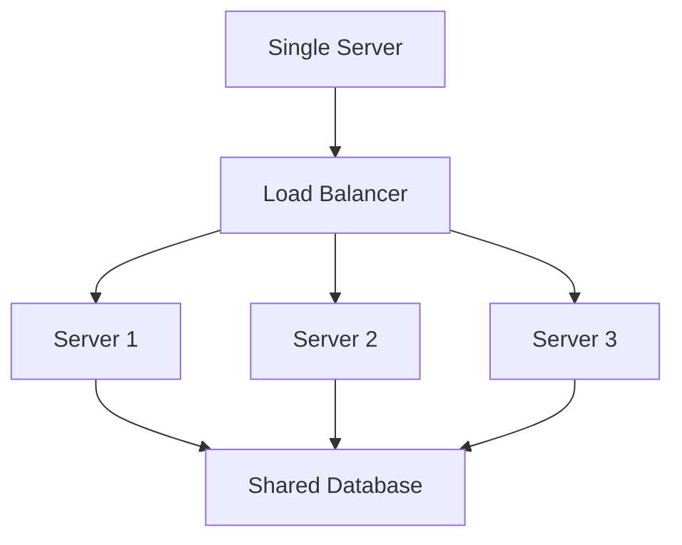
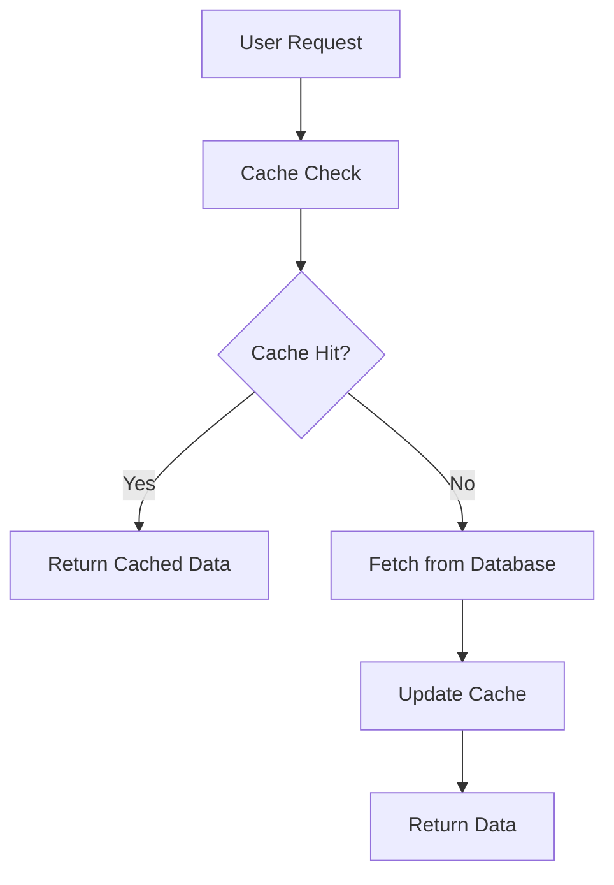
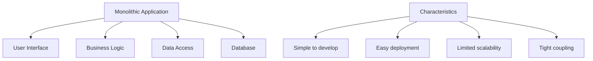
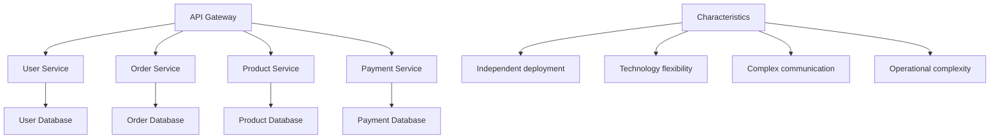
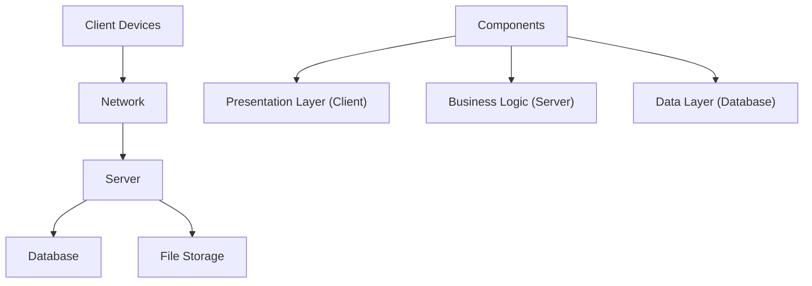
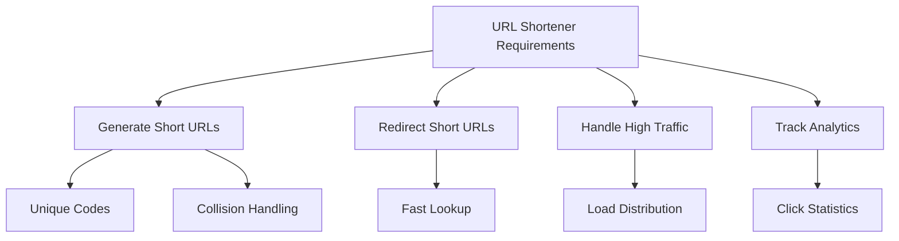
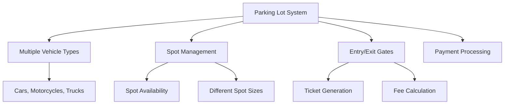
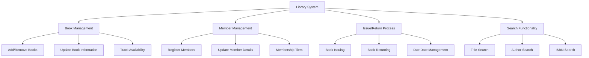
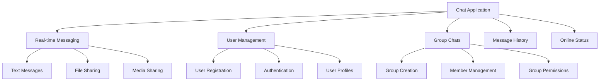
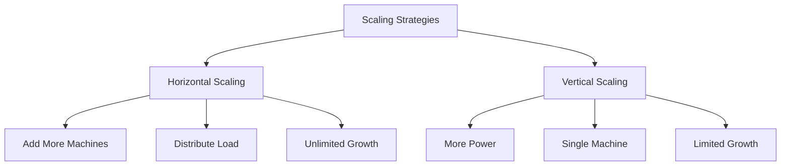

# Chapter 2: System Design Fundamentals

## System Design Basics

### What is System Design?
- **Definition**: Process of defining architecture, components, and interfaces of a system to meet specific requirements
- **Purpose**: Create scalable, maintainable, and efficient systems
- **Importance**: Foundation for building applications that can handle growth and complexity
- **Interview Focus**: Understanding trade-offs, scalability, and architectural decisions

### Key System Design Concepts

#### 1. Scalability
**Definition**: System's ability to handle increasing amounts of work by adding resources
- **Horizontal Scaling**: Adding more machines to handle increased load
- **Vertical Scaling**: Adding more power (CPU, RAM) to existing machines

**When to use each**:
- **Horizontal**: For web applications, microservices, when you need unlimited growth
- **Vertical**: For databases, monolithic applications, when you need consistent performance

#### 2. Load Balancing
**Purpose**: Distribute incoming network traffic across multiple servers
- **Benefits**: No single point of failure, better resource utilization, improved availability
- **Types**: Hardware load balancers, software load balancers, DNS load balancing

#### 3. Caching
**Purpose**: Store frequently accessed data in faster storage to reduce response time
- **Levels**: Browser cache, CDN cache, application cache, database cache
- **Types**: In-memory cache (Redis, Memcached), distributed cache

#### 4. Database Design Choices
- **SQL (Relational)**: Structured data, ACID properties, joins and relationships
- **NoSQL (Non-relational)**: Unstructured data, horizontal scaling, flexibility

| Aspect | SQL | NoSQL |
|-------|-----|-------|
| **Data Model** | Structured, tables | Unstructured, documents |
| **Consistency** | Strong consistency | Eventual consistency |
| **Scaling** | Vertical scaling | Horizontal scaling |
| **Query Language** | SQL | Various (document queries, etc.) |
| **Use Cases** | Financial, transactions | Social media, big data |

### High-Level Architecture Patterns

#### 1. Monolithic Architecture
**Definition**: Single, unified application where all functionality is contained within one deployable unit

**Pros and Cons**:
- **Pros**: Simple architecture, easier debugging, single deployment unit
- **Cons**: Scalability limitations, technology lock-in, deployment risks

#### 2. Microservices Architecture
**Definition**: Application structured as collection of loosely coupled services

**Pros and Cons**:
- **Pros**: Independent scaling, technology flexibility, team autonomy
- **Cons**: Network complexity, distributed transactions, operational overhead

#### 3. Client-Server Architecture
**Definition**: Distributed application structure where clients request services from servers

## Common System Design Problems for Freshers

### 1. Design a URL Shortener

#### Requirements Analysis

#### Core Components
**Key Components**:
- **URL Shortening Service**: Generates unique short codes from long URLs
- **Database**: Stores mapping between short and long URLs
- **Redirect Service**: Handles redirection from short to long URLs
- **Analytics Service**: Tracks clicks and generates statistics

#### Design Considerations
- **Short Code Generation**: Use Base62 encoding (0-9, a-z, A-Z) for maximum combinations
- **Collision Handling**: Implement strategies to handle duplicate short codes
- **Redirection Speed**: Use in-memory database or caching for fast lookups
- **Scalability**: Handle millions of URLs and concurrent requests

#### Hash Function Design
- **Input**: Long URL string
- **Output**: Short alphanumeric code (6-8 characters)
- **Considerations**: Uniform distribution, collision resistance, uniqueness

### 2. Design a Parking Lot System

#### Requirements Analysis

#### Core Components
**Key Entities**:
- **ParkingLot**: Main system that manages all parking operations
- **Vehicle**: Abstract base class representing different vehicle types
- **ParkingSpot**: Represents individual parking spots with size and availability
- **Ticket**: Contains parking information, time, and payment details
- **Entry/Exit Gates**: Manage vehicle entry and exit processes

#### Design Considerations
- **Vehicle-Spot Matching**: Determine which vehicle types can use which spot types
- **Concurrency Handling**: Multiple vehicles entering/exiting simultaneously
- **Time-based Pricing**: Different rates for different time periods
- **Real-time Availability**: Update spot availability as vehicles enter/exit

#### Spot Allocation Strategy
- **Motorcycle**: Can park in motorcycle, compact, or large spots
- **Car**: Can park in compact or large spots
- **Truck**: Can only park in large spots
- **Priority**: Nearest available spot of appropriate size

### 3. Design a Library Management System

#### Requirements Analysis

#### Core Components
**Key Entities**:
- **Library**: Main system orchestrator
- **Book**: Represents books with metadata and availability status
- **Member**: Library members with borrowing privileges and limits
- **Librarian**: System administrator with extended privileges
- **IssueRecord**: Tracks book borrowing history and fine calculation

#### Design Considerations
- **Search Functionality**: Multiple search criteria (title, author, genre, ISBN)
- **Reservation System**: Handle book reservations when books are not available
- **Fine Calculation**: Calculate late return fines based on duration and book type
- **Concurrent Operations**: Handle multiple users borrowing/returning books simultaneously

### 4. Design a Chat Application

#### Requirements Analysis

#### Core Components
**Key Entities**:
- **ChatServer**: Central server handling all chat operations
- **User**: Represents chat users with profiles and status
- **Message**: Represents chat messages with content and metadata
- **ChatRoom**: Represents group chats with multiple participants
- **ConnectionManager**: Handles real-time connections between users

#### Design Considerations
- **Real-time Communication**: Use WebSocket or long polling for instant messaging
- **Message Persistence**: Store chat history for future retrieval
- **Online Status**: Track and display user availability
- **Scalability**: Handle thousands of concurrent users and messages

## Design Principles for Interviews

### SOLID Principles

1. **Single Responsibility Principle**: Each class should have one reason to change
2. **Open/Closed Principle**: Open for extension, closed for modification
3. **Liskov Substitution Principle**: Subtypes must be substitutable for their base types
4. **Interface Segregation Principle**: Clients should not depend on interfaces they don't use
5. **Dependency Inversion Principle**: Depend on abstractions, not concretions

### Common Design Patterns

#### Creational Patterns
- **Singleton**: Ensures only one instance of class exists
- **Factory**: Creates objects without specifying exact class
- **Builder**: Constructs complex objects step by step

#### Structural Patterns
- **Adapter**: Allows incompatible interfaces to work together
- **Decorator**: Adds functionality to objects dynamically
- **Proxy**: Controls access to another object

#### Behavioral Patterns
- **Observer**: One-to-many dependency between objects
- **Strategy**: Encapsulates algorithms and makes them interchangeable
- **Command**: Encapsulates request as an object

## Scalability and Performance

### Horizontal vs Vertical Scaling

### Caching Strategies
- **Cache-Aside**: Application manages cache and database
- **Write-Through**: Write to both cache and database simultaneously
- **Write-Behind**: Write to cache first, then update database later
- **Refresh-Ahead**: Preload cache before data expires

### Database Optimization
- **Indexing**: Create indexes on frequently queried columns
- **Partitioning**: Split large tables into smaller, manageable pieces
- **Replication**: Create read replicas to distribute read operations
- **Connection Pooling**: Reuse database connections to reduce overhead

## Security Considerations

### Authentication and Authorization
- **Authentication**: Verify user identity (who are you?)
- **Authorization**: Grant appropriate permissions (what can you do?)
- **Implementation**: JWT tokens, OAuth 2.0, session management

### Data Protection
- **Encryption**: Encrypt sensitive data at rest and in transit
- **Access Control**: Implement proper access control mechanisms
- **Data Validation**: Validate all input data to prevent injection attacks
- **Regular Audits**: Monitor and audit access to sensitive data

### Common Security Threats
- **SQL Injection**: Malicious SQL code in input fields
- **XSS (Cross-Site Scripting)**: Malicious scripts in web pages
- **CSRF (Cross-Site Request Forgery)**: Unauthorized actions on behalf of user
- **DDoS (Distributed Denial of Service)**: Overwhelm system with traffic

## Monitoring and Observability

### Monitoring Metrics
- **Performance Metrics**: Response time, throughput, error rates
- **Business Metrics**: User engagement, transaction success rate
- **Infrastructure Metrics**: CPU, memory, disk usage, network traffic
- **Application Metrics**: Application-specific KPIs

### Alerting Strategy
- **Threshold-based**: Alert when metrics exceed predefined thresholds
- **Anomaly Detection**: Alert when unusual patterns are detected
- **Multi-level Alerts**: Different alert levels for different severity
- **Escalation Rules**: Escalate alerts when not acknowledged

## Common Interview Questions

### Basic Questions

**Q1: What is the difference between horizontal and vertical scaling?**
**Answer**:
- **Horizontal scaling**: Add more machines to handle increased load
- **Vertical scaling**: Add more power (CPU, RAM) to existing machines
- **Trade-offs**: Horizontal offers unlimited growth but adds complexity, vertical is simpler but limited

**Q2: When would you use NoSQL vs SQL databases?**
**Answer**:
- **SQL**: Structured data, ACID compliance, complex queries (financial systems, e-commerce)
- **NoSQL**: Unstructured data, horizontal scaling, flexibility (social media, big data)

**Q3: What is a load balancer and why is it important?**
**Answer**: Load balancer distributes incoming traffic across multiple servers to ensure no single server is overwhelmed. Important for availability, scalability, and reliability.

### Intermediate Questions

**Q4: How would you design a system that handles 1 million concurrent users?**
**Answer**:
- Use load balancer to distribute traffic across multiple servers
- Implement caching at multiple levels (CDN, application, database)
- Use auto-scaling to handle variable load
- Design stateless services for easy horizontal scaling
- Implement proper monitoring and alerting

**Q5: What are the trade-offs between monolithic and microservices architecture?**
**Answer**:
- **Monolithic**: Simpler to develop and deploy initially, but scaling challenges later
- **Microservices**: More complex initially, but better scalability and team autonomy
- **Decision depends on**: Team size, system complexity, scalability requirements

### Advanced Questions

**Q6: How would you design a system that needs to be highly available?**
**Answer**:
- Use multi-region deployment with data replication
- Implement automatic failover mechanisms
- Use load balancing with health checks
- Implement circuit breakers to prevent cascading failures
- Regular backup and disaster recovery procedures

**Q7: How would you handle database scaling for a high-traffic application?**
**Answer**:
- Read replicas to distribute read operations
- Database sharding to distribute data across multiple databases
- Connection pooling to manage database connections efficiently
- Caching layer to reduce database load
- Use appropriate indexing and query optimization

## Design Process for Interviews

### Step-by-Step Approach
1. **Clarify Requirements**: Ask questions to understand system scope and constraints
2. **Estimate Scale**: Understand expected load and storage requirements
3. **High-Level Design**: Identify major components and their relationships
4. **Deep Dive**: Detail each component's design and data structures
5. **Bottleneck Analysis**: Identify potential performance bottlenecks
6. **Scalability**: Discuss how system will handle growth

### Common Interview Techniques
- **Start Simple**: Begin with basic design and add complexity gradually
- **Ask Questions**: Clarify ambiguities and constraints
- **Explain Trade-offs**: Discuss pros and cons of design decisions
- **Consider Edge Cases**: Think about error handling and boundary conditions
- **Draw Diagrams**: Use diagrams to communicate design effectively

## Quick Reference

### Key Design Concepts
| Concept | Description | Interview Focus |
|---------|-------------|-----------------|
| **Scalability** | Handle increasing load | Horizontal vs vertical |
| **Availability** | System uptime and reliability | Redundancy, failover |
| **Performance** | Response time and throughput | Caching, optimization |
| **Consistency** | Data consistency guarantees | Strong vs eventual |
| **Security** | Protection against threats | Authentication, encryption |

### Common Patterns
| Pattern | Use Case | Interview Focus |
|---------|----------|-----------------|
| **Load Balancer** | Distribute traffic | High availability |
| **Caching** | Improve performance | Cache strategies |
| **Message Queue** | Asynchronous communication | Decoupling |
| **Database Replication** | Scale read operations | Read replicas |
| **CDN** | Content delivery | Geographic distribution |

### System Design Checklist
| Aspect | Consideration | Key Questions |
|--------|-------------|-------------|
| **Requirements** | Functional and non-functional | What is expected scale? |
| **Scalability** | Growth handling | How does it scale? |
| **Availability** | Uptime requirements | How to handle failures? |
| **Performance** | Response time requirements | What are latency requirements? |
| **Security** | Protection mechanisms | How to secure the system? |

---

**Important Note**: In system design interviews, interviewers are more interested in your thought process, understanding of trade-offs, and ability to justify design decisions than in perfect technical details. Focus on understanding the problem clearly, identifying key requirements, and making reasonable design choices.