# Chapter 3: SQL and Database Management

## SQL Fundamentals

### What is SQL?
- **SQL (Structured Query Language)**: Standard language for managing relational databases
- **Purpose**: Create, read, update, and delete data
- **Importance**: Essential for almost every software development role

### Database Basics
- **Database**: Organized collection of structured data
- **Table**: Collection of rows and columns with specific data
- **Schema**: Structure of database (tables, relationships, constraints)

### SQL Command Categories

| Category | Purpose | Key Commands |
|----------|---------|--------------|
| **DDL** | Define structure | CREATE, ALTER, DROP, TRUNCATE |
| **DML** | Manipulate data | INSERT, UPDATE, DELETE |
| **DQL** | Query data | SELECT |
| **DCL** | Control access | GRANT, REVOKE |
| **TCL** | Transaction control | COMMIT, ROLLBACK, SAVEPOINT |

## Core SQL Concepts

### 1. Data Types

**Common Data Types**:
- **INT**: Whole numbers
- **VARCHAR(n)**: Variable-length string (max n characters)
- **TEXT**: Long text without specified length
- **DATE**: Date values (YYYY-MM-DD)
- **BOOLEAN**: True/False values

### 2. Primary and Foreign Keys

**Key Concepts**:
- **Primary Key**: Uniquely identifies each record in a table
- **Foreign Key**: Links tables together by referencing primary key
- **Composite Key**: Primary key made of multiple columns

### 3. Constraints
- **NOT NULL**: Column must have a value
- **UNIQUE**: All values in column must be unique
- **CHECK**: Validates data before insertion
- **DEFAULT**: Sets default value if none provided

## Basic SQL Operations

### 1. CREATE TABLE Operations
**Purpose**: Define table structure with columns, data types, and constraints

**Key Components**:
- **Column Definitions**: Name, data type, constraints
- **Primary Key**: Unique identifier for each record
- **Foreign Key**: Links to other tables
- **Constraints**: Rules for data validation (NOT NULL, UNIQUE, CHECK)
- **Default Values**: Automatic values when not specified

**Interview Focus**: Understanding how to design proper table structures with appropriate data types and constraints.

### 2. INSERT Operations
**Purpose**: Add new records to tables

**Insertion Types**:
- **Single Record**: Insert one row at a time
- **Multiple Records**: Insert multiple rows in single statement
- **Partial Data**: Insert only specified columns (others use defaults/NULL)
- **Auto-increment**: Let database generate primary keys

**Key Considerations**:
- Data must match column types
- Constraints must be satisfied
- Primary key uniqueness maintained
- Foreign key references must exist

### 3. SELECT Operations
**Purpose**: Retrieve data from database

**Query Patterns**:
- **Basic Selection**: Choose specific columns or all columns
- **Conditional Filtering**: Use WHERE clause with conditions
- **Multiple Conditions**: Combine with AND, OR operators
- **Range Queries**: Use BETWEEN for numeric/date ranges
- **List Queries**: Use IN for multiple possible values
- **Pattern Matching**: Use LIKE for text patterns

**Filtering Techniques**:
- Comparison operators (=, <>, <, >, <=, >=)
- Logical operators (AND, OR, NOT)
- Wildcard patterns (%, _)
- NULL value handling (IS NULL, IS NOT NULL)

### 4. UPDATE Operations
**Purpose**: Modify existing records

**Update Strategies**:
- **Single Record**: Update specific row using primary key
- **Bulk Updates**: Update multiple rows matching conditions
- **Calculated Updates**: Update based on current values
- **Conditional Updates**: Different updates based on conditions

**Important Considerations**:
- Always use WHERE clause to avoid updating entire table
- Ensure foreign key constraints aren't violated
- Consider transaction safety for critical updates

### 5. DELETE Operations
**Purpose**: Remove records from tables

**Deletion Approaches**:
- **Single Record**: Delete specific row using primary key
- **Conditional Delete**: Remove rows matching criteria
- **Cascade Delete**: Automatically delete related records
- **Soft Delete**: Mark records as deleted instead of removing

**Critical Points**:
- Use WHERE clause to avoid deleting all data
- Consider foreign key constraints
- Back up important data before deletion
- Understand cascade delete behavior

## Advanced SQL Queries

### 1. Joins
**Purpose**: Combine rows from multiple tables based on related columns

#### INNER JOIN Concepts
**Purpose**: Return only matching records from both tables

**Use Cases**:
- Getting employees with their assigned departments
- Finding customers with their orders
- Linking students to their enrolled courses

**Key Points**:
- Only rows with matching keys in both tables are included
- Most commonly used join type
- Perfect for finding relationships that definitely exist

#### LEFT JOIN Concepts
**Purpose**: Return all records from left table, matching from right table

**Use Cases**:
- All employees and their departments (including unassigned)
- Customers and their orders (including customers without orders)
- Students and their grades (including students without grades)

**Key Points**:
- All records from left table are included
- NULL values for right table when no match exists
- Useful for finding missing relationships

#### SELF JOIN Concepts
**Purpose**: Join a table to itself for hierarchical relationships

**Use Cases**:
- Employees and their managers (same table)
- Categories and parent categories
- Comments and reply relationships

**Key Points**:
- Same table used with different aliases
- Requires foreign key referencing same table
- Essential for organizational structures

### 2. Aggregate Functions

#### Basic Aggregates Concepts
**COUNT Function**: Counts number of rows in a group
- **Use Cases**: Total records, records per category, validation counts
- **Interview Focus**: Understanding COUNT(*) vs COUNT(column) vs COUNT(DISTINCT column)

**SUM Function**: Calculates total of numeric values
- **Use Cases**: Total sales, salary budgets, inventory quantities
- **Key Point**: Works only on numeric data types

**AVG Function**: Calculates average value
- **Use Cases**: Average salary, average order value, average rating
- **Important**: Ignores NULL values in calculations

**MAX/MIN Functions**: Find highest/lowest values
- **Use Cases**: Highest salary, earliest date, maximum price
- **Performance**: Can use indexes effectively on indexed columns

#### GROUP BY with HAVING Concepts
**GROUP BY Purpose**: Group rows with same values into summary rows

**Common Grouping Patterns**:
- **Categorization**: Group by department, category, status
- **Time Analysis**: Group by date, month, year
- **Geographic**: Group by country, state, city

**HAVING vs WHERE**:
- **WHERE**: Filters rows before grouping
- **HAVING**: Filters groups after aggregation
- **Order**: WHERE → GROUP BY → HAVING

**Real-world Examples**:
- Departments with more than 5 employees
- Product categories with average price above threshold
- Months with total sales exceeding targets
- Customers with order count above average

### 3. Subqueries

```mermaid
graph TD
    A["Main Query"] --> B["Subquery"]
    B --> C["Returns Data to Main Query"]

    D["Subquery Types"] --> E["Single Row"]
    D --> F["Multiple Rows"]
    D --> G["Correlated"]
```

#### Subquery in WHERE Clause
**Purpose**: Filter results based on values from another query

**Common Patterns**:
- **Comparison with Aggregate**: Compare values against group statistics
- **Membership Testing**: Check if values exist in another table
- **Range Queries**: Use results of one query to filter another

**Real-world Examples**:
- Employees earning above company average salary
- Products priced above category average
- Customers who placed orders in last month
- Students scoring above class average

**Interview Focus**: Understanding subquery execution order and performance implications.

#### Subquery in FROM Clause
**Purpose**: Use query results as a temporary table for further analysis

**Use Cases**:
- **Derived Tables**: Create temporary result sets for complex queries
- **Ranking Operations**: Find top/bottom performers within groups
- **Complex Aggregations**: Multi-level grouping and calculations

**Real-world Examples**:
- Department with highest average salary
- Top 3 customers by purchase amount
- Most profitable product categories
- Students with highest GPA in each major

**Key Point**: FROM clause subqueries must have aliases and are called derived tables.

#### Correlated Subquery
**Purpose**: Subquery that depends on values from outer query

**Characteristics**:
- **Row-by-Row Execution**: Runs once for each row of outer query
- **Reference Outer Query**: Can access columns from outer query
- **Performance Consideration**: Can be slower than non-correlated

**Real-world Examples**:
- Employees earning more than their department average
- Customers with above-average order values
- Products performing better than category average
- Students scoring above their major's GPA average

**Interview Focus**: Understanding when to use correlated vs non-correlated subqueries.

### 4. Window Functions

#### Ranking Functions Concepts
**RANK()**: Assigns rank with gaps for ties
- **Use Case**: Competition rankings, sales performance
- **Behavior**: 1, 2, 2, 4 (tie causes skip)

**DENSE_RANK()**: Assigns rank without gaps
- **Use Case**: Academic grades, continuous rankings
- **Behavior**: 1, 2, 2, 3 (no skipping)

**ROW_NUMBER()**: Assigns unique sequential numbers
- **Use Case**: Pagination, unique ordering
- **Behavior**: 1, 2, 3, 4 (no ties)

**PARTITION BY**: Creates groups for ranking within
- **Real-world**: Rank employees within each department
- **Benefit**: Multiple independent rankings in one query

#### Aggregate Window Functions Concepts
**Window Frame**: Defines the set of rows for calculation

**Common Window Patterns**:
- **Running Total**: Cumulative sum over ordered rows
- **Moving Average**: Average of sliding window of rows
- **Year-over-Year**: Compare with previous year's data

**Frame Specifications**:
- **ROWS BETWEEN**: Physical row boundaries
- **RANGE BETWEEN**: Logical value boundaries
- **UNBOUNDED PRECEDING**: From start to current row
- **N PRECEDING/FOLLOWING**: N rows before/after current

**Business Applications**:
- Running sales totals throughout the year
- 7-day moving average of stock prices
- Cumulative customer acquisition
- Quarterly performance comparisons

## Database Design

### Normalization
**Purpose**: Organize data to reduce redundancy and improve data integrity

#### First Normal Form (1NF)
- **Rule**: Each cell contains atomic values
- **Example**: Instead of "Skills: Java, Python, SQL", create separate skill records

#### Second Normal Form (2NF)
- **Rule**: No partial dependencies on composite primary key
- **Example**: If PK is (order_id, item_id), then item_description should depend only on item_id

#### Third Normal Form (3NF)
- **Rule**: No transitive dependencies
- **Example**: If A → B and B → C, then A → C is transitive dependency

### ER Diagram Basics

## Common Interview Questions

### 1. Find Nth Highest Salary

#### Solution Approaches

**Method 1: LIMIT and OFFSET**
- **Concept**: Sort salaries descending, skip N-1 rows, take next
- **Advantage**: Simple and intuitive
- **Limitation**: Database-specific syntax (LIMIT vs TOP vs ROWNUM)

**Method 2: Nested Subqueries**
- **Concept**: Find highest salary less than previous highest
- **Advantage**: Works across all databases
- **Interview Value**: Shows understanding of subquery logic

**Method 3: Window Functions**
- **Concept**: Use DENSE_RANK() to assign ranks, filter by rank
- **Advantage**: Efficient, handles ties gracefully
- **Modern Approach**: Preferred in recent database versions

**Key Interview Points**:
- Understanding of duplicates handling
- Performance implications of each method
- Database compatibility considerations
- Edge cases (less than N distinct salaries)

### 2. Find Duplicate Records

#### Problem Approaches

**Finding Duplicates by Specific Column**
- **Concept**: Group by suspected duplicate column, count occurrences
- **Use Case**: Find duplicate email addresses, phone numbers
- **Implementation**: GROUP BY + HAVING COUNT(*) > 1

**Finding Complete Row Duplicates**
- **Concept**: Group by all columns to find identical rows
- **Use Case**: Data cleaning, identifying data entry errors
- **Challenge**: Need to consider all columns for complete duplication

**Showing All Duplicate Records**
- **Concept**: Display complete records that are duplicates
- **Two-Step Process**: First find duplicates, then show full records
- **Performance Consideration**: Can be expensive on large tables

**Business Scenarios**:
- Customer data deduplication
- Removing duplicate orders
- Cleaning survey responses
- Identifying system-generated duplicate entries

**Interview Focus**: Understanding GROUP BY, HAVING, and subquery relationships.

### 3. Department with Most Employees

#### Solution Approaches

**Method 1: JOIN with ORDER BY and LIMIT**
- **Concept**: Join tables, group by department, sort by count, take top
- **Advantage**: Intuitive and easy to understand
- **Consideration**: Handles ties based on database's LIMIT behavior

**Method 2: Subquery Approach**
- **Concept**: Find department with max employees in subquery
- **Advantage**: Clear separation of logic
- **Interview Value**: Shows understanding of nested queries

**Handling Ties**: Different approaches for handling multiple departments with same max count
- **Method Limitation**: LIMIT may return only one of tied departments
- **Complete Solution**: Use window functions to handle ties properly

**Real-world Applications**:
- Finding top-performing branches
- Identifying busiest departments
- Resource allocation decisions
- Performance analysis

### 4. Pivot Table (Rows to Columns)

#### Pivoting Concepts

**Purpose**: Transform row-based data into columnar format for reporting

**Implementation Strategy**: Use conditional aggregation with CASE statements
- **Logic**: For each desired column, sum values when condition matches
- **Flexibility**: Can handle varying numbers of categories
- **Performance**: Generally efficient with proper indexing

**Real-world Examples**:
- Student marks by subject (rows to columns)
- Sales data by month/quarter
- Survey responses by question
- Financial statements by period

**Challenges**:
- **Dynamic Columns**: Need to know possible values in advance
- **NULL Handling**: Decide how to handle missing values
- **Performance**: Can be slow with many pivoted columns

**Modern Alternatives**: Some databases have built-in PIVOT functions

### 5. Find Employees Who Never Took Leave

#### Problem Patterns

**LEFT JOIN with NULL Check**
- **Concept**: Left join and check for NULL in joined table
- **Logic**: Employees without matching leave records
- **Advantage**: Standard SQL pattern, widely supported

**NOT EXISTS Approach**
- **Concept**: Check for non-existence of related records
- **Logic**: For each employee, verify no leave records exist
- **Performance**: Often more efficient than LEFT JOIN

**NOT IN Alternative**
- **Concept**: Find employees not in the set of employees who took leave
- **Caveat**: Must handle NULL values carefully
- **Performance**: Can be slower on large datasets

**Business Applications**:
- Identifying employees who never used benefits
- Finding customers who never made purchases
- Detecting unused resources
- Compliance reporting

**Interview Focus**: Understanding different anti-join patterns and their performance characteristics.

## Performance Optimization

### Indexes
**Purpose**: Speed up data retrieval operations

#### When to Use Indexes

**High-Value Index Candidates**:
- **WHERE Clause Columns**: Frequently filtered columns
- **JOIN Columns**: Foreign keys and join conditions
- **ORDER BY Columns**: Sorted result sets
- **High Cardinality Columns**: Many unique values (user IDs, timestamps)

**Index Types and Their Use Cases**:
- **Single Column Index**: Most common, single field lookups
- **Composite Index**: Multiple columns searched together
- **Unique Index**: Enforces uniqueness and speeds up lookups
- **Partial Index**: Index subset of rows with conditions

**Trade-offs**:
- **Storage Overhead**: Indexes consume disk space
- **Write Performance**: Slower INSERT/UPDATE/DELETE operations
- **Maintenance**: Indexes need to be updated with data changes

**Interview Focus**: Understanding when indexes help vs hurt performance, and how to choose optimal index columns.

### Query Optimization Tips

1. **Use appropriate indexes**
2. **Avoid SELECT \*** - select only needed columns
3. **Use LIMIT** for large result sets
4. **Optimize JOIN order** - small tables first
5. **Use EXISTS instead of IN** for subqueries

### Query Performance Analysis

#### EXPLAIN Plan Concepts
**Purpose**: Understand how database executes your query

**Key Information Revealed**:
- **Join Order**: Sequence of table operations
- **Index Usage**: Whether indexes are being used
- **Scan Types**: Full table scan vs index scan
- **Cost Estimates**: Database's predicted execution cost
- **Row Estimates**: Expected number of rows processed

**Performance Indicators**:
- **Sequential Scans**: May indicate missing indexes
- **High Cost Numbers**: Potential optimization opportunities
- **Nested Loops**: May suggest better join strategies
- **Hash Joins**: Generally efficient for large datasets

**Interpretation Strategy**:
1. Identify most expensive operations
2. Check for unexpected full table scans
3. Verify index usage in WHERE and JOIN clauses
4. Look for opportunities to add or modify indexes

**Interview Value**: Demonstrates understanding of database internals and performance tuning methodology.

## Transactions and ACID

### ACID Properties

#### Transaction Examples

**Bank Transfer Scenario**:
- **Atomicity Requirement**: Both debit and credit must succeed or fail together
- **Consistency Check**: Total money in system remains constant
- **Isolation Need**: Concurrent transfers don't interfere with each other
- **Durability Guarantee**: Once committed, transfers survive system crashes

**E-commerce Order Processing**:
1. Check inventory availability
2. Reserve items for customer
3. Process payment
4. Update inventory levels
5. Confirm order

**Transaction Commands**:
- **BEGIN/START TRANSACTION**: Initiate transaction
- **COMMIT**: Make changes permanent
- **ROLLBACK**: Undo all changes in transaction
- **SAVEPOINT**: Create rollback points within transaction

**Interview Focus**: Understanding why transactions are essential for data integrity and how ACID properties protect against common problems like lost updates and dirty reads.

## Database Security

### SQL Injection Prevention

#### Understanding SQL Injection

**Attack Concept**: Malicious SQL code inserted through input fields

**Classic Example**:
- **Input**: `' OR '1'='1' --`
- **Result**: Bypasses authentication, returns all users
- **Impact**: Unauthorized data access, data modification, data deletion

**Prevention Strategies**:

**1. Parameterized Queries**
- **Principle**: Separate SQL logic from data values
- **Implementation**: Use prepared statements with parameter markers
- **Benefit**: Database handles proper escaping automatically
- **Example**: Query structure defined first, values bound later

**2. Input Validation**
- **Whitelist Approach**: Allow only expected characters/values
- **Type Checking**: Validate data types match expectations
- **Length Limits**: Restrict input field lengths
- **Special Character Handling**: Remove or escape dangerous characters

**3. ORM Frameworks**
- **Abstraction Layer**: Object-Relational Mapping handles SQL generation
- **Built-in Protection**: Most frameworks include injection prevention
- **Type Safety**: Compile-time type checking prevents issues

### Access Control

#### Database Security Principles

**Principle of Least Privilege**:
- **Grant Minimum**: Users get only necessary permissions
- **Role-based Access**: Group users by function, assign roles
- **Regular Audits**: Review and adjust permissions periodically

**Common Permission Types**:
- **SELECT**: Read-only access to data
- **INSERT/UPDATE/DELETE**: Data modification permissions
- **CREATE/ALTER/DROP**: Structure modification permissions
- **ALL PRIVILEGES**: Full administrative access

**Security Best Practices**:
- **Application Users**: Separate from administrative users
- **Database-Specific Users**: Different credentials per application
- **Connection Security**: Use SSL/TLS for connections
- **Audit Logging**: Track all database access and modifications

**Interview Focus**: Understanding common security vulnerabilities and implementing defense-in-depth strategies for database protection.

## Quick Reference

### SQL Commands Summary
| Operation | Command | Example |
|-----------|---------|---------|
| **Create** | CREATE TABLE | `CREATE TABLE users(...)` |
| **Read** | SELECT | `SELECT * FROM users` |
| **Update** | UPDATE | `UPDATE users SET name='John'` |
| **Delete** | DELETE | `DELETE FROM users WHERE id=1` |
| **Join** | INNER/LEFT/RIGHT | `SELECT * FROM a JOIN b ON a.id=b.id` |

### Common Functions
| Function | Purpose | Example |
|----------|---------|---------|
| `COUNT()` | Count rows | `SELECT COUNT(*) FROM table` |
| `SUM()` | Sum values | `SELECT SUM(price) FROM products` |
| `AVG()` | Average | `SELECT AVG(salary) FROM employees` |
| `MAX()/MIN()` | Max/Min values | `SELECT MAX(salary) FROM employees` |
| `UPPER()` | Uppercase | `SELECT UPPER(name) FROM users` |
| `DATE_FORMAT()` | Format date | `SELECT DATE_FORMAT(date, '%Y-%m-%d')` |

### Interview Preparation Tips

1. **Understand fundamentals** before memorizing syntax
2. **Practice common patterns** (joins, aggregations, subqueries)
3. **Know when to use** different join types
4. **Understand performance** implications
5. **Practice writing queries** for common scenarios

### Common Mistakes to Avoid

1. **Forgetting NULL values** in conditions
2. **Mixing up JOIN types** and their results
3. **Not using indexes** properly
4. **SQL injection vulnerabilities**
5. **Ignoring performance** in large datasets

---

**Important Note**: SQL is tested in almost every technical interview. Focus on understanding concepts rather than memorizing syntax. Practice writing queries for different scenarios and understand the performance implications of your queries.