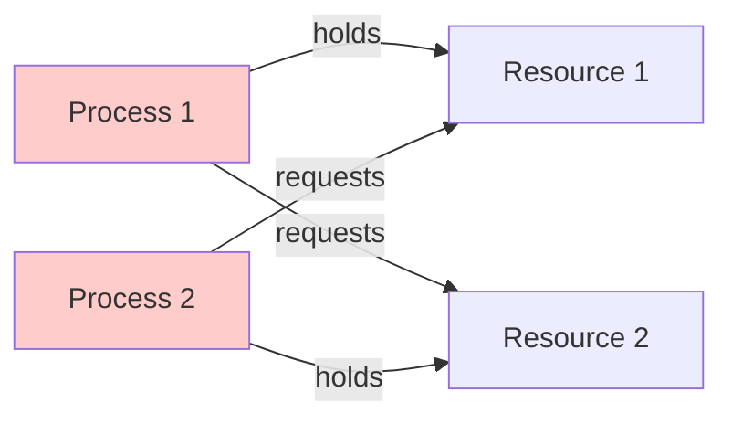
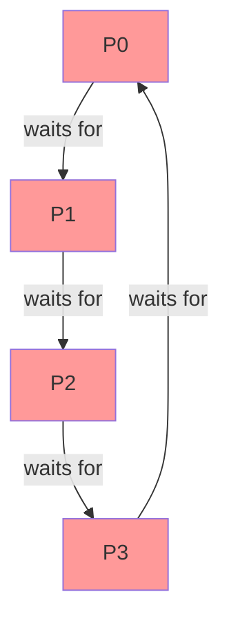
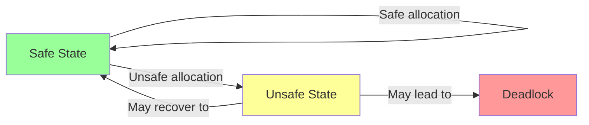
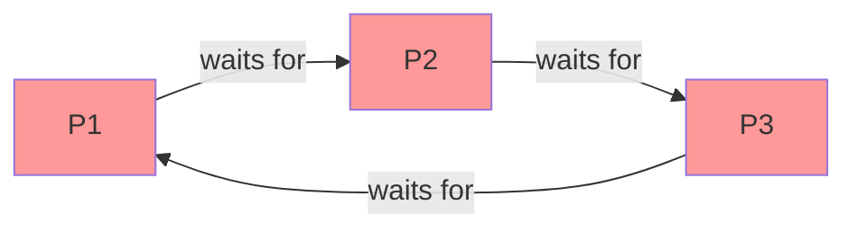
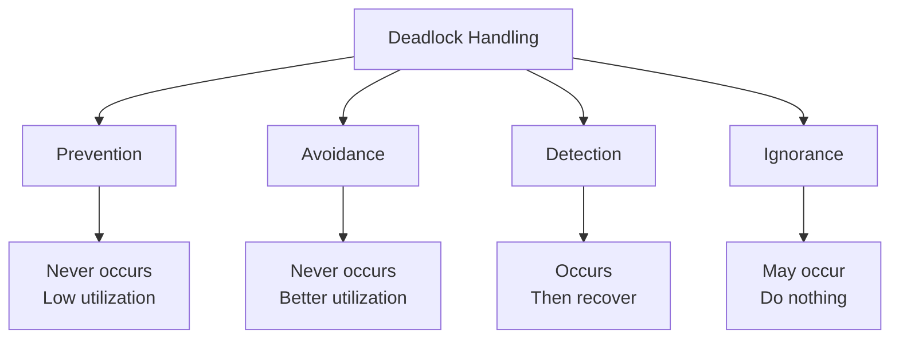

# Chapter 8: Deadlocks

## What is Deadlock?

**Deadlock**: Two or more processes waiting indefinitely for resources held by each other, creating a circular wait.

**Characteristics**:
- Processes **never finish** executing
- System resources are **tied up**
- Prevents other jobs from starting
- Bug in synchronization implementation



## Resource Allocation

### How Processes Utilize Resources

1. **Request**: Request resource, if free lock it, else wait
2. **Use**: Use the resource
3. **Release**: Release resource, make it available

### Resource Types
- **Single instance**: One CPU, one printer
- **Multiple instances**: 4 GB RAM (many 1 MB blocks), 2 CPUs

## Deadlock Necessary Conditions

**All 4 conditions must hold simultaneously** for deadlock:

### 1. Mutual Exclusion
- Only **one process** can use resource at a time
- If another process requests, it must wait
- Example: Printer (can't be shared)

### 2. Hold and Wait
- Process must be **holding at least one resource**
- **Waiting** to acquire additional resources held by others
- Example: P1 holds R1, waits for R2

### 3. No Preemption
- Resources **cannot be forcefully taken**
- Must be **voluntarily released** by process after completion
- Example: Can't take away printer mid-job

### 4. Circular Wait
- Set of processes {P0, P1, ..., Pn} where:
  - P0 waits for resource held by P1
  - P1 waits for resource held by P2
  - ...
  - Pn waits for resource held by P0



## Methods for Handling Deadlocks

### 1. Deadlock Prevention
Ensure at least one necessary condition **cannot hold**.

### 2. Deadlock Avoidance
Use protocol to ensure system never enters deadlock state.

### 3. Deadlock Detection & Recovery
Allow deadlock to occur, detect it, then recover.

### 4. Deadlock Ignorance
Ignore the problem (assume deadlocks never occur) - **Ostrich Algorithm**.

## Deadlock Prevention

Prevent deadlock by **negating** one of the four necessary conditions.

### 1. Preventing Mutual Exclusion
- Use locks only for **non-sharable** resources
- Sharable resources (read-only files) can be accessed by multiple processes
- ❌ **Not practical** - some resources are intrinsically non-sharable

### 2. Preventing Hold and Wait

**Protocol A**: Request all resources before execution
- Process must acquire all resources at start
- ❌ **Low resource utilization** (holds resources unnecessarily)
- ❌ **Starvation** possible

**Protocol B**: Release all resources before requesting new ones
- Process can request resources only when holding none
- ❌ **Livelock** may occur
- ❌ Repeated acquire-release cycles

### 3. Preventing No Preemption

**Method 1**: If process requests unavailable resource:
- Preempt all resources it's currently holding
- Add to list of resources it needs
- Restart when it can get all resources

**Method 2**: Check if requested resource is held by waiting process:
- If yes, **preempt** from waiting process
- If no, process must wait

❌ **Issues**: Works only for resources whose state can be saved/restored (CPU, memory), not I/O devices.

### 4. Preventing Circular Wait

**Solution**: Impose **total ordering** on resource allocation.

**Example**: If P1 and P2 both need R1 and R2:
- **Both processes** acquire R1 first, then R2
- Whoever gets R1 first will get R2
- No circular wait possible

```
Assign order: R1 < R2 < R3 < ... < Rn
Rule: Process can request Ri only if it doesn't hold Rj where j > i
```

## Deadlock Avoidance

**Idea**: OS has advance info about which resources each process will use.

### Safe State
- System can allocate resources to each process in **some order** and avoid deadlock
- Safe state means there exists a **safe sequence**

### Unsafe State
- OS cannot prevent processes from requesting resources in a way that leads to deadlock
- ⚠️ Unsafe ≠ Deadlock (unsafe may lead to deadlock)



### Banker's Algorithm

**Purpose**: Determine if allocating resources will leave system in safe state.

**Working**:
- When process requests resources, system checks if allocation maintains safe state
- If **safe**: Allocate resources
- If **unsafe**: Process must wait

**Use Case**: Multiple instances of each resource type.

## Deadlock Detection

### For Single Instance Resources: Wait-For Graph

**Wait-For Graph**: Variant of resource allocation graph.
- Nodes: Processes only (no resource nodes)
- Edge P1 → P2: P1 waiting for P2 to release resource

**Deadlock Detection**: If there's a **cycle** in wait-for graph → Deadlock exists.



### For Multiple Instance Resources: Banker's Algorithm
Use modified version to detect deadlock.

## Recovery from Deadlock

### 1. Process Termination

**Option A**: Abort **all** deadlocked processes
- ✅ Simple
- ❌ Expensive (all progress lost)

**Option B**: Abort **one process at a time** until deadlock eliminated
- ✅ Less expensive
- ❌ Overhead (invoke detection algorithm after each abortion)

**Selection Criteria for Abortion**:
1. Process priority
2. Computation time so far
3. Resources held
4. Resources needed to complete
5. Number of processes to terminate

### 2. Resource Preemption

**Method**: Successively preempt resources from processes and give to others until deadlock broken.

**Issues to Consider**:

**a) Selecting Victim**:
- Which process to preempt from?
- Minimize cost

**b) Rollback**:
- If we preempt from process, what happens to it?
- **Safe state**: Rollback to some safe state
- **Total rollback**: Abort process, restart from beginning

**c) Starvation**:
- Same process may be picked as victim repeatedly
- **Solution**: Include number of rollbacks in cost factor

## Comparison of Deadlock Handling

| Method | Pros | Cons | When to Use |
|--------|------|------|-------------|
| **Prevention** | Deadlock never occurs | Low resource utilization, complex | Critical systems |
| **Avoidance** | Better resource utilization than prevention | Requires advance info | When future requests known |
| **Detection & Recovery** | No prevention overhead | Overhead of detection | Systems where deadlocks rare |
| **Ignorance** | No overhead | Deadlocks can occur | Desktop systems (restart) |

## Interview Questions

### Q1: What is deadlock and give a real-world analogy?
**Answer**: Deadlock is when two or more processes wait indefinitely for resources held by each other.

**Real-world analogy - Traffic Jam**:
Four cars at intersection, each waiting for other to move:
- Car 1 waits for Car 2 to move
- Car 2 waits for Car 3 to move
- Car 3 waits for Car 4 to move
- Car 4 waits for Car 1 to move
- All cars stuck forever!

### Q2: What are the four necessary conditions for deadlock?
**Answer**: **All 4 must hold simultaneously**:
1. **Mutual Exclusion**: Resource can't be shared
2. **Hold and Wait**: Process holds resources while waiting for more
3. **No Preemption**: Resources can't be forcefully taken
4. **Circular Wait**: Circular chain of processes waiting for resources

### Q3: If we break any one condition, can we prevent deadlock?
**Answer**: **Yes!** Breaking **any one** of the four necessary conditions will prevent deadlock. This is the principle behind **deadlock prevention**.

**Example**: Implementing resource ordering breaks circular wait → No deadlock.

### Q4: What is the difference between deadlock and starvation?
**Answer**:

| Deadlock | Starvation |
|----------|------------|
| Multiple processes block each other | One process indefinitely denied resources |
| Circular wait | Continuously preempted by higher priority |
| **No progress** for any | **Others make progress** |
| All involved processes stuck | Only victim process stuck |
| Requires external intervention | Can be solved by aging |

### Q5: Explain Banker's Algorithm in simple terms.
**Answer**: Banker's Algorithm is like a bank deciding whether to grant a loan:

**Bank analogy**:
- Bank has limited cash (resources)
- Customers (processes) request loans
- Bank checks: "If I grant this loan, can I still satisfy all customers?"
- If **yes** (safe state): Grant loan
- If **no** (unsafe state): Deny loan, customer waits

**In OS**: Before allocating resources, check if system remains in safe state.

### Q6: What is a safe state and unsafe state?
**Answer**:
**Safe State**: There exists a sequence to allocate resources to all processes without deadlock.

**Unsafe State**: No such safe sequence exists; may lead to deadlock.

**Important**: Unsafe ≠ Deadlock, but unsafe **may** lead to deadlock.

```
Safe → Can allocate safely
Unsafe → Might deadlock
Deadlock → Definitely stuck
```

### Q7: How can we prevent circular wait?
**Answer**: **Resource Ordering**:
1. Assign unique number to each resource type
2. Process can request Ri only if it doesn't hold Rj where j > i
3. Forces **linear ordering** of resource requests
4. **Breaks circular wait** condition

**Example**:
- R1 (Printer) = 1
- R2 (Scanner) = 2
- Both processes must request Printer before Scanner
- Whoever gets Printer first will get Scanner

### Q8: Why is deadlock ignorance (Ostrich Algorithm) used in some systems?
**Answer**: Used in systems like **Windows, Linux** because:
- Deadlocks are **rare** in these systems
- Cost of prevention/avoidance is **high**
- Users can **restart** system if deadlock occurs
- **Simplicity** over robustness for non-critical systems

**Not suitable for**: Mission-critical systems (aircraft, medical devices).

### Q9: What is the difference between deadlock prevention and avoidance?
**Answer**:

| Prevention | Avoidance |
|------------|-----------|
| Breaks one of 4 necessary conditions | Checks safe state before allocation |
| **Static** approach | **Dynamic** approach |
| Low resource utilization | Better resource utilization |
| No need for future info | Requires future resource needs |
| Simpler to implement | More complex |

### Q10: Give an example of deadlock in database systems.
**Answer**: **Transaction Deadlock**:

```
Transaction T1:        Transaction T2:
Lock Row A             Lock Row B
(needs Row B)          (needs Row A)
Wait for Row B         Wait for Row A
↓ DEADLOCK ↓
```

**Solution**: Database uses detection and recovery:
- Detect cycle in wait-for graph
- Abort one transaction (rollback)
- Other transaction proceeds

### Q11: Why can't we always prevent mutual exclusion?
**Answer**: Some resources are **intrinsically non-sharable**:
- **Printer**: Can't print two documents simultaneously
- **Tape drive**: Can't be shared
- **Locks**: Purpose is mutual exclusion

Making these sharable would defeat their purpose or is physically impossible.

### Q12: What is livelock and how is it different from deadlock?
**Answer**:
**Livelock**: Processes actively trying to resolve deadlock but making no progress.

**Analogy**: Two people in hallway trying to pass:
- Person A moves left
- Person B moves right (same as A's left)
- Both move right
- Both move left
- Both actively moving but stuck!

| Deadlock | Livelock |
|----------|----------|
| Processes blocked (waiting) | Processes active (responding) |
| No state change | State changes but no progress |
| Easier to detect | Harder to detect |

### Q13: How does the wait-for graph help detect deadlock?
**Answer**: Wait-For Graph:
- **Nodes**: Processes
- **Edge** P1 → P2: P1 waiting for resource held by P2
- **Cycle** in graph: Deadlock detected

**Algorithm**:
1. Periodically run cycle detection (DFS/BFS)
2. If cycle found → Deadlock exists
3. Invoke recovery mechanism

**Advantage**: Simple for single instance resources.

### Q14: What factors should be considered when selecting a victim for preemption?
**Answer**: Selection criteria (minimize cost):
1. **Priority**: Lower priority first
2. **Computation time**: Process that has computed least
3. **Resources held**: Fewer resources = less recovery cost
4. **Resources needed**: Closer to completion = don't abort
5. **Interactive vs Batch**: Preempt batch processes
6. **Number of rollbacks**: Prevent starvation

### Q15: Can deadlock occur with only one process?
**Answer**: **No**. Deadlock requires:
- Multiple processes (at least 2)
- Circular wait between them
- One process cannot wait for itself (no circular dependency)

**Note**: Single process can have other issues like infinite loop or blocking on I/O, but these aren't deadlocks.

### Q16: What is the overhead of deadlock detection?
**Answer**: Overhead includes:
- **Time complexity**: O(n²) for n processes (cycle detection)
- **Frequency**: How often to run detection algorithm
  - More frequent → Higher overhead, quicker detection
  - Less frequent → Lower overhead, delayed detection
- **Memory**: Storing wait-for graph
- **Recovery cost**: Rollback or termination

**Trade-off**: Detection frequency vs response time.

### Q17: Why is resource preemption difficult for I/O devices?
**Answer**: I/O device preemption is difficult because:
- **State can't be saved**: Unlike CPU registers, I/O device state is complex
- **Partial operations**: Can't interrupt mid-operation (e.g., printing half page)
- **Physical limitations**: Can't "undo" physical changes
- **No rollback**: Can't restore previous state

**Works for**: CPU (save registers), Memory (swap to disk)
**Doesn't work for**: Printer, Scanner, Network sockets

### Q18: How does imposing resource ordering prevent deadlock?
**Answer**: Resource ordering breaks **circular wait**:

**Without ordering**:
- P1: Locks R1 → Needs R2
- P2: Locks R2 → Needs R1
- Deadlock!

**With ordering** (R1 < R2):
- P1: Locks R1 → Locks R2 ✅
- P2: **Must** request R1 first → Waits for P1
- No circular wait!

**Guarantees**: Linear acquisition order → No cycles possible.

### Q19: What is the relationship between the four deadlock handling methods?
**Answer**:



**Spectrum**: Increasing resource utilization, decreasing safety.

### Q20: How can aging prevent starvation in resource preemption?
**Answer**: **Aging mechanism**:
- Track how many times process has been preempted
- Include **rollback count** in victim selection cost
- Formula: `Cost = Priority + Resources + (Weight × Rollback_Count)`
- Higher rollback count → Higher cost → Less likely to be selected

**Result**: Process eventually becomes "too expensive" to preempt → Gets resources.
