# Chapter 9: Memory Management

## Logical vs Physical Address Space

### Logical Address (Virtual Address)
- Address **generated by CPU**
- Used by process during execution
- Does **not exist physically**
- User can access (indirectly)
- **Range**: 0 to max
- Set of all logical addresses = **Logical Address Space**

### Physical Address
- Address in **physical memory** (RAM)
- Computed by **MMU** (Memory Management Unit)
- User **cannot** access directly
- Actually exists in hardware
- **Range**: (R + 0) to (R + max) where R = base address
- Set of all physical addresses = **Physical Address Space**

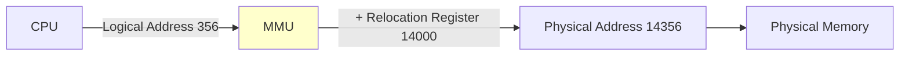

### Memory Management Unit (MMU)
- **Hardware device**
- Maps logical address to physical address at runtime
- Uses **relocation register** (base address)
- Physical Address = Logical Address + Relocation Register

## Memory Mapping and Protection

### Purpose
- **Isolation**: Separate memory spaces for processes
- **Protection**: Prevent unauthorized access

### Mechanism
1. **Relocation Register**: Contains base address (smallest physical address)
2. **Limit Register**: Contains range of logical addresses

**Protection Check**:
```
if (logical_address >= limit):
    trap to OS (addressing error)
else:
    physical_address = relocation_register + logical_address
```

### Context Switching
When CPU scheduler selects process:
- Dispatcher loads **relocation and limit registers**
- Ensures process accesses only its legal memory range
- Protects OS and other processes

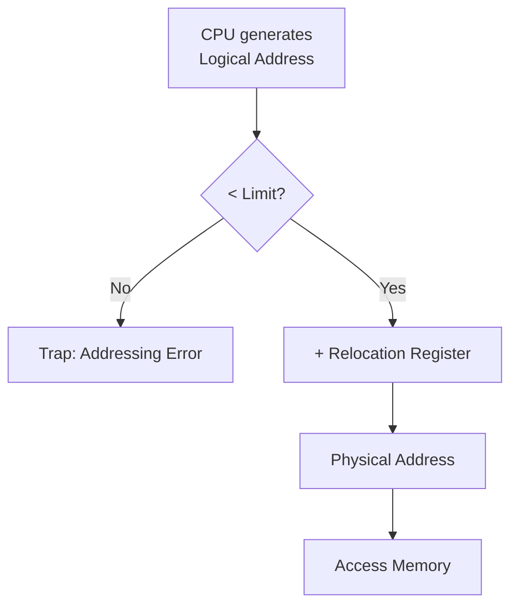

## Memory Allocation Methods

### 1. Contiguous Allocation
Process occupies **single contiguous** block of memory.

### 2. Non-Contiguous Allocation
Process can be split across **multiple** memory blocks.

## Contiguous Memory Allocation

### A. Fixed Partitioning

**Concept**: Main memory divided into **fixed-sized partitions** (equal or different sizes).

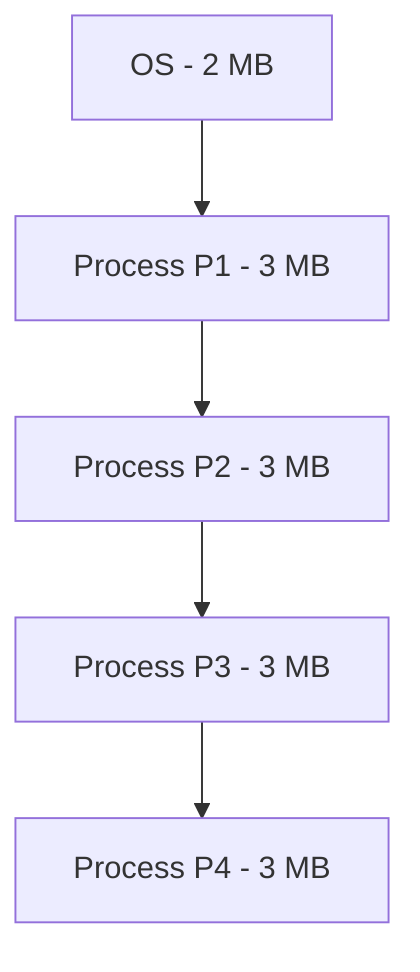

**Limitations**:

| Problem | Description |
|---------|-------------|
| **Internal Fragmentation** | Unused space within partition (Process smaller than partition) |
| **External Fragmentation** | Total unused space can't be used (not contiguous) |
| **Process Size Limit** | Process can't be larger than largest partition |
| **Low Multiprogramming** | Fixed number of partitions limits number of processes |

### B. Dynamic Partitioning

**Concept**: Partition size **not declared initially**, determined at process load time.

**Advantages** over Fixed Partitioning:
- ✅ **No internal fragmentation**
- ✅ **No process size limit**
- ✅ **Better degree of multiprogramming**

**Limitation**:
- ❌ **External fragmentation** still occurs

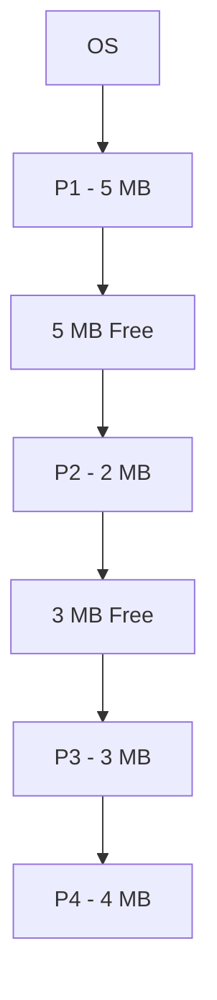

After P1 and P3 terminate: Two 5 MB and 3 MB holes (total 8 MB) but can't load 8 MB process (not contiguous).

## Solutions to External Fragmentation

### 1. Compaction (Defragmentation)
- Make all free partitions **contiguous**
- Move all loaded processes together
- **Disadvantage**: Overhead of moving processes

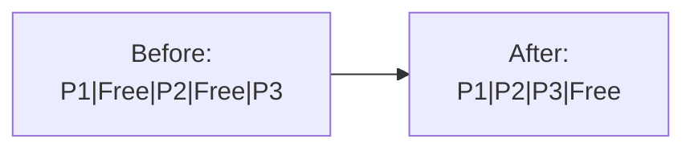

### 2. Free Space Management Algorithms

**Data Structure**: Free holes represented as **linked list**.

**Problem**: How to satisfy request of size n from list of free holes?

#### First Fit
- Allocate **first** hole that is big enough
- ✅ **Fast** (less search time)
- ✅ Simple to implement

#### Next Fit
- Start search from **last allocated** hole
- ✅ Same advantages as First Fit
- ✅ Distributes allocation across memory

#### Best Fit
- Allocate **smallest** hole that is big enough
- ✅ Lesser internal fragmentation
- ❌ May create many small holes (external fragmentation)
- ❌ **Slow** (must search entire list)

#### Worst Fit
- Allocate **largest** hole
- ✅ Leaves larger holes (may accommodate other processes)
- ❌ **Slow** (must search entire list)

## Non-Contiguous Memory Allocation

### Paging

**Concept**: Physical memory divided into fixed-size **frames**, logical memory into same-sized **pages**.

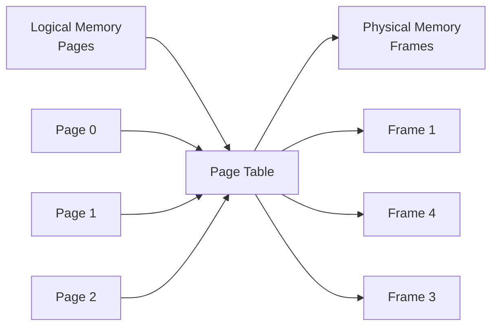

**Key Features**:
- ✅ **No external fragmentation**
- ✅ **Non-contiguous** allocation allowed
- Page size = Frame size (typically 4 KB)
- ❌ **Internal fragmentation** possible (last page)

#### Page Table
- Data structure mapping pages to frames
- Stored in **main memory**
- **PTBR** (Page Table Base Register) points to current page table

#### Logical Address Structure
```
Logical Address = [Page Number | Page Offset]
                     ↓              ↓
                  Index into    Offset within
                  page table       frame
```

#### Translation Process
1. Extract **page number (p)** and **offset (d)** from logical address
2. Use p as index into **page table** to get **frame number (f)**
3. Physical address = `f × frame_size + d`

### Translation Look-aside Buffer (TLB)

**Problem**: Page table in main memory → Two memory accesses (slow)

**Solution**: **TLB** - Hardware cache for page table entries.

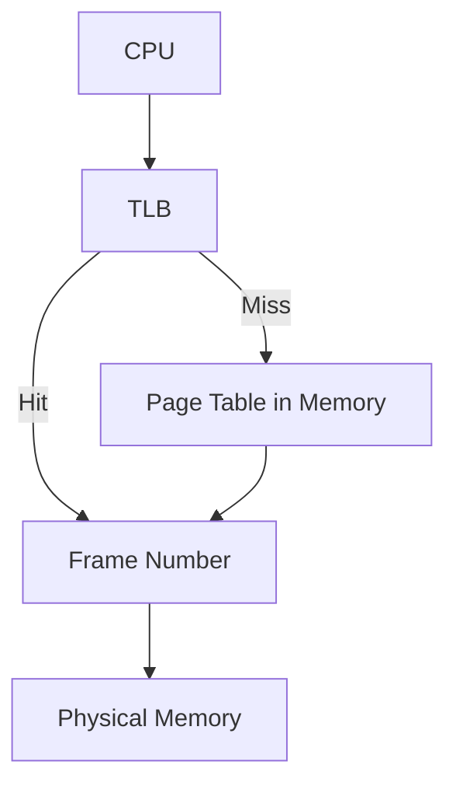

**Working**:
- Check TLB first
- **TLB Hit**: Get frame number directly (fast)
- **TLB Miss**: Access page table in memory (slow), then update TLB

**Contains**: Page number → Frame number mappings (recently used)

**ASID** (Address Space Identifier):
- Uniquely identifies each process
- Allows TLB to contain entries for multiple processes
- Ensures correct mapping during context switch

### Segmentation

**Concept**: Process divided into **variable-sized segments** based on user view (logical divisions).

**Segment Types**:
- Main function segment
- Library functions segment
- Data segment
- Stack segment

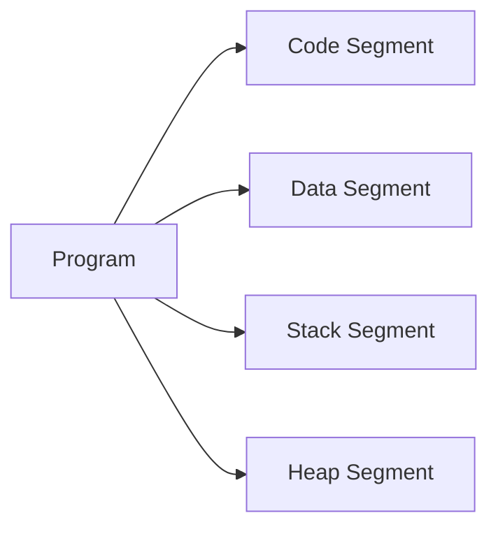

#### Logical Address Structure
```
Logical Address = [Segment Number | Offset]
```

#### Segment Table
- Each entry contains:
  - **Base**: Starting physical address of segment
  - **Limit**: Length of segment

#### Advantages
- ✅ **No internal fragmentation**
- ✅ Reflects **user view** (logical divisions)
- ✅ Efficient within-segment access

#### Disadvantages
- ❌ **External fragmentation** (variable segment sizes)
- ❌ Complex swapping (different sizes)

## Virtual Memory

**Concept**: Technique allowing execution of processes **not completely in memory**.

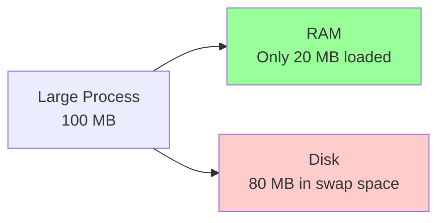

**Benefits**:
- ✅ Programs can be **larger than physical memory**
- ✅ **More programs** can run (higher multiprogramming)
- ✅ Less **I/O** needed for swapping

### Demand Paging

**Concept**: Page brought into memory **only when demanded** (lazy loading).

**Working**:
1. Process starts with **no pages** in memory
2. Page accessed → **Page fault** occurs
3. OS loads page from disk to memory
4. Execution continues

#### Valid-Invalid Bit
- **Valid (1)**: Page in memory
- **Invalid (0)**: Page not in memory OR not in process's address space

#### Page Fault Handling
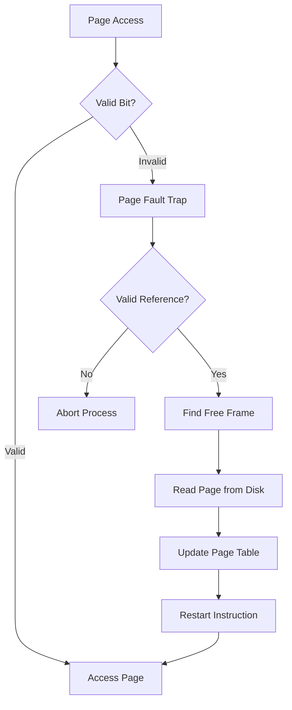

**Steps**:
1. Check internal table (PCB) - valid reference?
2. If invalid access → Abort
3. If valid but not in memory:
   - Find free frame
   - Read page from disk
   - Update page table (set valid bit)
   - Restart instruction

## Page Replacement Algorithms

**When**: All frames full, need to replace a page.

### 1. FIFO (First-In-First-Out)
- Replace **oldest** page
- ✅ Easy to implement
- ❌ May replace frequently used page
- ❌ **Belady's Anomaly**: More frames may increase page faults

### 2. Optimal Page Replacement
- Replace page that **won't be used for longest time**
- ✅ **Lowest page fault rate**
- ❌ Requires **future knowledge** (impossible in practice)
- Theoretical benchmark

### 3. LRU (Least Recently Used)
- Replace page **not used for longest time**
- ✅ Good approximation of optimal
- ❌ Implementation overhead

**Implementation**:
- **Counters**: Timestamp each page access
- **Stack**: Keep stack of page numbers (doubly linked list)

### 4. LFU (Least Frequently Used)
- Replace page with **smallest reference count**
- ❌ Recently loaded page may be evicted

### 5. MFU (Most Frequently Used)
- Replace page with **largest reference count**
- ❌ Not commonly used
- Reasoning: Smallest count page probably just loaded

## Thrashing

**Definition**: System spends more time **servicing page faults** than executing processes.

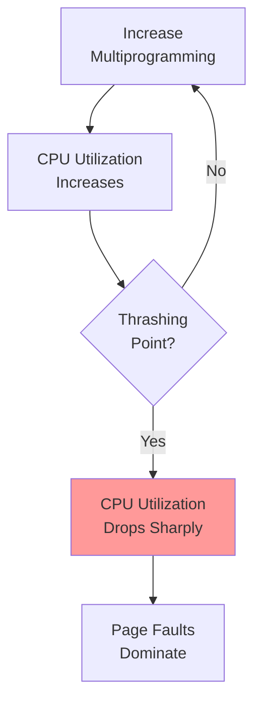

**Cause**: Process doesn't have enough frames for its **locality**.

### Solutions to Thrashing

#### 1. Working Set Model
- Based on **locality of reference**
- **Locality**: Set of pages currently being used
- Allocate enough frames for current locality

#### 2. Page Fault Frequency (PFF)
- Establish **upper** and **lower** bounds on page fault rate
- If PF rate > upper limit: **Allocate more frames**
- If PF rate < lower limit: **Remove frames**

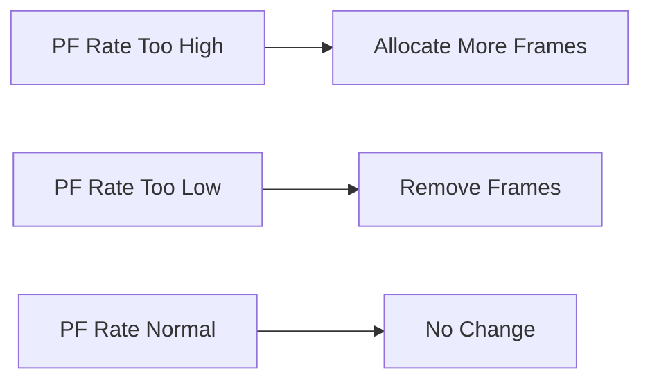

## Interview Questions

### Q1: What is the difference between logical and physical addresses?
**Answer**:

| Logical Address | Physical Address |
|-----------------|------------------|
| Generated by CPU | In physical memory (RAM) |
| Virtual (doesn't exist physically) | Actually exists |
| User can view (indirectly) | User cannot access |
| Range: 0 to max | Range: R to R+max |
| Address space: Logical | Address space: Physical |

**Example**: CPU generates logical address 356. MMU adds base register 14000 → Physical address 14356.

### Q2: Why do we need MMU?
**Answer**: MMU (Memory Management Unit) is needed to:
- **Translate** logical addresses to physical addresses
- **Enable** process isolation (each process has own address space)
- **Protect** memory (prevent unauthorized access)
- **Support** virtual memory
- **Allow** relocation (process can be moved in memory)

### Q3: What is internal vs external fragmentation?
**Answer**:

| Internal Fragmentation | External Fragmentation |
|------------------------|------------------------|
| Wasted space **within** partition | Wasted space **between** partitions |
| Process smaller than partition | Total free space exists but not contiguous |
| Occurs in **fixed partitioning** | Occurs in **dynamic partitioning** |
| Fixed amount per partition | Variable amount |
| **Solved by**: Paging | **Solved by**: Compaction or Paging |

**Example**:
- Internal: 5 MB partition, 3 MB process → 2 MB wasted
- External: 3 MB + 2 MB free holes, can't load 4 MB process

### Q4: How does paging eliminate external fragmentation?
**Answer**: Paging eliminates external fragmentation because:
- Physical memory divided into **fixed-size frames**
- Process divided into **same-size pages**
- **Non-contiguous** allocation allowed
- Any free frame can accommodate any page
- **No gaps** between allocations

**Example**: Process needs 10 KB, frame size = 2 KB:
- Needs 5 frames
- Can be placed in frames 1, 5, 7, 12, 15 (not contiguous) ✅

### Q5: What is a page fault and when does it occur?
**Answer**: **Page Fault**: Trap to OS when process accesses page not in memory.

**Occurs when**:
- Process accesses page for first time (demand paging)
- Page was swapped out to disk
- Invalid memory reference (segmentation fault)

**Handling**:
1. Find free frame
2. Load page from disk
3. Update page table
4. Restart instruction

### Q6: Why is page table stored in main memory and not in CPU registers?
**Answer**:
- **Size**: Page table can be very large (millions of entries)
- **CPU registers**: Very limited (32-64 registers)
- **Context switching**: Changing page table requires changing one register (PTBR) instead of copying entire table

**Example**: 4 GB address space, 4 KB pages → 1 million page table entries (can't fit in registers).

### Q7: What is TLB and why is it needed?
**Answer**: **TLB (Translation Look-aside Buffer)** is hardware cache for page table entries.

**Needed because**:
- Page table in memory → **2 memory accesses** (page table + actual data)
- **Slows down** every memory access
- TLB caches recent translations → **1 memory access** on hit

**Performance**:
- TLB hit (90-98%): 1 memory access
- TLB miss: 2 memory accesses

### Q8: Calculate effective memory access time with TLB.
**Question**: Memory access = 100 ns, TLB lookup = 20 ns, TLB hit ratio = 80%.

**Answer**:
```
TLB Hit: 20 (TLB) + 100 (memory) = 120 ns
TLB Miss: 20 (TLB) + 100 (page table) + 100 (memory) = 220 ns

Effective = 0.8 × 120 + 0.2 × 220 = 96 + 44 = 140 ns
```

### Q9: What is the difference between paging and segmentation?
**Answer**:

| Paging | Segmentation |
|--------|--------------|
| **Fixed-size** pages | **Variable-size** segments |
| **OS view** (invisible to user) | **User view** (logical divisions) |
| No external fragmentation | External fragmentation |
| Internal fragmentation (last page) | No internal fragmentation |
| Simple address translation | Complex address translation |
| Page table | Segment table |

### Q10: What is virtual memory and why is it useful?
**Answer**: Virtual memory allows process to execute without being **entirely in memory**.

**Benefits**:
1. **Programs > Physical memory**: Run 1 GB program on 512 MB RAM
2. **More programs**: Higher degree of multiprogramming
3. **Faster loading**: Only needed pages loaded
4. **Memory abstraction**: Process thinks it has contiguous memory

**Implementation**: Demand paging, swapping

### Q11: Explain demand paging in simple terms.
**Answer**: **Demand Paging** = Lazy loading of pages.

**Analogy - Library Books**:
- Don't bring all books home (won't use all)
- Bring only when needed (demand)
- If book not at home (page fault) → Go to library (disk) and bring it

**OS**:
- Start process with no pages in memory
- When page accessed → Page fault
- Load page from disk
- Continue execution

### Q12: What is Belady's Anomaly?
**Answer**: **Belady's Anomaly**: Increasing number of frames increases page faults (counter-intuitive).

**Occurs in**: FIFO page replacement algorithm

**Example**:
- 3 frames: 9 page faults
- 4 frames: 10 page faults (More!)

**Not in**: LRU, Optimal (stack algorithms)

### Q13: Compare FIFO, LRU, and Optimal page replacement.
**Answer**:

| Algorithm | Page Faults | Implementation | Belady's Anomaly |
|-----------|-------------|----------------|------------------|
| **FIFO** | High | Easy (queue) | Yes |
| **LRU** | Medium | Complex (stack/counter) | No |
| **Optimal** | **Lowest** | Impossible (need future) | No |

**Best**: Optimal (theoretical), LRU (practical)

### Q14: What is thrashing and how can it be prevented?
**Answer**: **Thrashing**: System spends most time swapping pages (paging overhead > useful work).

**Cause**: Too many processes, each with insufficient frames.

**Prevention**:
1. **Working Set Model**: Allocate frames based on locality
2. **Page Fault Frequency**: Monitor PF rate, adjust frames
3. **Reduce multiprogramming**: Suspend some processes
4. **Increase memory**: Add more RAM

### Q15: What is the locality of reference?
**Answer**: **Locality of Reference**: Programs tend to access small portion of address space at any time.

**Types**:
1. **Temporal Locality**: Recently accessed location likely accessed again soon
   - Example: Loop variables
2. **Spatial Locality**: Nearby locations likely accessed soon
   - Example: Array elements

**Used in**: Caching, paging (working set model)

### Q16: Why is compaction expensive?
**Answer**: Compaction is expensive because:
- **Copy overhead**: Must move all processes in memory
- **CPU time**: Significant processing for large memory
- **Downtime**: System less responsive during compaction
- **Frequency**: May need frequent compaction

**Alternative**: Use paging (no need for compaction).

### Q17: What is the purpose of the valid-invalid bit in page table?
**Answer**: Valid-Invalid bit indicates page status:

**Valid (1)**:
- Page is in memory
- Process can access

**Invalid (0)**:
- Page not in memory (on disk)
- OR page not in process's address space

**On invalid access**: Page fault trap or segmentation fault.

### Q18: How does segmentation support sharing and protection?
**Answer**:
**Sharing**: Multiple processes share same segment (e.g., shared library)
- Same segment base in different process segment tables
- Code segment shared, data segment separate

**Protection**: Each segment has protection bits
- Read, write, execute permissions
- Segment-level access control

**Example**: Code segment (read + execute), Data segment (read + write)

### Q19: What is the difference between swap space and paging file?
**Answer**:
- **Same concept**, different names
- **Swap space** (Linux): Disk partition for swapping
- **Paging file** (Windows): File on disk for virtual memory

**Purpose**: Store pages not currently in physical memory.

### Q20: Calculate internal fragmentation in paging.
**Question**: Process size = 10250 bytes, Page size = 1024 bytes.

**Answer**:
```
Pages needed = ⌈10250 / 1024⌉ = 11 pages
Memory allocated = 11 × 1024 = 11264 bytes
Internal fragmentation = 11264 - 10250 = 1014 bytes
(Last page: 10250 % 1024 = 10 bytes used, 1014 bytes wasted)
```
